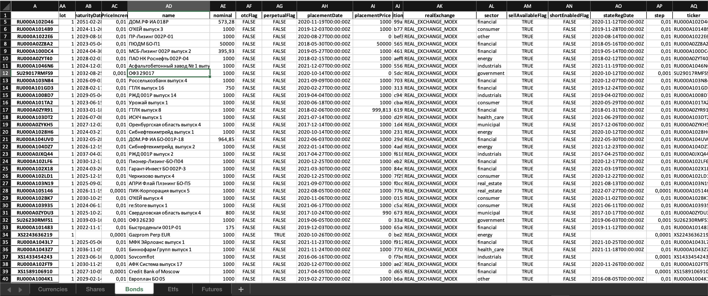
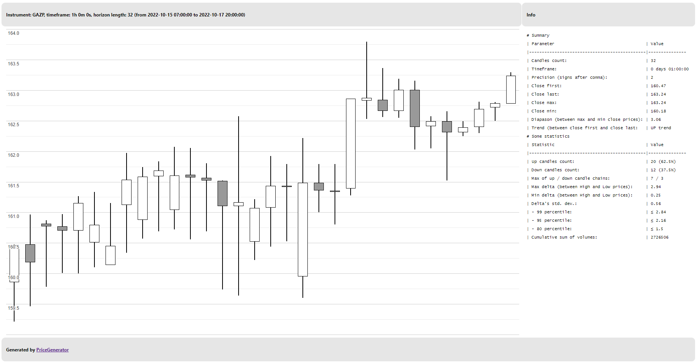
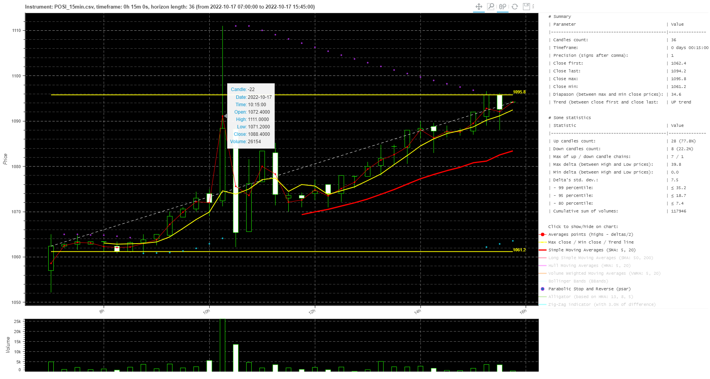
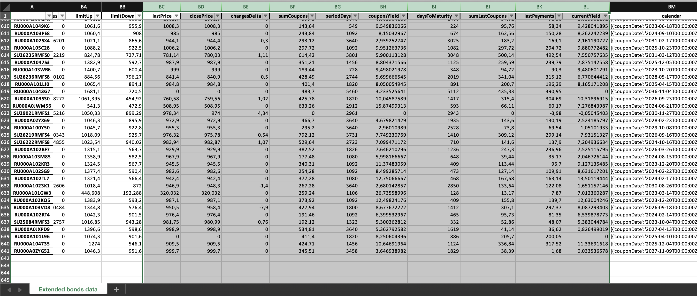
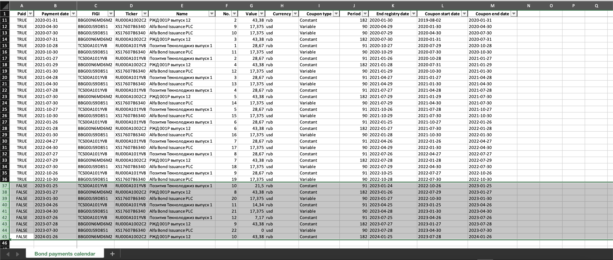
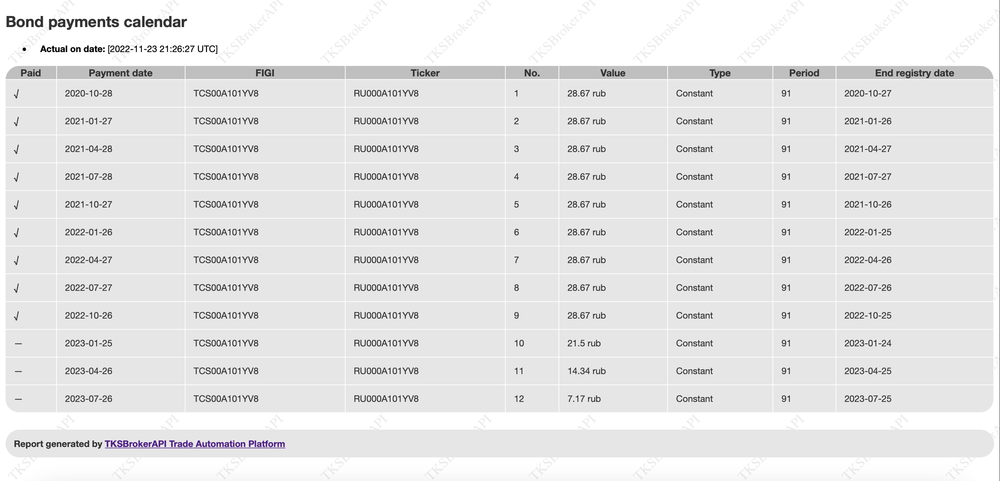
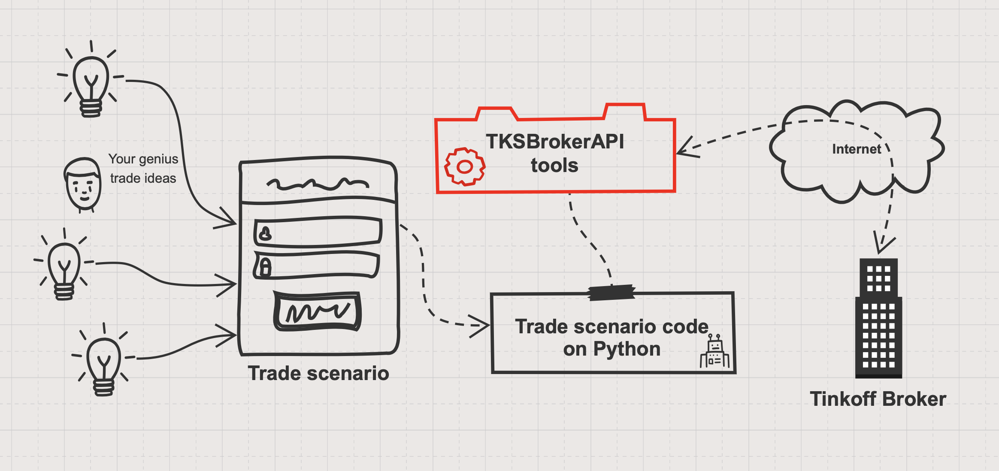
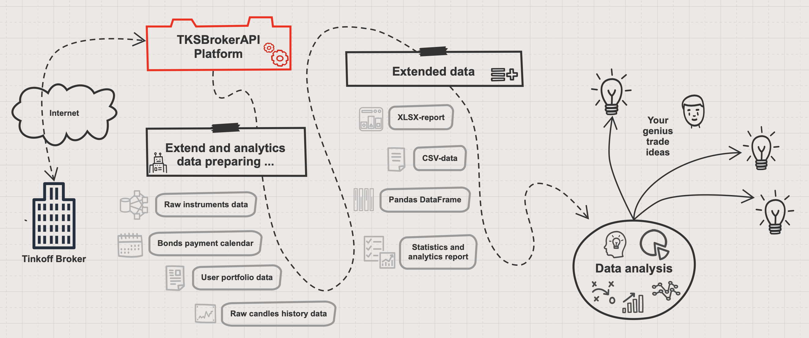

# TKSBrokerAPI — платформа для автоматизации торговли на бирже 

*[Нечёткие технологии](https://fuzzy-technologies.github.io/)*<br>
<a href="https://github.com/Tim55667757/TKSBrokerAPI/blob/master/README_EN.md" target="_blank"></a><br>
**Т**ехнологии · **З**нания · **Н**аука

**[TKSBrokerAPI](https://github.com/Tim55667757/TKSBrokerAPI)** — это платформа для упрощения автоматизации торговых сценариев на Python и работы с [Tinkoff Invest API](https://tinkoff.ru/sl/AaX1Et1omnH) сервером через REST-протокол. Платформа TKSBrokerAPI может использоваться в двух вариантах: из консоли (она имеет богатый набор ключей и команд) или её можно использовать как обычный Python модуль через `python import`. TKSBrokerAPI помогает автоматизировать рутинные торговые операции и реализовать торговые сценарии, или упростить получение необходимой для аналитики информации с сервера брокера. Платформа достаточно легко интегрируется в различные CI/CD конвейеры.

**Статус сборок и деплоя CI/CD**

[](https://pypi.python.org/pypi/TKSBrokerAPI)
[](https://github.com/Tim55667757/TKSBrokerAPI/actions/workflows/python-package-ci-cd.yml)
[](https://github.com/Tim55667757/TKSBrokerAPI/blob/master/LICENSE)
[](https://github.com/Tim55667757/TKSBrokerAPI/blob/develop/CHANGELOG.md)
[](https://github.com/Tim55667757/TKSBrokerAPI/blob/master/README_EN.md)
[](https://tim55667757.github.io/TKSBrokerAPI/docs/tksbrokerapi/TKSBrokerAPI.html)
[](https://yoomoney.ru/fundraise/4WOyAgNgb7M.230111)

❗ Если вам не хватает возможностей платформы или какого-либо примера в документации, для лучшего понимания работы платформы TKSBrokerAPI (в консоли или как Python API), то опишите ваш случай в разделе 👉 [**Issues**](https://github.com/Tim55667757/TKSBrokerAPI/issues/new) 👈, пожалуйста. По мере возможности постараемся реализовать нужную функциональность и добавить примеры в очередном релизе.

[](https://github.com/Tim55667757/TKSBrokerAPI/issues?q=is%3Aopen+is%3Aissue+sort%3Acreated-desc)
[](https://isitmaintained.com/project/tim55667757/TKSBrokerAPI)

**Полезные ссылки**

* 📚 [Документация и примеры на английском (documentation and examples in english here)](https://github.com/Tim55667757/TKSBrokerAPI/blob/master/README_EN.md)
  * ⚙ [Автоматическая API-документация на английском для модуля TKSBrokerAPI (API documentation here)](https://tim55667757.github.io/TKSBrokerAPI/docs/tksbrokerapi/TKSBrokerAPI.html)
  * 🇺🇸 [Релиз-ноты на английском](https://github.com/Tim55667757/TKSBrokerAPI/blob/master/CHANGELOG_EN.md)
  * 🇷🇺 [Релиз-ноты на русском](https://github.com/Tim55667757/TKSBrokerAPI/blob/master/CHANGELOG.md)
    * 💡 [Все запланированные релизы и вошедшие в них фичи](https://github.com/Tim55667757/TKSBrokerAPI/milestones?direction=desc&sort=title&state=open)
    * 📂 [Все открытые задачи в беклоге](https://github.com/Tim55667757/TKSBrokerAPI/issues?q=is%3Aissue+is%3Aopen+sort%3Acreated-asc)
* 🎁 Поддержать проект донатом на ЮМани-кошелёк: [410015019068268](https://yoomoney.ru/fundraise/4WOyAgNgb7M.230111)

**Содержание документации**

1. [Введение](#Введение)
   - [Основные возможности](#Основные-возможности)
2. [Как установить](#Как-установить)
3. [Аутентификация](#Аутентификация)
   - [Токен](#Токен)
   - [Идентификатор счёта пользователя](#Идентификатор-счёта-пользователя)
4. [Справка по ключам](#Справка-по-ключам)
5. [Примеры использования](#Примеры-использования)
   - [Из командной строки](#Из-командной-строки)
     - [Локальный кэш данных](#Локальный-кэш-данных)
     - [Получить список всех доступных для торговли инструментов](#Получить-список-всех-доступных-для-торговли-инструментов)
     - [Найти инструмент](#Найти-инструмент)
     - [Получить информацию по инструменту](#Получить-информацию-по-инструменту)
     - [Запросить стакан цен с заданной глубиной](#Запросить-стакан-цен-с-заданной-глубиной)
     - [Запросить таблицу последних актуальных цен для списка инструментов](#Запросить-таблицу-последних-актуальных-цен-для-списка-инструментов)
     - [Получить текущий портфель пользователя и статистику распределения активов](#Получить-текущий-портфель-пользователя-и-статистику-распределения-активов)
     - [Получить отчёт по операциям с портфелем за указанный период](#Получить-отчёт-по-операциям-с-портфелем-за-указанный-период)
     - [Совершить сделку по рынку](#Совершить-сделку-по-рынку)
     - [Открыть отложенный лимитный или стоп-ордер](#Открыть-отложенный-лимитный-или-стоп-ордер)
     - [Отменить ордера и закрыть позиции](#Отменить-ордера-и-закрыть-позиции)
     - [Скачать исторические данные в формате OHLCV-свечей](#Скачать-исторические-данные-в-формате-OHLCV-свечей)
     - [Узнать доступный для вывода остаток средств в различных валютах](#Узнать-доступный-для-вывода-остаток-средств-в-различных-валютах)
     - [Получить информацию о пользователе и счетах](#Получить-информацию-о-пользователе-и-счетах)
     - [Получить обогащённые данные по облигациям](#Получить-обогащённые-данные-по-облигациям)
     - [Построить календарь выплат по облигациям](#Построить-календарь-выплат-по-облигациям)
   - [Как Python API через импорт модуля TKSBrokerAPI](#Как-Python-API-через-импорт-модуля-TKSBrokerAPI)
     - [Пример реализации абстрактного сценария](#Пример-реализации-абстрактного-сценария)
     - [Использование в Jupyter Notebook](#Использование-в-Jupyter-Notebook)
     - [Детектор аномальных объёмов](#Детектор-аномальных-объёмов)


## Введение

Если вы занимаетесь одновременно инвестированием, автоматизацией и алгоритмической торговлей, то наверняка слышали про [Tinkoff Open API](https://tinkoff.github.io/investAPI/) (к нему есть неплохая [Swagger-документация](https://tinkoff.github.io/investAPI/swagger-ui/)) — это API, предоставляемое брокером Тинькофф Инвестиции для автоматизации работы биржевых торговых роботов. Если ещё не слышали, то можете завести себе аккаунт [по ссылке](https://tinkoff.ru/sl/AaX1Et1omnH) и протестировать его возможности сами.

При работе с любыми API, всегда возникают технические трудности: высокий порог вхождения, необходимость в изучении документации, написание и отладка кода для выполнения сетевых запросов по формату API. Пройдёт много времени, прежде чем у вас дойдёт дело до реализации торгового алгоритма.

Платформа **[TKSBrokerAPI](https://github.com/Tim55667757/TKSBrokerAPI)** — это более простой инструмент, который можно использовать как обычный Python модуль или запускать из командной строки, и сразу из коробки получить возможность работать со счётом у брокера Тинькофф Инвестиции: получать информацию о состоянии портфеля, включая элементарную аналитику, открывать и закрывать позиции, получать общую информацию о торгуемых на бирже инструментах, запрашивать цены и получать отчёты об операциях за указанный период. Все данные выводятся сразу в консоль: в текстовом виде или сохраняются в файлах формата Markdown.

<details>
  <summary>Пример запроса клиентского портфеля и вывод информации в консоль</summary>

```commandline
$ tksbrokerapi --overview

TKSBrokerAPI.py     L:1821 INFO    [2022-08-10 22:06:27,150] Statistics of client's portfolio:
# Client's portfolio

* **Actual date:** [2022-08-10 19:06:27] (UTC)
* **Account ID:** [**********]
* **Portfolio cost:** 405705.77 RUB
* **Changes:** +2098.76 RUB (+0.52%)

## Open positions

| Ticker [FIGI]               | Volume (blocked)                | Lots     | Curr. price  | Avg. price   | Current volume cost | Profit (%)
|-----------------------------|---------------------------------|----------|--------------|--------------|---------------------|----------------------
| Ruble                       |                 5.62 (0.00) rub |          |              |              |                     |
|                             |                                 |          |              |              |                     |
| **Currencies:**             |                                 |          |              |              |        13886.03 RUB |
| EUR_RUB__TOM [BBG0013HJJ31] |                 5.29 (0.00) eur | 0.0053   |    62.75 rub |    61.41 rub |          331.96 rub | +7.10 rub (+2.19%)
| CNYRUB_TOM [BBG0013HRTL0]   |               928.93 (0.00) cny | 0.9289   |     9.09 rub |     8.95 rub |         8443.97 rub | +134.69 rub (+1.62%)
| CHFRUB_TOM [BBG0013HQ5K4]   |                 1.00 (0.00) chf | 0.0010   |    60.54 rub |    64.00 rub |           60.54 rub | -3.46 rub (-5.41%)
| GBPRUB_TOM [BBG0013HQ5F0]   |                10.00 (0.00) gbp | 0.0100   |    74.39 rub |    75.88 rub |          743.85 rub | -14.94 rub (-1.97%)
| TRYRUB_TOM [BBG0013J12N1]   |               100.00 (0.00) try | 0.1000   |     3.42 rub |     3.41 rub |          342.00 rub | +0.65 rub (+0.19%)
| USD000UTSTOM [BBG0013HGFT4] |                34.42 (0.05) usd | 0.0344   |    60.66 rub |    60.33 rub |         2088.09 rub | +11.44 rub (+0.55%)
| HKDRUB_TOM [BBG0013HSW87]   |               237.75 (0.00) hkd | 0.2378   |     7.89 rub |     7.83 rub |         1875.61 rub | +14.27 rub (+0.77%)
|                             |                                 |          |              |              |                     |
| **Shares:**                 |                                 |          |              |              |       199987.52 RUB |
| POSI [TCS00A103X66]         |                           3 (0) | 3        |  1161.80 rub |  1120.20 rub |         3485.40 rub | +124.60 rub (+3.71%)
| 288 [BBG00699M8Q7]          |                         800 (0) | 8        |     5.53 hkd |     5.69 hkd |         4424.00 hkd | -128.00 hkd (-2.81%)
| YNDX [BBG006L8G4H1]         |                           4 (0) | 4        |  1971.80 rub |  1958.80 rub |         7887.20 rub | +52.22 rub (+0.67%)
| IBM [BBG000BLNNH6]          |                           1 (1) | 1        |   131.03 usd |   131.13 usd |          131.03 usd | -0.10 usd (-0.08%)
| 1810 [BBG00KVTBY91]         |                        1100 (0) | 11       |    11.79 hkd |    11.76 hkd |        12969.00 hkd | +30.00 hkd (+0.23%)
| 9988 [BBG006G2JVL2]         |                          60 (0) | 6        |    91.80 hkd |    91.05 hkd |         5508.00 hkd | +45.50 hkd (+0.83%)
|                             |                                 |          |              |              |                     |
| **Bonds:**                  |                                 |          |              |              |        56240.33 RUB |
| RU000A105104 [TCS00A105104] |                           5 (0) | 5        |  1012.00 cny |  1013.00 cny |         5064.80 cny | -5.00 cny (-0.10%)
| RU000A101YV8 [TCS00A101YV8] |                          10 (0) | 10       |  1015.40 rub |  1011.21 rub |        10201.30 rub | +41.90 rub (+0.41%)
|                             |                                 |          |              |              |                     |
| **Etfs:**                   |                                 |          |              |              |       135586.27 RUB |
| TGLD [BBG222222222]         |                       30000 (0) | 300      |     0.07 usd |     0.07 usd |         2235.00 usd | -3.39 usd (-0.15%)
|                             |                                 |          |              |              |                     |
| **Futures:** no trades      |                                 |          |              |              |                     |

## Opened pending limit-orders: 1

| Ticker [FIGI]               | Order ID       | Lots (exec.) | Current price (% delta) | Target price  | Action    | Type      | Create date (UTC)
|-----------------------------|----------------|--------------|-------------------------|---------------|-----------|-----------|---------------------
| IBM [BBG000BLNNH6]          | ************   | 1 (0)        |     131.02 usd (-4.36%) |    137.00 usd | ↓ Sell    | Limit     | 2022-08-10 22:02:44

## Opened stop-orders: 3

| Ticker [FIGI]               | Stop order ID                        | Lots   | Current price (% delta) | Target price  | Limit price   | Action    | Type        | Expire type  | Create date (UTC)   | Expiration (UTC)
|-----------------------------|--------------------------------------|--------|-------------------------|---------------|---------------|-----------|-------------|--------------|---------------------|---------------------
| 1810 [BBG00KVTBY91]         | ********-****-****-****-************ | 11     |         N/A hkd (0.00%) |     14.00 hkd |        Market | ↓ Sell    | Take profit | Until cancel | 2022-08-10 11:24:57 | Undefined
| 288 [BBG00699M8Q7]          | ********-****-****-****-************ | 8      |         N/A hkd (0.00%) |      5.80 hkd |        Market | ↓ Sell    | Take profit | Until cancel | 2022-08-10 11:06:28 | Undefined
| IBM [BBG000BLNNH6]          | ********-****-****-****-************ | 1      |     130.99 usd (-4.49%) |    137.15 usd |        Market | ↓ Sell    | Take profit | Until cancel | 2022-08-10 19:02:21 | Undefined

# Analytics

* **Current total portfolio cost:** 405705.77 RUB
* **Changes:** +2098.76 RUB (+0.52%)

## Portfolio distribution by assets

| Type       | Uniques | Percent | Current cost
|------------|---------|---------|-----------------
| Ruble      | 1       | 0.00%   | 5.62 rub
| Currencies | 7       | 3.42%   | 13886.03 rub
| Shares     | 6       | 49.29%  | 199987.52 rub
| Bonds      | 2       | 13.86%  | 56240.33 rub
| Etfs       | 1       | 33.42%  | 135586.27 rub

## Portfolio distribution by companies

| Company                                     | Percent | Current cost
|---------------------------------------------|---------|-----------------
| All money cash                              | 3.42%   | 13891.65 rub
| [POSI] Positive Technologies                | 0.86%   | 3485.40 rub
| [288] WH Group                              | 8.60%   | 34900.94 rub
| [YNDX] Yandex                               | 1.94%   | 7887.20 rub
| [IBM] IBM                                   | 1.96%   | 7948.93 rub
| [1810] Xiaomi                               | 25.22%  | 102312.44 rub
| [9988] Alibaba                              | 10.71%  | 43452.61 rub
| [RU000A105104] РУСАЛ выпуск 5               | 11.35%  | 46039.03 rub
| [RU000A101YV8] Позитив Текнолоджиз выпуск 1 | 2.51%   | 10201.30 rub
| [TGLD] Тинькофф Золото                      | 33.42%  | 135586.28 rub

## Portfolio distribution by sectors

| Sector         | Percent | Current cost
|----------------|---------|-----------------
| All money cash | 3.42%   | 13891.65 rub
| it             | 30.55%  | 123948.08 rub
| consumer       | 19.31%  | 78353.55 rub
| telecom        | 1.94%   | 7887.20 rub
| materials      | 11.35%  | 46039.03 rub
| other          | 33.42%  | 135586.28 rub

## Portfolio distribution by currencies

| Instruments currencies   | Percent | Current cost
|--------------------------|---------|-----------------
| [rub] Российский рубль   | 5.32%   | 21579.52 rub
| [hkd] Гонконгский доллар | 44.99%  | 182541.60 rub
| [usd] Доллар США         | 35.89%  | 145623.30 rub
| [cny] Юань               | 13.43%  | 54483.01 rub
| [eur] Евро               | 0.08%   | 331.96 rub
| [chf] Швейцарский франк  | 0.01%   | 60.54 rub
| [gbp] Фунт стерлингов    | 0.18%   | 743.85 rub
| [try] Турецкая лира      | 0.08%   | 342.00 rub

## Portfolio distribution by countries

| Assets by country                  | Percent | Current cost
|------------------------------------|---------|-----------------
| All other countries                | 36.84%  | 149472.30 rub
| [RU] Российская Федерация          | 16.67%  | 67612.93 rub
| [CN] Китайская Народная Республика | 44.53%  | 180665.99 rub
| [US] Соединенные Штаты Америки     | 1.96%   | 7948.93 rub

TKSBrokerAPI.py     L:1827 INFO    [2022-08-10 22:06:27,153] Client's portfolio is saved to file: [overview.md]
```

</details>

Платформа TKSBrokerAPI позволяет автоматизировать рутинные торговые операции и реализовать ваши торговые сценарии, либо только получать нужную информацию от брокера. Благодаря богатой системе консольных команд её достаточно просто встроить в системы автоматизации CI/CD.

В будущем, на основе этой платформы, в опенсорс будут выложены готовые торговые сценарии и шаблоны для написания собственных сценариев на языке Python.

### Основные возможности

На момент [последнего релиза](https://pypi.org/project/tksbrokerapi/) инструмент TKSBrokerAPI умеет:

- Скачивать с сервера брокера исторические данные в ценовой модели OHLCV (доступны интервалы: `1min`, `5min`, `15min`, `hour` и `day` за любой период времени, начиная с `1970-01-01`);
  - общий ключ `--history` и дополнительные ключи: `--interval`, `--only-missing` и `--csv-sep`;
  - API-метод: [`History()`](https://tim55667757.github.io/TKSBrokerAPI/docs/tksbrokerapi/TKSBrokerAPI.html#TinkoffBrokerServer.History).
- Параллельно скачивать историю тикеров по крону с сохранением в отдельные CSV-файлы (с аналогичными опциями как выше);
   - общий ключ `--history-auto-updater` и дополнительные ключи: `--crontab`, `--date-start`, `--wait-after-iteration` и `--wait-next`;
   - API-метод: [`HistoryAutoUpdater()`](https://tim55667757.github.io/TKSBrokerAPI/docs/tksbrokerapi/TKSBrokerAPI.html#HistoryAutoUpdater).
- Кэшировать по умолчанию все данные по всем торгуемым инструментам в файл `dump.json` и использовать его в дальнейшем, что позволяет уменьшить число обращений на сервер брокера;
  - ключ `--no-cache` отменяет использование локального кэша, данные запрашиваются с сервера при каждом запуске;
  - API-метод: [`DumpInstruments()`](https://tim55667757.github.io/TKSBrokerAPI/docs/tksbrokerapi/TKSBrokerAPI.html#TinkoffBrokerServer.DumpInstruments).
- Получать с сервера брокера список всех доступных для указанного аккаунта инструментов: валют, акций, облигаций, фондов и фьючерсов, в табличном виде в формате Markdown (человеко-читаемая таблица) или в формате XLSX, для дальнейшего использования датасайнтистами или биржевыми аналитиками;
  - ключ `--list` или `-l` для Markdown-файла, ключ `--list-xlsx` или `-x` для XLSX-файла;
  - API-методы: [`Listing()`](https://tim55667757.github.io/TKSBrokerAPI/docs/tksbrokerapi/TKSBrokerAPI.html#TinkoffBrokerServer.Listing) и [`DumpInstrumentsAsXLSX()`](https://tim55667757.github.io/TKSBrokerAPI/docs/tksbrokerapi/TKSBrokerAPI.html#TinkoffBrokerServer.DumpInstrumentsAsXLSX).
- Выполнять поиск инструментов, указав только часть их имени, тикера или FIGI идентификатора, либо задав регулярное выражение;
  - ключ `--search` или `-s`;
  - API-метод: [`SearchInstruments()`](https://tim55667757.github.io/TKSBrokerAPI/docs/tksbrokerapi/TKSBrokerAPI.html#TinkoffBrokerServer.SearchInstruments).
- Запрашивать у брокера информацию об инструменте, зная его тикер или идентификатор FIGI;
  - ключ `--info` или `-i`;
  - API-методы: [`SearchByTicker()`](https://tim55667757.github.io/TKSBrokerAPI/docs/tksbrokerapi/TKSBrokerAPI.html#TinkoffBrokerServer.SearchByTicker), [`SearchByFIGI()`](https://tim55667757.github.io/TKSBrokerAPI/docs/tksbrokerapi/TKSBrokerAPI.html#TinkoffBrokerServer.SearchByFIGI) и [`ShowInstrumentInfo()`](https://tim55667757.github.io/TKSBrokerAPI/docs/tksbrokerapi/TKSBrokerAPI.html#TinkoffBrokerServer.ShowInstrumentInfo).
- Запрашивать у брокера стакан актуальных биржевых цен для указанного по тикеру или FIGI инструмента, при этом можно указать глубину стакана;
  - ключ `--price` совместно с ключом `--depth`;
  - API-метод: [`GetCurrentPrices()`](https://tim55667757.github.io/TKSBrokerAPI/docs/tksbrokerapi/TKSBrokerAPI.html#TinkoffBrokerServer.GetCurrentPrices).
- Получать с сервера брокера таблицу последних цен;
  - ключ `--prices` с перечислением списка интересующих инструментов;
  - API-метод: [`GetListOfPrices()`](https://tim55667757.github.io/TKSBrokerAPI/docs/tksbrokerapi/TKSBrokerAPI.html#TinkoffBrokerServer.GetListOfPrices).
- Получать информацию о состоянии портфеля пользователя и аналитику по нему: распределение портфеля по активам, компаниям, секторам, валютам и странам активов;
  - ключ `--overview` или `-o`;
  - API-метод: [`Overview()`](https://tim55667757.github.io/TKSBrokerAPI/docs/tksbrokerapi/TKSBrokerAPI.html#TinkoffBrokerServer.Overview).
- Получать с сервера брокера информацию о совершённых сделках за указанный период и представлять её в табличном виде;
  - ключ `--deals` или `-d`;
  - API-метод: [`Deals()`](https://tim55667757.github.io/TKSBrokerAPI/docs/tksbrokerapi/TKSBrokerAPI.html#TinkoffBrokerServer.Deals).
- Совершать сделки по рынку, покупая или продавая активы в стакане, удовлетворяя имеющиеся заявки от продавцов или покупателей;
  - общий ключ `--trade` и дополнительные ключи: `--buy`, `--sell`;
  - API-методы: [`Trade()`](https://tim55667757.github.io/TKSBrokerAPI/docs/tksbrokerapi/TKSBrokerAPI.html#TinkoffBrokerServer.Trade), [`Buy()`](https://tim55667757.github.io/TKSBrokerAPI/docs/tksbrokerapi/TKSBrokerAPI.html#TinkoffBrokerServer.Buy) и [`Sell()`](https://tim55667757.github.io/TKSBrokerAPI/docs/tksbrokerapi/TKSBrokerAPI.html#TinkoffBrokerServer.Sell).
- Открывать ордера любого типа: отложенные лимитные, действующие в пределах одной торговой сессии, и стоп-ордера, которые могут действовать до отмены или до указанной даты;
  - общий ключ `--order` и дополнительные ключи: `--buy-limit`, `--sell-limit`, `--buy-stop`, `--sell-stop`;
  - API-методы: [`Order()`](https://tim55667757.github.io/TKSBrokerAPI/docs/tksbrokerapi/TKSBrokerAPI.html#TinkoffBrokerServer.Order), [`BuyLimit()`](https://tim55667757.github.io/TKSBrokerAPI/docs/tksbrokerapi/TKSBrokerAPI.html#TinkoffBrokerServer.BuyLimit), [`SellLimit()`](https://tim55667757.github.io/TKSBrokerAPI/docs/tksbrokerapi/TKSBrokerAPI.html#TinkoffBrokerServer.SellLimit), [`BuyStop()`](https://tim55667757.github.io/TKSBrokerAPI/docs/tksbrokerapi/TKSBrokerAPI.html#TinkoffBrokerServer.BuyStop) и [`SellStop()`](https://tim55667757.github.io/TKSBrokerAPI/docs/tksbrokerapi/TKSBrokerAPI.html#TinkoffBrokerServer.SellStop).
- Закрывать открытые ранее ордера или списки ордеров любого типа по их ID;
  - ключи `--close-order` или `--cancel-order`, `--close-orders` или `--cancel-orders`;
  - API-метод: [`CloseOrders()`](https://tim55667757.github.io/TKSBrokerAPI/docs/tksbrokerapi/TKSBrokerAPI.html#TinkoffBrokerServer.CloseOrders).
- Закрывать ранее открытые позиции полностью (кроме заблокированных объёмов), указав конкретный инструмент или список инструментов через их тикеры или FIGI;
  - ключи `--close-trade` (`--cancel-trade`) или `--close-trades` (`--cancel-trades`);
  - API-метод: [`CloseTrades()`](https://tim55667757.github.io/TKSBrokerAPI/docs/tksbrokerapi/TKSBrokerAPI.html#TinkoffBrokerServer.CloseTrades).
- Отменять все открытые ранее ордера и закрывать текущие позиции по всем инструментам сразу, кроме заблокированных объёмов и позиций по валютам, которые необходимо закрывать отдельно;
  - ключ `--close-all` (возможно использовать совместно с ключами `--ticker` или `--figi`), также можно конкретизировать ордера, тип актива или указать через пробел сразу несколько ключевых слов после ключа `--close-all`: `orders`, `shares`, `bonds`, `etfs` или `futures`;
  - API-методы: [`CloseAll()`](https://tim55667757.github.io/TKSBrokerAPI/docs/tksbrokerapi/TKSBrokerAPI.html#TinkoffBrokerServer.CloseAll), [`CloseAllByTicker()`](https://tim55667757.github.io/TKSBrokerAPI/docs/tksbrokerapi/TKSBrokerAPI.html#TinkoffBrokerServer.CloseAllByTicker), [`CloseAllByFIGI()`](https://tim55667757.github.io/TKSBrokerAPI/docs/tksbrokerapi/TKSBrokerAPI.html#TinkoffBrokerServer.CloseAllByFIGI), [`IsInLimitOrders()`](https://tim55667757.github.io/TKSBrokerAPI/docs/tksbrokerapi/TKSBrokerAPI.html#TinkoffBrokerServer.IsInLimitOrders), [`GetLimitOrderIDs()`](https://tim55667757.github.io/TKSBrokerAPI/docs/tksbrokerapi/TKSBrokerAPI.html#TinkoffBrokerServer.GetLimitOrderIDs), [`IsInStopOrders()`](https://tim55667757.github.io/TKSBrokerAPI/docs/tksbrokerapi/TKSBrokerAPI.html#TinkoffBrokerServer.IsInStopOrders), [`GetStopOrderIDs()`](https://tim55667757.github.io/TKSBrokerAPI/docs/tksbrokerapi/TKSBrokerAPI.html#TinkoffBrokerServer.GetStopOrderIDs), [`CloseAllOrders()`](https://tim55667757.github.io/TKSBrokerAPI/docs/tksbrokerapi/TKSBrokerAPI.html#TinkoffBrokerServer.CloseAllOrders) и [`CloseAllTrades()`](https://tim55667757.github.io/TKSBrokerAPI/docs/tksbrokerapi/TKSBrokerAPI.html#TinkoffBrokerServer.CloseAllTrades).
- Получать лимиты пользователя на доступные для вывода средства;
  - ключ `--limits` (`--withdrawal-limits`, `-w`);
  - API-методы: [`RequestLimits()`](https://tim55667757.github.io/TKSBrokerAPI/docs/tksbrokerapi/TKSBrokerAPI.html#TinkoffBrokerServer.RequestLimits) и [`OverviewLimits()`](https://tim55667757.github.io/TKSBrokerAPI/docs/tksbrokerapi/TKSBrokerAPI.html#TinkoffBrokerServer.OverviewLimits).
- Строить интерактивные или статические свечные графики цен (используя библиотеку [PriceGenerator](https://github.com/Tim55667757/PriceGenerator)), источником цен при этом могут быть как загруженные с сервера данные, так и ранее сохранённые файлы в csv-формате;
  - общий ключ `--render-chart`, который используется совместно с одним из ключей `--history` (загрузка данных с сервера) или `--load-history` (загрузка из csv-файла);
  - API-методы: [`ShowHistoryChart()`](https://tim55667757.github.io/TKSBrokerAPI/docs/tksbrokerapi/TKSBrokerAPI.html#TinkoffBrokerServer.ShowHistoryChart), [`History()`](https://tim55667757.github.io/TKSBrokerAPI/docs/tksbrokerapi/TKSBrokerAPI.html#TinkoffBrokerServer.History) и [`LoadHistory()`](https://tim55667757.github.io/TKSBrokerAPI/docs/tksbrokerapi/TKSBrokerAPI.html#TinkoffBrokerServer.LoadHistory).
- Запрашивать общую информацию о пользователе, список аккаунтов (в том числе `accountId` всех счетов), доступные средства для маржинальной торговли и лимиты подключений через API для текущего тарифа;
  - общий ключ `--user-info` (`-u`) для получения всей информации или ключ `--account` (`--accounts`, `-a`) для получения списка аккаунтов;
  - API-методы: [`RequestAccounts()`](https://tim55667757.github.io/TKSBrokerAPI/docs/tksbrokerapi/TKSBrokerAPI.html#TinkoffBrokerServer.RequestAccounts), [`RequestUserInfo()`](https://tim55667757.github.io/TKSBrokerAPI/docs/tksbrokerapi/TKSBrokerAPI.html#TinkoffBrokerServer.RequestUserInfo), [`RequestMarginStatus()`](https://tim55667757.github.io/TKSBrokerAPI/docs/tksbrokerapi/TKSBrokerAPI.html#TinkoffBrokerServer.RequestMarginStatus), [`RequestTariffLimits()`](https://tim55667757.github.io/TKSBrokerAPI/docs/tksbrokerapi/TKSBrokerAPI.html#TinkoffBrokerServer.RequestTariffLimits), [`OverviewUserInfo()`](https://tim55667757.github.io/TKSBrokerAPI/docs/tksbrokerapi/TKSBrokerAPI.html#TinkoffBrokerServer.OverviewUserInfo) и [`OverviewAccounts()`](https://tim55667757.github.io/TKSBrokerAPI/docs/tksbrokerapi/TKSBrokerAPI.html#TinkoffBrokerServer.OverviewAccounts).
- Запрашивать данные об облигациях, обогащать их и превращать в Pandas DataFrame с большим количеством дополнительной информации для будущего использования датасайнтистами или биржевыми аналитиками: основные данные, текущая цена, календарь выплат по облигациям, купонный доход, текущая доходность и некоторая статистика, а также сохранять эти данные в XLSX-файл;
  - общий ключ `--bonds-xlsx` (`-b`) для обогащения данных по всем сразу или по указанным облигациям;
  - API-методы: [`RequestBondCoupons()`](https://tim55667757.github.io/TKSBrokerAPI/docs/tksbrokerapi/TKSBrokerAPI.html#TinkoffBrokerServer.RequestBondCoupons) и [`ExtendBondsData()`](https://tim55667757.github.io/TKSBrokerAPI/docs/tksbrokerapi/TKSBrokerAPI.html#TinkoffBrokerServer.ExtendBondsData).
- Генерировать календарь выплат по всем сразу или по списку облигаций и сохранять его в файл формата Markdown или в XLSX-файл;
  - общий ключ `--calendar` (`-c`) для построения календаря выплат по купонам;
  - API-методы: [`CreateBondsCalendar()`](https://tim55667757.github.io/TKSBrokerAPI/docs/tksbrokerapi/TKSBrokerAPI.html#TinkoffBrokerServer.CreateBondsCalendar) и [`ShowBondsCalendar()`](https://tim55667757.github.io/TKSBrokerAPI/docs/tksbrokerapi/TKSBrokerAPI.html#TinkoffBrokerServer.ShowBondsCalendar).
- Генерировать HTML-отчёты из любых отчётов формата Markdown;
  - общий ключ `--html` (`--HTML`), который можно указать с любой из команд: `--list`, `--info`, `--search`, `--prices`, `--deals`, `--limits`, `--calendar`, `--account`, `--user-info`, `--overview`, `--overview-digest`, `--overview-positions`, `--overview-orders`, `--overview-analytics` и `--overview-calendar`;
  - API-методы: [`Listing()`](https://tim55667757.github.io/TKSBrokerAPI/docs/tksbrokerapi/TKSBrokerAPI.html#TinkoffBrokerServer.Listing), [`ShowInstrumentInfo()`](https://tim55667757.github.io/TKSBrokerAPI/docs/tksbrokerapi/TKSBrokerAPI.html#TinkoffBrokerServer.ShowInstrumentInfo), [`SearchInstruments()`](https://tim55667757.github.io/TKSBrokerAPI/docs/tksbrokerapi/TKSBrokerAPI.html#TinkoffBrokerServer.SearchInstruments), [`GetListOfPrices()`](https://tim55667757.github.io/TKSBrokerAPI/docs/tksbrokerapi/TKSBrokerAPI.html#TinkoffBrokerServer.GetListOfPrices), [`Deals()`](https://tim55667757.github.io/TKSBrokerAPI/docs/tksbrokerapi/TKSBrokerAPI.html#TinkoffBrokerServer.Deals), [`OverviewLimits()`](https://tim55667757.github.io/TKSBrokerAPI/docs/tksbrokerapi/TKSBrokerAPI.html#TinkoffBrokerServer.OverviewLimits), [`CreateBondsCalendar()`](https://tim55667757.github.io/TKSBrokerAPI/docs/tksbrokerapi/TKSBrokerAPI.html#TinkoffBrokerServer.CreateBondsCalendar), [`OverviewAccounts()`](https://tim55667757.github.io/TKSBrokerAPI/docs/tksbrokerapi/TKSBrokerAPI.html#TinkoffBrokerServer.OverviewAccounts), [`OverviewUserInfo()`](https://tim55667757.github.io/TKSBrokerAPI/docs/tksbrokerapi/TKSBrokerAPI.html#TinkoffBrokerServer.OverviewUserInfo) и [`Overview()`](https://tim55667757.github.io/TKSBrokerAPI/docs/tksbrokerapi/TKSBrokerAPI.html#TinkoffBrokerServer.Overview) с включенным параметром `TinkoffBrokerServer.useHTMLReports = True`.


## Как установить

Проще всего использовать установку через PyPI:

```commandline
pip install tksbrokerapi
```

После этого можно проверить установку командой:

```commandline
pip show tksbrokerapi
tksbrokerapi --version
```

Также можно использовать модуль TKSBrokerAPI, скачав его напрямую из [репозитория](https://github.com/Tim55667757/TKSBrokerAPI/) через `git clone` и взяв кодовую базу любого протестированного [релиза](https://github.com/Tim55667757/TKSBrokerAPI/releases).

В первом случае инструмент будет доступен в консоли через команду `tksbrokerapi`, а во втором случае вам придётся запускать его как обычный Python-скрипт, через `python TKSBrokerAPI.py` из каталога с исходным кодом.

❗ **Важное замечание:** модуль TKSBrokerAPI тестировался для `python >= 3.9`. В более ранних версиях будут возникать ошибки. Далее все примеры написаны для случая, когда TKSBrokerAPI установлен через PyPI и запускается в `python == 3.9`.

## Аутентификация

### Токен

Сервис TINKOFF INVEST API использует для аутентификации токен. Токен — это набор символов, в котором зашифрованы данные о владельце, правах доступ и прочая информация, необходимая для авторизации в сервисе. Токен необходимо передавать на сервер с каждым сетевым запросом.

Платформа TKSBrokerAPI берёт всю работу с токенами на себя. Есть три варианта задания токена пользователя:

- при вызове `tksbrokerapi` в консоли укажите ключ: `--token "your_token_here"`;
- либо укажите `token` при инициализации класса в Python-скрипте: [`TKSBrokerAPI.TinkoffBrokerServer(token="your_token_here", ...)`](https://tim55667757.github.io/TKSBrokerAPI/docs/tksbrokerapi/TKSBrokerAPI.html#TinkoffBrokerServer.__init__);
- или же можно заранее установить специальную переменную в пользовательском окружении: `TKS_API_TOKEN=your_token_here`.

❗ **Работа с TINKOFF INVEST API без выпуска и использования токена невозможна**. До начала работы с платформой TKSBrokerAPI, пожалуйста, откройте по ссылке [брокерский счёт в Тинькофф Инвестиции](https://tinkoff.ru/sl/AaX1Et1omnH), а затем выберете нужный вам вид токена и создайте его, как указано по ссылке [в официальной документации](https://tinkoff.github.io/investAPI/token/).

❗ **Важное замечание:** никогда и никому не передавайте свои токены, не используйте их в примерах, а также не сохраняйте их в пабликах и в коде. Токеном может воспользоваться кто угодно, но все операции у брокера будут отображаться от вашего имени. Если вы хотите использовать свои токены для автоматизации в CI/CD-системах, то обязательно пользуйтесь сокрытием переменных окружения ([пример](https://docs.travis-ci.com/user/environment-variables/#defining-variables-in-repository-settings) установки "hidden variables" для Travis CI, и [пример](https://docs.gitlab.com/ee/ci/variables/#protected-cicd-variables) установки "protected variables" для GitLab CI).

### Идентификатор счёта пользователя

Второй важный параметр для работы TKSBrokerAPI — это идентификатор конкретного счёта пользователя. Он не является обязательным, но без его указания будет невозможно выполнить многие операции через API (посмотреть портфель по брокерскому счёту, выполнить торговые операции, узнать лимиты на вывод средств и многие другие).

Вы можете найти этот идентификатор в любом брокерском отчёте (их можно заказать либо из мобильного приложения Тинькофф Инвестиции, либо в личном кабинете на сайте). Обычно идентификатор счёта пользователя находится сверху, в "шапке" отчётов. Также можно узнать этот номер спросив в чате техподдержки Тинькофф Инвестиции.

Но самый простой способ — это воспользоваться командой `--user-info` и TKSBrokerAPI покажет вам список всех доступных счетов пользователя и их идентификаторы (токен должен быть задан, см. раздел ["Получить информацию о пользователе и счетах"](#Получить-информацию-о-пользователе-и-счетах)).

Есть три варианта задания идентификатора счёта пользователя:

- при вызове `tksbrokerapi` в консоли укажите ключ: `--account-id your_id_number"`;
- либо укажите `accountId` при инициализации класса в Python-скрипте: [`TKSBrokerAPI.TinkoffBrokerServer(token="...", accountId=your_id_number, ...)`](https://tim55667757.github.io/TKSBrokerAPI/docs/tksbrokerapi/TKSBrokerAPI.html#TinkoffBrokerServer.__init__);
- или же можно заранее установить специальную переменную в пользовательском окружении: `TKS_ACCOUNT_ID=your_id_number`.


## Справка по ключам

Используется ключ `--help` (`-h`), действие не указывается. В консоль будет выведен актуальный для данного релиза список ключей и их краткое описание.

```commandline
tksbrokerapi --help
```

### 🚀 Как запустить

Платформу можно использовать двумя способами:

```bash
# Как модуль Python
python TKSBrokerAPI.py [options] [command]

# Как CLI-инструмент (если установлен с entry point)
tksbrokerapi [options] [command]
```

### 💡 Обзор платформы

**TKSBrokerAPI** — это торговая платформа, предназначенная для автоматизации и упрощения торговых сценариев. Она работает с **Tinkoff Invest API (REST)** и поддерживает полный цикл: торговлю, получение данных, управление ордерами и исполнение сигналов.

См. [примеры использования](#Usage-examples).

### ⚙️ Опции

| Option                          | Описание                                                                      | Пример                          |
|---------------------------------|-------------------------------------------------------------------------------|---------------------------------|
| `--token TOKEN`                 | API токен. Если не задан — используется переменная окружения `TKS_API_TOKEN`. | `--token abc123`                |
| `--account-id ACCOUNT_ID`       | ID счёта. Можно узнать из отчётов брокера и установить в `TKS_ACCOUNT_ID`.    | `--account-id 123456789`        |
| `--ticker TICKER`, `-t TICKER`  | Тикер инструмента, например: `GAZP`, `SBER`, `USD`.                           | `--ticker YNDX`                 |
| `--figi FIGI`, `-f FIGI`        | FIGI-код инструмента.                                                         | `--figi BBG000TJ6F42`           |
| `--depth DEPTH`                 | Глубина стакана (DOM), целое число ≥1.                                        | `--depth 10`                    |
| `--output OUTPUT`               | Путь к файлу для сохранения (CSV, MD, XLSX).                                  | `--output deals.md`             |
| `--interval INTERVAL`           | Интервал свечей: `1min`, `5min`, `15min`, `hour`, `day`.                      | `--interval hour`               |
| `--date-start DATE`, `-ds DATE` | Дата начала для исторических данных.                                          | `--date-start 2024-01-01`       |
| `--only-missing`                | Добавлять только недостающие свечи в файл.                                    | `--only-missing`                |
| `--html`                        | Генерировать HTML-отчёты из Markdown.                                         | `--html`                        |
| `--debug-level N`, `-v N`       | Уровень логов: 10=DEBUG, 20=INFO и т.д.                                       | `-v 20`                         |
| `--more`                        | Включить расширенное логирование, включая HTTP-заголовки.                     | `--more`                        |
| `--tag TAG`                     | Опциональный тег для различения параллельных запусков.                        | `--tag "Backtest#1"`            |
| `--crontab CRON`                | Cron-выражение в формате pycron.                                              | `--crontab "*/5 10-23 * * 1-5"` |
| `--wait-after-iteration SECS`   | Пауза после каждой итерации cron.                                             | `--wait-after-iteration 60`     |
| `--wait-next SECS`              | Пауза перед следующим cron-запросом.                                          | `--wait-next 2`                 |
| `--no-cache`                    | Игнорировать локальный кеш `dump.json`.                                       | `--no-cache`                    |
| `--csv-sep SEP`                 | Разделитель CSV, по умолчанию `,`.                                            | `--csv-sep ;`                   |
| `--no-cancelled`                | Не показывать отменённые сделки.                                              | `--no-cancelled`                |
| `--version`, `--ver`            | Показать версию TKSBrokerAPI.                                                 | `--version`                     |

### 🛠 Команды

#### 🔍 Рыночные данные

| Command               | Описание                               | Пример                    |
|-----------------------|----------------------------------------|---------------------------|
| `--list`, `-l`        | Показать все доступные инструменты.    | `--list`                  |
| `--search NAME`, `-s` | Найти инструмент по названию/тикеру.   | `--search "Газпр"`        |
| `--info`, `-i`        | Подробная информация по тикеру/FIGI.   | `--ticker YDEX --info`    |
| `--calendar`, `-c`    | Календарь выплат по облигациям.        | `--calendar SBER`         |
| `--price`             | Актуальная цена по одному инструменту. | `--ticker GAZP --price`   |
| `--prices`, `-p`      | Цены по нескольким инструментам.       | `--prices GAZP SBER YDEX` |

#### 📊 Отчёты и история

| Command                | Описание                          | Пример                 |
|------------------------|-----------------------------------|------------------------|
| `--deals`, `-d`        | Все сделки за указанный период.   | `--deals week`         |
| `--overview`, `-o`     | Полный снимок портфеля.           | `--overview`           |
| `--overview-digest`    | Краткая сводка.                   | `--overview-digest`    |
| `--overview-positions` | Только открытые позиции.          | `--overview-positions` |
| `--overview-orders`    | Только лимитные и стоп-заявки.    | `--overview-orders`    |
| `--limits`, `-w`       | Таблица лимитов на вывод средств. | `--limits`             |
| `--user-info`, `-u`    | Информация о пользователе/счетах. | `--user-info`          |
| `--account`, `-a`      | Перечень всех аккаунтов.          | `--account`            |

#### 📈 Исторические данные

| Command                             | Описание                                         | Пример                                                  |
|-------------------------------------|--------------------------------------------------|---------------------------------------------------------|
| `--history`, `--get-history`, `-gh` | Скачать свечи по инструменту.                    | `--ticker GAZP --history today`                         |
| `--load-history`, `-lh`             | Загрузить данные из файла и вывести таблицу.     | `--load-history mydata.csv`                             |
| `--render-chart`                    | Построить график: `interact` или `non-interact`. | `--render-chart i`                                      |
| `--history-auto-updater`, `-hu`     | Автообновление истории по расписанию (cron).     | `--history-auto-updater GAZP SBER YDEX --date-start -3` |

#### 📤 Торговые операции

| Command                             | Описание                              | Пример                        |
|-------------------------------------|---------------------------------------|-------------------------------|
| `--trade`                           | Открыть рыночную позицию.             | `--trade Buy 1 200.0 180.0`   |
| `--buy`, `--sell`                   | Мгновенная покупка/продажа.           | `--buy 2 220.0 190.0`         |
| `--order`                           | Универсальный лимит/стоп-ордер.       | `--order Buy Limit 1 190.0`   |
| `--buy-limit`, `--sell-limit`       | Лимитная заявка.                      | `--buy-limit 2 180.0`         |
| `--buy-stop`, `--sell-stop`         | Стоп-заявка.                          | `--sell-stop 1 150.0`         |
| `--close-order`, `--cancel-order`   | Отмена одного ордера по ID.           | `--close-order abc123`        |
| `--close-orders`, `--cancel-orders` | Отмена нескольких ордеров по ID.      | `--close-orders id1 id2`      |
| `--close-trade`, `--cancel-trade`   | Закрыть одну позицию.                 | `--ticker YNDX --close-trade` |
| `--close-trades`, `--cancel-trades` | Закрыть список позиций.               | `--close-trades GAZP SBER`    |
| `--close-all`, `--cancel-all`       | Закрыть все (кроме валютных) позиции. | `--close-all`                 |


## Примеры использования

Далее рассмотрим некоторые сценарии использования платформы TKSBrokerAPI: при её запуске в консоли или как Python-скрипт.

❗ По умолчанию в консоль выводится информация уровня `INFO`. В случае возникновения каких-либо ошибок, рекомендуется повысить уровень логирования до `DEBUG`. Для этого укажите вместе с командой любой из ключей: `--debug-level=10`, `--verbosity=10` или `-v 10`. После этого скопируйте логи с проблемой и создайте новый баг в разделе 👉 [**Issues**](https://github.com/Tim55667757/TKSBrokerAPI/issues/new) 👈, пожалуйста. Желательно указывать версию проблемной сборки, которую можно узнать по ключу `--version` (или `--ver`).

Также информация уровня `DEBUG` всегда выводится в служебный файл `TKSBrokerAPI.log` (он создаётся в рабочей директории, где происходит вызов `tksbrokerapi` или скрипта `python TKSBrokerAPI.py`). Начиная с TKSBrokerAPI v1.5.120 можно использовать ключ `--more` (`--more-debug`), который дополнительно включает во всех методах отладочную информацию и выводит её в логи, например, сетевые запросы, ответы и их заголовки.

Если вы запускаете несколько экземпляров платформы TKSBrokerAPI в параллельном режиме, можно использовать дополнительный тег для упрощения отладки и идентификации экземпляров в логах. Тег добавляется ключом `--tag` (начиная с TKSBrokerAPI v1.6.*).

### Из командной строки

При запуске платформы TKSBrokerAPI в консоли можно указать множество параметров и выполнить одно действие. Формат команд следующий:

```commandline
tksbrokerapi [необязательные ключи и параметры] [одно действие]
```

❗ Для выполнения большинства команд вы должны каждый раз указывать свой токен через ключ `--token` и идентификатор пользователя через ключ `--account-id`, либо один раз установить их через переменные окружения `TKS_API_TOKEN` и `TKS_ACCOUNT_ID` (см. раздел ["Аутентификация"](#Аутентификация)).

*Примечание: в примерах ниже токен доступа и ID счёта были заранее заданы через переменные окружения `TKS_API_TOKEN` и `TKS_ACCOUNT_ID`, поэтому ключи `--token` и `--account-id` не фигурируют в логах.*

#### Локальный кэш данных

Начиная с версии TKSBrokerAPI v1.2.62 добавлена возможность использования локального кэша `dump.json` с данными по торгуемым инструментам, что позволяет избежать постоянных запросов этих данных с сервера брокера и существенно сэкономить время. Кэш используется по умолчанию при исполнении любой команды, специально задавать его не требуется.

Если текущий день отличается от дня последнего изменения кэша, то он автоматически обновится при очередном запуске программы. Если файл `dump.json` не существует в локальном каталоге, он также будет создан автоматически.

Обычно на биржах редко происходят критические изменения по инструментам в течение дня и обновление кэша минимум раз в день оправданно. Но если вы хотите быть полностью уверены в консистентности данных, то можете указывать ключ `--no-cahce` вместе с каждой командой. В этом случае данные по инструментам будут запрашиваться каждый раз.

#### Получить список всех доступных для торговли инструментов

Используется ключ `--list` (`-l`). При этом запрашивается информация с сервера брокера по инструментам, доступным для текущего аккаунта. Дополнительно можно использовать ключ `--output` для указания файла, куда следует сохранить полученные данные в виде таблицы в человеко-читаемом формате Markdown (по умолчанию `instruments.md` в текущей рабочей директории). Для генерации файла `instruments.md` используются данные из локального кеша `dump.json`.

Ключ `--debug-level=10` (или `--verbosity 10`, `-v 10`) выведет всю отладочную информацию в консоль (можно его не указывать).

Начиная с TKSBrokerAPI v1.4.90 вы можете использовать ключ `--list-xlsx` (`-x`), чтобы сохранить сырые данные по доступным инструментам в формате XLSX, пригодном для дальнейшей обработки датасайнтистами или биржевыми аналитиками. По умолчанию используются данные из локального кеша `dump.json`, которые трансформируются в XLSX-формат и сохраняются в файл `dump.xlsx`.

На выходе получится XLSX-файл, содержащий сырые данные и заголовки, полученные с сервера брокера. Пример можно посмотреть в файле [./docs/media/dump.xlsx](./docs/media/dump.xlsx). Что означают заголовки в XLSX-файле, смотрите в разделах "[Получить обогащённые данные по облигациям](#Получить-обогащённые-данные-по-облигациям)" и "[Построить календарь выплат по облигациям](#Построить-календарь-выплат-по-облигациям)".



<details>
  <summary>Команда для получения списка всех доступных инструментов в формате Markdown</summary>

```commandline
$ tksbrokerapi --debug-level=10 --list --output ilist.md

TKSBrokerAPI.py     L:2804 DEBUG   [2022-07-26 22:04:39,571] TKSBrokerAPI module started at: [2022-07-26 19:04:39] (UTC), it is [2022-07-26 22:04:39] local time
TKSBrokerAPI.py     L:198  DEBUG   [2022-07-26 22:04:39,572] Bearer token for Tinkoff OpenApi set up from environment variable `TKS_API_TOKEN`. See https://tinkoff.github.io/investAPI/token/
TKSBrokerAPI.py     L:210  DEBUG   [2022-07-26 22:04:39,572] String with user's numeric account ID in Tinkoff Broker set up from environment variable `TKS_ACCOUNT_ID`
TKSBrokerAPI.py     L:240  DEBUG   [2022-07-26 22:04:39,573] Broker API server: https://invest-public-api.tinkoff.ru/rest
TKSBrokerAPI.py     L:411  DEBUG   [2022-07-26 22:04:39,573] Requesting all available instruments from broker for current user token. Wait, please...
TKSBrokerAPI.py     L:412  DEBUG   [2022-07-26 22:04:39,574] CPU usages for parallel requests: [7]
TKSBrokerAPI.py     L:389  DEBUG   [2022-07-26 22:04:39,581] Requesting available [Currencies] list. Wait, please...
TKSBrokerAPI.py     L:389  DEBUG   [2022-07-26 22:04:39,581] Requesting available [Shares] list. Wait, please...
TKSBrokerAPI.py     L:389  DEBUG   [2022-07-26 22:04:39,581] Requesting available [Bonds] list. Wait, please...
TKSBrokerAPI.py     L:389  DEBUG   [2022-07-26 22:04:39,581] Requesting available [Etfs] list. Wait, please...
TKSBrokerAPI.py     L:389  DEBUG   [2022-07-26 22:04:39,582] Requesting available [Futures] list. Wait, please...
TKSBrokerAPI.py     L:925  INFO    [2022-07-26 22:04:40,400] # All available instruments from Tinkoff Broker server for current user token

* **Actual on date:** [2022-07-26 19:04] (UTC)
* **Currencies:** [21]
* **Shares:** [1900]
* **Bonds:** [655]
* **Etfs:** [105]
* **Futures:** [284]


## Currencies available. Total: [21]

| Ticker       | Full name                                                      | FIGI         | Cur | Lot    | Step
|--------------|----------------------------------------------------------------|--------------|-----|--------|---------
| USDCHF_TOM   | Швейцарский франк - Доллар США                                 | BBG0013HPJ07 | chf | 1000   | 1e-05
| EUR_RUB__TOM | Евро                                                           | BBG0013HJJ31 | rub | 1000   | 0.0025
| CNYRUB_TOM   | Юань                                                           | BBG0013HRTL0 | rub | 1000   | 0.0001
| ...          | ...                                                            | ...          | ... | ...    | ...   
| RUB000UTSTOM | Российский рубль                                               | RUB000UTSTOM | rub | 1      | 0.0025
| USD000UTSTOM | Доллар США                                                     | BBG0013HGFT4 | rub | 1000   | 0.0025

[... далее идёт аналогичная информация по другим инструментам ...]

TKSBrokerAPI.py     L:931  INFO    [2022-07-26 22:04:41,211] All available instruments are saved to file: [ilist.md]
TKSBrokerAPI.py     L:3034 DEBUG   [2022-07-26 22:04:41,213] All operations with Tinkoff Server using Open API are finished success (summary code is 0).
TKSBrokerAPI.py     L:3039 DEBUG   [2022-07-26 22:04:41,214] TKSBrokerAPI module work duration: [0:00:01.641989]
TKSBrokerAPI.py     L:3042 DEBUG   [2022-07-26 22:04:41,215] TKSBrokerAPI module finished: [2022-07-26 19:04:41] (UTC), it is [2022-07-26 22:04:41] local time
```

</details>

<details>
  <summary>Команда для получения сырых данных по всем доступным инструментам в XLSX-формате</summary>

```commandline
$ tksbrokerapi -v 10 --list-xlsx

TKSBrokerAPI.py     L:3482 DEBUG   [2022-10-19 01:20:35,574] >>> TKSBrokerAPI module started at: [2022-10-18 22:20:35] UTC, it is [2022-10-19 01:20:35] local time
TKSBrokerAPI.py     L:3496 DEBUG   [2022-10-19 01:20:35,576] TKSBrokerAPI major.minor.build version used: [1.3.dev77]
TKSBrokerAPI.py     L:3497 DEBUG   [2022-10-19 01:20:35,576] Host CPU count: [8]
TKSBrokerAPI.py     L:210  DEBUG   [2022-10-19 01:20:35,576] Bearer token for Tinkoff OpenApi set up from environment variable `TKS_API_TOKEN`. See https://tinkoff.github.io/investAPI/token/
TKSBrokerAPI.py     L:222  DEBUG   [2022-10-19 01:20:35,576] String with user's numeric account ID in Tinkoff Broker set up from environment variable `TKS_ACCOUNT_ID`
TKSBrokerAPI.py     L:270  DEBUG   [2022-10-19 01:20:35,576] Broker API server: https://invest-public-api.tinkoff.ru/rest
TKSBrokerAPI.py     L:395  DEBUG   [2022-10-19 01:20:35,599] Local cache with raw instruments data is used: [dump.json]
TKSBrokerAPI.py     L:396  DEBUG   [2022-10-19 01:20:35,599] Dump file was last modified [2022-10-18 20:38:59] UTC
TKSBrokerAPI.py     L:603  INFO    [2022-10-19 01:20:37,278] XLSX-file for further used by data scientists or stock analytics: [dump.xlsx]
TKSBrokerAPI.py     L:3806 DEBUG   [2022-10-19 01:20:37,278] All operations were finished success (summary code is 0).
TKSBrokerAPI.py     L:3813 DEBUG   [2022-10-19 01:20:37,278] >>> TKSBrokerAPI module work duration: [0:00:01.703956]
TKSBrokerAPI.py     L:3814 DEBUG   [2022-10-19 01:20:37,279] >>> TKSBrokerAPI module finished: [2022-10-18 22:20:37 UTC], it is [2022-10-19 01:20:37] local time
```

</details>

#### Найти инструмент

Чтобы работать с биржевыми инструментами, получать информацию по ним, запрашивать цены и совершать сделки, обычно требуется указать тикер (ключ `--ticker`) или FIGI (ключ `--figi`). Но вряд ли есть много людей, кто знает их наизусть. Чаще всего имеется лишь предположение о части символов тикера или примерного названия компании. В этом случае можно воспользоваться поиском по паттерну: части имени, тикера или FIGI, либо указав регулярное выражение. Поиск осуществляется стандартным Python модулем [`re`](https://docs.python.org/3/library/re.html#re.compile), без учёта регистра.

Начиная с версии TKSBrokerAPI v1.2.62 добавлен ключ `--search`, после которого нужно указать паттерн. Например, требуется найти все инструменты группы компаний Сбер, тогда можно попробовать задать часть слова: `tksbrokerapi --search "sbe"` (или по-русски `"сбер"`). Или же хочется узнать все инструменты компаний, в названии которых встречаются слова "Российские", "акции" и "облигации". В этом случае можно попробовать скомбинировать слова и задать регулярное выражение: `tksbrokerapi --search "(Росс.*).*(?:.*ции)"`.

Дополнительно к ключу `--search` можно указать ключ `--output` и задать имя файла, куда сохранить результаты поиска. По умолчанию полные результаты поиска сохраняются в `search-results.md`. В консоли отображаются только первые 5 найденных инструмента каждого типа.

После того как нужный инструмент был найден и стали известны его тикер и FIGI, посмотреть более подробную информацию можно командой `tksbrokerapi -t TICKER --info` или `tksbrokerapi -f FIGI --info` ([подробнее](https://github.com/Tim55667757/TKSBrokerAPI#Получить-информацию-по-инструменту)).

<details>
  <summary>Команда для поиска инструмента по части названия</summary>

```commandline
$ tksbrokerapi --search "сбер"

TKSBrokerAPI.py     L:1065 INFO    [2022-08-11 22:00:31,171] # Search results

* **Search pattern:** [сбер]
* **Found instruments:** [21]

**Note:** you can view info about found instruments with key `--info`, e.g.: `tksbrokerapi -t TICKER --info` or `tksbrokerapi -f FIGI --info`.

### Shares: [2]

| Type       | Ticker       | Full name                                                      | FIGI         |
|------------|--------------|----------------------------------------------------------------|--------------|
| Shares     | SBER         | Сбер Банк                                                      | BBG004730N88 |
| Shares     | SBERP        | Сбер Банк - привилегированные акции                            | BBG0047315Y7 |

### Bonds: [8]

| Type       | Ticker       | Full name                                                      | FIGI         |
|------------|--------------|----------------------------------------------------------------|--------------|
| Bonds      | RU000A101QW2 | Сбер Банк                                                      | BBG00V9STNC5 |
| Bonds      | RU000A103YM3 | Сбер Банк 002P выпуск 1                                        | BBG013J0F816 |
| Bonds      | RU000A101C89 | Сбер Банк 001P-SBER15                                          | BBG00RKBQ4D2 |
| Bonds      | RU000A102FR3 | Сбербанк                                                       | BBG00YHVQ768 |
| Bonds      | RU000A103G75 | Сбер Банк 001P-SBER32                                          | BBG0122KNFZ0 |
| ...        | ...          | ...                                                            | ...          |

### Etfs: [1]

| Type       | Ticker       | Full name                                                      | FIGI         |
|------------|--------------|----------------------------------------------------------------|--------------|
| Etfs       | RU000A104172 | ЗПИФ ПАРУС-Сберлог                                             | TCS00A104172 |

### Futures: [10]

| Type       | Ticker       | Full name                                                      | FIGI         |
|------------|--------------|----------------------------------------------------------------|--------------|
| Futures    | SPH2         | SBPR-3.22 Сбер Банк (привилегированные)                        | FUTSBPR03220 |
| Futures    | SRU2         | SBRF-9.22 Сбер Банк (обыкновенные)                             | FUTSBRF09220 |
| Futures    | SRH3         | SBRF-3.23 Сбер Банк (обыкновенные)                             | FUTSBRF03230 |
| Futures    | SRH2         | SBRF-3.22 Сбер Банк (обыкновенные)                             | FUTSBRF03220 |
| Futures    | SPM2         | SBPR-6.22 Сбер Банк (привилегированные)                        | FUTSBPR06220 |
| ...        | ...          | ...                                                            | ...          |

TKSBrokerAPI.py     L:1066 INFO    [2022-08-11 22:00:31,172] You can view info about found instruments with key `--info`, e.g.: `tksbrokerapi -t IBM --info` or `tksbrokerapi -f BBG000BLNNH6 --info`
TKSBrokerAPI.py     L:1072 INFO    [2022-08-11 22:00:31,172] Full search results were saved to file: [search-results.md]
```

</details>

<details>
  <summary>Команда для поиска инструмента по регулярному выражению</summary>

```commandline
$ tksbrokerapi --search "(Росс.*).*(?:.*ции)"

TKSBrokerAPI.py     L:1067 INFO    [2022-08-11 22:41:39,039] # Search results

* **Search pattern:** [(Росс.*).*(?:.*ции)]
* **Found instruments:** [5]

**Note:** you can view info about found instruments with key `--info`, e.g.: `tksbrokerapi -t TICKER --info` or `tksbrokerapi -f FIGI --info`.

### Shares: [1]

| Type       | Ticker       | Full name                                                      | FIGI         |
|------------|--------------|----------------------------------------------------------------|--------------|
| Shares     | RSTIP        | Российские сети - акции привилегированные                      | BBG000KTF667 |

### Etfs: [4]

| Type       | Ticker       | Full name                                                      | FIGI         |
|------------|--------------|----------------------------------------------------------------|--------------|
| Etfs       | AMRE         | АТОН Российские акции +                                        | TCS00A102XX4 |
| Etfs       | AMRB         | АТОН Российские облигации +                                    | TCS00A102XY2 |
| Etfs       | SBCB         | Первая - Фонд Российские еврооблигации                         | BBG00NB6KGN0 |
| Etfs       | AKME         | Альфа-Капитал Управляемые Российские Акции                     | BBG00YRW4B42 |

TKSBrokerAPI.py     L:1068 INFO    [2022-08-11 22:41:39,039] You can view info about found instruments with key `--info`, e.g.: `tksbrokerapi -t IBM --info` or `tksbrokerapi -f BBG000BLNNH6 --info`
TKSBrokerAPI.py     L:1074 INFO    [2022-08-11 22:41:39,040] Full search results were saved to file: [search-results.md]
```

</details>

#### Получить информацию по инструменту

Используется ключ `--info` (`-i`), а также необходимо указать одно из двух: тикер инструмента, либо его FIGI идентификатор. Они задаются ключами `--ticker` (`-t`) и `--figi` (`-f`) соответственно. Выводимая пользователю информация при этом не отличается для обоих ключей. Разница имеется в содержании и количестве полей, отображаемых в информационной таблице, в зависимости от типа найденного инструмента: это валюта, акция, облигация, фонд или фьючерс.

Дополнительно можно указать ключ `--output` и указать имя файла, куда сохранить полученную информацию. По умолчанию результаты сохраняются в `info.md`.

<details>
  <summary>Команда для получения информации по валюте (используя алиас тикера, минимальные логи)</summary>

```commandline
$ tksbrokerapi -t CNY -i

TKSBrokerAPI.py     L:930  INFO    [2022-11-18 13:58:40,118] # Main information: ticker [CNYRUB_TOM], FIGI [BBG0013HRTL0]

* Actual at: [2022-11-18 10:58] (UTC)

| Parameters                                                  | Values                                                 |
|-------------------------------------------------------------|--------------------------------------------------------|
| Ticker:                                                     | CNYRUB_TOM                                             |
| Full name:                                                  | Юань                                                   |
|                                                             |                                                        |
| FIGI (Financial Instrument Global Identifier):              | BBG0013HRTL0                                           |
| Real exchange [Exchange section]:                           | MOEX [FX]                                              |
| Class Code (exchange section where instrument is traded):   | CETS                                                   |
|                                                             |                                                        |
| Current broker security trading status:                     | Normal trading                                         |
|                                                             |                                                        |
| Buy operations allowed:                                     | Yes                                                    |
| Sale operations allowed:                                    | Yes                                                    |
| Short positions allowed:                                    | Yes                                                    |
|                                                             |                                                        |
| Limit orders allowed:                                       | Yes                                                    |
| Market orders allowed:                                      | Yes                                                    |
| API trade allowed:                                          | Yes                                                    |
|                                                             |                                                        |
| Type of the instrument:                                     | Currencies                                             |
| ISO currency name:                                          | cny                                                    |
| Payment currency:                                           | rub                                                    |
|                                                             |                                                        |
| Previous close price of the instrument:                     | 8.453 rub                                              |
| Last deal price of the instrument:                          | 8.473 rub                                              |
| Changes between last deal price and last close              | 0.24% (+0.02 rub)                                      |
| Current limit price, min / max:                             | 8.064 rub / 8.857 rub                                  |
| Actual price, sell / buy:                                   | 8.473 rub / 8.474 rub                                  |
| Minimum lot to buy:                                         | 1000                                                   |
| Minimum price increment (step):                             | 0.001 rub                                              |

TKSBrokerAPI.py     L:939  INFO    [2022-11-18 13:58:40,121] Info about instrument with ticker [CNYRUB_TOM] and FIGI [BBG0013HRTL0] was saved to file: [info.md]
```

</details>

<details>
  <summary>Команда для получения информации по акции (используя тикер, подробные логи)</summary>

```commandline
$ tksbrokerapi -v 10 --ticker IBM --info

TKSBrokerAPI.py     L:4545 DEBUG   [2022-11-18 14:05:00,882] =-=-=-=-=-=-=-=-=-=-=-=-=-=-=-=-=-=-=-=-=-=-=-=-=-=-=-=-=-=-=-=-=-=-=-=-=-=-=-=-=-=-=-=-=-=-=-=-=-=-
TKSBrokerAPI.py     L:4546 DEBUG   [2022-11-18 14:05:00,882] >>> TKSBrokerAPI module started at: [2022-11-18 11:05:00] UTC, it is [2022-11-18 14:05:00] local time
TKSBrokerAPI.py     L:4560 DEBUG   [2022-11-18 14:05:00,883] TKSBrokerAPI major.minor.build version used: [1.5.dev0]
TKSBrokerAPI.py     L:4561 DEBUG   [2022-11-18 14:05:00,883] Host CPU count: [8]
TKSBrokerAPI.py     L:212  DEBUG   [2022-11-18 14:05:00,883] Bearer token for Tinkoff OpenAPI set up from environment variable `TKS_API_TOKEN`. See https://tinkoff.github.io/investAPI/token/
TKSBrokerAPI.py     L:225  DEBUG   [2022-11-18 14:05:00,883] Main account ID [**********] set up from environment variable `TKS_ACCOUNT_ID`
TKSBrokerAPI.py     L:277  DEBUG   [2022-11-18 14:05:00,883] Broker API server: https://invest-public-api.tinkoff.ru/rest
TKSBrokerAPI.py     L:444  DEBUG   [2022-11-18 14:05:00,903] Local cache with raw instruments data is used: [dump.json]. Last modified: [2022-11-18 08:28:22] UTC
TKSBrokerAPI.py     L:1161 DEBUG   [2022-11-18 14:05:00,904] Requesting current prices: ticker [IBM], FIGI [BBG000BLNNH6]. Wait, please...
TKSBrokerAPI.py     L:1515 DEBUG   [2022-11-18 14:05:01,028] Requesting current trading status, FIGI: [BBG000BLNNH6]. Wait, please...
TKSBrokerAPI.py     L:930  INFO    [2022-11-18 14:05:01,198] # Main information: ticker [IBM], FIGI [BBG000BLNNH6]

* Actual at: [2022-11-18 11:05] (UTC)

| Parameters                                                  | Values                                                 |
|-------------------------------------------------------------|--------------------------------------------------------|
| Ticker:                                                     | IBM                                                    |
| Full name:                                                  | IBM                                                    |
| Sector:                                                     | it                                                     |
| Country of instrument:                                      | (US) Соединенные Штаты Америки                         |
|                                                             |                                                        |
| FIGI (Financial Instrument Global Identifier):              | BBG000BLNNH6                                           |
| Real exchange [Exchange section]:                           | SPBEX [SPB_MORNING]                                    |
| ISIN (International Securities Identification Number):      | US4592001014                                           |
| Class Code (exchange section where instrument is traded):   | SPBXM                                                  |
|                                                             |                                                        |
| Current broker security trading status:                     | Normal trading                                         |
|                                                             |                                                        |
| Buy operations allowed:                                     | Yes                                                    |
| Sale operations allowed:                                    | Yes                                                    |
| Short positions allowed:                                    | No                                                     |
|                                                             |                                                        |
| Limit orders allowed:                                       | Yes                                                    |
| Market orders allowed:                                      | Yes                                                    |
| API trade allowed:                                          | Yes                                                    |
|                                                             |                                                        |
| Type of the instrument:                                     | Shares                                                 |
| Share type:                                                 | Ordinary                                               |
| IPO date:                                                   | 1915-11-11 00:00:00                                    |
| Payment currency:                                           | usd                                                    |
|                                                             |                                                        |
| Previous close price of the instrument:                     | 146.09 usd                                             |
| Last deal price of the instrument:                          | 145.51 usd                                             |
| Changes between last deal price and last close              | -0.40% (-0.58 usd)                                     |
| Current limit price, min / max:                             | 144.1 usd / 147.62 usd                                 |
| Actual price, sell / buy:                                   | 145.51 usd / 146.2 usd                                 |
| Minimum lot to buy:                                         | 1                                                      |
| Minimum price increment (step):                             | 0.01 usd                                               |

TKSBrokerAPI.py     L:939  INFO    [2022-11-18 14:05:01,203] Info about instrument with ticker [IBM] and FIGI [BBG000BLNNH6] was saved to file: [info.md]
TKSBrokerAPI.py     L:4929 DEBUG   [2022-11-18 14:05:01,204] >>> TKSBrokerAPI module work duration: [0:00:00.322308]
TKSBrokerAPI.py     L:4930 DEBUG   [2022-11-18 14:05:01,204] >>> TKSBrokerAPI module finished: [2022-11-18 11:05:01 UTC], it is [2022-11-18 14:05:01] local time
TKSBrokerAPI.py     L:4934 DEBUG   [2022-11-18 14:05:01,204] =-=-=-=-=-=-=-=-=-=-=-=-=-=-=-=-=-=-=-=-=-=-=-=-=-=-=-=-=-=-=-=-=-=-=-=-=-=-=-=-=-=-=-=-=-=-=-=-=-=-
```

</details>

<details>
  <summary>Команда для получения информации по облигации (зная FIGI инструмента)</summary>

```commandline
$ tksbrokerapi -f TCS00A101YV8 --info

TKSBrokerAPI.py     L:4134 INFO    [2022-11-18 14:07:20,658] XLSX-file with bond payments calendar for further used by data scientists or stock analytics: [calendar.xlsx]
TKSBrokerAPI.py     L:4208 INFO    [2022-11-18 14:07:20,660] Bond payment calendar was saved to file: [calendar.md]
TKSBrokerAPI.py     L:930  INFO    [2022-11-18 14:07:20,660] # Main information: ticker [RU000A101YV8], FIGI [TCS00A101YV8]

* Actual at: [2022-11-18 11:07] (UTC)

| Parameters                                                  | Values                                                 |
|-------------------------------------------------------------|--------------------------------------------------------|
| Ticker:                                                     | RU000A101YV8                                           |
| Full name:                                                  | Позитив Текнолоджиз выпуск 1                           |
| Sector:                                                     | it                                                     |
| Country of instrument:                                      | (RU) Российская Федерация                              |
|                                                             |                                                        |
| FIGI (Financial Instrument Global Identifier):              | TCS00A101YV8                                           |
| Real exchange [Exchange section]:                           | MOEX [MOEX]                                            |
| ISIN (International Securities Identification Number):      | RU000A101YV8                                           |
| Class Code (exchange section where instrument is traded):   | TQCB                                                   |
|                                                             |                                                        |
| Current broker security trading status:                     | Normal trading                                         |
|                                                             |                                                        |
| Buy operations allowed:                                     | Yes                                                    |
| Sale operations allowed:                                    | Yes                                                    |
| Short positions allowed:                                    | No                                                     |
|                                                             |                                                        |
| Limit orders allowed:                                       | Yes                                                    |
| Market orders allowed:                                      | Yes                                                    |
| API trade allowed:                                          | Yes                                                    |
|                                                             |                                                        |
| Type of the instrument:                                     | Bonds                                                  |
| Payment currency:                                           | rub                                                    |
| Nominal currency:                                           | rub                                                    |
| State registration date:                                    | 2020-07-21 00:00:00                                    |
| Placement date:                                             | 2020-07-29 00:00:00                                    |
| Maturity date:                                              | 2023-07-26 00:00:00                                    |
|                                                             |                                                        |
| Bond issue (size / plan):                                   | 500000 / 500000                                        |
| Nominal price (100%):                                       | 750 rub                                                |
| Floating coupon:                                            | No                                                     |
| Amortization:                                               | Yes                                                    |
|                                                             |                                                        |
| Number of coupon payments per year:                         | 4                                                      |
| Days last to maturity date:                                 | 249                                                    |
| Coupons yield (average coupon daily yield * 365):           | 13.42%                                                 |
| Current price yield (average daily yield * 365):            | 7.12%                                                  |
| Current accumulated coupon income (ACI):                    | 6.14 rub                                               |
|                                                             |                                                        |
| Previous close price of the instrument:                     | 101.19% of nominal price (758.92 rub)                  |
| Last deal price of the instrument:                          | 101.24% of nominal price (759.30 rub)                  |
| Changes between last deal price and last close              | 0.05% (+0.38 rub)                                      |
| Current limit price, min / max:                             | 60.66% / 141.52% (454.95 rub / 1061.40 rub)            |
| Actual price, sell / buy:                                   | 101.13% / 101.29% (101.13 rub / 101.29 rub)            |
| Minimum lot to buy:                                         | 1                                                      |
| Minimum price increment (step):                             | 0.01 rub                                               |

# Bond payments calendar

| Paid  | Payment date    | FIGI         | Ticker       | No. | Value         | Type      | Period | End registry date |
|-------|-----------------|--------------|--------------|-----|---------------|-----------|--------|-------------------|
|   √   | 2020-10-28      | TCS00A101YV8 | RU000A101YV8 | 1   | 28.67 rub     | Constant  | 91     | 2020-10-27        |
|   √   | 2021-01-27      | TCS00A101YV8 | RU000A101YV8 | 2   | 28.67 rub     | Constant  | 91     | 2021-01-26        |
|   √   | 2021-04-28      | TCS00A101YV8 | RU000A101YV8 | 3   | 28.67 rub     | Constant  | 91     | 2021-04-27        |
|   √   | 2021-07-28      | TCS00A101YV8 | RU000A101YV8 | 4   | 28.67 rub     | Constant  | 91     | 2021-07-27        |
|   √   | 2021-10-27      | TCS00A101YV8 | RU000A101YV8 | 5   | 28.67 rub     | Constant  | 91     | 2021-10-26        |
|   √   | 2022-01-26      | TCS00A101YV8 | RU000A101YV8 | 6   | 28.67 rub     | Constant  | 91     | 2022-01-25        |
|   √   | 2022-04-27      | TCS00A101YV8 | RU000A101YV8 | 7   | 28.67 rub     | Constant  | 91     | 2022-04-26        |
|   √   | 2022-07-27      | TCS00A101YV8 | RU000A101YV8 | 8   | 28.67 rub     | Constant  | 91     | 2022-07-26        |
|   √   | 2022-10-26      | TCS00A101YV8 | RU000A101YV8 | 9   | 28.67 rub     | Constant  | 91     | 2022-10-25        |
|   —   | 2023-01-25      | TCS00A101YV8 | RU000A101YV8 | 10  | 21.5 rub      | Constant  | 91     | 2023-01-24        |
|   —   | 2023-04-26      | TCS00A101YV8 | RU000A101YV8 | 11  | 14.34 rub     | Constant  | 91     | 2023-04-25        |
|   —   | 2023-07-26      | TCS00A101YV8 | RU000A101YV8 | 12  | 7.17 rub      | Constant  | 91     | 2023-07-25        |

TKSBrokerAPI.py     L:939  INFO    [2022-11-18 14:07:20,661] Info about instrument with ticker [RU000A101YV8] and FIGI [TCS00A101YV8] was saved to file: [info.md]
```

</details>

<details>
  <summary>Команда для получения информации по фонду (зная FIGI инструмента)</summary>

```commandline
$ tksbrokerapi --figi BBG222222222 -i

TKSBrokerAPI.py     L:930  INFO    [2022-11-18 14:11:05,791] # Main information: ticker [TGLD], FIGI [BBG222222222]

* Actual at: [2022-11-18 11:11] (UTC)

| Parameters                                                  | Values                                                 |
|-------------------------------------------------------------|--------------------------------------------------------|
| Ticker:                                                     | TGLD                                                   |
| Full name:                                                  | Тинькофф Золото                                        |
|                                                             |                                                        |
| FIGI (Financial Instrument Global Identifier):              | BBG222222222                                           |
| Real exchange [Exchange section]:                           | MOEX [MOEX]                                            |
| ISIN (International Securities Identification Number):      | RU000A101X50                                           |
| Class Code (exchange section where instrument is traded):   | TQTD                                                   |
|                                                             |                                                        |
| Current broker security trading status:                     | Normal trading                                         |
|                                                             |                                                        |
| Buy operations allowed:                                     | Yes                                                    |
| Sale operations allowed:                                    | Yes                                                    |
| Short positions allowed:                                    | No                                                     |
|                                                             |                                                        |
| Limit orders allowed:                                       | Yes                                                    |
| Market orders allowed:                                      | Yes                                                    |
| API trade allowed:                                          | Yes                                                    |
|                                                             |                                                        |
| Type of the instrument:                                     | Etfs                                                   |
| Released date:                                              | 2020-07-13 00:00:00                                    |
| Focusing type:                                              | equity                                                 |
| Payment currency:                                           | usd                                                    |
|                                                             |                                                        |
| Previous close price of the instrument:                     | 0.0727 usd                                             |
| Last deal price of the instrument:                          | 0.073 usd                                              |
| Changes between last deal price and last close              | 0.41% (+0.00 usd)                                      |
| Current limit price, min / max:                             | 0.062 usd / 0.0833 usd                                 |
| Actual price, sell / buy:                                   | 0.073 usd / 0.0731 usd                                 |
| Minimum lot to buy:                                         | 100                                                    |
| Minimum price increment (step):                             | 0.0001 usd                                             |

TKSBrokerAPI.py     L:939  INFO    [2022-11-18 14:11:05,795] Info about instrument with ticker [TGLD] and FIGI [BBG222222222] was saved to file: [info.md]
```

</details>

<details>
  <summary>Команда для получения информации по фьючерсу (зная его тикер, подробные логи)</summary>

```commandline
$ tksbrokerapi --verbosity=10 --ticker PZH2 --info

TKSBrokerAPI.py     L:4545 DEBUG   [2022-11-18 14:12:29,029] =-=-=-=-=-=-=-=-=-=-=-=-=-=-=-=-=-=-=-=-=-=-=-=-=-=-=-=-=-=-=-=-=-=-=-=-=-=-=-=-=-=-=-=-=-=-=-=-=-=-
TKSBrokerAPI.py     L:4546 DEBUG   [2022-11-18 14:12:29,029] >>> TKSBrokerAPI module started at: [2022-11-18 11:12:29] UTC, it is [2022-11-18 14:12:29] local time
TKSBrokerAPI.py     L:4560 DEBUG   [2022-11-18 14:12:29,030] TKSBrokerAPI major.minor.build version used: [1.5.dev0]
TKSBrokerAPI.py     L:4561 DEBUG   [2022-11-18 14:12:29,030] Host CPU count: [8]
TKSBrokerAPI.py     L:212  DEBUG   [2022-11-18 14:12:29,030] Bearer token for Tinkoff OpenAPI set up from environment variable `TKS_API_TOKEN`. See https://tinkoff.github.io/investAPI/token/
TKSBrokerAPI.py     L:225  DEBUG   [2022-11-18 14:12:29,030] Main account ID [2000096541] set up from environment variable `TKS_ACCOUNT_ID`
TKSBrokerAPI.py     L:277  DEBUG   [2022-11-18 14:12:29,030] Broker API server: https://invest-public-api.tinkoff.ru/rest
TKSBrokerAPI.py     L:444  DEBUG   [2022-11-18 14:12:29,051] Local cache with raw instruments data is used: [dump.json]. Last modified: [2022-11-18 08:28:22] UTC
TKSBrokerAPI.py     L:1161 DEBUG   [2022-11-18 14:12:29,051] Requesting current prices: ticker [PZH2], FIGI [FUTPLZL03220]. Wait, please...
TKSBrokerAPI.py     L:1515 DEBUG   [2022-11-18 14:12:29,178] Requesting current trading status, FIGI: [FUTPLZL03220]. Wait, please...
TKSBrokerAPI.py     L:930  INFO    [2022-11-18 14:12:29,298] # Main information: ticker [PZH2], FIGI [FUTPLZL03220]

* Actual at: [2022-11-18 11:12] (UTC)

| Parameters                                                  | Values                                                 |
|-------------------------------------------------------------|--------------------------------------------------------|
| Ticker:                                                     | PZH2                                                   |
| Full name:                                                  | PLZL-3.22 Полюс Золото                                 |
| Sector:                                                     | SECTOR_MATERIALS                                       |
| Country of instrument:                                      | (RU) Российская Федерация                              |
|                                                             |                                                        |
| FIGI (Financial Instrument Global Identifier):              | FUTPLZL03220                                           |
| Real exchange [Exchange section]:                           | SPBEX [FORTS]                                          |
| Class Code (exchange section where instrument is traded):   | SPBFUT                                                 |
|                                                             |                                                        |
| Current broker security trading status:                     | Not available for trading                              |
|                                                             |                                                        |
| Buy operations allowed:                                     | Yes                                                    |
| Sale operations allowed:                                    | Yes                                                    |
| Short positions allowed:                                    | Yes                                                    |
|                                                             |                                                        |
| Limit orders allowed:                                       | No                                                     |
| Market orders allowed:                                      | No                                                     |
| API trade allowed:                                          | Yes                                                    |
|                                                             |                                                        |
| Type of the instrument:                                     | Futures                                                |
| Futures type:                                               | DELIVERY_TYPE_PHYSICAL_DELIVERY                        |
| Asset type:                                                 | TYPE_SECURITY                                          |
| Basic asset:                                                | PLZL                                                   |
| Basic asset size:                                           | 10.00                                                  |
| Payment currency:                                           | rub                                                    |
| First trade date:                                           | 2021-09-02 20:59:59                                    |
| Last trade date:                                            | 2022-03-28 21:00:00                                    |
| Date of expiration:                                         | 2022-03-30 00:00:00                                    |
|                                                             |                                                        |
| Previous close price of the instrument:                     | 108100 rub                                             |
| Last deal price of the instrument:                          | 108100 rub                                             |
| Changes between last deal price and last close              | 0.00% (0.00 rub)                                       |
| Current limit price, min / max:                             | 0 rub / 0 rub                                          |
| Actual price, sell / buy:                                   | N/A rub / N/A rub                                      |
| Minimum lot to buy:                                         | 1                                                      |
| Minimum price increment (step):                             | 1.0 rub                                                |

TKSBrokerAPI.py     L:939  INFO    [2022-11-18 14:12:29,302] Info about instrument with ticker [PZH2] and FIGI [FUTPLZL03220] was saved to file: [info.md]
TKSBrokerAPI.py     L:4929 DEBUG   [2022-11-18 14:12:29,303] >>> TKSBrokerAPI module work duration: [0:00:00.274060]
TKSBrokerAPI.py     L:4930 DEBUG   [2022-11-18 14:12:29,303] >>> TKSBrokerAPI module finished: [2022-11-18 11:12:29 UTC], it is [2022-11-18 14:12:29] local time
TKSBrokerAPI.py     L:4934 DEBUG   [2022-11-18 14:12:29,303] =-=-=-=-=-=-=-=-=-=-=-=-=-=-=-=-=-=-=-=-=-=-=-=-=-=-=-=-=-=-=-=-=-=-=-=-=-=-=-=-=-=-=-=-=-=-=-=-=-=-
```

</details>

#### Запросить стакан цен с заданной глубиной

Используется ключ `--price`, а также необходимо указать одно из двух: тикер инструмента (ключ `--ticker` или `-t`), либо его FIGI идентификатор (ключ `--figi` или `-f`) соответственно. Дополнительно можно указать ключ `--depth` для задания "глубины стакана" с актуальными ценами. Фактическая отдаваемая глубина определяется политиками брокера для конкретного инструмента, она может быть значительно меньше запрашиваемой.

<details>
  <summary>Команда для получения стакана цен</summary>

```commandline
$ tksbrokerapi -t TRUR --depth 10 --price

TKSBrokerAPI.py     L:1231 INFO    [2022-11-11 18:01:48,273] Current prices in order book:

Orders book actual at [2022-11-11 15:01:48] (UTC)
Ticker: [TRUR], FIGI: [BBG000000001], Depth of Market: [10]
------------------------------------------------------------
             Orders of Buyers | Orders of Sellers
------------------------------------------------------------
        Sell prices (volumes) | Buy prices (volumes)
------------------------------------------------------------
                              | 5.71 (1158)
                              | 5.7 (93508)
                              | 5.69 (112074)
                              | 5.68 (12804)
                              | 5.67 (106064)
                              | 5.66 (23593)
                              | 5.65 (1457706)
                              | 5.64 (32957)
                              | 5.63 (823159)
                              | 5.62 (1991386)
               5.61 (3351948) |
                5.6 (1780747) |
               5.59 (1354789) |
               5.58 (1167135) |
                5.57 (770161) |
                5.56 (521801) |
                5.55 (337911) |
                  5.54 (6204) |
                  5.53 (5603) |
               5.52 (1110590) |
------------------------------------------------------------
         Total sell: 10406889 | Total buy: 4654409
------------------------------------------------------------
```

</details>

#### Запросить таблицу последних актуальных цен для списка инструментов

Используется ключ `--prices` (`-p`), а также необходимо перечислить тикеры инструментов или их FIGI идентификаторы, разделяя пробелом. Дополнительно можно указать ключ `--output` и задать имя файла, куда будет сохранена таблица цен в формате Markdown (по умолчанию `prices.md` в текущей рабочей директории).

<details>
  <summary>Команда для запроса цен указанных инструментов</summary>

```commandline
$ tksbrokerapi --prices EUR IBM MSFT GOOGL UNKNOWN_TICKER TCS00A101YV8 POSI BBG000000001 PTZ2 --output some-prices.md

TKSBrokerAPI.py     L:977  WARNING [2022-07-27 00:25:43,224] Instrument [UNKNOWN_TICKER] not in list of available instruments for current token!
TKSBrokerAPI.py     L:1018 INFO    [2022-07-27 00:25:43,606] Only unique instruments are shown:
# Actual prices at: [2022-07-26 21:25 UTC]

| Ticker       | FIGI         | Type       | Prev. close | Last price  | Chg. %   | Day limits min/max  | Actual sell / buy   | Curr.
|--------------|--------------|------------|-------------|-------------|----------|---------------------|---------------------|------
| EUR_RUB__TOM | BBG0013HJJ31 | Currencies |       59.22 |       61.68 |   +4.16% |       55.82 / 62.47 |           N/A / N/A | rub
| IBM          | BBG000BLNNH6 | Shares     |      128.08 |      128.36 |   +0.22% |     126.64 / 129.96 |     128.18 / 128.65 | usd
| MSFT         | BBG000BPH459 | Shares     |      251.90 |      252.23 |   +0.13% |     248.74 / 254.96 |     252.01 / 252.35 | usd
| GOOGL        | BBG009S39JX6 | Shares     |      105.02 |      108.00 |   +2.84% |       97.78 / 119.3 |     107.55 / 107.94 | usd
| RU000A101YV8 | TCS00A101YV8 | Bonds      |      101.00 |      101.00 |    0.00% |      60.51 / 141.17 |           N/A / N/A | rub
| POSI         | TCS00A103X66 | Shares     |      910.00 |      910.00 |    0.00% |      533.2 / 1243.6 |           N/A / N/A | rub
| TRUR         | BBG000000001 | Etfs       |        5.45 |        5.45 |    0.00% |          4.8 / 5.94 |           N/A / N/A | rub
| PTZ2         | FUTPLT122200 | Futures    |      940.40 |      930.00 |   -1.11% |      831.4 / 1024.2 |           N/A / N/A | rub

TKSBrokerAPI.py     L:1024 INFO    [2022-07-27 00:25:43,611] Price list for all instruments saved to file: [some-prices.md]
```

</details>

#### Получить текущий портфель пользователя и статистику распределения активов

Чтобы посмотреть состояние портфеля и статистику распределения активов (по типам, компаниям, секторам, валютам и странам), используется ключ `--overview` (`-o`). Дополнительно можно указать ключ `--output` и задать имя файла, куда сохранить отчёт о состоянии портфеля в формате Markdown (по умолчанию `overview.md` в текущей рабочей директории). Ключ `--verbosity=10` выведет всю отладочную информацию в консоль (можно его не указывать).

Также вы можете использовать дополнительные ключи вместо ключа `--overview`, начиная с TKSBrokerAPI v1.3.70:
- ключ `--overview-digest` показывает краткий дайджест состояния портфеля,
- ключ `--overview-positions` показывает только открытые позиции, без всего остального,
- ключ `--overview-orders` показывает только секцию открытых лимитных и стоп ордеров,
- ключ `--overview-analytics` показывает только секцию аналитики и распределения портфеля по различным категориям.

Начиная с TKSBrokerAPI v1.5.* добавлен ещё один ключ:
- `--overview-calendar`, который показывает только секцию календаря выплат по облигациям (если они присутствуют в портфеле пользователя, смотрите также разделы "[Получить обогащённые данные по облигациям](#Получить-обогащённые-данные-по-облигациям)" и "[Построить календарь выплат по облигациям](#Построить-календарь-выплат-по-облигациям)").

Ключ `--output` также переопределяет выходной файл и для дополнительных ключей.

<details>
  <summary>Команда для отображения портфеля пользователя</summary>

```commandline
$ tksbrokerapi --verbosity=10 --overview --output portfolio.md

TKSBrokerAPI.py     L:2898 DEBUG   [2022-08-10 22:06:22,087] TKSBrokerAPI module started at: [2022-08-10 19:06:22] (UTC), it is [2022-08-10 22:06:22] local time
TKSBrokerAPI.py     L:205  DEBUG   [2022-08-10 22:06:22,087] Bearer token for Tinkoff OpenApi set up from environment variable `TKS_API_TOKEN`. See https://tinkoff.github.io/investAPI/token/
TKSBrokerAPI.py     L:217  DEBUG   [2022-08-10 22:06:22,087] String with user's numeric account ID in Tinkoff Broker set up from environment variable `TKS_ACCOUNT_ID`
TKSBrokerAPI.py     L:247  DEBUG   [2022-08-10 22:06:22,087] Broker API server: https://invest-public-api.tinkoff.ru/rest
TKSBrokerAPI.py     L:307  DEBUG   [2022-08-10 22:06:22,113] Local cache with raw instruments data is used: [dump.json]
TKSBrokerAPI.py     L:308  DEBUG   [2022-08-10 22:06:22,114] Dump file was modified [2022-08-10 12:02:58] UTC
TKSBrokerAPI.py     L:1207 DEBUG   [2022-08-10 22:06:22,114] Request portfolio of a client...
TKSBrokerAPI.py     L:1095 DEBUG   [2022-08-10 22:06:22,114] Requesting current actual user's portfolio. Wait, please...
TKSBrokerAPI.py     L:1101 DEBUG   [2022-08-10 22:06:22,499] Records about user's portfolio successfully received
TKSBrokerAPI.py     L:1112 DEBUG   [2022-08-10 22:06:22,499] Requesting current open positions in currencies and instruments. Wait, please...
TKSBrokerAPI.py     L:1118 DEBUG   [2022-08-10 22:06:22,854] Records about current open positions successfully received
TKSBrokerAPI.py     L:1129 DEBUG   [2022-08-10 22:06:22,854] Requesting current actual pending orders. Wait, please...
TKSBrokerAPI.py     L:1135 DEBUG   [2022-08-10 22:06:23,192] [1] records about pending orders successfully received
TKSBrokerAPI.py     L:1146 DEBUG   [2022-08-10 22:06:23,193] Requesting current actual stop orders. Wait, please...
TKSBrokerAPI.py     L:1152 DEBUG   [2022-08-10 22:06:23,807] [5] records about stop orders successfully received
TKSBrokerAPI.py     L:858  DEBUG   [2022-08-10 22:06:23,824] Requesting current prices for instrument with ticker [IBM] and FIGI [BBG000BLNNH6]...
TKSBrokerAPI.py     L:858  DEBUG   [2022-08-10 22:06:24,152] Requesting current prices for instrument with ticker [1810] and FIGI [BBG00KVTBY91]...
TKSBrokerAPI.py     L:858  DEBUG   [2022-08-10 22:06:24,571] Requesting current prices for instrument with ticker [288] and FIGI [BBG00699M8Q7]...
TKSBrokerAPI.py     L:858  DEBUG   [2022-08-10 22:06:24,843] Requesting current prices for instrument with ticker [9988] and FIGI [BBG006G2JVL2]...
TKSBrokerAPI.py     L:1821 INFO    [2022-08-10 22:06:27,150] Statistics of client's portfolio:
# Client's portfolio

* **Actual date:** [2022-08-10 19:06:27] (UTC)
* **Account ID:** [**********]
* **Portfolio cost:** 405705.77 RUB
* **Changes:** +2098.76 RUB (+0.52%)

## Open positions

| Ticker [FIGI]               | Volume (blocked)                | Lots     | Curr. price  | Avg. price   | Current volume cost | Profit (%)
|-----------------------------|---------------------------------|----------|--------------|--------------|---------------------|----------------------
| Ruble                       |                 5.62 (0.00) rub |          |              |              |                     |
|                             |                                 |          |              |              |                     |
| **Currencies:**             |                                 |          |              |              |        13886.03 RUB |
| EUR_RUB__TOM [BBG0013HJJ31] |                 5.29 (0.00) eur | 0.0053   |    62.75 rub |    61.41 rub |          331.96 rub | +7.10 rub (+2.19%)
| CNYRUB_TOM [BBG0013HRTL0]   |               928.93 (0.00) cny | 0.9289   |     9.09 rub |     8.95 rub |         8443.97 rub | +134.69 rub (+1.62%)
| CHFRUB_TOM [BBG0013HQ5K4]   |                 1.00 (0.00) chf | 0.0010   |    60.54 rub |    64.00 rub |           60.54 rub | -3.46 rub (-5.41%)
| GBPRUB_TOM [BBG0013HQ5F0]   |                10.00 (0.00) gbp | 0.0100   |    74.39 rub |    75.88 rub |          743.85 rub | -14.94 rub (-1.97%)
| TRYRUB_TOM [BBG0013J12N1]   |               100.00 (0.00) try | 0.1000   |     3.42 rub |     3.41 rub |          342.00 rub | +0.65 rub (+0.19%)
| USD000UTSTOM [BBG0013HGFT4] |                34.42 (0.05) usd | 0.0344   |    60.66 rub |    60.33 rub |         2088.09 rub | +11.44 rub (+0.55%)
| HKDRUB_TOM [BBG0013HSW87]   |               237.75 (0.00) hkd | 0.2378   |     7.89 rub |     7.83 rub |         1875.61 rub | +14.27 rub (+0.77%)
|                             |                                 |          |              |              |                     |
| **Shares:**                 |                                 |          |              |              |       199987.52 RUB |
| POSI [TCS00A103X66]         |                           3 (0) | 3        |  1161.80 rub |  1120.20 rub |         3485.40 rub | +124.60 rub (+3.71%)
| 288 [BBG00699M8Q7]          |                         800 (0) | 8        |     5.53 hkd |     5.69 hkd |         4424.00 hkd | -128.00 hkd (-2.81%)
| YNDX [BBG006L8G4H1]         |                           4 (0) | 4        |  1971.80 rub |  1958.80 rub |         7887.20 rub | +52.22 rub (+0.67%)
| IBM [BBG000BLNNH6]          |                           1 (1) | 1        |   131.03 usd |   131.13 usd |          131.03 usd | -0.10 usd (-0.08%)
| 1810 [BBG00KVTBY91]         |                        1100 (0) | 11       |    11.79 hkd |    11.76 hkd |        12969.00 hkd | +30.00 hkd (+0.23%)
| 9988 [BBG006G2JVL2]         |                          60 (0) | 6        |    91.80 hkd |    91.05 hkd |         5508.00 hkd | +45.50 hkd (+0.83%)
|                             |                                 |          |              |              |                     |
| **Bonds:**                  |                                 |          |              |              |        56240.33 RUB |
| RU000A105104 [TCS00A105104] |                           5 (0) | 5        |  1012.00 cny |  1013.00 cny |         5064.80 cny | -5.00 cny (-0.10%)
| RU000A101YV8 [TCS00A101YV8] |                          10 (0) | 10       |  1015.40 rub |  1011.21 rub |        10201.30 rub | +41.90 rub (+0.41%)
|                             |                                 |          |              |              |                     |
| **Etfs:**                   |                                 |          |              |              |       135586.27 RUB |
| TGLD [BBG222222222]         |                       30000 (0) | 300      |     0.07 usd |     0.07 usd |         2235.00 usd | -3.39 usd (-0.15%)
|                             |                                 |          |              |              |                     |
| **Futures:** no trades      |                                 |          |              |              |                     |

## Opened pending limit-orders: 1

| Ticker [FIGI]               | Order ID       | Lots (exec.) | Current price (% delta) | Target price  | Action    | Type      | Create date (UTC)
|-----------------------------|----------------|--------------|-------------------------|---------------|-----------|-----------|---------------------
| IBM [BBG000BLNNH6]          | ************   | 1 (0)        |     131.02 usd (-4.36%) |    137.00 usd | ↓ Sell    | Limit     | 2022-08-10 22:02:44

## Opened stop-orders: 3

| Ticker [FIGI]               | Stop order ID                        | Lots   | Current price (% delta) | Target price  | Limit price   | Action    | Type        | Expire type  | Create date (UTC)   | Expiration (UTC)
|-----------------------------|--------------------------------------|--------|-------------------------|---------------|---------------|-----------|-------------|--------------|---------------------|---------------------
| 1810 [BBG00KVTBY91]         | ********-****-****-****-************ | 11     |         N/A hkd (0.00%) |     14.00 hkd |        Market | ↓ Sell    | Take profit | Until cancel | 2022-08-10 11:24:57 | Undefined
| 288 [BBG00699M8Q7]          | ********-****-****-****-************ | 8      |         N/A hkd (0.00%) |      5.80 hkd |        Market | ↓ Sell    | Take profit | Until cancel | 2022-08-10 11:06:28 | Undefined
| IBM [BBG000BLNNH6]          | ********-****-****-****-************ | 1      |     130.99 usd (-4.49%) |    137.15 usd |        Market | ↓ Sell    | Take profit | Until cancel | 2022-08-10 19:02:21 | Undefined

# Analytics

* **Current total portfolio cost:** 405705.77 RUB
* **Changes:** +2098.76 RUB (+0.52%)

## Portfolio distribution by assets

| Type       | Uniques | Percent | Current cost
|------------|---------|---------|-----------------
| Ruble      | 1       | 0.00%   | 5.62 rub
| Currencies | 7       | 3.42%   | 13886.03 rub
| Shares     | 6       | 49.29%  | 199987.52 rub
| Bonds      | 2       | 13.86%  | 56240.33 rub
| Etfs       | 1       | 33.42%  | 135586.27 rub

## Portfolio distribution by companies

| Company                                     | Percent | Current cost
|---------------------------------------------|---------|-----------------
| All money cash                              | 3.42%   | 13891.65 rub
| [POSI] Positive Technologies                | 0.86%   | 3485.40 rub
| [288] WH Group                              | 8.60%   | 34900.94 rub
| [YNDX] Yandex                               | 1.94%   | 7887.20 rub
| [IBM] IBM                                   | 1.96%   | 7948.93 rub
| [1810] Xiaomi                               | 25.22%  | 102312.44 rub
| [9988] Alibaba                              | 10.71%  | 43452.61 rub
| [RU000A105104] РУСАЛ выпуск 5               | 11.35%  | 46039.03 rub
| [RU000A101YV8] Позитив Текнолоджиз выпуск 1 | 2.51%   | 10201.30 rub
| [TGLD] Тинькофф Золото                      | 33.42%  | 135586.28 rub

## Portfolio distribution by sectors

| Sector         | Percent | Current cost
|----------------|---------|-----------------
| All money cash | 3.42%   | 13891.65 rub
| it             | 30.55%  | 123948.08 rub
| consumer       | 19.31%  | 78353.55 rub
| telecom        | 1.94%   | 7887.20 rub
| materials      | 11.35%  | 46039.03 rub
| other          | 33.42%  | 135586.28 rub

## Portfolio distribution by currencies

| Instruments currencies   | Percent | Current cost
|--------------------------|---------|-----------------
| [rub] Российский рубль   | 5.32%   | 21579.52 rub
| [hkd] Гонконгский доллар | 44.99%  | 182541.60 rub
| [usd] Доллар США         | 35.89%  | 145623.30 rub
| [cny] Юань               | 13.43%  | 54483.01 rub
| [eur] Евро               | 0.08%   | 331.96 rub
| [chf] Швейцарский франк  | 0.01%   | 60.54 rub
| [gbp] Фунт стерлингов    | 0.18%   | 743.85 rub
| [try] Турецкая лира      | 0.08%   | 342.00 rub

## Portfolio distribution by countries

| Assets by country                  | Percent | Current cost
|------------------------------------|---------|-----------------
| All other countries                | 36.84%  | 149472.30 rub
| [RU] Российская Федерация          | 16.67%  | 67612.93 rub
| [CN] Китайская Народная Республика | 44.53%  | 180665.99 rub
| [US] Соединенные Штаты Америки     | 1.96%   | 7948.93 rub

# Bond payments calendar

| Paid  | Payment date    | FIGI         | Ticker       | No. | Value         | Type      | Period | End registry date |
|-------|-----------------|--------------|--------------|-----|---------------|-----------|--------|-------------------|
|   √   | 2020-10-28      | TCS00A101YV8 | RU000A101YV8 | 1   | 28.67 rub     | Constant  | 91     | 2020-10-27        |
|       |                 |              |              |     |               |           |        |                   |
|   √   | 2021-01-27      | TCS00A101YV8 | RU000A101YV8 | 2   | 28.67 rub     | Constant  | 91     | 2021-01-26        |
|       |                 |              |              |     |               |           |        |                   |
|   √   | 2021-04-28      | TCS00A101YV8 | RU000A101YV8 | 3   | 28.67 rub     | Constant  | 91     | 2021-04-27        |
|       |                 |              |              |     |               |           |        |                   |
|   √   | 2021-07-28      | TCS00A101YV8 | RU000A101YV8 | 4   | 28.67 rub     | Constant  | 91     | 2021-07-27        |
|       |                 |              |              |     |               |           |        |                   |
|   √   | 2021-10-27      | TCS00A101YV8 | RU000A101YV8 | 5   | 28.67 rub     | Constant  | 91     | 2021-10-26        |
|       |                 |              |              |     |               |           |        |                   |
|   √   | 2022-01-26      | TCS00A101YV8 | RU000A101YV8 | 6   | 28.67 rub     | Constant  | 91     | 2022-01-25        |
|       |                 |              |              |     |               |           |        |                   |
|   √   | 2022-04-27      | TCS00A101YV8 | RU000A101YV8 | 7   | 28.67 rub     | Constant  | 91     | 2022-04-26        |
|       |                 |              |              |     |               |           |        |                   |
|   √   | 2022-07-27      | TCS00A101YV8 | RU000A101YV8 | 8   | 28.67 rub     | Constant  | 91     | 2022-07-26        |
|       |                 |              |              |     |               |           |        |                   |
|   —   | 2022-10-26      | TCS00A101YV8 | RU000A101YV8 | 9   | 28.67 rub     | Constant  | 91     | 2022-10-25        |
|       |                 |              |              |     |               |           |        |                   |
|   —   | 2023-01-25      | TCS00A101YV8 | RU000A101YV8 | 10  | 21.5 rub      | Constant  | 91     | 2023-01-24        |
|       |                 |              |              |     |               |           |        |                   |
|   —   | 2023-02-01      | TCS00A105104 | RU000A105104 | 1   | 19.45 cny     | Variable  | 182    | 2023-01-31        |
|       |                 |              |              |     |               |           |        |                   |
|   —   | 2023-04-26      | TCS00A101YV8 | RU000A101YV8 | 11  | 14.34 rub     | Constant  | 91     | 2023-04-25        |
|       |                 |              |              |     |               |           |        |                   |
|   —   | 2023-07-26      | TCS00A101YV8 | RU000A101YV8 | 12  | 7.17 rub      | Constant  | 91     | 2023-07-25        |
|       |                 |              |              |     |               |           |        |                   |
|   —   | 2023-08-02      | TCS00A105104 | RU000A105104 | 2   | 19.45 cny     | Variable  | 182    | 2023-08-01        |
|       |                 |              |              |     |               |           |        |                   |
|   —   | 2024-01-31      | TCS00A105104 | RU000A105104 | 3   | 19.45 cny     | Variable  | 182    | 2024-01-30        |
|       |                 |              |              |     |               |           |        |                   |
|   —   | 2024-07-31      | TCS00A105104 | RU000A105104 | 4   | 19.45 cny     | Variable  | 182    | 2024-07-30        |
|       |                 |              |              |     |               |           |        |                   |
|   —   | 2025-01-29      | TCS00A105104 | RU000A105104 | 5   | 0 cny         | Variable  | 182    | 2025-01-28        |
|       |                 |              |              |     |               |           |        |                   |
|   —   | 2025-07-30      | TCS00A105104 | RU000A105104 | 6   | 0 cny         | Variable  | 182    | 2025-07-29        |
|       |                 |              |              |     |               |           |        |                   |
|   —   | 2026-01-28      | TCS00A105104 | RU000A105104 | 7   | 0 cny         | Variable  | 182    | 2026-01-27        |
|       |                 |              |              |     |               |           |        |                   |
|   —   | 2026-07-29      | TCS00A105104 | RU000A105104 | 8   | 0 cny         | Variable  | 182    | 2026-07-28        |
|       |                 |              |              |     |               |           |        |                   |
|   —   | 2027-01-27      | TCS00A105104 | RU000A105104 | 9   | 0 cny         | Variable  | 182    | 2027-01-26        |
|       |                 |              |              |     |               |           |        |                   |
|   —   | 2027-07-28      | TCS00A105104 | RU000A105104 | 10  | 0 cny         | Variable  | 182    | 2027-07-27        |

TKSBrokerAPI.py     L:1827 INFO    [2022-08-10 22:06:27,153] Client's portfolio is saved to file: [portfolio.md]
TKSBrokerAPI.py     L:3132 DEBUG   [2022-08-10 22:06:27,153] All operations with Tinkoff Server using Open API are finished success (summary code is 0).
TKSBrokerAPI.py     L:3137 DEBUG   [2022-08-10 22:06:27,153] TKSBrokerAPI module work duration: [0:00:05.066358]
TKSBrokerAPI.py     L:3138 DEBUG   [2022-08-10 22:06:27,154] TKSBrokerAPI module finished: [2022-08-10 19:06:27] (UTC), it is [2022-08-10 22:06:27] local time
```

</details>

#### Получить отчёт по операциям с портфелем за указанный период

Используется ключ `--deals` (`-d`), после которого нужно указать две даты: начальную и конечную даты отчёта. Они должны быть в формате `%Y-%m-%d` и разделены пробелом, например, `--deals 2022-07-01 2022-07-27`. В этом случае в отчёт войдут все операции с 0:00:00 часов первой даты и до 23:59:59 второй даты.

Вместо начальной даты можно указать отрицательное число — количество предыдущих дней от текущей даты (`--deals -1`, `-d -2`, `-d -3`, ...), тогда конечную дату указывать не нужно. Также вместо начальной даты можно указать одно из ключевых слов: `today`, `yesterday` (-1 день), `week` (-7 дней), `month` (-30 дней), `year` (-365 дней). Во всех этих случаях будет выдан отчёт за указанное количество предыдущих дней и вплоть до сегодняшнего числа и текущего времени.

Дополнительно можно указать ключ `--output` для указания файла, куда сохранить отчёт по операциям в формате Markdown (по умолчанию `deals.md` в текущей рабочей директории). А также ключ `--no-cancelled` может удалить информацию об отмененных операциях из отчёта, чтобы уменьшить его объё м.
 
<details>
  <summary>Команда для получения отчёта по операциям между двумя указанными датами</summary>

```commandline
$ tksbrokerapi --deals 2022-07-01 2022-07-28 --output deals.md

TKSBrokerAPI.py     L:1972 INFO    [2022-07-28 18:13:18,960] # Client's operations

* **Period:** from [2022-07-01] to [2022-07-28]

## Summary (operations executed only)

| Report sections            |                               |                              |                      |                        |
|----------------------------|-------------------------------|------------------------------|----------------------|------------------------|
| **Actions:**               | Operations executed: 35       | Trading volumes:             |                      |                        |
|                            |   Buy: 19 (54.3%)             |   rub, buy: -25907.12        |                      |                        |
|                            |   Sell: 16 (45.7%)            |   rub, sell: +11873.86       |                      |                        |
|                            |                               |   usd, buy: -664.45          |                      |                        |
|                            |                               |   usd, sell: +281.03         |                      |                        |
|                            |                               |                              |                      |                        |
| **Payments:**              | Deposit on broker account:    | Withdrawals:                 | Dividends income:    | Coupons income:        |
|                            |   rub: +14000.00              |   —                          |   —                  |   rub: +86.01          |
|                            |                               |                              |                      |                        |
| **Commissions and taxes:** | Broker commissions:           | Service commissions:         | Margin commissions:  | All taxes/corrections: |
|                            |   rub: -75.85                 |   —                          |   —                  |   rub: -11.00          |
|                            |   usd: -0.30                  |   —                          |   —                  |   —                    |
|                            |                               |                              |                      |                        |

## All operations

| Date and time       | FIGI         | Ticker       | Asset      | Value     | Payment         | Status     | Operation type
|---------------------|--------------|--------------|------------|-----------|-----------------|------------|--------------------------------------------------------------------
| 2022-07-28 05:00:08 | TCS00A101YV8 | RU000A101YV8 | Bonds      | —         |      +86.01 rub | √ Executed | Coupons income
| 2022-07-28 05:00:08 | TCS00A101YV8 | RU000A101YV8 | Bonds      | —         |      -11.00 rub | √ Executed | Withholding personal income tax on bond coupons
|                     |              |              |            |           |                 |            |
| 2022-07-27 20:30:12 | BBG000BLNNH6 | IBM          | Shares     | 2         |               — | × Canceled | Sell securities
| 2022-07-27 20:26:41 | BBG000BLNNH6 | IBM          | Shares     | —         |       -0.03 usd | √ Executed | Operation fee deduction
| 2022-07-27 20:26:40 | BBG000BLNNH6 | IBM          | Shares     | 1         |     -129.28 usd | √ Executed | Buy securities
| 2022-07-27 20:25:41 | BBG000BLNNH6 | IBM          | Shares     | —         |       -0.03 usd | √ Executed | Operation fee deduction
| 2022-07-27 20:25:40 | BBG000BLNNH6 | IBM          | Shares     | 1         |     +128.89 usd | √ Executed | Sell securities
| 2022-07-27 19:18:43 | BBG000BLNNH6 | IBM          | Shares     | —         |       -0.03 usd | √ Executed | Operation fee deduction
| 2022-07-27 19:18:42 | BBG000BLNNH6 | IBM          | Shares     | 1         |     -128.80 usd | √ Executed | Buy securities
| 2022-07-27 19:13:29 | BBG000BLNNH6 | IBM          | Shares     | 1         |               — | × Canceled | Sell securities
| 2022-07-27 16:00:39 | BBG000BLNNH6 | IBM          | Shares     | —         |       -0.03 usd | √ Executed | Operation fee deduction
| 2022-07-27 16:00:38 | BBG000BLNNH6 | IBM          | Shares     | 1         |     +128.01 usd | √ Executed | Sell securities
| 2022-07-27 15:56:46 | BBG000BLNNH6 | IBM          | Shares     | —         |       -0.03 usd | √ Executed | Operation fee deduction
| 2022-07-27 15:56:45 | BBG000BLNNH6 | IBM          | Shares     | 1         |     -128.10 usd | √ Executed | Buy securities
| 2022-07-27 13:10:38 | TCS00A101YV8 | RU000A101YV8 | Bonds      | 2         |               — | × Canceled | Sell securities
| 2022-07-27 13:06:38 | BBG0013HRTL0 | CNYRUB_TOM   | Currencies | —         |       -6.47 rub | √ Executed | Operation fee deduction
| 2022-07-27 13:06:37 | BBG0013HRTL0 | CNYRUB_TOM   | Currencies | 241       |    -2156.28 rub | √ Executed | Buy securities
| 2022-07-27 13:05:42 | BBG222222222 | TGLD         | Etfs       | 1100      |      -78.43 usd | √ Executed | Buy securities
| 2022-07-27 13:04:26 | BBG0013HGFT4 | USD000UTSTOM | Currencies | —         |      -35.66 rub | √ Executed | Operation fee deduction
| 2022-07-27 13:04:25 | BBG0013HGFT4 | USD000UTSTOM | Currencies | 200       |   -11885.50 rub | √ Executed | Buy securities
| 2022-07-27 13:03:46 | —            | —            | —          | —         |   +14000.00 rub | √ Executed | Deposit on broker account
|                     |              |              |            |           |                 |            |
| 2022-07-26 14:46:08 | BBG000BLNNH6 | IBM          | Shares     | —         |       -0.03 usd | √ Executed | Operation fee deduction
| 2022-07-26 14:46:07 | BBG000BLNNH6 | IBM          | Shares     | 1         |     -128.89 usd | √ Executed | Buy securities
| 2022-07-26 09:43:05 | TCS00A103X66 | POSI         | Shares     | 1         |               — | × Canceled | Sell securities
| 2022-07-26 09:37:47 | BBG0013HGFT4 | USD000UTSTOM | Currencies | —         |      -24.57 rub | √ Executed | Operation fee deduction
| 2022-07-26 09:37:46 | BBG0013HGFT4 | USD000UTSTOM | Currencies | 140       |    -8190.00 rub | √ Executed | Buy securities
| 2022-07-26 08:58:02 | TCS00A103X66 | POSI         | Shares     | —         |       -0.23 rub | √ Executed | Operation fee deduction
| 2022-07-26 08:58:01 | TCS00A103X66 | POSI         | Shares     | 1         |     -906.80 rub | √ Executed | Buy securities
| 2022-07-26 08:56:25 | TCS00A103X66 | POSI         | Shares     | —         |       -1.13 rub | √ Executed | Operation fee deduction
| 2022-07-26 08:56:24 | TCS00A103X66 | POSI         | Shares     | 5         |    +4530.00 rub | √ Executed | Sell securities
|                     |              |              |            |           |                 |            |
| 2022-07-25 08:25:59 | TCS00A103X66 | POSI         | Shares     | —         |       -1.17 rub | √ Executed | Operation fee deduction
| 2022-07-25 08:25:58 | TCS00A103X66 | POSI         | Shares     | 5         |    +4676.00 rub | √ Executed | Sell securities
|                     |              |              |            |           |                 |            |
| 2022-07-22 14:48:50 | BBG00JN4FXG8 | SLDB         | Shares     | —         |       -0.01 usd | √ Executed | Operation fee deduction
| 2022-07-22 14:48:49 | BBG00JN4FXG8 | SLDB         | Shares     | 3         |       +2.14 usd | √ Executed | Sell securities
|                     |              |              |            |           |                 |            |
| 2022-07-21 17:21:21 | BBG00JN4FXG8 | SLDB         | Shares     | 1         |               — | × Canceled | Sell securities
| 2022-07-21 17:17:06 | BBG00JN4FXG8 | SLDB         | Shares     | 1         |               — | × Canceled | Sell securities
| 2022-07-21 17:16:17 | BBG00JN4FXG8 | SLDB         | Shares     | 1         |               — | × Canceled | Sell securities
| 2022-07-21 17:11:30 | BBG00JN4FXG8 | SLDB         | Shares     | —         |       -0.01 usd | √ Executed | Operation fee deduction
| 2022-07-21 17:11:29 | BBG00JN4FXG8 | SLDB         | Shares     | 1         |       -0.74 usd | √ Executed | Buy securities
|                     |              |              |            |           |                 |            |
| 2022-07-19 07:08:11 | TCS00A103X66 | POSI         | Shares     | —         |       -0.22 rub | √ Executed | Operation fee deduction
| 2022-07-19 07:08:10 | TCS00A103X66 | POSI         | Shares     | 1         |     -864.00 rub | √ Executed | Buy securities
|                     |              |              |            |           |                 |            |
| 2022-07-15 07:00:05 | TCS00A103X66 | POSI         | Shares     | —         |       -0.22 rub | √ Executed | Operation fee deduction
| 2022-07-15 07:00:04 | TCS00A103X66 | POSI         | Shares     | 1         |     +860.00 rub | √ Executed | Sell securities
|                     |              |              |            |           |                 |            |
| 2022-07-11 07:46:13 | BBG222222222 | TGLD         | Etfs       | 300       |      -21.45 usd | √ Executed | Buy securities
| 2022-07-08 18:04:04 | BBG00JN4FXG8 | SLDB         | Shares     | —         |       -0.01 usd | √ Executed | Operation fee deduction
| 2022-07-08 18:04:03 | BBG00JN4FXG8 | SLDB         | Shares     | 25        |      +16.26 usd | √ Executed | Sell securities
|                     |              |              |            |           |                 |            |
| 2022-07-06 17:15:05 | BBG00JN4FXG8 | SLDB         | Shares     | 27        |               — | × Canceled | Sell securities
| 2022-07-06 14:58:23 | BBG00JN4FXG8 | SLDB         | Shares     | —         |       -0.01 usd | √ Executed | Operation fee deduction
| 2022-07-06 14:58:22 | BBG00JN4FXG8 | SLDB         | Shares     | 3         |       +2.16 usd | √ Executed | Sell securities
| 2022-07-06 14:46:40 | BBG00JN4FXG8 | SLDB         | Shares     | —         |       -0.01 usd | √ Executed | Operation fee deduction
| 2022-07-06 14:46:39 | BBG00JN4FXG8 | SLDB         | Shares     | 1         |       +0.68 usd | √ Executed | Sell securities
| 2022-07-06 14:40:39 | BBG00JN4FXG8 | SLDB         | Shares     | —         |       -0.01 usd | √ Executed | Operation fee deduction
| 2022-07-06 14:40:38 | BBG00JN4FXG8 | SLDB         | Shares     | 1         |       +0.66 usd | √ Executed | Sell securities
|                     |              |              |            |           |                 |            |
| 2022-07-05 14:24:15 | BBG00JN4FXG8 | SLDB         | Shares     | 1         |               — | × Canceled | Sell securities
| 2022-07-05 13:26:56 | BBG00JN4FXG8 | SLDB         | Shares     | —         |       -0.01 usd | √ Executed | Operation fee deduction
| 2022-07-05 13:26:55 | BBG00JN4FXG8 | SLDB         | Shares     | 6         |       -3.59 usd | √ Executed | Buy securities
| 2022-07-05 13:26:31 | BBG222222222 | TGLD         | Etfs       | 300       |      -22.29 usd | √ Executed | Buy securities
| 2022-07-05 13:24:45 | BBG0013HGFT4 | USD000UTSTOM | Currencies | —         |       -5.38 rub | √ Executed | Operation fee deduction
| 2022-07-05 13:24:44 | BBG0013HGFT4 | USD000UTSTOM | Currencies | 29        |    -1792.56 rub | √ Executed | Buy securities
| 2022-07-05 13:24:26 | BBG00V9V16J8 | GOLD         | Etfs       | —         |       -0.45 rub | √ Executed | Operation fee deduction
| 2022-07-05 13:24:25 | BBG00V9V16J8 | GOLD         | Etfs       | 1972      |    +1797.68 rub | √ Executed | Sell securities
| 2022-07-05 13:21:59 | BBG222222222 | TGLD         | Etfs       | 100       |       -7.44 usd | √ Executed | Buy securities
| 2022-07-05 10:12:22 | BBG00V9V16J8 | GOLD         | Etfs       | —         |       -0.01 rub | √ Executed | Operation fee deduction
| 2022-07-05 10:12:21 | BBG00V9V16J8 | GOLD         | Etfs       | 11        |      +10.18 rub | √ Executed | Sell securities
|                     |              |              |            |           |                 |            |
| 2022-07-01 19:32:46 | BBG00JN4FXG8 | SLDB         | Shares     | —         |       -0.01 usd | √ Executed | Operation fee deduction
| 2022-07-01 19:32:45 | BBG00JN4FXG8 | SLDB         | Shares     | 1         |       +0.58 usd | √ Executed | Sell securities
| 2022-07-01 18:13:04 | BBG00JN4FXG8 | SLDB         | Shares     | —         |       -0.01 usd | √ Executed | Operation fee deduction
| 2022-07-01 18:13:03 | BBG00JN4FXG8 | SLDB         | Shares     | 1         |       -0.56 usd | √ Executed | Buy securities
| 2022-07-01 17:46:57 | BBG00JN4FXG8 | SLDB         | Shares     | —         |       -0.01 usd | √ Executed | Operation fee deduction
| 2022-07-01 17:46:56 | BBG00JN4FXG8 | SLDB         | Shares     | —         |       -0.01 usd | √ Executed | Operation fee deduction
| 2022-07-01 17:46:56 | BBG00JN4FXG8 | SLDB         | Shares     | 1         |               — | × Canceled | Buy securities
| 2022-07-01 17:46:56 | BBG00JN4FXG8 | SLDB         | Shares     | 1         |       +0.55 usd | √ Executed | Sell securities
| 2022-07-01 17:46:56 | BBG00JN4FXG8 | SLDB         | Shares     | —         |       -0.01 usd | √ Executed | Operation fee deduction
| 2022-07-01 17:46:55 | BBG00JN4FXG8 | SLDB         | Shares     | 1         |       +0.55 usd | √ Executed | Sell securities
| 2022-07-01 17:46:55 | BBG00JN4FXG8 | SLDB         | Shares     | 1         |       +0.55 usd | √ Executed | Sell securities
| 2022-07-01 09:22:15 | BBG0013HRTL0 | CNYRUB_TOM   | Currencies | —         |       -0.34 rub | √ Executed | Operation fee deduction
| 2022-07-01 09:22:14 | BBG0013HRTL0 | CNYRUB_TOM   | Currencies | 13        |     -111.98 rub | √ Executed | Buy securities
| 2022-07-01 09:20:21 | BBG222222222 | TGLD         | Etfs       | 200       |      -14.88 usd | √ Executed | Buy securities

TKSBrokerAPI.py     L:1978 INFO    [2022-07-28 18:13:18,975] History of a client's operations are saved to file: [deals.md]
```

</details>

<details>
  <summary>Команда для получения отчёта по операциям за три предыдущих дня</summary>

```commandline
$ tksbrokerapi -d -3

TKSBrokerAPI.py     L:1972 INFO    [2022-07-28 18:29:15,026] # Client's operations

* **Period:** from [2022-07-25] to [2022-07-28]

## Summary (operations executed only)

| Report sections            |                               |                              |                      |                        |                   
|----------------------------|-------------------------------|------------------------------|----------------------|------------------------|
| **Actions:**               | Operations executed: 13       | Trading volumes:             |                      |                        |
|                            |   Buy: 9 (69.2%)              |   rub, buy: -23138.58        |                      |                        |
|                            |   Sell: 4 (30.8%)             |   rub, sell: +9206.00        |                      |                        |
|                            |                               |   usd, buy: -593.50          |                      |                        |
|                            |                               |   usd, sell: +256.90         |                      |                        |
|                            |                               |                              |                      |                        |
| **Payments:**              | Deposit on broker account:    | Withdrawals:                 | Dividends income:    | Coupons income:        |
|                            |   rub: +14000.00              |   —                          |   —                  |   rub: +86.01          |
|                            |                               |                              |                      |                        |
| **Commissions and taxes:** | Broker commissions:           | Service commissions:         | Margin commissions:  | All taxes/corrections: |
|                            |   rub: -69.23                 |   —                          |   —                  |   rub: -11.00          |
|                            |   usd: -0.18                  |   —                          |   —                  |   —                    |
|                            |                               |                              |                      |                        |

## All operations

| Date and time       | FIGI         | Ticker       | Asset      | Value     | Payment         | Status     | Operation type
|---------------------|--------------|--------------|------------|-----------|-----------------|------------|--------------------------------------------------------------------
| 2022-07-28 05:00:08 | TCS00A101YV8 | RU000A101YV8 | Bonds      | —         |      +86.01 rub | √ Executed | Coupons income
| 2022-07-28 05:00:08 | TCS00A101YV8 | RU000A101YV8 | Bonds      | —         |      -11.00 rub | √ Executed | Withholding personal income tax on bond coupons
|                     |              |              |            |           |                 |            |
| 2022-07-27 20:30:12 | BBG000BLNNH6 | IBM          | Shares     | 2         |               — | × Canceled | Sell securities
| 2022-07-27 20:26:41 | BBG000BLNNH6 | IBM          | Shares     | —         |       -0.03 usd | √ Executed | Operation fee deduction
| 2022-07-27 20:26:40 | BBG000BLNNH6 | IBM          | Shares     | 1         |     -129.28 usd | √ Executed | Buy securities
| 2022-07-27 20:25:41 | BBG000BLNNH6 | IBM          | Shares     | —         |       -0.03 usd | √ Executed | Operation fee deduction
| 2022-07-27 20:25:40 | BBG000BLNNH6 | IBM          | Shares     | 1         |     +128.89 usd | √ Executed | Sell securities
| 2022-07-27 19:18:43 | BBG000BLNNH6 | IBM          | Shares     | —         |       -0.03 usd | √ Executed | Operation fee deduction
| 2022-07-27 19:18:42 | BBG000BLNNH6 | IBM          | Shares     | 1         |     -128.80 usd | √ Executed | Buy securities
| 2022-07-27 19:13:29 | BBG000BLNNH6 | IBM          | Shares     | 1         |               — | × Canceled | Sell securities
| 2022-07-27 16:00:39 | BBG000BLNNH6 | IBM          | Shares     | —         |       -0.03 usd | √ Executed | Operation fee deduction
| 2022-07-27 16:00:38 | BBG000BLNNH6 | IBM          | Shares     | 1         |     +128.01 usd | √ Executed | Sell securities
| 2022-07-27 15:56:46 | BBG000BLNNH6 | IBM          | Shares     | —         |       -0.03 usd | √ Executed | Operation fee deduction
| 2022-07-27 15:56:45 | BBG000BLNNH6 | IBM          | Shares     | 1         |     -128.10 usd | √ Executed | Buy securities
| 2022-07-27 13:10:38 | TCS00A101YV8 | RU000A101YV8 | Bonds      | 2         |               — | × Canceled | Sell securities
| 2022-07-27 13:06:38 | BBG0013HRTL0 | CNYRUB_TOM   | Currencies | —         |       -6.47 rub | √ Executed | Operation fee deduction
| 2022-07-27 13:06:37 | BBG0013HRTL0 | CNYRUB_TOM   | Currencies | 241       |    -2156.28 rub | √ Executed | Buy securities
| 2022-07-27 13:05:42 | BBG222222222 | TGLD         | Etfs       | 1100      |      -78.43 usd | √ Executed | Buy securities
| 2022-07-27 13:04:26 | BBG0013HGFT4 | USD000UTSTOM | Currencies | —         |      -35.66 rub | √ Executed | Operation fee deduction
| 2022-07-27 13:04:25 | BBG0013HGFT4 | USD000UTSTOM | Currencies | 200       |   -11885.50 rub | √ Executed | Buy securities
| 2022-07-27 13:03:46 | —            | —            | —          | —         |   +14000.00 rub | √ Executed | Deposit on broker account
|                     |              |              |            |           |                 |            |
| 2022-07-26 14:46:08 | BBG000BLNNH6 | IBM          | Shares     | —         |       -0.03 usd | √ Executed | Operation fee deduction
| 2022-07-26 14:46:07 | BBG000BLNNH6 | IBM          | Shares     | 1         |     -128.89 usd | √ Executed | Buy securities
| 2022-07-26 09:43:05 | TCS00A103X66 | POSI         | Shares     | 1         |               — | × Canceled | Sell securities
| 2022-07-26 09:37:47 | BBG0013HGFT4 | USD000UTSTOM | Currencies | —         |      -24.57 rub | √ Executed | Operation fee deduction
| 2022-07-26 09:37:46 | BBG0013HGFT4 | USD000UTSTOM | Currencies | 140       |    -8190.00 rub | √ Executed | Buy securities
| 2022-07-26 08:58:02 | TCS00A103X66 | POSI         | Shares     | —         |       -0.23 rub | √ Executed | Operation fee deduction
| 2022-07-26 08:58:01 | TCS00A103X66 | POSI         | Shares     | 1         |     -906.80 rub | √ Executed | Buy securities
| 2022-07-26 08:56:25 | TCS00A103X66 | POSI         | Shares     | —         |       -1.13 rub | √ Executed | Operation fee deduction
| 2022-07-26 08:56:24 | TCS00A103X66 | POSI         | Shares     | 5         |    +4530.00 rub | √ Executed | Sell securities
|                     |              |              |            |           |                 |            |
| 2022-07-25 08:25:59 | TCS00A103X66 | POSI         | Shares     | —         |       -1.17 rub | √ Executed | Operation fee deduction
| 2022-07-25 08:25:58 | TCS00A103X66 | POSI         | Shares     | 5         |    +4676.00 rub | √ Executed | Sell securities

TKSBrokerAPI.py     L:1978 INFO    [2022-07-28 18:29:15,032] History of a client's operations are saved to file: [deals.md]
```

</details>

<details>
  <summary>Команда для получения отчёта по операциям за прошлую неделю</summary>

```commandline
$ tksbrokerapi -d week

TKSBrokerAPI.py     L:1972 INFO    [2022-07-28 18:29:59,035] # Client's operations

* **Period:** from [2022-07-21] to [2022-07-28]

## Summary (operations executed only)

| Report sections            |                               |                              |                      |                        |                   
|----------------------------|-------------------------------|------------------------------|----------------------|------------------------|
| **Actions:**               | Operations executed: 15       | Trading volumes:             |                      |                        |
|                            |   Buy: 10 (66.7%)             |   rub, buy: -23138.58        |                      |                        |
|                            |   Sell: 5 (33.3%)             |   rub, sell: +9206.00        |                      |                        |
|                            |                               |   usd, buy: -594.24          |                      |                        |
|                            |                               |   usd, sell: +259.04         |                      |                        |
|                            |                               |                              |                      |                        |
| **Payments:**              | Deposit on broker account:    | Withdrawals:                 | Dividends income:    | Coupons income:        |
|                            |   rub: +14000.00              |   —                          |   —                  |   rub: +86.01          |
|                            |                               |                              |                      |                        |
| **Commissions and taxes:** | Broker commissions:           | Service commissions:         | Margin commissions:  | All taxes/corrections: |
|                            |   rub: -69.23                 |   —                          |   —                  |   rub: -11.00          |
|                            |   usd: -0.20                  |   —                          |   —                  |   —                    |
|                            |                               |                              |                      |                        |

## All operations

| Date and time       | FIGI         | Ticker       | Asset      | Value     | Payment         | Status     | Operation type
|---------------------|--------------|--------------|------------|-----------|-----------------|------------|--------------------------------------------------------------------
| 2022-07-28 05:00:08 | TCS00A101YV8 | RU000A101YV8 | Bonds      | —         |      -11.00 rub | √ Executed | Withholding personal income tax on bond coupons
| 2022-07-28 05:00:08 | TCS00A101YV8 | RU000A101YV8 | Bonds      | —         |      +86.01 rub | √ Executed | Coupons income
|                     |              |              |            |           |                 |            |
| 2022-07-27 20:30:12 | BBG000BLNNH6 | IBM          | Shares     | 2         |               — | × Canceled | Sell securities
| 2022-07-27 20:26:41 | BBG000BLNNH6 | IBM          | Shares     | —         |       -0.03 usd | √ Executed | Operation fee deduction
| 2022-07-27 20:26:40 | BBG000BLNNH6 | IBM          | Shares     | 1         |     -129.28 usd | √ Executed | Buy securities
| 2022-07-27 20:25:41 | BBG000BLNNH6 | IBM          | Shares     | —         |       -0.03 usd | √ Executed | Operation fee deduction
| 2022-07-27 20:25:40 | BBG000BLNNH6 | IBM          | Shares     | 1         |     +128.89 usd | √ Executed | Sell securities
| 2022-07-27 19:18:43 | BBG000BLNNH6 | IBM          | Shares     | —         |       -0.03 usd | √ Executed | Operation fee deduction
| 2022-07-27 19:18:42 | BBG000BLNNH6 | IBM          | Shares     | 1         |     -128.80 usd | √ Executed | Buy securities
| 2022-07-27 19:13:29 | BBG000BLNNH6 | IBM          | Shares     | 1         |               — | × Canceled | Sell securities
| 2022-07-27 16:00:39 | BBG000BLNNH6 | IBM          | Shares     | —         |       -0.03 usd | √ Executed | Operation fee deduction
| 2022-07-27 16:00:38 | BBG000BLNNH6 | IBM          | Shares     | 1         |     +128.01 usd | √ Executed | Sell securities
| 2022-07-27 15:56:46 | BBG000BLNNH6 | IBM          | Shares     | —         |       -0.03 usd | √ Executed | Operation fee deduction
| 2022-07-27 15:56:45 | BBG000BLNNH6 | IBM          | Shares     | 1         |     -128.10 usd | √ Executed | Buy securities
| 2022-07-27 13:10:38 | TCS00A101YV8 | RU000A101YV8 | Bonds      | 2         |               — | × Canceled | Sell securities
| 2022-07-27 13:06:38 | BBG0013HRTL0 | CNYRUB_TOM   | Currencies | —         |       -6.47 rub | √ Executed | Operation fee deduction
| 2022-07-27 13:06:37 | BBG0013HRTL0 | CNYRUB_TOM   | Currencies | 241       |    -2156.28 rub | √ Executed | Buy securities
| 2022-07-27 13:05:42 | BBG222222222 | TGLD         | Etfs       | 1100      |      -78.43 usd | √ Executed | Buy securities
| 2022-07-27 13:04:26 | BBG0013HGFT4 | USD000UTSTOM | Currencies | —         |      -35.66 rub | √ Executed | Operation fee deduction
| 2022-07-27 13:04:25 | BBG0013HGFT4 | USD000UTSTOM | Currencies | 200       |   -11885.50 rub | √ Executed | Buy securities
| 2022-07-27 13:03:46 | —            | —            | —          | —         |   +14000.00 rub | √ Executed | Deposit on broker account
|                     |              |              |            |           |                 |            |
| 2022-07-26 14:46:08 | BBG000BLNNH6 | IBM          | Shares     | —         |       -0.03 usd | √ Executed | Operation fee deduction
| 2022-07-26 14:46:07 | BBG000BLNNH6 | IBM          | Shares     | 1         |     -128.89 usd | √ Executed | Buy securities
| 2022-07-26 09:43:05 | TCS00A103X66 | POSI         | Shares     | 1         |               — | × Canceled | Sell securities
| 2022-07-26 09:37:47 | BBG0013HGFT4 | USD000UTSTOM | Currencies | —         |      -24.57 rub | √ Executed | Operation fee deduction
| 2022-07-26 09:37:46 | BBG0013HGFT4 | USD000UTSTOM | Currencies | 140       |    -8190.00 rub | √ Executed | Buy securities
| 2022-07-26 08:58:02 | TCS00A103X66 | POSI         | Shares     | —         |       -0.23 rub | √ Executed | Operation fee deduction
| 2022-07-26 08:58:01 | TCS00A103X66 | POSI         | Shares     | 1         |     -906.80 rub | √ Executed | Buy securities
| 2022-07-26 08:56:25 | TCS00A103X66 | POSI         | Shares     | —         |       -1.13 rub | √ Executed | Operation fee deduction
| 2022-07-26 08:56:24 | TCS00A103X66 | POSI         | Shares     | 5         |    +4530.00 rub | √ Executed | Sell securities
|                     |              |              |            |           |                 |            |
| 2022-07-25 08:25:59 | TCS00A103X66 | POSI         | Shares     | —         |       -1.17 rub | √ Executed | Operation fee deduction
| 2022-07-25 08:25:58 | TCS00A103X66 | POSI         | Shares     | 5         |    +4676.00 rub | √ Executed | Sell securities
|                     |              |              |            |           |                 |            |
| 2022-07-22 14:48:50 | BBG00JN4FXG8 | SLDB         | Shares     | —         |       -0.01 usd | √ Executed | Operation fee deduction
| 2022-07-22 14:48:49 | BBG00JN4FXG8 | SLDB         | Shares     | 3         |       +2.14 usd | √ Executed | Sell securities
|                     |              |              |            |           |                 |            |
| 2022-07-21 17:21:21 | BBG00JN4FXG8 | SLDB         | Shares     | 1         |               — | × Canceled | Sell securities
| 2022-07-21 17:17:06 | BBG00JN4FXG8 | SLDB         | Shares     | 1         |               — | × Canceled | Sell securities
| 2022-07-21 17:16:17 | BBG00JN4FXG8 | SLDB         | Shares     | 1         |               — | × Canceled | Sell securities
| 2022-07-21 17:11:30 | BBG00JN4FXG8 | SLDB         | Shares     | —         |       -0.01 usd | √ Executed | Operation fee deduction
| 2022-07-21 17:11:29 | BBG00JN4FXG8 | SLDB         | Shares     | 1         |       -0.74 usd | √ Executed | Buy securities

TKSBrokerAPI.py     L:1978 INFO    [2022-07-28 18:29:59,045] History of a client's operations are saved to file: [deals.md]
```

</details>

#### Совершить сделку по рынку

В начале следует указать ключ `--ticker` или `--figi`, чтобы конкретизировать инструмент, для которого будет рыночный ордер. Для совершения сделки "по рынку", то есть по текущим ценам в стакане, используется общий ключ `--trade`, после которого нужно указать от 1 до 5 параметров в строгом порядке их следования:

- направление: `Buy`или `Sell` — обязательный параметр;
- необязательные параметры:
  - количество лотов инструмента, целое число >= 1, по умолчанию 1;
  - уровень тейк-профит, дробное число >= 0, по умолчанию 0 (если 0 — тейк-профит ордер установлен не будет);
  - уровень стоп-лосс, дробное число >= 0, по умолчанию 0 (если 0 — стоп-лосс ордер установлен не будет);
  - дата отмены ордеров тейк-профит и стоп-лосс, по умолчанию строка `Undefined` (в этом случае ордера будут действовать до отмены) или можно задать дату в формате `%Y-%m-%d %H:%M:%S`.

Также можно использовать более простые ключи для совершения операций покупки и продажи по рынку `--buy` или `--sell`, для которых можно задать до 4 необязательных параметров:

- количество лотов инструмента, целое число >= 1, по умолчанию 1;
- уровень тейк-профит, дробное число >= 0, по умолчанию 0 (если 0 — тейк-профит ордер установлен не будет);
- уровень стоп-лосс, дробное число >= 0, по умолчанию 0 (если 0 — стоп-лосс ордер установлен не будет);
- дата отмены ордеров тейк-профит и стоп-лосс, по умолчанию строка `Undefined` (в этом случае ордера будут действовать до отмены) или можно задать дату в формате `%Y-%m-%d %H:%M:%S`.
 
<details>
  <summary>Команда для покупки и выставления ордеров тейк-профит и стоп-лосс</summary>

```commandline
$ tksbrokerapi --ticker IBM --trade Buy 1 131.5 125.1 "2022-07-28 12:00:00"

TKSBrokerAPI.py     L:2202 INFO    [2022-07-27 18:56:49,032] [Buy] market order [447445558780] was executed: ticker [IBM], FIGI [BBG000BLNNH6], lots [1]. Total order price: [128.1000 usd] (with commission: [0.04 usd]). Average price of lot: [128.10 usd]
TKSBrokerAPI.py     L:2476 INFO    [2022-07-27 18:56:49,389] Stop-order [182892f7-9533-4817-94d9-613545a01ee1] was created: ticker [IBM], FIGI [BBG000BLNNH6], action [Sell], lots [1], target price [131.50 usd], limit price [131.50 usd], stop-order type [Take profit] and expiration date in UTC [2022-07-28 09:00:00]
TKSBrokerAPI.py     L:2476 INFO    [2022-07-27 18:56:49,683] Stop-order [4ca044e8-607a-4636-ad27-3a9139cc964a] was created: ticker [IBM], FIGI [BBG000BLNNH6], action [Sell], lots [1], target price [125.10 usd], limit price [125.10 usd], stop-order type [Stop loss] and expiration date in UTC [2022-07-28 09:00:00]
```

</details>

<details>
  <summary>Команда для продажи ранее купленного инструмента (без указания SL/TP ордеров, с подробными логами)</summary>

```commandline
$ tksbrokerapi -v 10 --ticker IBM --sell 1

TKSBrokerAPI.py     L:2804 DEBUG   [2022-07-27 19:00:39,673] TKSBrokerAPI module started at: [2022-07-27 16:00:39] (UTC), it is [2022-07-27 19:00:39] local time
TKSBrokerAPI.py     L:198  DEBUG   [2022-07-27 19:00:39,674] Bearer token for Tinkoff OpenApi set up from environment variable `TKS_API_TOKEN`. See https://tinkoff.github.io/investAPI/token/
TKSBrokerAPI.py     L:210  DEBUG   [2022-07-27 19:00:39,675] String with user's numeric account ID in Tinkoff Broker set up from environment variable `TKS_ACCOUNT_ID`
TKSBrokerAPI.py     L:240  DEBUG   [2022-07-27 19:00:39,676] Broker API server: https://invest-public-api.tinkoff.ru/rest
TKSBrokerAPI.py     L:411  DEBUG   [2022-07-27 19:00:39,677] Requesting all available instruments from broker for current user token. Wait, please...
TKSBrokerAPI.py     L:412  DEBUG   [2022-07-27 19:00:39,678] CPU usages for parallel requests: [7]
TKSBrokerAPI.py     L:389  DEBUG   [2022-07-27 19:00:39,682] Requesting available [Currencies] list. Wait, please...
TKSBrokerAPI.py     L:389  DEBUG   [2022-07-27 19:00:39,682] Requesting available [Shares] list. Wait, please...
TKSBrokerAPI.py     L:389  DEBUG   [2022-07-27 19:00:39,682] Requesting available [Bonds] list. Wait, please...
TKSBrokerAPI.py     L:389  DEBUG   [2022-07-27 19:00:39,682] Requesting available [Etfs] list. Wait, please...
TKSBrokerAPI.py     L:389  DEBUG   [2022-07-27 19:00:39,683] Requesting available [Futures] list. Wait, please...
TKSBrokerAPI.py     L:798  DEBUG   [2022-07-27 19:00:40,812] Requesting current prices for instrument with ticker [IBM] and FIGI [BBG000BLNNH6]...
TKSBrokerAPI.py     L:2184 DEBUG   [2022-07-27 19:00:40,922] Opening [Sell] market order: ticker [IBM], FIGI [BBG000BLNNH6], lots [1], TP [0.0000], SL [0.0000], expiration date of TP/SL orders [Undefined]. Wait, please...
TKSBrokerAPI.py     L:2202 INFO    [2022-07-27 19:00:41,201] [Sell] market order [447451039340] was executed: ticker [IBM], FIGI [BBG000BLNNH6], lots [1]. Total order price: [128.0100 usd] (with commission: [0.04 usd]). Average price of lot: [128.01 usd]
TKSBrokerAPI.py     L:3034 DEBUG   [2022-07-27 19:00:41,203] All operations with Tinkoff Server using Open API are finished success (summary code is 0).
TKSBrokerAPI.py     L:3039 DEBUG   [2022-07-27 19:00:41,204] TKSBrokerAPI module work duration: [0:00:01.530060]
TKSBrokerAPI.py     L:3042 DEBUG   [2022-07-27 19:00:41,204] TKSBrokerAPI module finished: [2022-07-27 16:00:41] (UTC), it is [2022-07-27 19:00:41] local time
```

</details>

#### Открыть отложенный лимитный или стоп-ордер

В начале следует указать ключ `--ticker` или `--figi`, чтобы конкретизировать инструмент, для которого будет выставлен ордер. Чтобы открыть отложенный ордер любого типа, можно использовать общий ключ `--order`, после которого нужно указать от 4 до 7 параметров в строгом порядке их следования:

- направление: `Buy`или `Sell` — обязательный параметр;
- тип ордера: `Limit` (действуют до конца торговой сессии) или `Stop` (действуют до отмены, либо до указанной даты) — обязательный параметр;
- количество лотов инструмента, целое число >= 1 — обязательный параметр;
- целевая цена срабатывания начального ордера, дробное число >= 0 — обязательный параметр;
- необязательные параметры и только для стоп-ордеров: 
  - цена открываемого лимитного ордера, дробное число >= 0, по умолчанию 0 (если 0 — вместо лимитного будет немедленно выставлен рыночный ордер, при достижении цены срабатывания начального стоп-ордера);
  - тип ордера, открываемого по достижении цены срабатывания начального стоп-ордера, по умолчанию это строка `Limit` или можно указать `SL`, `TP`, для открытия стоп-лосс или тейк-профит ордера;
    - стоп-лосс ордер всегда открывается по рыночной цене;
  - дата отмены ордеров тейк-профит и стоп-лосс, по умолчанию строка `Undefined` (в этом случае ордера будут действовать до отмены) или можно задать дату в формате `%Y-%m-%d %H:%M:%S`.

Можно использовать более простые ключи для выставления отложенных лимитных ордеров (действуют до конца торговой сессии) `--buy-limit` или `--sell-limit`, для которых нужно указать только 2 обязательных параметра:

- количество лотов инструмента, целое число >= 1 — обязательный параметр;
- целевая цена срабатывания лимитного ордера, дробное число >= 0 — обязательный параметр;
  - для ордера типа `--buy-limit` целевая цена должна быть ниже текущей цены, а если она будет выше, то брокер немедленно откроет рыночный ордер на покупку, как если бы исполнилась команда `--buy`;
  - для ордера типа `--sell-limit` целевая цена должна быть выше текущей цены, а если она будет ниже, то брокер немедленно откроет рыночный ордер на продажу, как если бы исполнилась команда `--sell`.

Можно использовать более простые ключи для выставления отложенных стоп-ордеров (действуют до отмены, либо до указанной даты) `--buy-stop` (на покупку) или `--sell-stop` (на продажу), для которых нужно указать только 2 обязательных параметра и 3 необязательных:

- количество лотов инструмента, целое число >= 1 — обязательный параметр;
- целевая цена срабатывания стоп-ордера, дробное число >= 0 — обязательный параметр;
- необязательные параметры:
  - цена открываемого лимитного ордера, дробное число >= 0, по умолчанию 0 (если 0 — вместо лимитного будет немедленно выставлен рыночный ордер, при достижении цены срабатывания начального стоп-ордера);
  - тип ордера, открываемого по достижении цены срабатывания начального стоп-ордера, по умолчанию это строка `Limit` или можно указать `SL`, `TP`, для открытия стоп-лосс или тейк-профит ордера;
    - стоп-лосс ордер всегда открывается по рыночной цене;
  - дата отмены ордеров тейк-профит и стоп-лосс, по умолчанию строка `Undefined` (в этом случае ордера будут действовать до отмены) или можно задать дату в формате `%Y-%m-%d %H:%M:%S`.

<details>
  <summary>Команда для выставления стоп-ордера типа тейк-профит на продажу, с указанием даты отмены</summary>

```commandline
$ tksbrokerapi -v 10 --ticker IBM --order Sell Stop  1 130.2 130.1 TP  "2022-07-28 12:20:00"

TKSBrokerAPI.py     L:2804 DEBUG   [2022-07-27 22:15:20,137] TKSBrokerAPI module started at: [2022-07-27 19:15:20] (UTC), it is [2022-07-27 22:15:20] local time
TKSBrokerAPI.py     L:198  DEBUG   [2022-07-27 22:15:20,138] Bearer token for Tinkoff OpenApi set up from environment variable `TKS_API_TOKEN`. See https://tinkoff.github.io/investAPI/token/
TKSBrokerAPI.py     L:210  DEBUG   [2022-07-27 22:15:20,139] String with user's numeric account ID in Tinkoff Broker set up from environment variable `TKS_ACCOUNT_ID`
TKSBrokerAPI.py     L:240  DEBUG   [2022-07-27 22:15:20,141] Broker API server: https://invest-public-api.tinkoff.ru/rest
TKSBrokerAPI.py     L:411  DEBUG   [2022-07-27 22:15:20,141] Requesting all available instruments from broker for current user token. Wait, please...
TKSBrokerAPI.py     L:412  DEBUG   [2022-07-27 22:15:20,142] CPU usages for parallel requests: [7]
TKSBrokerAPI.py     L:389  DEBUG   [2022-07-27 22:15:20,148] Requesting available [Currencies] list. Wait, please...
TKSBrokerAPI.py     L:389  DEBUG   [2022-07-27 22:15:20,148] Requesting available [Shares] list. Wait, please...
TKSBrokerAPI.py     L:389  DEBUG   [2022-07-27 22:15:20,148] Requesting available [Bonds] list. Wait, please...
TKSBrokerAPI.py     L:389  DEBUG   [2022-07-27 22:15:20,148] Requesting available [Etfs] list. Wait, please...
TKSBrokerAPI.py     L:389  DEBUG   [2022-07-27 22:15:20,148] Requesting available [Futures] list. Wait, please...
TKSBrokerAPI.py     L:798  DEBUG   [2022-07-27 22:15:21,400] Requesting current prices for instrument with ticker [IBM] and FIGI [BBG000BLNNH6]...
TKSBrokerAPI.py     L:2443 DEBUG   [2022-07-27 22:15:21,500] Creating stop-order: ticker [IBM], FIGI [BBG000BLNNH6], action [Sell], lots [1], target price [130.20 usd], limit price [130.10 usd], stop-order type [TP] and local expiration date [2022-07-28 12:20:00]. Wait, please...
TKSBrokerAPI.py     L:2476 INFO    [2022-07-27 22:15:21,671] Stop-order [********-****-****-****-************] was created: ticker [IBM], FIGI [BBG000BLNNH6], action [Sell], lots [1], target price [130.20 usd], limit price [130.10 usd], stop-order type [Take profit] and expiration date in UTC [2022-07-28 09:20:00]
TKSBrokerAPI.py     L:3034 DEBUG   [2022-07-27 22:15:21,673] All operations with Tinkoff Server using Open API are finished success (summary code is 0).
TKSBrokerAPI.py     L:3039 DEBUG   [2022-07-27 22:15:21,674] TKSBrokerAPI module work duration: [0:00:01.535746]
TKSBrokerAPI.py     L:3042 DEBUG   [2022-07-27 22:15:21,675] TKSBrokerAPI module finished: [2022-07-27 19:15:21] (UTC), it is [2022-07-27 22:15:21] local time
```

</details>

<details>
  <summary>Команда для выставления тейк-профит стоп-ордера с продажей по рыночной цене, при достижении целевого уровня</summary>

```commandline
$ tksbrokerapi -t IBM --sell-stop 2 140 0 TP

TKSBrokerAPI.py     L:2476 INFO    [2022-07-27 23:29:29,614] Stop-order [********-****-****-****-************] was created: ticker [IBM], FIGI [BBG000BLNNH6], action [Sell], lots [2], target price [140.00 usd], limit price [140.00 usd], stop-order type [Take profit] and expiration date in UTC [Undefined]
```

</details>

<details>
  <summary>Команда для выставления лимитного ордера на покупку</summary>

```commandline
$ tksbrokerapi --debug-level=10 --ticker IBM --buy-limit 1 128.8

TKSBrokerAPI.py     L:2804 DEBUG   [2022-07-27 22:18:41,111] TKSBrokerAPI module started at: [2022-07-27 19:18:41] (UTC), it is [2022-07-27 22:18:41] local time
TKSBrokerAPI.py     L:198  DEBUG   [2022-07-27 22:18:41,111] Bearer token for Tinkoff OpenApi set up from environment variable `TKS_API_TOKEN`. See https://tinkoff.github.io/investAPI/token/
TKSBrokerAPI.py     L:210  DEBUG   [2022-07-27 22:18:41,111] String with user's numeric account ID in Tinkoff Broker set up from environment variable `TKS_ACCOUNT_ID`
TKSBrokerAPI.py     L:240  DEBUG   [2022-07-27 22:18:41,111] Broker API server: https://invest-public-api.tinkoff.ru/rest
TKSBrokerAPI.py     L:411  DEBUG   [2022-07-27 22:18:41,111] Requesting all available instruments from broker for current user token. Wait, please...
TKSBrokerAPI.py     L:412  DEBUG   [2022-07-27 22:18:41,111] CPU usages for parallel requests: [7]
TKSBrokerAPI.py     L:389  DEBUG   [2022-07-27 22:18:41,118] Requesting available [Currencies] list. Wait, please...
TKSBrokerAPI.py     L:389  DEBUG   [2022-07-27 22:18:41,119] Requesting available [Shares] list. Wait, please...
TKSBrokerAPI.py     L:389  DEBUG   [2022-07-27 22:18:41,119] Requesting available [Bonds] list. Wait, please...
TKSBrokerAPI.py     L:389  DEBUG   [2022-07-27 22:18:41,119] Requesting available [Etfs] list. Wait, please...
TKSBrokerAPI.py     L:389  DEBUG   [2022-07-27 22:18:41,120] Requesting available [Futures] list. Wait, please...
TKSBrokerAPI.py     L:798  DEBUG   [2022-07-27 22:18:42,032] Requesting current prices for instrument with ticker [IBM] and FIGI [BBG000BLNNH6]...
TKSBrokerAPI.py     L:2398 DEBUG   [2022-07-27 22:18:42,134] Creating pending limit-order: ticker [IBM], FIGI [BBG000BLNNH6], action [Buy], lots [1] and the target price [128.80 usd]. Wait, please...
TKSBrokerAPI.py     L:2417 INFO    [2022-07-27 22:18:42,358] Limit-order [************] was created: ticker [IBM], FIGI [BBG000BLNNH6], action [Buy], lots [1], target price [128.80 usd]
TKSBrokerAPI.py     L:3034 DEBUG   [2022-07-27 22:18:42,359] All operations with Tinkoff Server using Open API are finished success (summary code is 0).
TKSBrokerAPI.py     L:3039 DEBUG   [2022-07-27 22:18:42,359] TKSBrokerAPI module work duration: [0:00:01.248221]
TKSBrokerAPI.py     L:3042 DEBUG   [2022-07-27 22:18:42,359] TKSBrokerAPI module finished: [2022-07-27 19:18:42] (UTC), it is [2022-07-27 22:18:42] local time
```

</details>

#### Отменить ордера и закрыть позиции

Идентификаторы ордеров и тикеры инструментов, по которым открыты позиции, можно узнать в портфеле клиента, запустив команду `tksbrokerapi --overview`. Они будут нужны для операций ниже.

Для закрытия одного ордера любого типа по его ID можно использовать ключ `--close-order` (`--cancel-order`), после которого указать уникальный идентификатор ордера. Для закрытия ордеров по списку, можно использовать аналогичный ключ `--close-orders` (`--cancel-orders`), после которого перечислить все идентификаторы ордеров.

Для закрытия ранее открытой позиции (как в "лонг", так и в "шорт") используется ключ `--close-trade` (`--cancel-trade`), перед которым следует указать тикер инструмента с ключом `--ticker` или FIGI с ключом `--figi`. По факту открывается рыночный ордер с направлением, противоположным открытой позиции. Для закрытия позиций по нескольким инструментам, можно использовать аналогичный ключ `--close-trades` (`--cancel-trades`), после которого перечислить нужные тикеры или FIGI (ключи `--ticker` или `--figi` уже не требуются).

Также можно использовать более общий ключ `--close-all` (`--cancel-all`). Если указать его без параметров, то будет выполнена попытка закрытия всех инструментов и ордеров, кроме заблокированных или недоступных для торгов. Сначала будут закрыты все ордера, иначе, например, лимитные ордера могут блокировать закрытие части доступных объёмов у инструментов. Затем по-порядку будут закрываться позиции по всем инструментам: акциям, облигациям, фондам и фьючерсам. Этот ключ более удобен, когда требуется экстренно закрыть все позиции, чем выполнять эти операции по очереди.

❗ Важно отметить, что в текущей версии TKSBrokerAPI открытые позиции по валютам не будут закрыты с ключом `--close-all` (`--cancel-all`). Это связано с тем, что остальные инструменты могут использовать различные базовые валюты. Кроме того, пользователь может не хотеть сокращения своих валютных позиций, чтобы покупать на эти средства другие инструменты в будущем. При необходимости позиции по валютам можно закрыть вручную, используя ключи `--buy`, `--sell`, `--close-trade` или `--close-trades`.

Для выборочного сокращения позиций, можно использовать ключ `--close-all` (`--cancel-all`), после которого перечислить один или более типов инструментов, разделённых пробелами:
- `orders` — закрыть все ордера (и лимитные, и стоп-ордера),
- `shares` — закрыть все позиции по акциям,
- `bonds` — закрыть все позиции по облигациям,
- `etfs` — закрыть все позиции по фондам,
- `futures` — закрыть все позиции по фьючерсам,
- но, нельзя указывать `currencies` — закрыть все позиции по валютам, из-за причин, описанных выше.

Начиная с TKSBrokerAPI v1.5.* появилась возможность использовать ключ `--close-all` совместно с ключами `--ticker` или `--figi`. В этом случае происходит закрытие позиций и всех открытых лимитных и стоп ордеров только для указанного инструмента.

<details>
  <summary>Команда для отмены одного стоп-ордера по его идентификатору</summary>

```commandline
$ tksbrokerapi -v 10 --cancel-order ********-****-****-****-************

TKSBrokerAPI.py     L:2804 DEBUG   [2022-07-27 23:16:55,978] TKSBrokerAPI module started at: [2022-07-27 20:16:55] (UTC), it is [2022-07-27 23:16:55] local time
TKSBrokerAPI.py     L:198  DEBUG   [2022-07-27 23:16:55,979] Bearer token for Tinkoff OpenApi set up from environment variable `TKS_API_TOKEN`. See https://tinkoff.github.io/investAPI/token/
TKSBrokerAPI.py     L:210  DEBUG   [2022-07-27 23:16:55,980] String with user's numeric account ID in Tinkoff Broker set up from environment variable `TKS_ACCOUNT_ID`
TKSBrokerAPI.py     L:240  DEBUG   [2022-07-27 23:16:55,981] Broker API server: https://invest-public-api.tinkoff.ru/rest
TKSBrokerAPI.py     L:411  DEBUG   [2022-07-27 23:16:55,982] Requesting all available instruments from broker for current user token. Wait, please...
TKSBrokerAPI.py     L:412  DEBUG   [2022-07-27 23:16:55,983] CPU usages for parallel requests: [7]
TKSBrokerAPI.py     L:389  DEBUG   [2022-07-27 23:16:55,989] Requesting available [Currencies] list. Wait, please...
TKSBrokerAPI.py     L:389  DEBUG   [2022-07-27 23:16:55,989] Requesting available [Shares] list. Wait, please...
TKSBrokerAPI.py     L:389  DEBUG   [2022-07-27 23:16:55,989] Requesting available [Bonds] list. Wait, please...
TKSBrokerAPI.py     L:389  DEBUG   [2022-07-27 23:16:55,989] Requesting available [Etfs] list. Wait, please...
TKSBrokerAPI.py     L:389  DEBUG   [2022-07-27 23:16:55,989] Requesting available [Futures] list. Wait, please...
TKSBrokerAPI.py     L:1069 DEBUG   [2022-07-27 23:16:56,959] Requesting current actual pending orders. Wait, please...
TKSBrokerAPI.py     L:1075 DEBUG   [2022-07-27 23:16:57,077] [1] records about pending orders successfully received
TKSBrokerAPI.py     L:1086 DEBUG   [2022-07-27 23:16:57,078] Requesting current actual stop orders. Wait, please...
TKSBrokerAPI.py     L:1092 DEBUG   [2022-07-27 23:16:57,187] [6] records about stop orders successfully received
TKSBrokerAPI.py     L:2606 DEBUG   [2022-07-27 23:16:57,188] Cancelling stop order with ID: [********-****-****-****-************]. Wait, please...
TKSBrokerAPI.py     L:2614 DEBUG   [2022-07-27 23:16:57,317] Success time marker received from server: [2022-07-27T20:16:57.288786707Z] (UTC)
TKSBrokerAPI.py     L:2615 INFO    [2022-07-27 23:16:57,318] Stop order with ID [********-****-****-****-************] successfully cancel
TKSBrokerAPI.py     L:3034 DEBUG   [2022-07-27 23:16:57,319] All operations with Tinkoff Server using Open API are finished success (summary code is 0).
TKSBrokerAPI.py     L:3039 DEBUG   [2022-07-27 23:16:57,319] TKSBrokerAPI module work duration: [0:00:01.340621]
TKSBrokerAPI.py     L:3042 DEBUG   [2022-07-27 23:16:57,320] TKSBrokerAPI module finished: [2022-07-27 20:16:57] (UTC), it is [2022-07-27 23:16:57] local time
```

</details>

<details>
  <summary>Команда для закрытия позиции по фонду (пример неудачной попытки, так как рынок уже закрыт)</summary>

```commandline
$ tksbrokerapi -v 10 --ticker TGLD --close-trade

TKSBrokerAPI.py     L:2804 DEBUG   [2022-07-27 23:20:32,745] TKSBrokerAPI module started at: [2022-07-27 20:20:32] (UTC), it is [2022-07-27 23:20:32] local time
TKSBrokerAPI.py     L:198  DEBUG   [2022-07-27 23:20:32,746] Bearer token for Tinkoff OpenApi set up from environment variable `TKS_API_TOKEN`. See https://tinkoff.github.io/investAPI/token/
TKSBrokerAPI.py     L:210  DEBUG   [2022-07-27 23:20:32,746] String with user's numeric account ID in Tinkoff Broker set up from environment variable `TKS_ACCOUNT_ID`
TKSBrokerAPI.py     L:240  DEBUG   [2022-07-27 23:20:32,746] Broker API server: https://invest-public-api.tinkoff.ru/rest
TKSBrokerAPI.py     L:411  DEBUG   [2022-07-27 23:20:32,747] Requesting all available instruments from broker for current user token. Wait, please...
TKSBrokerAPI.py     L:412  DEBUG   [2022-07-27 23:20:32,747] CPU usages for parallel requests: [7]
TKSBrokerAPI.py     L:389  DEBUG   [2022-07-27 23:20:32,751] Requesting available [Currencies] list. Wait, please...
TKSBrokerAPI.py     L:389  DEBUG   [2022-07-27 23:20:32,751] Requesting available [Shares] list. Wait, please...
TKSBrokerAPI.py     L:389  DEBUG   [2022-07-27 23:20:32,752] Requesting available [Bonds] list. Wait, please...
TKSBrokerAPI.py     L:389  DEBUG   [2022-07-27 23:20:32,752] Requesting available [Etfs] list. Wait, please...
TKSBrokerAPI.py     L:389  DEBUG   [2022-07-27 23:20:32,752] Requesting available [Futures] list. Wait, please...
TKSBrokerAPI.py     L:1035 DEBUG   [2022-07-27 23:20:34,316] Requesting current actual user's portfolio. Wait, please...
TKSBrokerAPI.py     L:1041 DEBUG   [2022-07-27 23:20:34,468] Records about user's portfolio successfully received
TKSBrokerAPI.py     L:1052 DEBUG   [2022-07-27 23:20:34,469] Requesting current open positions in currencies and instruments. Wait, please...
TKSBrokerAPI.py     L:1058 DEBUG   [2022-07-27 23:20:34,582] Records about current open positions successfully received
TKSBrokerAPI.py     L:1069 DEBUG   [2022-07-27 23:20:34,583] Requesting current actual pending orders. Wait, please...
TKSBrokerAPI.py     L:1075 DEBUG   [2022-07-27 23:20:34,682] [1] records about pending orders successfully received
TKSBrokerAPI.py     L:1086 DEBUG   [2022-07-27 23:20:34,683] Requesting current actual stop orders. Wait, please...
TKSBrokerAPI.py     L:1092 DEBUG   [2022-07-27 23:20:34,793] [5] records about stop orders successfully received
TKSBrokerAPI.py     L:798  DEBUG   [2022-07-27 23:20:34,805] Requesting current prices for instrument with ticker [IBM] and FIGI [BBG000BLNNH6]...
TKSBrokerAPI.py     L:798  DEBUG   [2022-07-27 23:20:34,907] Requesting current prices for instrument with ticker [POSI] and FIGI [TCS00A103X66]...
TKSBrokerAPI.py     L:798  DEBUG   [2022-07-27 23:20:34,993] Requesting current prices for instrument with ticker [IBM] and FIGI [BBG000BLNNH6]...
TKSBrokerAPI.py     L:798  DEBUG   [2022-07-27 23:20:35,077] Requesting current prices for instrument with ticker [IBM] and FIGI [BBG000BLNNH6]...
TKSBrokerAPI.py     L:798  DEBUG   [2022-07-27 23:20:35,192] Requesting current prices for instrument with ticker [IBM] and FIGI [BBG000BLNNH6]...
TKSBrokerAPI.py     L:2264 DEBUG   [2022-07-27 23:20:35,285] All opened instruments by it's tickers names: ['EUR_RUB__TOM', 'CNYRUB_TOM', 'CHFRUB_TOM', 'GBPRUB_TOM', 'TRYRUB_TOM', 'USD000UTSTOM', 'HKDRUB_TOM', 'POSI', 'IBM', 'RU000A101YV8', 'TGLD']
TKSBrokerAPI.py     L:2290 DEBUG   [2022-07-27 23:20:35,286] Closing trade of instrument: ticker [TGLD], FIGI[BBG222222222], lots [2700]. Wait, please...
TKSBrokerAPI.py     L:798  DEBUG   [2022-07-27 23:20:35,286] Requesting current prices for instrument with ticker [TGLD] and FIGI [BBG222222222]...
TKSBrokerAPI.py     L:2184 DEBUG   [2022-07-27 23:20:35,386] Opening [Sell] market order: ticker [TGLD], FIGI [BBG222222222], lots [27.0], TP [0.0000], SL [0.0000], expiration date of TP/SL orders [Undefined]. Wait, please... TKSBrokerAPI.py     L:358  DEBUG   [2022-07-27 23:20:35,485]     - not oK status code received: [400] {"code":3,"message":"instrument is not available for trading","description":"30079"}
TKSBrokerAPI.py     L:368  ERROR   [2022-07-27 23:20:35,486] Not `oK` status received from broker server!
TKSBrokerAPI.py     L:369  ERROR   [2022-07-27 23:20:35,486]     - message: [400] {"code":3,"message":"instrument is not available for trading","description":"30079"}
TKSBrokerAPI.py     L:2206 WARNING [2022-07-27 23:20:35,487] Not `oK` status received! Market order not created. See full debug log or try again and open order later.
TKSBrokerAPI.py     L:3034 DEBUG   [2022-07-27 23:20:35,488] All operations with Tinkoff Server using Open API are finished success (summary code is 0).
TKSBrokerAPI.py     L:3039 DEBUG   [2022-07-27 23:20:35,488] TKSBrokerAPI module work duration: [0:00:02.742544]
TKSBrokerAPI.py     L:3042 DEBUG   [2022-07-27 23:20:35,488] TKSBrokerAPI module finished: [2022-07-27 20:20:35] (UTC), it is [2022-07-27 23:20:35] local time
```

</details>

<details>
  <summary>Команда для отмены всех ордеров и закрытия позиций по незаблокированным акциям</summary>

```commandline
$ tksbrokerapi --debug-level=10 --close-all orders shares
TKSBrokerAPI.py     L:2804 DEBUG   [2022-07-27 23:25:36,481] TKSBrokerAPI module started at: [2022-07-27 20:25:36] (UTC), it is [2022-07-27 23:25:36] local time
TKSBrokerAPI.py     L:198  DEBUG   [2022-07-27 23:25:36,482] Bearer token for Tinkoff OpenApi set up from environment variable `TKS_API_TOKEN`. See https://tinkoff.github.io/investAPI/token/
TKSBrokerAPI.py     L:210  DEBUG   [2022-07-27 23:25:36,483] String with user's numeric account ID in Tinkoff Broker set up from environment variable `TKS_ACCOUNT_ID`
TKSBrokerAPI.py     L:240  DEBUG   [2022-07-27 23:25:36,484] Broker API server: https://invest-public-api.tinkoff.ru/rest
TKSBrokerAPI.py     L:411  DEBUG   [2022-07-27 23:25:36,485] Requesting all available instruments from broker for current user token. Wait, please...
TKSBrokerAPI.py     L:412  DEBUG   [2022-07-27 23:25:36,485] CPU usages for parallel requests: [7]
TKSBrokerAPI.py     L:389  DEBUG   [2022-07-27 23:25:36,492] Requesting available [Currencies] list. Wait, please...
TKSBrokerAPI.py     L:389  DEBUG   [2022-07-27 23:25:36,492] Requesting available [Shares] list. Wait, please...
TKSBrokerAPI.py     L:389  DEBUG   [2022-07-27 23:25:36,492] Requesting available [Bonds] list. Wait, please...
TKSBrokerAPI.py     L:389  DEBUG   [2022-07-27 23:25:36,492] Requesting available [Etfs] list. Wait, please...
TKSBrokerAPI.py     L:389  DEBUG   [2022-07-27 23:25:36,492] Requesting available [Futures] list. Wait, please...
TKSBrokerAPI.py     L:1035 DEBUG   [2022-07-27 23:25:37,568] Requesting current actual user's portfolio. Wait, please...
TKSBrokerAPI.py     L:1041 DEBUG   [2022-07-27 23:25:37,742] Records about user's portfolio successfully received
TKSBrokerAPI.py     L:1052 DEBUG   [2022-07-27 23:25:37,743] Requesting current open positions in currencies and instruments. Wait, please...
TKSBrokerAPI.py     L:1058 DEBUG   [2022-07-27 23:25:37,831] Records about current open positions successfully received
TKSBrokerAPI.py     L:1069 DEBUG   [2022-07-27 23:25:37,832] Requesting current actual pending orders. Wait, please...
TKSBrokerAPI.py     L:1075 DEBUG   [2022-07-27 23:25:37,934] [1] records about pending orders successfully received
TKSBrokerAPI.py     L:1086 DEBUG   [2022-07-27 23:25:37,934] Requesting current actual stop orders. Wait, please...
TKSBrokerAPI.py     L:1092 DEBUG   [2022-07-27 23:25:38,049] [5] records about stop orders successfully received
TKSBrokerAPI.py     L:798  DEBUG   [2022-07-27 23:25:38,058] Requesting current prices for instrument with ticker [IBM] and FIGI [BBG000BLNNH6]...
TKSBrokerAPI.py     L:798  DEBUG   [2022-07-27 23:25:38,165] Requesting current prices for instrument with ticker [POSI] and FIGI [TCS00A103X66]...
TKSBrokerAPI.py     L:2663 DEBUG   [2022-07-27 23:25:38,534] Closing all available ['orders', 'shares']. Currency positions you must closes manually using buy or sell operations! Wait, please...
TKSBrokerAPI.py     L:1069 DEBUG   [2022-07-27 23:25:38,535] Requesting current actual pending orders. Wait, please...
TKSBrokerAPI.py     L:1075 DEBUG   [2022-07-27 23:25:38,639] [1] records about pending orders successfully received
TKSBrokerAPI.py     L:1086 DEBUG   [2022-07-27 23:25:38,639] Requesting current actual stop orders. Wait, please...
TKSBrokerAPI.py     L:1092 DEBUG   [2022-07-27 23:25:38,774] [5] records about stop orders successfully received
TKSBrokerAPI.py     L:2636 INFO    [2022-07-27 23:25:38,775] Found: [1] opened pending and [5] stop orders. Let's trying to cancel it all. Wait, please...
TKSBrokerAPI.py     L:2591 DEBUG   [2022-07-27 23:25:38,776] Cancelling pending order with ID: [************]. Wait, please...
TKSBrokerAPI.py     L:2599 DEBUG   [2022-07-27 23:25:38,939] Success time marker received from server: [2022-07-27T20:25:38.908221Z] (UTC)
TKSBrokerAPI.py     L:2600 INFO    [2022-07-27 23:25:38,940] Pending order with ID [************] successfully cancel
TKSBrokerAPI.py     L:2606 DEBUG   [2022-07-27 23:25:38,941] Cancelling stop order with ID: [********-****-****-****-************]. Wait, please...
TKSBrokerAPI.py     L:2614 DEBUG   [2022-07-27 23:25:39,201] Success time marker received from server: [2022-07-27T20:25:39.171270508Z] (UTC)
TKSBrokerAPI.py     L:2615 INFO    [2022-07-27 23:25:39,202] Stop order with ID [********-****-****-****-************] successfully cancel
TKSBrokerAPI.py     L:2606 DEBUG   [2022-07-27 23:25:39,202] Cancelling stop order with ID: [********-****-****-****-************]. Wait, please...
TKSBrokerAPI.py     L:2614 DEBUG   [2022-07-27 23:25:39,336] Success time marker received from server: [2022-07-27T20:25:39.306369844Z] (UTC)
TKSBrokerAPI.py     L:2615 INFO    [2022-07-27 23:25:39,337] Stop order with ID [********-****-****-****-************] successfully cancel
TKSBrokerAPI.py     L:2606 DEBUG   [2022-07-27 23:25:39,337] Cancelling stop order with ID: [********-****-****-****-************]. Wait, please...
TKSBrokerAPI.py     L:2614 DEBUG   [2022-07-27 23:25:39,438] Success time marker received from server: [2022-07-27T20:25:39.410229318Z] (UTC)
TKSBrokerAPI.py     L:2615 INFO    [2022-07-27 23:25:39,439] Stop order with ID [********-****-****-****-************] successfully cancel
TKSBrokerAPI.py     L:2606 DEBUG   [2022-07-27 23:25:39,439] Cancelling stop order with ID: [********-****-****-****-************]. Wait, please...
TKSBrokerAPI.py     L:2614 DEBUG   [2022-07-27 23:25:39,565] Success time marker received from server: [2022-07-27T20:25:39.534114123Z] (UTC)
TKSBrokerAPI.py     L:2615 INFO    [2022-07-27 23:25:39,566] Stop order with ID [********-****-****-****-************] successfully cancel
TKSBrokerAPI.py     L:2606 DEBUG   [2022-07-27 23:25:39,567] Cancelling stop order with ID: [************]. Wait, please...
TKSBrokerAPI.py     L:2614 DEBUG   [2022-07-27 23:25:39,745] Success time marker received from server: [2022-07-27T20:25:39.714517992Z] (UTC)
TKSBrokerAPI.py     L:2615 INFO    [2022-07-27 23:25:39,746] Stop order with ID [************] successfully cancel
TKSBrokerAPI.py     L:2325 DEBUG   [2022-07-27 23:25:39,747] Instrument tickers with type [Shares] that will be closed: ['POSI', 'IBM']
TKSBrokerAPI.py     L:2264 DEBUG   [2022-07-27 23:25:39,747] All opened instruments by it's tickers names: ['EUR_RUB__TOM', 'CNYRUB_TOM', 'CHFRUB_TOM', 'GBPRUB_TOM', 'TRYRUB_TOM', 'USD000UTSTOM', 'HKDRUB_TOM', 'POSI', 'IBM', 'RU000A101YV8', 'TGLD']
TKSBrokerAPI.py     L:2290 DEBUG   [2022-07-27 23:25:39,748] Closing trade of instrument: ticker [POSI], FIGI[TCS00A103X66], lots [1]. Wait, please...
TKSBrokerAPI.py     L:798  DEBUG   [2022-07-27 23:25:39,749] Requesting current prices for instrument with ticker [POSI] and FIGI [TCS00A103X66]...
TKSBrokerAPI.py     L:2184 DEBUG   [2022-07-27 23:25:39,855] Opening [Sell] market order: ticker [POSI], FIGI [TCS00A103X66], lots [1.0], TP [0.0000], SL [0.0000], expiration date of TP/SL orders [Undefined]. Wait, please...
TKSBrokerAPI.py     L:358  DEBUG   [2022-07-27 23:25:39,947]     - not oK status code received: [400] {"code":3,"message":"instrument is not available for trading","description":"30079"}
TKSBrokerAPI.py     L:368  ERROR   [2022-07-27 23:25:39,948] Not `oK` status received from broker server!
TKSBrokerAPI.py     L:369  ERROR   [2022-07-27 23:25:39,948]     - message: [400] {"code":3,"message":"instrument is not available for trading","description":"30079"}
TKSBrokerAPI.py     L:2206 WARNING [2022-07-27 23:25:39,949] Not `oK` status received! Market order not created. See full debug log or try again and open order later.
TKSBrokerAPI.py     L:2290 DEBUG   [2022-07-27 23:25:39,949] Closing trade of instrument: ticker [IBM], FIGI[BBG000BLNNH6], lots [2], blocked [1]. Wait, please...
TKSBrokerAPI.py     L:2300 WARNING [2022-07-27 23:25:39,950] Just for your information: there are [1] lots blocked for instrument [IBM]! Available only [1.0] lots to closing trade.
TKSBrokerAPI.py     L:798  DEBUG   [2022-07-27 23:25:39,950] Requesting current prices for instrument with ticker [IBM] and FIGI [BBG000BLNNH6]...
TKSBrokerAPI.py     L:2184 DEBUG   [2022-07-27 23:25:40,042] Opening [Sell] market order: ticker [IBM], FIGI [BBG000BLNNH6], lots [1.0], TP [0.0000], SL [0.0000], expiration date of TP/SL orders [Undefined]. Wait, please...
TKSBrokerAPI.py     L:2202 INFO    [2022-07-27 23:25:40,685] [Sell] market order [447747151970] was executed: ticker [IBM], FIGI [BBG000BLNNH6], lots [1.0]. Total order price: [128.8900 usd] (with commission: [0.04 usd]). Average price of lot: [128.89 usd]
TKSBrokerAPI.py     L:3034 DEBUG   [2022-07-27 23:25:40,686] All operations with Tinkoff Server using Open API are finished success (summary code is 0).
TKSBrokerAPI.py     L:3039 DEBUG   [2022-07-27 23:25:40,686] TKSBrokerAPI module work duration: [0:00:04.204806]
TKSBrokerAPI.py     L:3042 DEBUG   [2022-07-27 23:25:40,687] TKSBrokerAPI module finished: [2022-07-27 20:25:40] (UTC), it is [2022-07-27 23:25:40] local time
```

</details>

#### Скачать исторические данные в формате OHLCV-свечей

Используя TKSBrokerAPI вы можете получать исторические ценовые данные в формате OHLCV-свечей. Для этого нужно указать инструмент с помощью ключа `--ticker` или ключа `--figi` (FIGI id), задать интервал свечи возможно с помощью ключа `--interval`. Кроме того, используется ключ `--only-missing`, чтобы указать TKSBrokerAPI загружать только последние недостающие свечи в ранее скачанном файле. Если ключ `--output` присутствует, то TKSBrokerAPI сохраняет историю в файл, в противном случае возвращает только Pandas DataFrame. Ключ `--csv-sep` определяет разделитель в csv-файлах.

История скачивается между двумя заданными датами: `start` и `end`. Минимальная дата в прошлом, начиная с которой сервер отдаёт историю, это `1970-01-01`. **Важно!** Сервер брокера по умолчанию использует время в формате ISO UTC.

Вы также можете использовать TKSBrokerAPI как полностью автоматизированный загрузчик истории с поддержкой cron и многопоточности, запуская его с ключом `--history-auto-updater`. История по каждому тикеру загружается параллельно с помощью пула потоков, а сам процесс запускается периодически в соответствии с заданным cron-выражением. Пример:

```shell
tksbrokerapi -v 20 --history-auto-updater SBER YDEX GAZP --date-start today --interval hour --wait-after-iteration 60 --wait-next 1 --only-missing --crontab "*/1 10-23 * * 1-5" --output history
```

В этом примере история по каждому тикеру будет сохранена в отдельный файл:

```
./history/SBER_hour.csv
./history/YDEX_hour.csv
./history/GAZP_hour.csv
```

Также вы можете дополнительно построить интерактивные или статические свечные графики цен (используя библиотеку [PriceGenerator](https://github.com/Tim55667757/PriceGenerator)). Источником цен при этом могут быть как загруженные с сервера данные, так и ранее сохранённые файлы в csv-формате. Для построения графиков цен используется общий ключ `--render-chart`, который нужно задать совместно с одним из ключей `--history` (загрузка данных с сервера) или `--load-history` (загрузка из csv-файла).

Построенные графики различного типа будут выглядеть как показано ниже (смотрите также реальные примеры под спойлерами). По умолчанию они сохраняются в файл `index.html`. На графиках дополнительно отображаются некоторые статистические значения и индикаторы, однако они представлены лишь для быстрого ознакомления с поведением цены в заданном диапазоне. Для проведения полноценных аналитических исследований и технического анализа рекомендуется использовать иные профессиональные средства.

| Интерактивный график                                                                         | Статический график                                                                                  |
|----------------------------------------------------------------------------------------------|-----------------------------------------------------------------------------------------------------|
|  |  |

<details>
  <summary>Команда для запроса сегодняшних цен часовыми свечами</summary>

```commandline
$ tksbrokerapi -v 10 -t GAZP --interval hour --history today 

TKSBrokerAPI.py     L:3108 DEBUG   [2022-09-04 14:08:40,443] TKSBrokerAPI module started at: [2022-09-04 11:08:40] UTC, it is [2022-09-04 14:08:40] local time
TKSBrokerAPI.py     L:207  DEBUG   [2022-09-04 14:08:40,443] Bearer token for Tinkoff OpenApi set up from environment variable `TKS_API_TOKEN`. See https://tinkoff.github.io/investAPI/token/
TKSBrokerAPI.py     L:219  DEBUG   [2022-09-04 14:08:40,443] String with user's numeric account ID in Tinkoff Broker set up from environment variable `TKS_ACCOUNT_ID`
TKSBrokerAPI.py     L:249  DEBUG   [2022-09-04 14:08:40,443] Broker API server: https://invest-public-api.tinkoff.ru/rest
TKSBrokerAPI.py     L:303  WARNING [2022-09-04 14:08:40,443] Local cache may be outdated! It has last modified [2022-09-03 19:51:24] UTC. Updating from broker server, wait, please...
TKSBrokerAPI.py     L:452  DEBUG   [2022-09-04 14:08:40,443] Requesting all available instruments from broker for current user token. Wait, please...
TKSBrokerAPI.py     L:453  DEBUG   [2022-09-04 14:08:40,443] CPU usages for parallel requests: [7]
TKSBrokerAPI.py     L:430  DEBUG   [2022-09-04 14:08:40,479] Requesting available [Currencies] list. Wait, please...
TKSBrokerAPI.py     L:430  DEBUG   [2022-09-04 14:08:40,479] Requesting available [Shares] list. Wait, please...
TKSBrokerAPI.py     L:430  DEBUG   [2022-09-04 14:08:40,479] Requesting available [Bonds] list. Wait, please...
TKSBrokerAPI.py     L:430  DEBUG   [2022-09-04 14:08:40,479] Requesting available [Etfs] list. Wait, please...
TKSBrokerAPI.py     L:430  DEBUG   [2022-09-04 14:08:40,479] Requesting available [Futures] list. Wait, please...
TKSBrokerAPI.py     L:501  INFO    [2022-09-04 14:08:41,919] New cache of instruments data was created: [dump.json]
TKSBrokerAPI.py     L:137  DEBUG   [2022-09-04 14:08:41,919] Input start day is [today] (UTC), end day is [None] (UTC)
TKSBrokerAPI.py     L:175  DEBUG   [2022-09-04 14:08:41,919] Start day converted to UTC ISO format, with Z: [2022-09-04T00:00:00Z], and the end day: [2022-09-04T23:59:59Z]
TKSBrokerAPI.py     L:2239 DEBUG   [2022-09-04 14:08:41,920] Original requested time period in local time: from [today] to [None]
TKSBrokerAPI.py     L:2240 DEBUG   [2022-09-04 14:08:41,920] Requested time period is about from [2022-09-04T00:00:00Z] UTC to [2022-09-04T23:59:59Z] UTC
TKSBrokerAPI.py     L:2241 DEBUG   [2022-09-04 14:08:41,920] Calculated history length: [24], interval: [hour]
TKSBrokerAPI.py     L:2242 DEBUG   [2022-09-04 14:08:41,920] Data blocks, count: [1], max candles in block: [167]
TKSBrokerAPI.py     L:2243 DEBUG   [2022-09-04 14:08:41,920] Requesting history candlesticks, ticker: [GAZP], FIGI: [BBG004730RP0]. Wait, please...
TKSBrokerAPI.py     L:2275 DEBUG   [2022-09-04 14:08:41,920] [Block #1/1] time period: [2022-09-04T00:00:00Z] UTC - [2022-09-05T00:00:00Z] UTC
TKSBrokerAPI.py     L:2340 DEBUG   [2022-09-04 14:08:42,024] Last 3 rows of received history:
      date  time   open   high    low  close  volume
2022.09.04 09:00 253.82 255.43 252.81 252.95    3506
2022.09.04 10:00 252.95 255.36 252.55 254.02    3522
2022.09.04 11:00 254.02 255.05 253.22 254.26     574
TKSBrokerAPI.py     L:2343 INFO    [2022-09-04 14:08:42,026] Here's requested history between [2022-09-04 00:00:00] UTC and [2022-09-04 23:59:59] UTC, not-empty candles count: [5]
      date  time   open   high    low  close  volume
2022.09.04 07:00 254.21 254.92 253.14 254.48    6635
2022.09.04 08:00 253.45 254.98 251.99 253.79    4048
2022.09.04 09:00 253.82 255.43 252.81 252.95    3506
2022.09.04 10:00 252.95 255.36 252.55 254.02    3522
2022.09.04 11:00 254.02 255.05 253.22 254.26     574
TKSBrokerAPI.py     L:2357 DEBUG   [2022-09-04 14:08:42,026] --output key is not defined. Parsed history file not saved to file, only Pandas DataFrame returns.
TKSBrokerAPI.py     L:3354 DEBUG   [2022-09-04 14:08:42,026] All operations with Tinkoff Server using Open API are finished success (summary code is 0).
TKSBrokerAPI.py     L:3359 DEBUG   [2022-09-04 14:08:42,026] TKSBrokerAPI module work duration: [0:00:01.582813]
TKSBrokerAPI.py     L:3360 DEBUG   [2022-09-04 14:08:42,026] TKSBrokerAPI module finished: [2022-09-04 11:08:42] UTC, it is [2022-09-04 14:08:42] local time
```

</details>

<details>
  <summary>Команда для запроса дневных свечей между двумя указанными датами</summary>

```commandline
$ tksbrokerapi -t IBM --history 2022-08-01 2022-08-31 --interval day

TKSBrokerAPI.py     L:2343 INFO    [2022-09-04 14:21:05,788] Here's requested history between [2022-08-01 00:00:00] UTC and [2022-08-31 23:59:59] UTC, not-empty candles count: [24]
      date  time   open   high    low  close  volume
2022.08.01 04:00 131.01 132.70 130.20 132.04  648608
2022.08.02 04:00 131.60 132.95 130.51 132.95  567640
2022.08.03 04:00 132.76 132.91 131.35 132.01  437408
2022.08.04 04:00 132.36 132.75 130.69 131.53  401974
2022.08.05 04:00 131.49 132.90 130.58 132.30  307648
2022.08.08 04:00 132.81 133.74 132.11 132.75  475499
2022.08.09 04:00 130.89 131.37 129.12 129.49  438811
2022.08.10 04:00 129.59 131.78 129.24 131.26  671500
2022.08.11 04:00 131.64 133.23 131.37 132.16  504115
2022.08.12 04:00 132.57 134.10 131.97 134.00  316447
2022.08.15 04:00 133.59 135.20 132.23 134.93  334782
2022.08.16 04:00 134.03 137.37 133.97 137.25  587223
2022.08.17 04:00 136.86 138.42 136.01 137.67  505083
2022.08.18 04:00 137.11 139.12 136.84 139.00  524103
2022.08.19 04:00 138.37 139.34 136.79 138.09  381548
2022.08.22 04:00 136.82 137.84 135.35 135.66  487278
2022.08.23 04:00 134.51 136.08 134.47 134.84  339339
2022.08.24 04:00 134.75 135.08 133.06 133.27  338234
2022.08.25 04:00 133.33 134.44 133.07 133.99  401394
2022.08.26 04:00 133.56 135.09 130.02 130.37  691667
2022.08.29 04:00 130.36 131.42 129.47 130.41  376955
2022.08.30 04:00 130.31 131.23 129.29 129.60  316821
2022.08.31 04:00 129.13 130.14 128.41 128.88  399543
```

</details>

<details>
  <summary>Команда для запроса только последних пропущенных свечей в ранее скачанном файле истории</summary>

```commandline
$ tksbrokerapi --ticker GAZP --interval day --history 2022-08-15 2022-09-01 --only-missing --output GAZP_day.csv --verbosity 10

TKSBrokerAPI.py     L:3109 DEBUG   [2022-09-04 14:31:27,548] TKSBrokerAPI module started at: [2022-09-04 11:31:27] UTC, it is [2022-09-04 14:31:27] local time
TKSBrokerAPI.py     L:207  DEBUG   [2022-09-04 14:31:27,549] Bearer token for Tinkoff OpenApi set up from environment variable `TKS_API_TOKEN`. See https://tinkoff.github.io/investAPI/token/
TKSBrokerAPI.py     L:219  DEBUG   [2022-09-04 14:31:27,549] String with user's numeric account ID in Tinkoff Broker set up from environment variable `TKS_ACCOUNT_ID`
TKSBrokerAPI.py     L:249  DEBUG   [2022-09-04 14:31:27,549] Broker API server: https://invest-public-api.tinkoff.ru/rest
TKSBrokerAPI.py     L:310  DEBUG   [2022-09-04 14:31:27,583] Local cache with raw instruments data is used: [dump.json]
TKSBrokerAPI.py     L:311  DEBUG   [2022-09-04 14:31:27,583] Dump file was last modified [2022-09-04 11:08:41] UTC
TKSBrokerAPI.py     L:137  DEBUG   [2022-09-04 14:31:27,583] Input start day is [2022-08-15] (UTC), end day is [2022-09-01] (UTC)
TKSBrokerAPI.py     L:175  DEBUG   [2022-09-04 14:31:27,585] Start day converted to UTC ISO format, with Z: [2022-08-15T00:00:00Z], and the end day: [2022-09-01T23:59:59Z]
TKSBrokerAPI.py     L:2240 DEBUG   [2022-09-04 14:31:27,586] Original requested time period in local time: from [2022-08-15] to [2022-09-01]
TKSBrokerAPI.py     L:2241 DEBUG   [2022-09-04 14:31:27,586] Requested time period is about from [2022-08-15T00:00:00Z] UTC to [2022-09-01T23:59:59Z] UTC
TKSBrokerAPI.py     L:2242 DEBUG   [2022-09-04 14:31:27,586] Calculated history length: [18], interval: [day]
TKSBrokerAPI.py     L:2243 DEBUG   [2022-09-04 14:31:27,586] Data blocks, count: [1], max candles in block: [364]
TKSBrokerAPI.py     L:2244 DEBUG   [2022-09-04 14:31:27,586] Requesting history candlesticks, ticker: [GAZP], FIGI: [BBG004730RP0]. Wait, please...
TKSBrokerAPI.py     L:2250 DEBUG   [2022-09-04 14:31:27,586] --only-missing key present, add only last missing candles...
TKSBrokerAPI.py     L:2251 DEBUG   [2022-09-04 14:31:27,586] History file will be updated: [/Users/tim/projects/TKSBrokerAPI/tksbrokerapi/GAZP_day.csv]
TKSBrokerAPI.py     L:2276 DEBUG   [2022-09-04 14:31:27,589] [Block #1/1] time period: [2022-08-14T23:59:59Z] UTC - [2022-09-01T23:59:59Z] UTC
TKSBrokerAPI.py     L:2331 DEBUG   [2022-09-04 14:31:27,704] History will be updated starting from the date: [2022-08-24 07:00:00]
TKSBrokerAPI.py     L:2341 DEBUG   [2022-09-04 14:31:27,706] Last 3 rows of received history:
      date  time   open   high    low  close   volume
2022.08.30 07:00 190.45 204.20 190.45 204.00 11254642
2022.08.31 07:00 224.40 275.96 224.40 254.90 23933088
2022.09.01 07:00 258.00 259.85 247.62 249.11  8366161
TKSBrokerAPI.py     L:2344 INFO    [2022-09-04 14:31:27,707] Here's requested history between [2022-08-15 00:00:00] UTC and [2022-09-01 23:59:59] UTC, not-empty candles count: [11]
      date  time   open   high    low  close   volume
2022.08.22 07:00 177.40 182.20 176.88 181.70  2279598
2022.08.23 07:00 182.39 185.80 182.10 184.30  2693193
2022.08.24 07:00 184.70 186.66 182.19 182.83  1756229
2022.08.25 07:00 183.00 184.60 180.80 181.90  1490493
2022.08.26 07:00 181.70 184.20 180.50 183.62  1301585
2022.08.27 07:00 183.99 185.24 181.90 183.83    15471
2022.08.28 07:00 184.57 185.60 183.20 184.07    10622
2022.08.29 07:00 183.15 190.00 182.65 190.00  3057446
2022.08.30 07:00 190.45 204.20 190.45 204.00 11254642
2022.08.31 07:00 224.40 275.96 224.40 254.90 23933088
2022.09.01 07:00 258.00 259.85 247.62 249.11  8366161
TKSBrokerAPI.py     L:2352 INFO    [2022-09-04 14:31:27,708] Ticker [GAZP], FIGI [BBG004730RP0], tf: [day], history saved: [GAZP_day.csv]
TKSBrokerAPI.py     L:3355 DEBUG   [2022-09-04 14:31:27,708] All operations with Tinkoff Server using Open API are finished success (summary code is 0).
TKSBrokerAPI.py     L:3360 DEBUG   [2022-09-04 14:31:27,708] TKSBrokerAPI module work duration: [0:00:00.159508]
TKSBrokerAPI.py     L:3361 DEBUG   [2022-09-04 14:31:27,708] TKSBrokerAPI module finished: [2022-09-04 11:31:27] UTC, it is [2022-09-04 14:31:27] local time
```

</details>

<details>
  <summary>Команда для запроса цен за последние 2 дня в виде 15-минутных свечей и их сохранения в csv-файл</summary>

```commandline
$ tksbrokerapi -v 10 --history -2 -t GAZP --interval 15min --output GAZP_15min.csv 

TKSBrokerAPI.py     L:3109 DEBUG   [2022-09-04 14:49:45,559] TKSBrokerAPI module started at: [2022-09-04 11:49:45] UTC, it is [2022-09-04 14:49:45] local time
TKSBrokerAPI.py     L:207  DEBUG   [2022-09-04 14:49:45,559] Bearer token for Tinkoff OpenApi set up from environment variable `TKS_API_TOKEN`. See https://tinkoff.github.io/investAPI/token/
TKSBrokerAPI.py     L:219  DEBUG   [2022-09-04 14:49:45,559] String with user's numeric account ID in Tinkoff Broker set up from environment variable `TKS_ACCOUNT_ID`
TKSBrokerAPI.py     L:249  DEBUG   [2022-09-04 14:49:45,559] Broker API server: https://invest-public-api.tinkoff.ru/rest
TKSBrokerAPI.py     L:310  DEBUG   [2022-09-04 14:49:45,594] Local cache with raw instruments data is used: [dump.json]
TKSBrokerAPI.py     L:311  DEBUG   [2022-09-04 14:49:45,594] Dump file was last modified [2022-09-04 11:08:41] UTC
TKSBrokerAPI.py     L:137  DEBUG   [2022-09-04 14:49:45,594] Input start day is [-2] (UTC), end day is [None] (UTC)
TKSBrokerAPI.py     L:175  DEBUG   [2022-09-04 14:49:45,594] Start day converted to UTC ISO format, with Z: [2022-09-03T00:00:00Z], and the end day: [2022-09-04T23:59:59Z]
TKSBrokerAPI.py     L:2240 DEBUG   [2022-09-04 14:49:45,594] Original requested time period in local time: from [-2] to [None]
TKSBrokerAPI.py     L:2241 DEBUG   [2022-09-04 14:49:45,595] Requested time period is about from [2022-09-03T00:00:00Z] UTC to [2022-09-04T23:59:59Z] UTC
TKSBrokerAPI.py     L:2242 DEBUG   [2022-09-04 14:49:45,595] Calculated history length: [192], interval: [15min]
TKSBrokerAPI.py     L:2243 DEBUG   [2022-09-04 14:49:45,595] Data blocks, count: [3], max candles in block: [95]
TKSBrokerAPI.py     L:2244 DEBUG   [2022-09-04 14:49:45,595] Requesting history candlesticks, ticker: [GAZP], FIGI: [BBG004730RP0]. Wait, please...
TKSBrokerAPI.py     L:2276 DEBUG   [2022-09-04 14:49:45,595] [Block #1/3] time period: [2022-09-04T00:15:00Z] UTC - [2022-09-05T00:00:00Z] UTC
TKSBrokerAPI.py     L:2276 DEBUG   [2022-09-04 14:49:45,699] [Block #2/3] time period: [2022-09-03T00:30:00Z] UTC - [2022-09-04T00:15:00Z] UTC
TKSBrokerAPI.py     L:2276 DEBUG   [2022-09-04 14:49:45,788] [Block #3/3] time period: [2022-09-03T00:00:00Z] UTC - [2022-09-03T00:30:00Z] UTC
TKSBrokerAPI.py     L:2341 DEBUG   [2022-09-04 14:49:45,871] Last 3 rows of received history:
      date  time   open   high    low  close  volume
2022.09.04 11:15 253.27 254.89 252.94 254.45    1159
2022.09.04 11:30 254.47 254.73 253.18 253.31     800
2022.09.04 11:45 254.21 254.37 253.20 253.29     121
TKSBrokerAPI.py     L:2344 INFO    [2022-09-04 14:49:45,875] Here's requested history between [2022-09-03 00:00:00] UTC and [2022-09-04 23:59:59] UTC, not-empty candles count: [56]
      date  time   open   high    low  close  volume
2022.09.03 07:00 251.77 255.06 250.86 252.73   10446
2022.09.03 07:15 252.74 253.95 251.28 252.29    2716
2022.09.03 07:30 251.28 252.55 249.44 250.88    8297
2022.09.03 07:45 250.97 252.00 249.69 252.00    3457
2022.09.03 08:00 252.01 252.66 250.71 251.44    1666
2022.09.03 08:15 252.46 252.84 251.11 252.59    1725
2022.09.03 08:30 251.54 253.52 250.79 252.15    2256
2022.09.03 08:45 252.15 252.76 250.67 252.22    1150
2022.09.03 09:00 252.22 252.55 250.65 252.55    1286
2022.09.03 09:15 252.55 253.29 251.16 252.20    1237
2022.09.03 09:30 251.15 254.48 251.13 253.47    4115
2022.09.03 09:45 253.49 253.69 251.61 252.78    1341
2022.09.03 10:00 252.79 253.57 251.80 253.05     878
2022.09.03 10:15 252.02 253.66 251.87 252.39     901
2022.09.03 10:30 252.33 253.49 251.97 253.02     734
2022.09.03 10:45 253.03 253.18 251.30 251.87    1451
2022.09.03 11:00 251.86 253.32 251.86 253.25     902
2022.09.03 11:15 251.98 253.53 251.62 253.25    1198
2022.09.03 11:30 253.26 253.80 252.22 253.61     989
2022.09.03 11:45 252.59 253.81 252.16 252.19     964
2022.09.03 12:00 253.24 253.85 251.65 253.49    1698
2022.09.03 12:15 253.50 254.31 252.13 252.84    1737
2022.09.03 12:30 253.87 254.64 252.55 254.00    1245
2022.09.03 12:45 252.97 254.13 252.34 253.48     613
2022.09.03 13:00 253.49 253.85 252.41 253.85     457
2022.09.03 13:15 253.85 254.19 252.48 252.48     889
2022.09.03 13:30 252.47 254.54 252.41 254.19     879
2022.09.03 13:45 253.16 254.40 252.52 253.93     877
2022.09.03 14:00 252.90 254.01 252.45 253.67     550
2022.09.03 14:15 252.64 253.75 252.40 252.40     344
2022.09.03 14:30 253.43 254.08 252.41 253.69     487
2022.09.03 14:45 252.66 254.08 252.47 253.51     682
2022.09.03 15:00 252.48 253.87 252.47 253.87     357
2022.09.03 15:15 253.88 253.89 252.01 253.60     892
2022.09.03 15:30 252.57 253.72 252.28 252.39     459
2022.09.03 15:45 253.49 254.68 252.57 253.20     641
2022.09.04 07:00 254.21 254.92 253.14 254.31    1669
2022.09.04 07:15 254.32 254.90 253.20 254.39    1604
2022.09.04 07:30 253.36 254.80 253.20 253.69    1206
2022.09.04 07:45 253.69 254.90 253.19 254.48    2156
2022.09.04 08:00 253.45 254.59 252.48 253.62    1057
2022.09.04 08:15 252.59 254.98 252.58 254.40    1034
2022.09.04 08:30 253.37 254.53 251.99 253.81    1133
2022.09.04 08:45 253.82 254.22 252.55 253.79     824
2022.09.04 09:00 253.82 254.27 252.81 254.27     674
2022.09.04 09:15 253.24 254.59 252.98 254.09     481
2022.09.04 09:30 253.07 254.59 253.07 254.47     671
2022.09.04 09:45 254.54 255.43 252.95 252.95    1680
2022.09.04 10:00 252.95 255.14 252.95 253.52     888
2022.09.04 10:15 254.55 254.60 252.55 253.82     811
2022.09.04 10:30 252.79 254.31 252.65 254.31     373
2022.09.04 10:45 253.29 255.36 253.26 254.02    1450
2022.09.04 11:00 254.02 255.05 253.14 254.30     718
2022.09.04 11:15 253.27 254.89 252.94 254.45    1159
2022.09.04 11:30 254.47 254.73 253.18 253.31     800
2022.09.04 11:45 254.21 254.37 253.20 253.29     121
TKSBrokerAPI.py     L:2352 INFO    [2022-09-04 14:49:45,876] Ticker [GAZP], FIGI [BBG004730RP0], tf: [15min], history saved: [GAZP_15min.csv]
TKSBrokerAPI.py     L:3355 DEBUG   [2022-09-04 14:49:45,876] All operations with Tinkoff Server using Open API are finished success (summary code is 0).
TKSBrokerAPI.py     L:3360 DEBUG   [2022-09-04 14:49:45,876] TKSBrokerAPI module work duration: [0:00:00.316572]
TKSBrokerAPI.py     L:3361 DEBUG   [2022-09-04 14:49:45,876] TKSBrokerAPI module finished: [2022-09-04 11:49:45] UTC, it is [2022-09-04 14:49:45] local time
```

</details>

<details>
  <summary>Команда для загрузки свечей с сервера и отрисовки не интерактивного графика цен</summary>

Пример загруженных данных можно посмотреть в файле [./docs/media/GAZP_hour.csv](./docs/media/GAZP_hour.csv), а сгенерированный график в файле [./docs/media/index_GAZP_google_chart.html](./docs/media/index_GAZP_google_chart.html).



```commandline
$ tksbrokerapi -t GAZP --history 2022-10-15 2022-10-17 --output GAZP_hour.csv --render-chart ni

TKSBrokerAPI.py     L:2498 INFO    [2022-10-18 15:23:35,398] Here's requested history between [2022-10-15 00:00:00] UTC and [2022-10-17 23:59:59] UTC, not-empty candles count: [32]
      date  time   open   high    low  close  volume
2022.10.15 07:00 159.86 160.48 159.21 160.47    1758
2022.10.15 08:00 160.48 160.97 159.46 160.18    3365
2022.10.15 09:00 160.82 160.88 159.78 160.77    2009
2022.10.15 10:00 160.78 160.98 160.01 160.70    2134
2022.10.15 11:00 160.70 161.27 160.00 161.16    2585
2022.10.15 12:00 160.51 161.34 160.10 160.80    2093
2022.10.15 13:00 160.14 161.16 160.14 160.46    1533
2022.10.15 14:00 161.12 161.98 160.34 161.54    2148
2022.10.15 15:00 160.88 161.75 160.57 161.59    1928
2022.10.16 07:00 161.59 161.84 160.69 161.69    3488
2022.10.16 08:00 161.04 162.08 160.72 161.61    3962
2022.10.16 09:00 161.62 162.06 160.56 161.57    2765
2022.10.16 10:00 161.57 161.81 160.69 161.52    3077
2022.10.16 11:00 161.52 161.53 159.74 161.10    2734
2022.10.16 12:00 161.10 162.58 159.64 161.17    5346
2022.10.16 13:00 160.52 161.22 160.22 161.08    1224
2022.10.16 14:00 161.08 161.93 160.44 161.44    2177
2022.10.16 15:00 161.44 161.80 160.53 161.43    3466
2022.10.17 07:00 159.95 162.22 159.60 161.49  624146
2022.10.17 08:00 161.49 161.80 161.00 161.36  234108
2022.10.17 09:00 161.36 161.80 160.80 161.35  196364
2022.10.17 10:00 161.39 162.87 161.28 162.87  308556
2022.10.17 11:00 162.83 163.80 162.53 162.88  585629
2022.10.17 12:00 162.85 163.37 162.56 162.66   96384
2022.10.17 13:00 162.66 163.19 162.55 163.01  120077
2022.10.17 14:00 163.01 163.16 162.03 162.40  161475
2022.10.17 15:00 162.41 162.58 162.05 162.50  121233
2022.10.17 16:00 162.50 162.66 161.52 162.31   93136
2022.10.17 17:00 162.31 162.50 162.25 162.40   30276
2022.10.17 18:00 162.40 162.82 162.30 162.70   34175
2022.10.17 19:00 162.72 162.81 162.50 162.79   25063
2022.10.17 20:00 162.78 163.30 162.78 163.24   48092
TKSBrokerAPI.py     L:2509 INFO    [2022-10-18 15:23:35,401] Ticker [GAZP], FIGI [BBG004730RP0], tf: [hour], history saved: [GAZP_hour.csv]
TKSBrokerAPI.py     L:2601 INFO    [2022-10-18 15:23:35,418] Rendered candles chart: [index.html]
```

</details>

<details>
  <summary>Команда для загрузки истории свечей из файла и отрисовки интерактивного графика цен</summary>

Пример загруженных данных можно посмотреть в файле [./docs/media/POSI_15min.csv](./docs/media/POSI_15min.csv), а сгенерированный график в файле [./docs/media/index_POSI_bokeh_chart.html](./docs/media/index_POSI_bokeh_chart.html).



```commandline
$ tksbrokerapi --load-history POSI_15min.csv --render-chart i

TKSBrokerAPI.py     L:2543 INFO    [2022-10-18 15:40:40,154] Rows count loaded: [36], detected timeframe of candles: [0h 15m 0s]. Showing some last rows:
              datetime    open    high     low   close  volume
26 2022-10-17 13:30:00  1084.4  1084.8  1080.4  1084.4    2487
27 2022-10-17 13:45:00  1084.2  1088.0  1080.6  1088.0    2422
28 2022-10-17 14:00:00  1088.0  1090.0  1086.2  1088.4    2781
29 2022-10-17 14:15:00  1088.8  1089.6  1083.0  1087.8    1723
30 2022-10-17 14:30:00  1087.6  1089.0  1086.4  1087.6     710
31 2022-10-17 14:45:00  1087.8  1088.4  1086.8  1087.8     603
32 2022-10-17 15:00:00  1087.8  1092.0  1087.0  1092.0    1749
33 2022-10-17 15:15:00  1091.0  1096.6  1089.0  1095.8    3614
34 2022-10-17 15:30:00  1095.8  1096.2  1088.0  1092.6    3429
35 2022-10-17 15:45:00  1094.2  1094.2  1094.2  1094.2     453
TKSBrokerAPI.py     L:2601 INFO    [2022-10-18 15:40:40,565] Rendered candles chart: [index.html]
```

</details>

#### Узнать доступный для вывода остаток средств в различных валютах

Начиная с TKSBrokerAPI v1.4.90 в CLI доступна команда `--limits` (`--withdrawal-limits`, `-w`), чтобы получить таблицу доступных для вывода средств в различных валютах. Если присутствует ключ `--output`, то таблица будет сохранена в указанный файл, а если ключа нет, то будет использоваться стандартный файл `limits.md`.

<details>
  <summary>В таблице столбцы означают:</summary>

- `Currencies` — валюта, имеющаяся в портфеле пользователя;
- `Total` — общий объём средств в указанной валюте;
- `Available for withdrawal` — сколько доступно на вывод средств в указанной валюте;
- `Blocked for trade` — объём средств в указанной валюте, которые заблокированы для торгов, например, на обеспечение сделок по выставленным лимитным ордерам;
- `Futures guarantee` — объём средств в указанной валюте, которые заблокированы для обеспечения сделок по фьючерсам.

</details>

Дополнительно можно указать ключ `--account-id`, чтобы узнать доступные лимиты по конкретному аккаунту пользователя. Узнать все `accountId` пользователя можно при помощи ключей `--user-info` или `--accounts` (подробнее: ["Получить информацию о пользователе и счетах"](#Получить-информацию-о-пользователе-и-счетах)).

<details>
  <summary>Команда для запроса доступных остатков</summary>

```commandline
$ tksbrokerapi --limits --output my-limits.md

TKSBrokerAPI.py     L:3227 INFO    [2022-10-07 16:59:56,795] # Withdrawal limits

* **Actual date:** [2022-10-07 13:59:56 UTC]
* **Account ID:** [**********]

| Currencies | Total         | Available for withdrawal | Blocked for trade | Futures guarantee |
|------------|---------------|--------------------------|-------------------|-------------------|
| [rub]      | 2136.61       | 1135.25                  | 1001.36           | —                 |
| [eur]      | 0.29          | 0.29                     | —                 | —                 |
| [cny]      | 1.42          | 1.42                     | —                 | —                 |
| [chf]      | 1.00          | 1.00                     | —                 | —                 |
| [try]      | 10.00         | 10.00                    | —                 | —                 |
| [usd]      | 0.68          | 0.68                     | —                 | —                 |
| [hkd]      | 2.41          | 2.41                     | —                 | —                 |

TKSBrokerAPI.py     L:3233 INFO    [2022-10-07 16:59:56,797] Client's withdrawal limits was saved to file: [my-limits.md]
```

</details>

#### Получить информацию о пользователе и счетах

В TKSBrokerAPI v1.4.90 появилась новая консольная команда `--user-info` (`-u`). Она позволяет узнать общую информацию о пользователе, список аккаунтов, доступные средства для маржинальной торговли и лимиты подключений через API для текущего тарифа. В том числе возможно узнать `accountId` всех счетов, даже если они находятся в процессе открытия.

Параметр `accountId` (он же `Account ID`, `ID` или `--account-id`) — это строка с идентификатором конкретного счёта пользователя. Его необходимо указывать для любых торговых операций (см. раздел ["Идентификатор счёта пользователя"](#Идентификатор-счёта-пользователя)).

Для выполнения через TKSBrokerAPI команды `--user-info` достаточно, чтобы был указан любой токен пользователя (см. раздел ["Токен"](#Токен)). Также, если присутствует ключ `--output`, то вся информация будет сохранена в указанный файл, либо будет использоваться файл по умолчанию `user-info.md`.

Раздел [основной информации о пользователе](https://tinkoff.github.io/investAPI/users/#getinforesponse).

<details>
  <summary>Параметры означают:</summary>

- `Qualified user` — признак квалифицированного инвестора;
- `Tariff name` — наименование тарифа пользователя;
- `Premium user` — признак премиум клиента;
- `Allowed to work with instruments` — [набор инструментов и возможностей](https://tinkoff.github.io/investAPI/faq_users/#qualified_for_work_with), с которыми может работать пользователь (зависит от тестов, пройденных в приложении Тинькофф Инвестиции).

</details>

Раздел [аккаунтов пользователя](https://tinkoff.github.io/investAPI/users/#account).

<details>
  <summary>Параметры означают:</summary>

- `ID` — идентификатор счёта пользователя;
- `Account type` — [тип аккаунта](https://tinkoff.github.io/investAPI/users/#accounttype): брокерский счёт Тинькофф, ИИС счёт или инвесткопилка;
- `Account name` — название аккаунта (его можно поменять на сайте или в приложении Тинькофф Инвестиции);
- `Account status` — [состояние аккаунта](https://tinkoff.github.io/investAPI/users/#accountstatus): новый (в процессе открытия), открытый и активный или закрытый счёт;
- `Access level` — [уровень доступа](https://tinkoff.github.io/investAPI/users/#accesslevel) к счёту для текущего токена, под которым выполняются запросы через TKSBrokerAPI: полный доступ, только чтение или доступ отсутствует;
- `Date opened` — дата открытия счёта (UTC);
- `Date closed` — дата закрытия счёта (UTC) или прочерк, если он активный;
- `Margin status` — [маржинальные показатели](https://tinkoff.github.io/investAPI/users/#getmarginattributesresponse), если торговля с использованием плеча разрешена для данного аккаунта:
  - `Liquid portfolio` — ликвидная стоимость портфеля ([подробнее](https://www.tinkoff.ru/invest/account/help/margin/about/#q4)),
  - `Margin starting` — начальная маржа для обеспечения совершения новой сделки ([подробнее](https://www.tinkoff.ru/invest/account/help/margin/about/#q6)),
  - `Margin minimum` — минимальная маржа для поддержания позиций, которые уже открыты ([подробнее](https://www.tinkoff.ru/invest/account/help/margin/about/#q6)),
  - `Sufficiency level` — уровень достаточности средств, рассчитывается как отношение стоимости ликвидного портфеля к начальной марже,
  - `Missing funds` — объём недостающих средств, рассчитывается как разница между стартовой маржой и ликвидной стоимостью портфеля.

</details>

Раздел [лимитов по тарифу](https://tinkoff.github.io/investAPI/limits/).

<details>
  <summary>Параметры означают:</summary>

- `Unary limits` — максимальное [количество unary-запросов](https://tinkoff.github.io/investAPI/users/#unarylimit) в минуту;
- `Stream limits` — максимальное [количество stream-соединений](https://tinkoff.github.io/investAPI/users/#streamlimit).

</details>

Если вам нужно узнать только аккаунты пользователя, без остальных подробностей, то можно воспользоваться ключом `--account` (`--accounts`, `-a`). Он покажет простую таблицу со всеми доступными `accountId` пользователя (по умолчанию таблица сохранится в файл `accounts.md` или переназначьте его с ключом `--output`).

<details>
  <summary>Команда для получения всех данных о пользователе и лимитах</summary>

```commandline
$ tksbrokerapi --user-info --output user-account-info.md

TKSBrokerAPI.py     L:3798 INFO    [2022-10-25 01:04:57,536] # Full user information

* **Actual date:** [2022-10-24 22:04:57 UTC]

## Common information

* **Qualified user:** No
* **Tariff name:** premium
* **Premium user:** Yes
* **Allowed to work with instruments:**
  - Bonds with low rating
  - Foreign shares not included in the exchange quotation lists
  - Margin trading, unsecured leveraged trades
  - Russian shares not included in quotation lists
  - Structured income bonds


## User accounts

### ID: [**********]

| Parameters           | Values                                                       |
|----------------------|--------------------------------------------------------------|
| Account type:        | Tinkoff brokerage account                                    |
| Account name:        | Testing                                                      |
| Account status:      | Opened and active account                                    |
| Access level:        | Full access                                                  |
| Date opened:         | 2018-05-23 00:00:00                                          |
| Date closed:         | —                                                            |
| Margin status:       | Enabled                                                      |
| - Liquid portfolio:  | 148420.61 rub                                                |
| - Margin starting:   | 105900.73 rub                                                |
| - Margin minimum:    | 52950.37 rub                                                 |
| - Margin difference: | -42510.88 rub                                                |
| - Sufficiency level: | 1.81 (181.00%)                                               |
| - Not covered funds: | -49650.45 rub                                                |

### ID: [**********]

| Parameters           | Values                                                       |
|----------------------|--------------------------------------------------------------|
| Account type:        | Tinkoff brokerage account                                    |
| Account name:        | Personal - **********                                        |
| Account status:      | Opened and active account                                    |
| Access level:        | Full access                                                  |
| Date opened:         | 2022-08-10 00:00:00                                          |
| Date closed:         | —                                                            |
| Margin status:       | Disabled                                                     |


## Current user tariff limits

See also:
* Tinkoff limit policy: https://tinkoff.github.io/investAPI/limits/
* Tinkoff Invest API: https://tinkoff.github.io/investAPI/
  - More about REST API requests: https://tinkoff.github.io/investAPI/swagger-ui/
  - More about gRPC requests for stream connections: https://tinkoff.github.io/investAPI/grpc/

### Unary limits

* Max requests per minute: 5
  - tinkoff.public.invest.api.contract.v1.OperationsService/GetBrokerReport
  - tinkoff.public.invest.api.contract.v1.OperationsService/GetDividendsForeignIssuer

* Max requests per minute: 50
  - tinkoff.public.invest.api.contract.v1.StopOrdersService/CancelStopOrder
  - tinkoff.public.invest.api.contract.v1.StopOrdersService/GetStopOrders
  - tinkoff.public.invest.api.contract.v1.StopOrdersService/PostStopOrder

* Max requests per minute: 60
  - tinkoff.public.invest.api.contract.v1.OrdersService/GetOrders

* Max requests per minute: 100
  - tinkoff.public.invest.api.contract.v1.OrdersService/CancelOrder
  - tinkoff.public.invest.api.contract.v1.OrdersService/GetOrderState
  - tinkoff.public.invest.api.contract.v1.OrdersService/PostOrder
  - tinkoff.public.invest.api.contract.v1.OrdersService/ReplaceOrder
  - tinkoff.public.invest.api.contract.v1.UsersService/GetAccounts
  - tinkoff.public.invest.api.contract.v1.UsersService/GetInfo
  - tinkoff.public.invest.api.contract.v1.UsersService/GetMarginAttributes
  - tinkoff.public.invest.api.contract.v1.UsersService/GetUserTariff

* Max requests per minute: 200
  - tinkoff.public.invest.api.contract.v1.InstrumentsService/BondBy
  - tinkoff.public.invest.api.contract.v1.InstrumentsService/Bonds
  - tinkoff.public.invest.api.contract.v1.InstrumentsService/Currencies
  - tinkoff.public.invest.api.contract.v1.InstrumentsService/CurrencyBy
  - tinkoff.public.invest.api.contract.v1.InstrumentsService/EditFavorites
  - tinkoff.public.invest.api.contract.v1.InstrumentsService/EtfBy
  - tinkoff.public.invest.api.contract.v1.InstrumentsService/Etfs
  - tinkoff.public.invest.api.contract.v1.InstrumentsService/FindInstrument
  - tinkoff.public.invest.api.contract.v1.InstrumentsService/FutureBy
  - tinkoff.public.invest.api.contract.v1.InstrumentsService/Futures
  - tinkoff.public.invest.api.contract.v1.InstrumentsService/GetAccruedInterests
  - tinkoff.public.invest.api.contract.v1.InstrumentsService/GetAssetBy
  - tinkoff.public.invest.api.contract.v1.InstrumentsService/GetAssets
  - tinkoff.public.invest.api.contract.v1.InstrumentsService/GetBondCoupons
  - tinkoff.public.invest.api.contract.v1.InstrumentsService/GetBrandBy
  - tinkoff.public.invest.api.contract.v1.InstrumentsService/GetBrands
  - tinkoff.public.invest.api.contract.v1.InstrumentsService/GetCountries
  - tinkoff.public.invest.api.contract.v1.InstrumentsService/GetDividends
  - tinkoff.public.invest.api.contract.v1.InstrumentsService/GetFavorites
  - tinkoff.public.invest.api.contract.v1.InstrumentsService/GetFuturesMargin
  - tinkoff.public.invest.api.contract.v1.InstrumentsService/GetInstrumentBy
  - tinkoff.public.invest.api.contract.v1.InstrumentsService/OptionBy
  - tinkoff.public.invest.api.contract.v1.InstrumentsService/Options
  - tinkoff.public.invest.api.contract.v1.InstrumentsService/ShareBy
  - tinkoff.public.invest.api.contract.v1.InstrumentsService/Shares
  - tinkoff.public.invest.api.contract.v1.InstrumentsService/TradingSchedules
  - tinkoff.public.invest.api.contract.v1.OperationsService/GetOperations
  - tinkoff.public.invest.api.contract.v1.OperationsService/GetOperationsByCursor
  - tinkoff.public.invest.api.contract.v1.OperationsService/GetPortfolio
  - tinkoff.public.invest.api.contract.v1.OperationsService/GetPositions
  - tinkoff.public.invest.api.contract.v1.OperationsService/GetWithdrawLimits
  - tinkoff.public.invest.api.contract.v1.SandboxService/CancelSandboxOrder
  - tinkoff.public.invest.api.contract.v1.SandboxService/CloseSandboxAccount
  - tinkoff.public.invest.api.contract.v1.SandboxService/GetSandboxAccounts
  - tinkoff.public.invest.api.contract.v1.SandboxService/GetSandboxOperations
  - tinkoff.public.invest.api.contract.v1.SandboxService/GetSandboxOrderState
  - tinkoff.public.invest.api.contract.v1.SandboxService/GetSandboxOrders
  - tinkoff.public.invest.api.contract.v1.SandboxService/GetSandboxPortfolio
  - tinkoff.public.invest.api.contract.v1.SandboxService/GetSandboxPositions
  - tinkoff.public.invest.api.contract.v1.SandboxService/OpenSandboxAccount
  - tinkoff.public.invest.api.contract.v1.SandboxService/PostSandboxOrder
  - tinkoff.public.invest.api.contract.v1.SandboxService/SandboxPayIn

* Max requests per minute: 300
  - tinkoff.public.invest.api.contract.v1.MarketDataService/GetCandles
  - tinkoff.public.invest.api.contract.v1.MarketDataService/GetClosePrices
  - tinkoff.public.invest.api.contract.v1.MarketDataService/GetLastPrices
  - tinkoff.public.invest.api.contract.v1.MarketDataService/GetLastTrades
  - tinkoff.public.invest.api.contract.v1.MarketDataService/GetOrderBook
  - tinkoff.public.invest.api.contract.v1.MarketDataService/GetTradingStatus

### Stream limits

* Max stream connections: 2
  - tinkoff.public.invest.api.contract.v1.OrdersStreamService/TradesStream
  - tinkoff.public.invest.api.contract.v1.OperationsStreamService/PortfolioStream
  - tinkoff.public.invest.api.contract.v1.OperationsStreamService/PositionsStream

* Max stream connections: 6
  - tinkoff.public.invest.api.contract.v1.MarketDataStreamService/MarketDataStream

TKSBrokerAPI.py     L:3804 INFO    [2022-10-25 01:04:57,541] User data was saved to file: [user-account-info.md]
```

</details>

<details>
  <summary>Команда для получения краткой информации об аккаунтах</summary>

```commandline
$ tksbrokerapi --accounts --output user-accounts.md

TKSBrokerAPI.py     L:3635 INFO    [2022-10-24 00:09:47,101] # User accounts

* **Actual date:** [2022-10-23 21:09:47 UTC]

| Account ID   | Type                      | Status                    | Name                           |
|--------------|---------------------------|---------------------------|--------------------------------|
| **********   | Tinkoff brokerage account | Opened and active account | Testing - **********           |
| **********   | Tinkoff brokerage account | Opened and active account | Personal - **********          |
| **********   | Tinkoff brokerage account | New, open in progress...  | Account **********             |

TKSBrokerAPI.py     L:3641 INFO    [2022-10-24 00:09:47,102] User accounts were saved to file: [user-accounts.md]
```

</details>

#### Получить обогащённые данные по облигациям

TKSBrokerAPI v1.4.90 содержит новую консольную команду `--bonds-xlsx` (`-b`). При запуске будут получены все доступные облигации (если указать только ключ) или список облигаций (если перечислить FIGI или тикеры), а затем обогащены данными и преобразованы в более широкий Pandas DataFrame с дополнительной информацией об облигациях: основная информация, текущие цены, календарь платежей по облигациям, купонные доходности, текущие доходности зависящие от цены и некоторые другие статистические данные.

Затем данные экспортируются в XLSX-файл, пригодный для дальнейшего анализа датасайнтистами или биржевыми аналитиками, по умолчанию: `ext-bonds.xlsx`. Его можно изменить его с помощью ключа `--output`.

❗ **Внимание**: это долгая операция, если с сервера брокера запрашивается слишком много или все облигации (ограничение: ~90-120 обогащённых информацией облигаций в минуту, в зависимости от лимитов ограничения скорости).

Что означают заголовки в обогащённом XLSX-файле или в Pandas DataFrame: часть из них описаны в секции [основной информации об облигациях](https://tinkoff.github.io/investAPI/instruments/#bond), а другая часть в секции [информации о купонах](https://tinkoff.github.io/investAPI/instruments/#coupon).

<details>
  <summary>Заголовки в XLSX-файле или в Pandas DataFrame:</summary>

- `actualDateTime` — момент времени, на который были получены обогащённые данные по облигации;
- `figi` — FIGI-идентификатор инструмента;
- `ticker` — тикер инструмента;
- `classCode` — [класс-код](https://tinkoff.github.io/investAPI/faq_instruments/#class_code) (секция биржи, на которой торгуется данный инструмент);
- `isin` — ISIN-идентификатор инструмента;
- `lot` — [лотность инструмента](https://tinkoff.github.io/investAPI/glossary/#lot) (возможно совершение операций только на [количество ценной бумаги](https://tinkoff.github.io/investAPI/faq_marketdata/#_3), кратное этому параметру);
- `currency` — валюта расчётов (для покупки и продажи инструмента);
- `shortEnabledFlag` — признак доступности для операций в шорт;
- `name` — человеко-понятное название инструмента;
- `exchange` — торговая площадка (`MOEX` — Московская биржа, `SPBEX` — Санкт-Петербургская биржа и `OTC` — внебиржевые сделки);
- `couponQuantityPerYear` — количество выплат по купонам в год;
- `maturityDate` — дата погашения облигации в часовом поясе UTC;
- `nominal` — текущая номинальная стоимость облигации;
- `stateRegDate` — дата выпуска облигации в часовом поясе UTC;
- `placementDate` — дата размещения облигации в часовом поясе UTC;
- `placementPrice` — цена облигации, по которой она была размещена;
- `aciValue` — значение НКД (накопленный купонный доход, ACI) на текущую дату;
- `countryOfRisk` — код страны риска (той страны, в которой компания ведёт основной бизнес);
- `countryOfRiskName` — название страны риска (в которой компания ведёт основной бизнес);
- `sector` — сектор экономики;
- `issueKind` — форма выпуска облигации (`documentary` — документарная, `non_documentary` — бездокументарная);
- `issueSize` — фактический размер выпуска;
- `issueSizePlan` — плановый размер выпуска;
- `tradingStatus` — [режим торгов инструмента](https://tinkoff.github.io/investAPI/instruments/#securitytradingstatus) на текущий момент времени, указанный в поле `actualDateTime`;
- `otcFlag` — признак внебиржевой ценной бумаги;
- `buyAvailableFlag` — признак доступности для покупки;
- `sellAvailableFlag` — признак доступности для продажи;
- `floatingCouponFlag` — признак облигации с плавающим купоном;
- `perpetualFlag` — признак бессрочной облигации;
- `amortizationFlag` — признак облигации с амортизацией долга;
- `apiTradeAvailableFlag` — признак возможности торговать инструментом через API (в том числе через TKSBrokerAPI);
- `realExchange` — [реальная площадка исполнения расчётов](https://tinkoff.github.io/investAPI/instruments/#realexchange);
- `forIisFlag` — признак доступности для ИИС (индивидуальный инвестиционный счёт);
- `first1minCandleDate` — дата и время первой доступной минутной свечи инструмента в часовом поясе UTC;
- `first1dayCandleDate` — дата первой доступной дневной свечи инструмента в часовом поясе UTC;
- `type` — тип инструмента (`Currencies` — валюта, `Shares` — акции, `Bonds` — облигации (бонды), `Etfs` — ETF-ы (фонды) и `Futures` — фьючерсы);
- `step` — [минимальный шаг изменения цены](https://tinkoff.github.io/investAPI/faq_marketdata/);
- `nominalCurrency` — валюта номинала, в которой оценена облигация при выпуске;
- `aciCurrency` — валюта платежей по купону для облигаций;
- `klong` — коэффициент ставки риска для длинной позиции по инструменту;
- `kshort` — коэффициент ставки риска для короткой позиции по инструменту;
- `dlong` — [ставка риска](https://www.tinkoff.ru/invest/account/help/margin/about/#q5) минимальной маржи в лонг;
- `dshort` — [ставка риска](https://www.tinkoff.ru/invest/account/help/margin/about/#q5) минимальной маржи в шорт;
- `dlongMin` — [ставка риска](https://www.tinkoff.ru/invest/account/help/margin/about/#q5) начальной маржи в лонг;
- `dshortMin` — [ставка риска](https://www.tinkoff.ru/invest/account/help/margin/about/#q5) начальной маржи в шорт;
- `limitUpPercent` — верхняя граница установленных биржей цен на облигацию, в процентах от номинала;
- `limitDownPercent` — нижняя граница установленных биржей цен на облигацию, в процентах от номинала;
- `lastPricePercent` — последняя цена облигации, в процентах от номинала;
- `closePricePercent` — цена облигации на закрытии предыдущего торгового дня, в процентах от номинала;
- `changes` — разница между последней ценой облигации и ценой закрытия предыдущего торгового дня, измеряется в процентах;
- `limitUp` — верхняя граница установленных биржей цен на облигацию, в валюте расчётов `currency`;
- `limitDown` — нижняя граница установленных биржей цен на облигацию, в валюте расчётов `currency`;
- `lastPrice` — последняя цена облигации, в валюте расчётов `currency`;
- `closePrice` — цена облигации на закрытии предыдущего торгового дня, в валюте расчётов `currency`;
- `changesDelta` — разница между последней ценой облигации и ценой закрытия предыдущего торгового дня, измеряется в валюте расчётов `currency`;
- `sumCoupons` — сумма всех заявленных купонов для выплаты по облигации в течение всего периода её действия;
- `periodDays` — суммарное количество дней по всем купонным периодам облигации;
- `couponsYield` — годовой купонный доход по облигации (средняя дневная доходность, при условии выплаты всех купонов, умноженная на 365 дней);
- `daysToMaturity` — количество дней, оставшихся до полного погашения облигации;
- `sumLastCoupons` — сумма оставшихся купонных выплат (в валюте платежей по купону `aciCurrency`);
- `lastPayments` — сумма оставшихся на текущую дату `actualDateTime` выплат `sumLastCoupons`, уменьшенная на величину НКД `aciValue`;
- `currentYield` — текущая годовая доходность на момент времени `actualDateTime` (учитывается текущая цена, считается средняя ежедневная доходность и умножается на 365 дней);
- `calendar` — календарь платежей по облигации — это лист словарей Python, содержащий [информацию по всем купонным выплатам](https://tinkoff.github.io/investAPI/instruments/#coupon), в котором поля означают:
  - `couponDate` — дата выплаты купона;
  - `couponNumber` — номер купона;
  - `fixDate` — дата фиксации реестра, до которой включительно нужно успеть купить облигацию, чтобы получить выплаты;
  - `payCurrency` — валюта, в которой будет выплачен купон (обычно совпадает с `aciCurrency`);
  - `payOneBond` — выплата на одну облигацию (в валюте платежа `payCurrency`);
  - `couponType` — [тип купона](https://tinkoff.github.io/investAPI/instruments/#coupontype) (`Constant` — постоянный, `Floating` — плавающий, `Discount` — дисконт, `Mortgage` — ипотечный, `Fixed` — фиксированный, `Variable` — переменный и `Other` — прочее);
  - `couponStartDate` — начало купонного периода в часовом поясе UTC;
  - `couponEndDate` — окончание купонного периода в часовом поясе UTC;
  - `couponPeriod` — количество дней в купонном периоде.

</details>

Пример генерируемого XLSX-файла, с обогащёнными данными по облигациям, можно посмотреть здесь: [./docs/media/ext-bonds.xlsx](./docs/media/ext-bonds.xlsx). 



<details>
  <summary>Команда для генерации обогащённых данных по нескольким облигациям</summary>

```commandline
$ tksbrokerapi -v 10 --bonds-xlsx RU000A1002C2 RU000A102CK5 RU000A101YV8 BBG00JS9D851 --output ext-bonds--2022-11-05.xlsx

TKSBrokerAPI.py     L:4451 DEBUG   [2022-11-05 17:54:31,756] >>> TKSBrokerAPI module started at: [2022-11-05 14:54:31] UTC, it is [2022-11-05 17:54:31] local time
TKSBrokerAPI.py     L:4465 DEBUG   [2022-11-05 17:54:31,757] TKSBrokerAPI major.minor.build version used: [1.4.dev0]
TKSBrokerAPI.py     L:4466 DEBUG   [2022-11-05 17:54:31,757] Host CPU count: [8]
TKSBrokerAPI.py     L:210  DEBUG   [2022-11-05 17:54:31,757] Bearer token for Tinkoff OpenAPI set up from environment variable `TKS_API_TOKEN`. See https://tinkoff.github.io/investAPI/token/
TKSBrokerAPI.py     L:223  DEBUG   [2022-11-05 17:54:31,757] Main account ID [2000096541] set up from environment variable `TKS_ACCOUNT_ID`
TKSBrokerAPI.py     L:272  DEBUG   [2022-11-05 17:54:31,757] Broker API server: https://invest-public-api.tinkoff.ru/rest
TKSBrokerAPI.py     L:430  DEBUG   [2022-11-05 17:54:31,780] Local cache with raw instruments data is used: [dump.json]
TKSBrokerAPI.py     L:431  DEBUG   [2022-11-05 17:54:31,780] Dump file was last modified [2022-11-05 09:56:11] UTC
TKSBrokerAPI.py     L:1365 DEBUG   [2022-11-05 17:54:31,780] Requested instruments without duplicates of tickers or FIGIs: ['RU000A1002C2', 'RU000A102CK5', 'RU000A101YV8', 'BBG00JS9D851']
TKSBrokerAPI.py     L:1388 DEBUG   [2022-11-05 17:54:31,781] Unique list of FIGIs: ['BBG00N6MD6M2', 'BBG00Y5TNGR6', 'TCS00A101YV8', 'BBG00JS9D851']
TKSBrokerAPI.py     L:3833 DEBUG   [2022-11-05 17:54:31,781] Requesting raw bonds calendar from server, transforming and extending it. Wait, please...
TKSBrokerAPI.py     L:1134 DEBUG   [2022-11-05 17:54:31,782] Requesting current prices: ticker [RU000A1002C2], FIGI [BBG00N6MD6M2]. Wait, please...
TKSBrokerAPI.py     L:3787 DEBUG   [2022-11-05 17:54:31,919] Requesting bond payment calendar, ticker: [RU000A1002C2], FIGI: [BBG00N6MD6M2], from: [2019-02-01T00:00:00Z], to: [2024-01-26T00:00:00Z]. Wait, please...
TKSBrokerAPI.py     L:3802 DEBUG   [2022-11-05 17:54:32,094] Records about bond payment calendar successfully received
TKSBrokerAPI.py     L:3941 DEBUG   [2022-11-05 17:54:32,103] 25.0% bonds processed [1 / 4]...
TKSBrokerAPI.py     L:1134 DEBUG   [2022-11-05 17:54:32,105] Requesting current prices: ticker [RU000A102CK5], FIGI [BBG00Y5TNGR6]. Wait, please...
TKSBrokerAPI.py     L:3787 DEBUG   [2022-11-05 17:54:32,221] Requesting bond payment calendar, ticker: [RU000A102CK5], FIGI: [BBG00Y5TNGR6], from: [2020-11-20T00:00:00Z], to: [2027-11-20T00:00:00Z]. Wait, please...
TKSBrokerAPI.py     L:3802 DEBUG   [2022-11-05 17:54:32,365] Records about bond payment calendar successfully received
TKSBrokerAPI.py     L:3941 DEBUG   [2022-11-05 17:54:32,376] 50.0% bonds processed [2 / 4]...
TKSBrokerAPI.py     L:1134 DEBUG   [2022-11-05 17:54:32,378] Requesting current prices: ticker [RU000A101YV8], FIGI [TCS00A101YV8]. Wait, please...
TKSBrokerAPI.py     L:3787 DEBUG   [2022-11-05 17:54:32,469] Requesting bond payment calendar, ticker: [RU000A101YV8], FIGI: [TCS00A101YV8], from: [2020-07-29T00:00:00Z], to: [2023-07-26T00:00:00Z]. Wait, please...
TKSBrokerAPI.py     L:3802 DEBUG   [2022-11-05 17:54:32,619] Records about bond payment calendar successfully received
TKSBrokerAPI.py     L:3941 DEBUG   [2022-11-05 17:54:32,625] 75.0% bonds processed [3 / 4]...
TKSBrokerAPI.py     L:1134 DEBUG   [2022-11-05 17:54:32,627] Requesting current prices: ticker [XS1760786340], FIGI [BBG00JS9D851]. Wait, please...
TKSBrokerAPI.py     L:3787 DEBUG   [2022-11-05 17:54:32,717] Requesting bond payment calendar, ticker: [XS1760786340], FIGI: [BBG00JS9D851], from: [2018-01-30T00:00:00Z], to: [2111-01-01T00:00:00Z]. Wait, please...
TKSBrokerAPI.py     L:3802 DEBUG   [2022-11-05 17:54:32,845] Records about bond payment calendar successfully received
TKSBrokerAPI.py     L:3941 DEBUG   [2022-11-05 17:54:32,853] 100.0% bonds processed [4 / 4]...
TKSBrokerAPI.py     L:3961 INFO    [2022-11-05 17:54:32,953] XLSX-file with extended bonds data for further used by data scientists or stock analytics: [ext-bonds--2022-11-05.xlsx]
TKSBrokerAPI.py     L:4810 DEBUG   [2022-11-05 17:54:32,953] All operations were finished success (summary code is 0).
TKSBrokerAPI.py     L:4817 DEBUG   [2022-11-05 17:54:32,953] >>> TKSBrokerAPI module work duration: [0:00:01.197099]
TKSBrokerAPI.py     L:4818 DEBUG   [2022-11-05 17:54:32,953] >>> TKSBrokerAPI module finished: [2022-11-05 14:54:32 UTC], it is [2022-11-05 17:54:32] local time
```

</details>

#### Построить календарь выплат по облигациям

Начиная с TKSBrokerAPI v1.4.90 вы можете использовать новую консольную команду `--calendar` (`-c`). Это действие отображает календарь платежей по облигациям в виде таблицы. Календарь строится для одной облигации или списка заданных тикеров или FIGI, либо для всех облигаций сразу, если после ключа не указывать никаких значений.

Также календарь экспортируется в XLSX-файл для дальнейшего использования датасайнтистами или биржевыми аналитиками, по умолчанию используется файл `calendar.xlsx`. Если присутствует ключ `--output`, то календарь также сохраняется в файл Markdown `calendar.md`, его можно изменить с помощью ключа `--output`.

❗ **Внимание**: это долгая операция, если с сервера брокера запрашивается слишком много или все облигации (ограничение: ~90-120 обогащённых информацией облигаций в минуту, в зависимости от лимитов ограничения скорости).

Данные, получаемые по купонам, описаны в секции [общей информации о купонах](https://tinkoff.github.io/investAPI/instruments/#coupon). Для календаря в виде Pandas DataFrame заголовки данных аналогичны тем, которые описаны в поле `calendar` в разделе "[Получить обогащённые данные по облигациям](#Получить-обогащённые-данные-по-облигациям)", под спойлером. Заголовки для календаря в виде XLSX-файла перед сохранением приводятся в более человеко-читаемый формат.

<details>
  <summary>Заголовки в XLSX-файле:</summary>

- `Paid` — выплачен ли уже купон (информация для удобства пользователя);
- `Payment date` — дата платежа по купону;
- `FIGI` — FIGI инструмента;
- `Ticker` — тикер инструмента;
- `Name` — человеко-читаемое название компании, которая выпустила облигации;
- `No.` — номер купона;
- `Value` — выплата на одну облигацию;
- `Currency` — валюта, в которой будет выплачен купон;
- `Coupon type` — тип купона (`Constant` — постоянный, `Floating` — плавающий, `Discount` — дисконт, `Mortgage` — ипотечный, `Fixed` — фиксированный, `Variable` — переменный и `Other` — прочее);
- `Period` — количество дней в купонном периоде;
- `End registry date` — дата фиксации реестра, до которой включительно нужно успеть купить облигацию, чтобы получить выплаты;
- `Coupon start date` — начало купонного периода в часовом поясе UTC;
- `Coupon end date` — окончание купонного периода в часовом поясе UTC.

</details>

Пример генерируемого XLSX-файла с календарём выплат по облигациям, можно посмотреть здесь: [./docs/media/calendar.xlsx](./docs/media/calendar.xlsx), а в виде Markdown-файла, здесь: [./docs/media/calendar.md](./docs/media/calendar.md). В случае, если календарь строится более чем для одной облигации, то платежи в один и тот же месяц группируются.



При запуске команды `--calendar` с дополнительным ключом `--html`, генерируемый календарь в HTML-формате будет выглядеть примерно так:



<details>
  <summary>Команда для построения календаря выплат по нескольким облигациям</summary>

```commandline
$ tksbrokerapi --calendar RU000A1002C2 IBM RU000A101YV8 BBG00JS9D851 ISSUANCEBRUS

TKSBrokerAPI.py     L:3934 WARNING [2022-11-05 21:56:23,772] Instrument with ticker [IBM] and FIGI [BBG000BLNNH6] is not a bond!
TKSBrokerAPI.py     L:4042 INFO    [2022-11-05 21:56:24,400] XLSX-file with bond payments calendar for further used by data scientists or stock analytics: [calendar.xlsx]
TKSBrokerAPI.py     L:4110 INFO    [2022-11-05 21:56:24,403] # Bond payments calendar

| Paid  | Payment date    | FIGI         | Ticker       | No. | Value         | Type      | Period | End registry date |
|-------|-----------------|--------------|--------------|-----|---------------|-----------|--------|-------------------|
|   √   | 2018-04-30      | BBG00JS9D851 | XS1760786340 | 1   | 17.375 usd    | Variable  | 90     | 2018-04-27        |
|       |                 |              |              |     |               |           |        |                   |
|   √   | 2018-07-30      | BBG00JS9D851 | XS1760786340 | 2   | 17.375 usd    | Variable  | 90     | 2018-07-27        |
|       |                 |              |              |     |               |           |        |                   |
|   √   | 2018-10-30      | BBG00JS9D851 | XS1760786340 | 3   | 17.375 usd    | Variable  | 90     | 2018-10-29        |
|       |                 |              |              |     |               |           |        |                   |
|   √   | 2019-01-30      | BBG00JS9D851 | XS1760786340 | 4   | 17.375 usd    | Variable  | 90     | 2019-01-29        |
|       |                 |              |              |     |               |           |        |                   |
|   √   | 2019-04-30      | BBG00JS9D851 | XS1760786340 | 5   | 17.375 usd    | Variable  | 90     | 2019-04-29        |
|       |                 |              |              |     |               |           |        |                   |
|   √   | 2019-07-30      | BBG00JS9D851 | XS1760786340 | 6   | 17.375 usd    | Variable  | 90     | 2019-07-29        |
|       |                 |              |              |     |               |           |        |                   |
|   √   | 2019-08-02      | BBG00N6MD6M2 | RU000A1002C2 | 1   | 43.38 rub     | Constant  | 182    | 2019-08-01        |
|       |                 |              |              |     |               |           |        |                   |
|   √   | 2019-10-30      | BBG00JS9D851 | XS1760786340 | 7   | 17.375 usd    | Variable  | 90     | 2019-10-29        |
|       |                 |              |              |     |               |           |        |                   |
|   √   | 2020-01-30      | BBG00JS9D851 | XS1760786340 | 8   | 17.375 usd    | Variable  | 90     | 2020-01-29        |
|   √   | 2020-01-31      | BBG00N6MD6M2 | RU000A1002C2 | 2   | 43.38 rub     | Constant  | 182    | 2020-01-30        |
|       |                 |              |              |     |               |           |        |                   |
|   √   | 2020-04-30      | BBG00JS9D851 | XS1760786340 | 9   | 17.375 usd    | Variable  | 90     | 2020-04-29        |
|       |                 |              |              |     |               |           |        |                   |
|   √   | 2020-07-30      | BBG00JS9D851 | XS1760786340 | 10  | 17.375 usd    | Variable  | 90     | 2020-07-29        |
|   √   | 2020-07-31      | BBG00N6MD6M2 | RU000A1002C2 | 3   | 43.38 rub     | Constant  | 182    | 2020-07-30        |
|       |                 |              |              |     |               |           |        |                   |
|   √   | 2020-10-28      | TCS00A101YV8 | RU000A101YV8 | 1   | 28.67 rub     | Constant  | 91     | 2020-10-27        |
|   √   | 2020-10-30      | BBG00JS9D851 | XS1760786340 | 11  | 17.375 usd    | Variable  | 90     | 2020-10-29        |
|       |                 |              |              |     |               |           |        |                   |
|   √   | 2021-01-27      | TCS00A101YV8 | RU000A101YV8 | 2   | 28.67 rub     | Constant  | 91     | 2021-01-26        |
|   √   | 2021-01-29      | BBG00N6MD6M2 | RU000A1002C2 | 4   | 43.38 rub     | Constant  | 182    | 2021-01-28        |
|   √   | 2021-01-30      | BBG00JS9D851 | XS1760786340 | 12  | 17.375 usd    | Variable  | 90     | 2021-01-29        |
|       |                 |              |              |     |               |           |        |                   |
|   √   | 2021-04-28      | TCS00A101YV8 | RU000A101YV8 | 3   | 28.67 rub     | Constant  | 91     | 2021-04-27        |
|   √   | 2021-04-30      | BBG00JS9D851 | XS1760786340 | 13  | 17.375 usd    | Variable  | 90     | 2021-04-29        |
|       |                 |              |              |     |               |           |        |                   |
|   √   | 2021-07-28      | TCS00A101YV8 | RU000A101YV8 | 4   | 28.67 rub     | Constant  | 91     | 2021-07-27        |
|   √   | 2021-07-30      | BBG00N6MD6M2 | RU000A1002C2 | 5   | 43.38 rub     | Constant  | 182    | 2021-07-29        |
|   √   | 2021-07-30      | BBG00JS9D851 | XS1760786340 | 14  | 17.375 usd    | Variable  | 90     | 2021-07-29        |
|       |                 |              |              |     |               |           |        |                   |
|   √   | 2021-10-27      | TCS00A101YV8 | RU000A101YV8 | 5   | 28.67 rub     | Constant  | 91     | 2021-10-26        |
|   √   | 2021-10-30      | BBG00JS9D851 | XS1760786340 | 15  | 17.375 usd    | Variable  | 90     | 2021-10-29        |
|       |                 |              |              |     |               |           |        |                   |
|   √   | 2022-01-26      | TCS00A101YV8 | RU000A101YV8 | 6   | 28.67 rub     | Constant  | 91     | 2022-01-25        |
|   √   | 2022-01-28      | BBG00N6MD6M2 | RU000A1002C2 | 6   | 43.38 rub     | Constant  | 182    | 2022-01-27        |
|   √   | 2022-01-30      | BBG00JS9D851 | XS1760786340 | 16  | 17.375 usd    | Variable  | 90     | 2022-01-28        |
|       |                 |              |              |     |               |           |        |                   |
|   √   | 2022-04-27      | TCS00A101YV8 | RU000A101YV8 | 7   | 28.67 rub     | Constant  | 91     | 2022-04-26        |
|   √   | 2022-04-30      | BBG00JS9D851 | XS1760786340 | 17  | 17.375 usd    | Variable  | 90     | 2022-04-29        |
|       |                 |              |              |     |               |           |        |                   |
|   √   | 2022-07-27      | TCS00A101YV8 | RU000A101YV8 | 8   | 28.67 rub     | Constant  | 91     | 2022-07-26        |
|   √   | 2022-07-29      | BBG00N6MD6M2 | RU000A1002C2 | 7   | 43.38 rub     | Constant  | 182    | 2022-07-28        |
|   √   | 2022-07-30      | BBG00JS9D851 | XS1760786340 | 18  | 17.375 usd    | Variable  | 90     | 2022-07-29        |
|       |                 |              |              |     |               |           |        |                   |
|   √   | 2022-10-26      | TCS00A101YV8 | RU000A101YV8 | 9   | 28.67 rub     | Constant  | 91     | 2022-10-25        |
|   √   | 2022-10-30      | BBG00JS9D851 | XS1760786340 | 19  | 17.375 usd    | Variable  | 90     | 2022-10-28        |
|       |                 |              |              |     |               |           |        |                   |
|   —   | 2023-01-25      | TCS00A101YV8 | RU000A101YV8 | 10  | 21.5 rub      | Constant  | 91     | 2023-01-24        |
|   —   | 2023-01-27      | BBG00N6MD6M2 | RU000A1002C2 | 8   | 43.38 rub     | Constant  | 182    | 2023-01-26        |
|   —   | 2023-01-30      | BBG00JS9D851 | XS1760786340 | 20  | 17.375 usd    | Variable  | 90     | 2023-01-27        |
|       |                 |              |              |     |               |           |        |                   |
|   —   | 2023-04-26      | TCS00A101YV8 | RU000A101YV8 | 11  | 14.34 rub     | Constant  | 91     | 2023-04-25        |
|   —   | 2023-04-30      | BBG00JS9D851 | XS1760786340 | 21  | 17.375 usd    | Variable  | 90     | 2023-04-28        |
|       |                 |              |              |     |               |           |        |                   |
|   —   | 2023-07-26      | TCS00A101YV8 | RU000A101YV8 | 12  | 7.17 rub      | Constant  | 91     | 2023-07-25        |
|   —   | 2023-07-28      | BBG00N6MD6M2 | RU000A1002C2 | 9   | 43.38 rub     | Constant  | 182    | 2023-07-27        |
|   —   | 2023-07-30      | BBG00JS9D851 | XS1760786340 | 22  | 0 usd         | Variable  | 90     | 2023-07-28        |
|       |                 |              |              |     |               |           |        |                   |
|   —   | 2024-01-26      | BBG00N6MD6M2 | RU000A1002C2 | 10  | 43.38 rub     | Constant  | 182    | 2024-01-25        |

TKSBrokerAPI.py     L:4116 INFO    [2022-11-05 21:56:24,404] Bond payment calendar was saved to file: [calendar.md]
```

</details>

### Как Python API через импорт модуля TKSBrokerAPI

Полная документация по всем доступным свойствам и методам класса `TKSBrokerAPI.TinkoffBrokerServer()` находится [по ссылке](https://tim55667757.github.io/TKSBrokerAPI/docs/tksbrokerapi/TKSBrokerAPI.html). Соответствие ключей и методов также можно посмотреть в разделе ["Основные возможности"](#Основные-возможности).

С помощью платформы TKSBrokerAPI вы можете реализовать на языке Python любой торговый сценарий. Что бы не использовалось вами в качестве основной системы принятия торговых решений о покупке или продаже (технический анализ, нейросети, парсинг отчётов или слежение за сделками других трейдеров), всё равно вам потребуется выполнять базовые торговые операции: выставлять ордера, открывать и закрывать сделки. Модуль `TKSBrokerAPI` будет выступать как посредник между кодом с логикой торгов и сервисной инфраструктурой брокера Тинькофф Инвестиции, а также выполнять рутинные задачи от вашего имени в [брокерском аккаунте](https://tinkoff.ru/sl/AaX1Et1omnH).

❗ **Важное замечание:** платформа TKSBrokerAPI не предназначена для высокочастотной (HFT) торговли, из-за системы динамического формирования лимитов для пользователей TINKOFF INVEST API (подробнее [по ссылке](https://tinkoff.github.io/investAPI/limits/)). В среднем, это 50-300 запросов в секунду, в зависимости от их типа, что очень мало для требований к скоростям HFT (есть [несколько рекомендаций](https://tinkoff.github.io/investAPI/speedup/) по ускорению исполнения поручений). Однако вы вполне можете использовать её для автоматизации своих интрадей, кратко-, средне- и долгосрочных торговых стратегий.



Схема автоматизации торговых сценариев с помощью TKSBrokerAPI очень простая:
1. Вы придумываете гениальный торговый алгоритм.
2. Записываете его пошагово в виде некоторого плана или торгового сценария.
3. Автоматизируете сценарий на Python при помощи TKSBrokerAPI.
4. TKSBrokerAPI берёт на себя всю работу с инфраструктурой брокера Тинькофф Инвестиции.
5. Профит!

Но откуда же взять этот "гениальный торговый алгоритм"? Платформа TKSBrokerAPI поможет вам и для решения задачи получения первичных, "сырых" данных по торговым инструментам (акции, облигации, фонды, фьючерсы и валюты) с сервера брокера, для их последующего анализа в любом удобном для вас аналитическом инструменте. Для этого в методах модуля TKSBrokerAPI предусмотрена возможность обогащения, расширения и сохранения данных в классических форматах: XLSX и CSV (для анализа в табличных редакторах), Markdown (для удобства чтения), а также Pandas DataFrame (для датасайнтистов и биржевых аналитиков). Некоторые методы можно найти в разделе "[Основные возможности](#Основные-возможности)" или в полной "[API-документации](https://tim55667757.github.io/TKSBrokerAPI/docs/tksbrokerapi/TKSBrokerAPI.html)" на модуль TKSBrokerAPI.

В качестве "сырых" данных может быть всё, что [возможно получить](https://tinkoff.github.io/investAPI/swagger-ui/) с сервера брокера. После обогащения из этих данных можно построить, например, [сводный календарь](#Построить-календарь-выплат-по-облигациям) выплат по облигациям и подсчитать их [купонные и текущие доходности](#Получить-обогащённые-данные-по-облигациям), или можно сформировать аналитику о состоянии портфеля пользователя и [распределении активов](#Получить-текущий-портфель-пользователя-и-статистику-распределения-активов) по типам, компаниям, отраслям, валютам и странам. Кроме того, можно скачать [исторические данные](#Скачать-исторические-данные-в-формате-OHLCV-свечей) по ценам любого инструмента в виде OHLCV-свечей.



Как обогащаются и используются данные в TKSBrokerAPI:
1. Вы запрашиваете нужные вам данные с сервера брокера Тинькофф Инвестиции с помощью модуля TKSBrokerAPI:
   - в этом модуле почти все методы возвращают "сырые" данные с сервера в виде словаря Python.
2. Далее происходит их обработка, обогащение и расширение:
   - добавляются различные статистические данные, параметры и некоторые аналитические отчёты.
3. После обогащения данные сохраняются в пригодном для дальнейшего анализа виде: 
   - большинство методов возвращают обогащённые данные в виде словаря Python или Pandas DataFrame;
   - если вы запускали платформу TKSBrokerAPI в консоли, то данные будут сохранены в форматах XLSX, CSV или Markdown.
4. Далее можно загрузить данные в привычную вам аналитическую систему и использовать различные методы анализа данных для поиска и выделения в них зависимостей, корреляций, делать прогнозы и строить предположения.
5. Далее, на основе анализа данных, вы придумываете тот самый "гениальный торговый алгоритм".
6. Автоматизируете торговый сценарий (по предыдущей схеме).
7. Профит!

#### Пример реализации абстрактного сценария

В данной документации не хочется акцентировать внимание на конкретных торговых сценариях, а только лишь указать возможности для их автоматизации. Поэтому, давайте рассмотрим один простой сценарий, основанный на сравнении объёмов текущих покупок и продаж, и реализуем его при помощи модуля TKSBrokerAPI, без использования дополнительных методов технического анализа. Действия будут следующие:

- запросить текущий портфель клиента и определить доступные для торговли средства;
- запросить стакан цен с глубиной 20 для выбранных инструментов, например, акции с тикерами `YNDX`, `IBM` и `GOOGLE`;
- если инструмент ранее ещё не был куплен, то проверить:
  - если резерв денежных средств (свободный кеш) в валюте инструмента больше, чем 5% от общей стоимости всех инструментов в этой валюте, то проверить:
    - если в стакане объёмы на покупку больше объёмов на продажу минимум на 10%, то купить 1 акцию по рынку и выставить тейк-профит как стоп-ордер на 3% выше текущей цены покупки со сроком действия 1 час;
- если инструмент имеется в списке открытых позиций, то проверить:
   - если текущая цена уже выше средней цены позиции хотя бы на 2.5%, то выставить отложенный лимитный ордер на весь объём, но ещё чуть-чуть выше (на 0.1%) от текущей цены, чтобы позиция закрылась с профитом с большой вероятностью в течении текущей торговой сессии;
- после всех торговых операций напечатать в консоль текущее состояние портфеля пользователя.

Для понимания примера сохраните и запустите скрипт [./docs/examples/scenario1.py](./docs/examples/scenario1.py). Не забудьте перед этим подставить свой token и accountId в разделе инициализации в коде (см. раздел ["Аутентификация"](#Аутентификация)). Большая часть кода подробно прокомментирована и даны ссылки на соответствующие методы API.

<details>
  <summary>Пример результатов запуска сценария</summary>

```commandline
scenario1.py        L:83   INFO    [2022-08-23 17:35:55,631] --- Ticker [YNDX], data analysis...
scenario1.py        L:90   INFO    [2022-08-23 17:35:56,479] Total portfolio cost: 407899.66 rub; blocked: 0.00 rub; changes: +7151.71 rub (+1.77%)
scenario1.py        L:100  INFO    [2022-08-23 17:35:56,479] Available funds free for trading: 5.29 eur; 928.93 cny; 1.00 chf; 10.00 gbp; 100.00 try; 167.84 usd; 237.75 hkd; 540.45 rub
scenario1.py        L:112  INFO    [2022-08-23 17:35:56,573] The current price is [2056.40 rub], average price is [1997.20 rub], so profit more than +2.50%. Opening SELL pending limit order...
scenario1.py        L:112  INFO    [2022-08-23 17:35:56,573] Limit-order [*********] was created: ticker [YNDX], FIGI [BBG006L8G4H1], action [Sell], lots [4.0], target price [2056.40 rub]
scenario1.py        L:83   INFO    [2022-08-23 17:35:56,574] --- Ticker [IBM], data analysis...
scenario1.py        L:90   INFO    [2022-08-23 17:35:57,297] Total portfolio cost: 407899.66 rub; blocked: 0.00 rub; changes: +7151.71 rub (+1.77%)
scenario1.py        L:100  INFO    [2022-08-23 17:35:57,297] Available funds free for trading: 5.29 eur; 928.93 cny; 1.00 chf; 10.00 gbp; 100.00 try; 167.84 usd; 237.75 hkd; 540.45 rub
scenario1.py        L:126  INFO    [2022-08-23 17:35:57,396] Ticker [IBM]: no current open positions with that instrument, checking opens rules...
scenario1.py        L:157  INFO    [2022-08-23 17:35:57,396] BUY position not opened, because buyers volumes [452] < 1.1 * sellers volumes [944]
scenario1.py        L:83   INFO    [2022-08-23 17:35:57,396] --- Ticker [GOOGL], data analysis...
scenario1.py        L:90   INFO    [2022-08-23 17:35:58,066] Total portfolio cost: 407899.66 rub; blocked: 0.00 rub; changes: +7151.71 rub (+1.77%)
scenario1.py        L:100  INFO    [2022-08-23 17:35:58,066] Available funds free for trading: 5.29 eur; 928.93 cny; 1.00 chf; 10.00 gbp; 100.00 try; 167.84 usd; 237.75 hkd; 540.45 rub
scenario1.py        L:126  INFO    [2022-08-23 17:35:58,161] Ticker [GOOGL]: no current open positions with that instrument, checking opens rules...
scenario1.py        L:149  INFO    [2022-08-23 17:35:58,161] Opening BUY position... (Buyers volumes [3974] >= 1.1 * sellers volumes [2611] and current price to buy: [119.98 usd])
TKSBrokerAPI.py     L:2398 INFO    [2022-08-23 17:35:58,647] [Buy] market order [456488037450] was executed: ticker [GOOGL], FIGI [BBG009S39JX6], lots [1]. Total order price: [119.9800 usd] (with commission: [0.04 usd]). Average price of lot: [119.98 usd]
TKSBrokerAPI.py     L:2669 INFO    [2022-08-23 17:35:59,162] Stop-order [********-****-****-****-************] was created: ticker [GOOGL], FIGI [BBG009S39JX6], action [Sell], lots [1], target price [123.58 usd], limit price [123.58 usd], stop-order type [Take profit] and expiration date in UTC [2022-08-18 17:35:58]
scenario1.py        L:204  INFO    [2022-08-23 17:35:59,163] --- All trade operations finished. Let's show what we got in the user's portfolio after all trades.
TKSBrokerAPI.py     L:1922 INFO    [2022-08-23 17:35:59,958] Statistics of client's portfolio:
# Client's portfolio
...
```

</details>

Как вы могли заметить, в примере выше фактически написан линейный скрипт, последовательно выполняющий торговый сценарий. Параметризация происходит в начале скрипта, далее идут множество торговых шагов-команд. То есть используется классическая императивная парадигма программирования. Из плюсов такого подхода, что логика торгового сценария описывается в скрипте подряд, шаг за шагом, и сразу видно, что и для чего выполняется. Если сценарий простой, можно окинуть взглядом его код целиком. Этот же плюс становится минусом, когда логика торгового сценария слишком сложная, с множеством ветвлений. В этом случае скрипт может превратиться в "портянку" трудно-читаемого кода.

Если вы поклонник больше объектно-ориентированного подхода к программированию, тот же самый сценарий можно реализовать классами. При этом исчезнет предыдущий минус: логика отдельных шагов будет вынесена в методы класса, что упростит их отладку, а финальный сценарий торговых шагов можно будет описать короткими конструкциями вида `if ... else`.

В этом случае лучше создать унаследованный от основного API-класса `TinkoffBrokerServer()` класс `TradeScenario(TinkoffBrokerServer)`. В качестве полей класса можно взять имена констант из первого примера, написать отдельные методы для каждого шага и логических проверок, и затем объединить вызов всех условий и торговых операций в методе `run()`. В основном блоке `if __name__ == "__main__:"` при запуске скрипта будет достаточно создать экземпляр класса-сценария и параметризовать его константами из первого примера, а затем вызвать метод `run()`.

Пример первого торгового сценария, написанный классами, можно посмотреть в [./docs/examples/scenario1a.py](./docs/examples/scenario1a.py). Не забудьте при инициализации класса указать свой token и accountId (см. раздел ["Аутентификация"](#Аутентификация)).

Вывод скрипта в консоль будет полностью аналогичен, как в первом примере.


#### Использование в Jupyter Notebook

Все методы TKSBrokerAPI ([документация](https://tim55667757.github.io/TKSBrokerAPI/docs/tksbrokerapi/TKSBrokerAPI.html) на основные функции, в том числе на загрузку данных) и TradeRoutines ([документация](https://tim55667757.github.io/TKSBrokerAPI/docs/tksbrokerapi/TradeRoutines.html) на вспомогательные функции, в том числе на фильтрацию данных) — доступны для использования в Jupyter Notebook. Совместно с этими методами можно использовать методы из [PriceGenerator](https://github.com/Tim55667757/PriceGenerator/blob/master/README_RU.md) — этот модуль умеет генерировать временные ряды с данными, похожими на случайные биржевые цены с аномалиями, а также строить графики цен.

Как использовать их в ноутбуках, на примере задачи фильтрации аномальных выбросов цен, смотрите тут: [HampelFilteringExample.ipynb](https://nbviewer.org/github/Tim55667757/TKSBrokerAPI/blob/develop/docs/examples/HampelFilteringExample.ipynb).

Статьи по теме:
- [Как быстро найти аномалии в числовых рядах с помощью метода Хампеля](https://forworktests.blogspot.com/2022/12/blog-post.html).
- [Получаем и расширяем биржевые данные с помощью TKSBrokerAPI — платформы для автоматизации торговых сценариев](https://forworktests.blogspot.com/2022/11/tksbrokerapi.html)
- (EN) [Пример скрипта на Python: как использовать фильтр Хампеля для фильтрации аномалий во временных рядах](https://github.com/Tim55667757/TKSBrokerAPI/tree/develop/docs/examples/TestAnomalyFilter.py)


#### Детектор аномальных объёмов

**[Детектор аномальных объёмов](https://github.com/Tim55667757/TKSBrokerAPI/tree/develop/docs/examples/AnomalyVolumesDetector)** — это простой Телеграм бот, созданный на базе платформы TKSBrokerAPI, для анализа объёмов спроса и предложения покупателей и продавцов.

Бот следит за объёмами покупателей и продавцов в биржевом стакане, ищет аномалии в числовом ряду объёмов и оповещает о них в Телеграм. Оповещение содержит: текущую цену инструмента и цены с аномальными объёмами.

<a href="https://github.com/Tim55667757/TKSBrokerAPI/blob/develop/README.md#Как-Python-API-через-импорт-модуля-TKSBrokerAPI" target="_blank"></a>

Подробности о боте и инструкцию по его запуску можно найти в каталоге: [./docs/examples/AnomalyVolumesDetector](https://github.com/Tim55667757/TKSBrokerAPI/tree/develop/docs/examples/AnomalyVolumesDetector#Детектор-аномальных-объёмов).

---

На этом всё, вопросы задавайте в разделе 👉 [**Issues**](https://github.com/Tim55667757/TKSBrokerAPI/issues/new) 👈, пожалуйста.

🚀 Успехов вам в автоматизации биржевой торговли! И профита!

[](https://yoomoney.ru/fundraise/4WOyAgNgb7M.230111)
