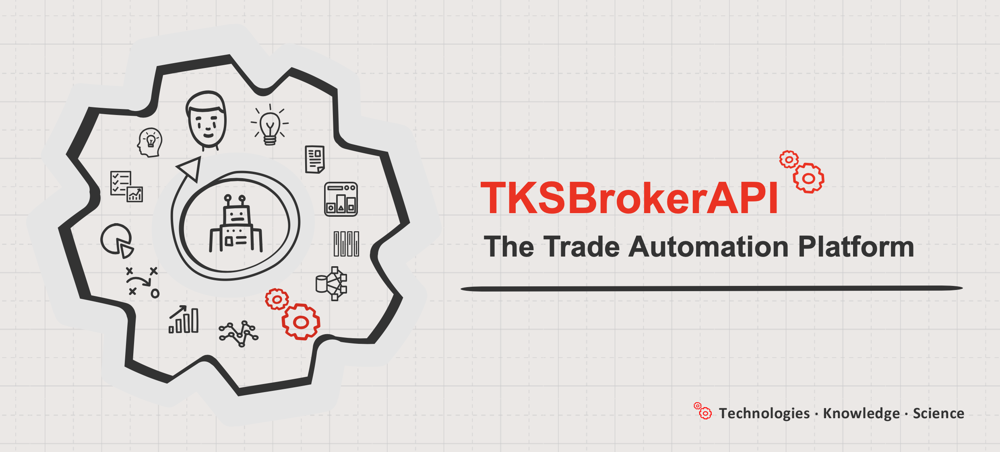

# TKSBrokerAPI Trade Automation Platform



**[TKSBrokerAPI](https://github.com/Tim55667757/TKSBrokerAPI)** is the trading platform for automation and simplifying the implementation of trading scenarios, as well as working with [Tinkoff Invest API](http://tinkoff.ru/sl/AaX1Et1omnH) server via the REST protocol. The TKSBrokerAPI platform may be used in two ways: from the console, it has a rich keys and commands, or you can use it as Python module with `python import`. TKSBrokerAPI allows you to automate routine trading operations and implement your trading scenarios, or just receive the necessary information from the broker. It is easy enough to integrate into various CI/CD automation systems.

[](https://app.travis-ci.com/Tim55667757/TKSBrokerAPI)
[](https://pypi.python.org/pypi/TKSBrokerAPI)
[](https://github.com/Tim55667757/TKSBrokerAPI/blob/master/LICENSE)
[](https://github.com/Tim55667757/TKSBrokerAPI/blob/develop/CHANGELOG_EN.md)
[](https://github.com/Tim55667757/TKSBrokerAPI/blob/master/README.md)
[](https://tim55667757.github.io/TKSBrokerAPI/docs/tksbrokerapi/TKSBrokerAPI.html)
[](https://yoomoney.ru/quickpay/shop-widget?writer=seller&targets=Donat%20(gift)%20for%20the%20authors%20of%20the%20TKSBrokerAPI%20project&default-sum=999&button-text=13&payment-type-choice=on&successURL=https%3A%2F%2Ftim55667757.github.io%2FTKSBrokerAPI%2F&quickpay=shop&account=410015019068268)

❗ If you are missing some feature of the platform or some specific example in the documentation to understand how to work with the TKSBrokerAPI module (in the CLI or as a Python API), then describe your case in the section 👉 [**Issues**](https://github.com/Tim55667757/TKSBrokerAPI/issues/new) 👈, please. As far as possible, we will try to implement the desired feature and add examples in the next release.

[](https://github.com/Tim55667757/TKSBrokerAPI/issues?q=is%3Aopen+is%3Aissue+sort%3Acreated-desc)
[](https://isitmaintained.com/project/tim55667757/TKSBrokerAPI)

**Useful links**

* 📚 [See documentation and examples in russian here (документация и примеры на русском)](https://github.com/Tim55667757/TKSBrokerAPI/blob/master/README.md)
  * ⚙ [TKSBrokerAPI module documentation](https://tim55667757.github.io/TKSBrokerAPI/docs/tksbrokerapi/TKSBrokerAPI.html)
  * 🇷🇺 [See release notes in russian here (релиз-ноты на русском)](https://github.com/Tim55667757/TKSBrokerAPI/blob/master/CHANGELOG.md)
  * 🇺🇸 [Release notes](https://github.com/Tim55667757/TKSBrokerAPI/blob/master/CHANGELOG_EN.md)
    * 💡 [All planned releases and features](https://github.com/Tim55667757/TKSBrokerAPI/milestones?direction=desc&sort=title&state=open)
    * 📂 [All open tasks in the backlog](https://github.com/Tim55667757/TKSBrokerAPI/issues?q=is%3Aissue+is%3Aopen+sort%3Acreated-asc)
* 🎁 Support the project with a donation to our yoomoney-wallet: [410015019068268](https://yoomoney.ru/quickpay/shop-widget?writer=seller&targets=Donat%20(gift)%20for%20the%20authors%20of%20the%20TKSBrokerAPI%20project&default-sum=999&button-text=13&payment-type-choice=on&successURL=https%3A%2F%2Ftim55667757.github.io%2FTKSBrokerAPI%2F&quickpay=shop&account=410015019068268)

**Contents**

1. [Introduction](#Introduction)
   - [Key features](#Key-features)
2. [Setup](#Setup)
3. [Auth](#Auth)
   - [Token](#Token)
   - [User account ID](#User-account-ID)
4. [Usage examples](#Usage-examples)
   - [Command line](#Command-line)
     - [Reference](#Reference)
     - [Local cache](#Local-cache)
     - [Get a list of all instruments available for trading](#Get-a-list-of-all-instruments-available-for-trading)
     - [Find an instrument](#Find-an-instrument)
     - [Get information about an instrument](#Get-information-about-an-instrument)
     - [Request Depth of Market with a specified depth](#Request-Depth-of-Market-with-a-specified-depth)
     - [Request a table of the latest up-to-date prices for a list of instruments](#Request-a-table-of-the-latest-up-to-date-prices-for-a-list-of-instruments)
     - [Get the current portfolio and asset allocation statistics](#Get-the-current-portfolio-and-asset-allocation-statistics)
     - [Get a report on operations with a portfolio for a specified period](#Get-a-report-on-operations-with-a-portfolio-for-a-specified-period)
     - [Make a deal on the market](#Make-a-deal-on-the-market)
     - [Open a pending limit or stop order](#Open-a-pending-limit-or-stop-order)
     - [Cancel orders and close positions](#Cancel-orders-and-close-positions)
     - [Download historical data in OHLCV-candles format](#Download-historical-data-in-OHLCV-candles-format)
     - [Find out the balance of funds available for withdrawal](#Find-out-the-balance-of-funds-available-for-withdrawal)
     - [Get user and account information](#Get-user-and-account-information)
     - [Get extended bonds data](#Get-extended-bonds-data)
     - [Build a bond payment calendar](#Build-a-bond-payment-calendar)
   - [Module import](#Module-import)
     - [Abstract scenario implementation example](#Abstract-scenario-implementation-example)
     - [Using in Jupyter Notebook](#Using-in-Jupyter-Notebook)


## Introduction

If you are engaged in investment, automation and algorithmic trading at the same time, then you have probably heard about [Tinkoff Open API](https://tinkoff.github.io/investAPI/) (there is a good [Swagger-documentation](https://tinkoff.github.io/investAPI/swagger-ui/)). This is an API provided by the Tinkoff Investments broker to automate the operation of exchange trading robots. If you haven't heard it yet, you can create an account [following the link](http://tinkoff.ru/sl/AaX1Et1omnH) and test its capabilities.

When working with any API, there are always technical difficulties: a high entry threshold, the need to study of the big volume of documentation, writing and debugging code to make network requests using the API format. It will take a long time before you get to the point of implementing a trading algorithm.

**[TKSBrokerAPI](https://github.com/Tim55667757/TKSBrokerAPI)** is a simple tool that can be used as a Python module or run from the command line, and immediately out of the box get the opportunity to work with an account with a Tinkoff Investments broker: receive information about the state of the portfolio, including elementary analytics, open and close positions, receive general information about the instruments traded on the exchange, request prices and receive reports on operations for the specified period. All data is output immediately to the console: in text view or saved in Markdown format files.

<details>
  <summary>An example of requesting a client portfolio and viewing information in the console</summary>

```commandline
$ tksbrokerapi --overview

TKSBrokerAPI.py     L:1821 INFO    [2022-08-10 22:06:27,150] Statistics of client's portfolio:
# Client's portfolio

* **Actual date:** [2022-08-10 19:06:27] (UTC)
* **Account ID:** [**********]
* **Portfolio cost:** 405705.77 RUB
* **Changes:** +2098.76 RUB (+0.52%)

## Open positions

| Ticker [FIGI]               | Volume (blocked)                | Lots     | Curr. price  | Avg. price   | Current volume cost | Profit (%)
|-----------------------------|---------------------------------|----------|--------------|--------------|---------------------|----------------------
| Ruble                       |                 5.62 (0.00) rub |          |              |              |                     |
|                             |                                 |          |              |              |                     |
| **Currencies:**             |                                 |          |              |              |        13886.03 RUB |
| EUR_RUB__TOM [BBG0013HJJ31] |                 5.29 (0.00) eur | 0.0053   |    62.75 rub |    61.41 rub |          331.96 rub | +7.10 rub (+2.19%)
| CNYRUB_TOM [BBG0013HRTL0]   |               928.93 (0.00) cny | 0.9289   |     9.09 rub |     8.95 rub |         8443.97 rub | +134.69 rub (+1.62%)
| CHFRUB_TOM [BBG0013HQ5K4]   |                 1.00 (0.00) chf | 0.0010   |    60.54 rub |    64.00 rub |           60.54 rub | -3.46 rub (-5.41%)
| GBPRUB_TOM [BBG0013HQ5F0]   |                10.00 (0.00) gbp | 0.0100   |    74.39 rub |    75.88 rub |          743.85 rub | -14.94 rub (-1.97%)
| TRYRUB_TOM [BBG0013J12N1]   |               100.00 (0.00) try | 0.1000   |     3.42 rub |     3.41 rub |          342.00 rub | +0.65 rub (+0.19%)
| USD000UTSTOM [BBG0013HGFT4] |                34.42 (0.05) usd | 0.0344   |    60.66 rub |    60.33 rub |         2088.09 rub | +11.44 rub (+0.55%)
| HKDRUB_TOM [BBG0013HSW87]   |               237.75 (0.00) hkd | 0.2378   |     7.89 rub |     7.83 rub |         1875.61 rub | +14.27 rub (+0.77%)
|                             |                                 |          |              |              |                     |
| **Shares:**                 |                                 |          |              |              |       199987.52 RUB |
| POSI [TCS00A103X66]         |                           3 (0) | 3        |  1161.80 rub |  1120.20 rub |         3485.40 rub | +124.60 rub (+3.71%)
| 288 [BBG00699M8Q7]          |                         800 (0) | 8        |     5.53 hkd |     5.69 hkd |         4424.00 hkd | -128.00 hkd (-2.81%)
| YNDX [BBG006L8G4H1]         |                           4 (0) | 4        |  1971.80 rub |  1958.80 rub |         7887.20 rub | +52.22 rub (+0.67%)
| IBM [BBG000BLNNH6]          |                           1 (1) | 1        |   131.03 usd |   131.13 usd |          131.03 usd | -0.10 usd (-0.08%)
| 1810 [BBG00KVTBY91]         |                        1100 (0) | 11       |    11.79 hkd |    11.76 hkd |        12969.00 hkd | +30.00 hkd (+0.23%)
| 9988 [BBG006G2JVL2]         |                          60 (0) | 6        |    91.80 hkd |    91.05 hkd |         5508.00 hkd | +45.50 hkd (+0.83%)
|                             |                                 |          |              |              |                     |
| **Bonds:**                  |                                 |          |              |              |        56240.33 RUB |
| RU000A105104 [TCS00A105104] |                           5 (0) | 5        |  1012.00 cny |  1013.00 cny |         5064.80 cny | -5.00 cny (-0.10%)
| RU000A101YV8 [TCS00A101YV8] |                          10 (0) | 10       |  1015.40 rub |  1011.21 rub |        10201.30 rub | +41.90 rub (+0.41%)
|                             |                                 |          |              |              |                     |
| **Etfs:**                   |                                 |          |              |              |       135586.27 RUB |
| TGLD [BBG222222222]         |                       30000 (0) | 300      |     0.07 usd |     0.07 usd |         2235.00 usd | -3.39 usd (-0.15%)
|                             |                                 |          |              |              |                     |
| **Futures:** no trades      |                                 |          |              |              |                     |

## Opened pending limit-orders: 1

| Ticker [FIGI]               | Order ID       | Lots (exec.) | Current price (% delta) | Target price  | Action    | Type      | Create date (UTC)
|-----------------------------|----------------|--------------|-------------------------|---------------|-----------|-----------|---------------------
| IBM [BBG000BLNNH6]          | ************   | 1 (0)        |     131.02 usd (-4.36%) |    137.00 usd | ↓ Sell    | Limit     | 2022-08-10 22:02:44

## Opened stop-orders: 3

| Ticker [FIGI]               | Stop order ID                        | Lots   | Current price (% delta) | Target price  | Limit price   | Action    | Type        | Expire type  | Create date (UTC)   | Expiration (UTC)
|-----------------------------|--------------------------------------|--------|-------------------------|---------------|---------------|-----------|-------------|--------------|---------------------|---------------------
| 1810 [BBG00KVTBY91]         | ********-****-****-****-************ | 11     |         N/A hkd (0.00%) |     14.00 hkd |        Market | ↓ Sell    | Take profit | Until cancel | 2022-08-10 11:24:57 | Undefined
| 288 [BBG00699M8Q7]          | ********-****-****-****-************ | 8      |         N/A hkd (0.00%) |      5.80 hkd |        Market | ↓ Sell    | Take profit | Until cancel | 2022-08-10 11:06:28 | Undefined
| IBM [BBG000BLNNH6]          | ********-****-****-****-************ | 1      |     130.99 usd (-4.49%) |    137.15 usd |        Market | ↓ Sell    | Take profit | Until cancel | 2022-08-10 19:02:21 | Undefined

# Analytics

* **Current total portfolio cost:** 405705.77 RUB
* **Changes:** +2098.76 RUB (+0.52%)

## Portfolio distribution by assets

| Type       | Uniques | Percent | Current cost
|------------|---------|---------|-----------------
| Ruble      | 1       | 0.00%   | 5.62 rub
| Currencies | 7       | 3.42%   | 13886.03 rub
| Shares     | 6       | 49.29%  | 199987.52 rub
| Bonds      | 2       | 13.86%  | 56240.33 rub
| Etfs       | 1       | 33.42%  | 135586.27 rub

## Portfolio distribution by companies

| Company                                     | Percent | Current cost
|---------------------------------------------|---------|-----------------
| All money cash                              | 3.42%   | 13891.65 rub
| [POSI] Positive Technologies                | 0.86%   | 3485.40 rub
| [288] WH Group                              | 8.60%   | 34900.94 rub
| [YNDX] Yandex                               | 1.94%   | 7887.20 rub
| [IBM] IBM                                   | 1.96%   | 7948.93 rub
| [1810] Xiaomi                               | 25.22%  | 102312.44 rub
| [9988] Alibaba                              | 10.71%  | 43452.61 rub
| [RU000A105104] РУСАЛ выпуск 5               | 11.35%  | 46039.03 rub
| [RU000A101YV8] Позитив Текнолоджиз выпуск 1 | 2.51%   | 10201.30 rub
| [TGLD] Тинькофф Золото                      | 33.42%  | 135586.28 rub

## Portfolio distribution by sectors

| Sector         | Percent | Current cost
|----------------|---------|-----------------
| All money cash | 3.42%   | 13891.65 rub
| it             | 30.55%  | 123948.08 rub
| consumer       | 19.31%  | 78353.55 rub
| telecom        | 1.94%   | 7887.20 rub
| materials      | 11.35%  | 46039.03 rub
| other          | 33.42%  | 135586.28 rub

## Portfolio distribution by currencies

| Instruments currencies   | Percent | Current cost
|--------------------------|---------|-----------------
| [rub] Российский рубль   | 5.32%   | 21579.52 rub
| [hkd] Гонконгский доллар | 44.99%  | 182541.60 rub
| [usd] Доллар США         | 35.89%  | 145623.30 rub
| [cny] Юань               | 13.43%  | 54483.01 rub
| [eur] Евро               | 0.08%   | 331.96 rub
| [chf] Швейцарский франк  | 0.01%   | 60.54 rub
| [gbp] Фунт стерлингов    | 0.18%   | 743.85 rub
| [try] Турецкая лира      | 0.08%   | 342.00 rub

## Portfolio distribution by countries

| Assets by country                  | Percent | Current cost
|------------------------------------|---------|-----------------
| All other countries                | 36.84%  | 149472.30 rub
| [RU] Российская Федерация          | 16.67%  | 67612.93 rub
| [CN] Китайская Народная Республика | 44.53%  | 180665.99 rub
| [US] Соединенные Штаты Америки     | 1.96%   | 7948.93 rub

TKSBrokerAPI.py     L:1827 INFO    [2022-08-10 22:06:27,153] Client's portfolio is saved to file: [overview.md]
```

</details>

TKSBrokerAPI allows you to automate routine trading operations and implement your trading scenarios, or just receive the necessary information from the broker. Thanks to the rich system of CLI commands, it is quite easy to integrate it into CI/CD automation systems.

In the future, based on this module, ready-made trading scenarios and templates for writing your own scenarios in Python will be posted here in open source.

### Key features

At the time of the [latest release](https://pypi.org/project/tksbrokerapi/), the TKSBrokerAPI tool can:

- Download historical data from the broker's server in the OHLCV price model (intervals available: `1min`, `5min`, `15min`, `hour` and `day` for any period of time, starting from `1970-01-01`);
   - common key `--history` and additional keys: `--interval`, `--only-missing` and `--csv-sep`;
   - API-method: [`History()`](https://tim55667757.github.io/TKSBrokerAPI/docs/tksbrokerapi/TKSBrokerAPI.html#TinkoffBrokerServer.History).
- Cache by default all data on all traded instruments to the `dump.json` cache file and use it in the future, which reduces the number of calls to the broker's server;
  - key `--no-cache` cancels the use of the local cache, the data is requested from the server at each time;
  - API-method: [`DumpInstruments()`](https://tim55667757.github.io/TKSBrokerAPI/docs/tksbrokerapi/TKSBrokerAPI.html#TinkoffBrokerServer.DumpInstruments).
- Receive from the broker's server a list of all instruments available for the specified account: currencies, shares, bonds, funds and futures as a table in Markdown (human-readable format) or in XLSX to further used by data scientists or stock analytics;
  - key `--list` or `-l` (save as Markdown-file), key `--list-xlsx` or `-x`(save as XLSX-file);
  - API-methods: [`Listing()`](https://tim55667757.github.io/TKSBrokerAPI/docs/tksbrokerapi/TKSBrokerAPI.html#TinkoffBrokerServer.Listing) and [`DumpInstrumentsAsXLSX()`](https://tim55667757.github.io/TKSBrokerAPI/docs/tksbrokerapi/TKSBrokerAPI.html#TinkoffBrokerServer.DumpInstrumentsAsXLSX).
- Search for instruments by specifying only part of their name, ticker or FIGI identifier, or by define a regular expression;
  - key `--search` or `-s`;
  - API-method: [`SearchInstruments()`](https://tim55667757.github.io/TKSBrokerAPI/docs/tksbrokerapi/TKSBrokerAPI.html#TinkoffBrokerServer.SearchInstruments).
- Request the broker for information about the instrument, knowing its ticker or FIGI ID;
  - key `--info` or `-i`;
  - API-methods: [`SearchByTicker()`](https://tim55667757.github.io/TKSBrokerAPI/docs/tksbrokerapi/TKSBrokerAPI.html#TinkoffBrokerServer.SearchByTicker), [`SearchByFIGI()`](https://tim55667757.github.io/TKSBrokerAPI/docs/tksbrokerapi/TKSBrokerAPI.html#TinkoffBrokerServer.SearchByFIGI) and [`ShowInstrumentInfo()`](https://tim55667757.github.io/TKSBrokerAPI/docs/tksbrokerapi/TKSBrokerAPI.html#TinkoffBrokerServer.ShowInstrumentInfo).
- Request the broker for the current exchange prices for the instrument by its ticker or FIGI ID, also you can specify the depth;
  - key `--price` together with the key `--depth`;
  - API-method: [`GetCurrentPrices()`](https://tim55667757.github.io/TKSBrokerAPI/docs/tksbrokerapi/TKSBrokerAPI.html#TinkoffBrokerServer.GetCurrentPrices).
- Receive a table of the latest prices from the broker server;
  - key `--prices` with the list of requested instruments;
  - API-method: [`GetListOfPrices()`](https://tim55667757.github.io/TKSBrokerAPI/docs/tksbrokerapi/TKSBrokerAPI.html#TinkoffBrokerServer.GetListOfPrices).
- Receive information about the user's portfolio and some analytics on it: distribution of the portfolio by assets, companies, sectors, currencies and countries of assets;
  - key `--overview` or `-o`;
  - API-method: [`Overview()`](https://tim55667757.github.io/TKSBrokerAPI/docs/tksbrokerapi/TKSBrokerAPI.html#TinkoffBrokerServer.Overview).
- Receive from the broker server information about completed transactions for the specified period and show it as a table;
  - key `--deals` or `-d`;
  - API-method: [`Deals()`](https://tim55667757.github.io/TKSBrokerAPI/docs/tksbrokerapi/TKSBrokerAPI.html#TinkoffBrokerServer.Deals).
- Make market deals, buy or sell assets, satisfying existing orders from sellers or buyers;
  - common key `--trade` and additional keys: `--buy`, `--sell`;
  - API-methods: [`Trade()`](https://tim55667757.github.io/TKSBrokerAPI/docs/tksbrokerapi/TKSBrokerAPI.html#TinkoffBrokerServer.Trade), [`Buy()`](https://tim55667757.github.io/TKSBrokerAPI/docs/tksbrokerapi/TKSBrokerAPI.html#TinkoffBrokerServer.Buy) and [`Sell()`](https://tim55667757.github.io/TKSBrokerAPI/docs/tksbrokerapi/TKSBrokerAPI.html#TinkoffBrokerServer.Sell).
- Open orders of any type: pending limit orders, expire after one trading session, and stop orders, which can be valid until canceled or until a specified date;
  - common key `--order` and additional keys: `--buy-limit`, `--sell-limit`, `--buy-stop`, `--sell-stop`;
  - API-methods: [`Order()`](https://tim55667757.github.io/TKSBrokerAPI/docs/tksbrokerapi/TKSBrokerAPI.html#TinkoffBrokerServer.Order), [`BuyLimit()`](https://tim55667757.github.io/TKSBrokerAPI/docs/tksbrokerapi/TKSBrokerAPI.html#TinkoffBrokerServer.BuyLimit), [`SellLimit()`](https://tim55667757.github.io/TKSBrokerAPI/docs/tksbrokerapi/TKSBrokerAPI.html#TinkoffBrokerServer.SellLimit), [`BuyStop()`](https://tim55667757.github.io/TKSBrokerAPI/docs/tksbrokerapi/TKSBrokerAPI.html#TinkoffBrokerServer.BuyStop) and [`SellStop()`](https://tim55667757.github.io/TKSBrokerAPI/docs/tksbrokerapi/TKSBrokerAPI.html#TinkoffBrokerServer.SellStop).
- Close previously opened orders or lists of orders of any type by their ID;
  - keys `--close-order` or `--cancel-order`, `--close-orders` or `--cancel-orders`;
  - API-method: [`CloseOrders()`](https://tim55667757.github.io/TKSBrokerAPI/docs/tksbrokerapi/TKSBrokerAPI.html#TinkoffBrokerServer.CloseOrders).
- Close previously opened positions completely (except for blocked volumes) by specifying an instrument or a list of instruments through their tickers or FIGI ID;
  - keys `--close-trade` (`--cancel-trade`) or `--close-trades` (`--cancel-trades`);
  - API-method: [`CloseTrades()`](https://tim55667757.github.io/TKSBrokerAPI/docs/tksbrokerapi/TKSBrokerAPI.html#TinkoffBrokerServer.CloseTrades).
- Cancel all previously opened orders and close current positions for all instruments at once, except for blocked volumes and positions for currencies, which must be closed manually;
  - key `--close-all` (maybe used together with `--ticker` or `--figi` keys), you can also specify orders, asset type or specify several keywords after the key `--close-all` separated by a space: `orders`, `shares`, `bonds`, `etfs` or `futures`;
  - API-methods: [`CloseAll()`](https://tim55667757.github.io/TKSBrokerAPI/docs/tksbrokerapi/TKSBrokerAPI.html#TinkoffBrokerServer.CloseAll), [`CloseAllByTicker()`](https://tim55667757.github.io/TKSBrokerAPI/docs/tksbrokerapi/TKSBrokerAPI.html#TinkoffBrokerServer.CloseAllByTicker), [`CloseAllByFIGI()`](https://tim55667757.github.io/TKSBrokerAPI/docs/tksbrokerapi/TKSBrokerAPI.html#TinkoffBrokerServer.CloseAllByFIGI), [`IsInLimitOrders()`](https://tim55667757.github.io/TKSBrokerAPI/docs/tksbrokerapi/TKSBrokerAPI.html#TinkoffBrokerServer.IsInLimitOrders), [`GetLimitOrderIDs()`](https://tim55667757.github.io/TKSBrokerAPI/docs/tksbrokerapi/TKSBrokerAPI.html#TinkoffBrokerServer.GetLimitOrderIDs), [`IsInStopOrders()`](https://tim55667757.github.io/TKSBrokerAPI/docs/tksbrokerapi/TKSBrokerAPI.html#TinkoffBrokerServer.IsInStopOrders), [`GetStopOrderIDs()`](https://tim55667757.github.io/TKSBrokerAPI/docs/tksbrokerapi/TKSBrokerAPI.html#TinkoffBrokerServer.GetStopOrderIDs), [`CloseAllOrders()`](https://tim55667757.github.io/TKSBrokerAPI/docs/tksbrokerapi/TKSBrokerAPI.html#TinkoffBrokerServer.CloseAllOrders) and [`CloseAllTrades()`](https://tim55667757.github.io/TKSBrokerAPI/docs/tksbrokerapi/TKSBrokerAPI.html#TinkoffBrokerServer.CloseAllTrades).
- Receive user limits on funds available for withdrawal;
  - key `--limits` (`--withdrawal-limits`, `-w`);
  - API-methods: [`RequestLimits()`](https://tim55667757.github.io/TKSBrokerAPI/docs/tksbrokerapi/TKSBrokerAPI.html#TinkoffBrokerServer.RequestLimits) and [`OverviewLimits()`](https://tim55667757.github.io/TKSBrokerAPI/docs/tksbrokerapi/TKSBrokerAPI.html#TinkoffBrokerServer.OverviewLimits).
- Build interactive or static candlestick price charts (using the [PriceGenerator](https://github.com/Tim55667757/PriceGenerator) library), the price source can be either data downloaded from the server or previously saved files in csv-format;
  - common key `--render-chart`, which must be used with one of the keys `--history` (loads data from server) or `--load-history` (loads data from csv-file);
  - API-methods: [`ShowHistoryChart()`](https://tim55667757.github.io/TKSBrokerAPI/docs/tksbrokerapi/TKSBrokerAPI.html#TinkoffBrokerServer.ShowHistoryChart), [`History()`](https://tim55667757.github.io/TKSBrokerAPI/docs/tksbrokerapi/TKSBrokerAPI.html#TinkoffBrokerServer.History) and [`LoadHistory()`](https://tim55667757.github.io/TKSBrokerAPI/docs/tksbrokerapi/TKSBrokerAPI.html#TinkoffBrokerServer.LoadHistory).
- Request general information about the user, a list of accounts (including the `accountId`s), available funds for margin trading and connection limits for the current tariff;
  - common key `--user-info` (`-u`) to request general information or key `--account` (`--accounts`, `-a`) to request list of accounts;
  - API-methods: [`RequestAccounts()`](https://tim55667757.github.io/TKSBrokerAPI/docs/tksbrokerapi/TKSBrokerAPI.html#TinkoffBrokerServer.RequestAccounts), [`RequestUserInfo()`](https://tim55667757.github.io/TKSBrokerAPI/docs/tksbrokerapi/TKSBrokerAPI.html#TinkoffBrokerServer.RequestUserInfo), [`RequestMarginStatus()`](https://tim55667757.github.io/TKSBrokerAPI/docs/tksbrokerapi/TKSBrokerAPI.html#TinkoffBrokerServer.RequestMarginStatus), [`RequestTariffLimits()`](https://tim55667757.github.io/TKSBrokerAPI/docs/tksbrokerapi/TKSBrokerAPI.html#TinkoffBrokerServer.RequestTariffLimits), [`OverviewUserInfo()`](https://tim55667757.github.io/TKSBrokerAPI/docs/tksbrokerapi/TKSBrokerAPI.html#TinkoffBrokerServer.OverviewUserInfo) and [`OverviewAccounts()`](https://tim55667757.github.io/TKSBrokerAPI/docs/tksbrokerapi/TKSBrokerAPI.html#TinkoffBrokerServer.OverviewAccounts).
- Request raw bonds data, extend it and creating Pandas DataFrame with more information for datascientists or stock analytics: main info, current prices, bonds payment calendar, coupon yields, current yields and some statistics, and also saves this data to XLSX-file;
  - common key `--bonds-xlsx` (`-b`) to extend data for all at once or for specified bonds;
  - API-methods: [`RequestBondCoupons()`](https://tim55667757.github.io/TKSBrokerAPI/docs/tksbrokerapi/TKSBrokerAPI.html#TinkoffBrokerServer.RequestBondCoupons) and [`ExtendBondsData()`](https://tim55667757.github.io/TKSBrokerAPI/docs/tksbrokerapi/TKSBrokerAPI.html#TinkoffBrokerServer.ExtendBondsData).
- Generate bonds payment calendar for all at once or for a list of bonds and save it to a Markdown-file or XLSX-file;
  - common key `--calendar` (`-c`) to generate bonds payment calendar;
  - API-methods: [`CreateBondsCalendar()`](https://tim55667757.github.io/TKSBrokerAPI/docs/tksbrokerapi/TKSBrokerAPI.html#TinkoffBrokerServer.CreateBondsCalendar) and [`ShowBondsCalendar()`](https://tim55667757.github.io/TKSBrokerAPI/docs/tksbrokerapi/TKSBrokerAPI.html#TinkoffBrokerServer.ShowBondsCalendar).
- Generate HTML reports from any Markdown reports;
  - common key `--html` (`--HTML`) with any of commands: `--list`, `--info`, `--search`, `--prices`, `--deals`, `--limits`, `--calendar`, `--account`, `--user-info`, `--overview`, `--overview-digest`, `--overview-positions`, `--overview-orders`, `--overview-analytics` and `--overview-calendar`;
  - API-methods: [`Listing()`](https://tim55667757.github.io/TKSBrokerAPI/docs/tksbrokerapi/TKSBrokerAPI.html#TinkoffBrokerServer.Listing), [`ShowInstrumentInfo()`](https://tim55667757.github.io/TKSBrokerAPI/docs/tksbrokerapi/TKSBrokerAPI.html#TinkoffBrokerServer.ShowInstrumentInfo), [`SearchInstruments()`](https://tim55667757.github.io/TKSBrokerAPI/docs/tksbrokerapi/TKSBrokerAPI.html#TinkoffBrokerServer.SearchInstruments), [`GetListOfPrices()`](https://tim55667757.github.io/TKSBrokerAPI/docs/tksbrokerapi/TKSBrokerAPI.html#TinkoffBrokerServer.GetListOfPrices), [`Deals()`](https://tim55667757.github.io/TKSBrokerAPI/docs/tksbrokerapi/TKSBrokerAPI.html#TinkoffBrokerServer.Deals), [`OverviewLimits()`](https://tim55667757.github.io/TKSBrokerAPI/docs/tksbrokerapi/TKSBrokerAPI.html#TinkoffBrokerServer.OverviewLimits), [`CreateBondsCalendar()`](https://tim55667757.github.io/TKSBrokerAPI/docs/tksbrokerapi/TKSBrokerAPI.html#TinkoffBrokerServer.CreateBondsCalendar), [`OverviewAccounts()`](https://tim55667757.github.io/TKSBrokerAPI/docs/tksbrokerapi/TKSBrokerAPI.html#TinkoffBrokerServer.OverviewAccounts), [`OverviewUserInfo()`](https://tim55667757.github.io/TKSBrokerAPI/docs/tksbrokerapi/TKSBrokerAPI.html#TinkoffBrokerServer.OverviewUserInfo) and [`Overview()`](https://tim55667757.github.io/TKSBrokerAPI/docs/tksbrokerapi/TKSBrokerAPI.html#TinkoffBrokerServer.Overview) with enabled parameter `TinkoffBrokerServer.useHTMLReports = True`.


## Setup

The easiest way is to install via PyPI:

```commandline
pip install tksbrokerapi
```

After that, you can check the installation with the command:

```commandline
pip show tksbrokerapi
```

You can also use the TKSBrokerAPI module by downloading it directly from [repository](https://github.com/Tim55667757/TKSBrokerAPI/) via `git clone` and taking the codebase of any tested [release](https://github.com/Tim55667757/TKSBrokerAPI/releases).

In the first case, the tool will be available in the console through the `tksbrokerapi` command, and in the second case, you will have to run it as a Python script, through `python TKSBrokerAPI.py` from the source directory.

❗ **Important note:** TKSBrokerAPI module was tested for `python >= 3.9`. Earlier versions will have bugs. Further, all examples are written for the case when TKSBrokerAPI is installed via PyPI in `python == 3.9`.


## Auth

### Token

The TINKOFF INVEST API service uses a token for authentication. A token is a set of characters that encodes information about the owner, access rights, and other information required for authorization in the service. The token must be passed to the server with every network request.

The TKSBrokerAPI module takes care of all the work with tokens. There are three options for setting a user token:

- when calling `tksbrokerapi` in the console, specify the key: `--token "your_token_here"`;
- either specify `token` when initializing the class in a Python script: [`TKSBrokerAPI.TinkoffBrokerServer(token="your_token_here", ...)`](https://tim55667757.github.io/TKSBrokerAPI/docs/tksbrokerapi/TKSBrokerAPI.html#TinkoffBrokerServer.__init__);
- or you can pre-set a special variable in the user environment: `TKS_API_TOKEN=your_token_here`.

❗ **Working with the TINKOFF INVEST API without creating and using a token is not possible**. Before you start working with the TKSBrokerAPI module, please open the [brokerage account in Tinkoff Investments](http://tinkoff.ru/sl/AaX1Et1omnH), and then select the type of token you need and create it as indicated [in official documentation](https://tinkoff.github.io/investAPI/token/).

❗ **Important note:** never share your tokens with anyone, don't use them in examples, and don't save them in public code. Anyone can use the token, but all transactions with the broker will be displayed on your behalf. If you want to use your tokens for automation in CI/CD systems, then be sure to use hidden environment variables ([example](https://docs.travis-ci.com/user/environment-variables/#defining-variables-in-repository-settings) of setting "hidden variables" for Travis CI, and [example](https://docs.gitlab.com/ee/ci/variables/#protected-cicd-variables) of setting "protected variables" for GitLab CI).

### User account ID

The second important parameter for the operation of TKSBrokerAPI is the user's account ID. It is not mandatory, but without specifying it, it will be impossible to perform many operations through the API (view a portfolio on a brokerage account, perform trading operations, view withdrawal limits and many others).

You can find this number in any brokerage report, which can be ordered either from the Tinkoff Investments mobile application or in your account on their website. Usually the user account ID is located at the top, in the "header" of reports. You can also request this number from the Tinkoff Investments technical support chat.

But the easiest way is to use the `--user-info` key and TKSBrokerAPI will show you a list of all available user accounts and their IDs (the token must be set, see section ["Get user and account information"](#Get-user-and-account-information)).

There are three options for setting the user account ID:

- when calling `tksbrokerapi` in the console, specify the key: `--account-id your_id_number"`;
- either specify `accountId` when initializing the class in a Python script: [`TKSBrokerAPI.TinkoffBrokerServer(token="...", accountId=your_id_number, ...)`](https://tim55667757.github.io/TKSBrokerAPI/docs/tksbrokerapi/TKSBrokerAPI.html#TinkoffBrokerServer.__init__);
- or you can pre-set a special variable in the user environment: `TKS_ACCOUNT_ID=your_id_number`.


## Usage examples

Next, consider some scenarios for using the TKSBrokerAPI module: when it is launched in the console or as a Python script.

❗ By default, level `INFO` information is displayed in the console. In case of any errors, it is recommended to increase the logging level to `DEBUG`. To do this, specify any of the keys together with the command: `--debug-level=10`, `--log-level=10`, `--verbosity=10` or `-v 10`. After that, copy the logs with the problem and create a new bug in the section 👉 [**Issues**](https://github.com/Tim55667757/TKSBrokerAPI/issues/new) 👈, please. It is useful to specify the version of the problem build, which can be found by the `--version` (or `--ver`) key.

Also, `DEBUG` level information is always output to the log-file `TKSBrokerAPI.log` (it is created in the working directory where `tksbrokerapi` or `python TKSBrokerAPI.py` script is called). Starting from TKSBrokerAPI v1.5.120 the `--more` (`--more-debug`) key additionally includes debugging information in all methods and displays it in the logs, for example, network requests, responses and their headers.

If you run TKSBrokerAPI platform instances in parallel mode, you can use additional tag in log messages to simplify instance identifying and debugging. It enables with the `--tag` key (since TKSBrokerAPI v1.6.*).

### Command line

When you run the platform in the console, you can specify many parameters and perform one action. The format of any commands is as follows:

```commandline
tksbrokerapi [optional keys and parameters] [one action]
```

❗ To execute most commands, you must each time specify your token through the `--token` key and the account ID through the `--account-id` key, or set them once with the `TKS_API_TOKEN` and `TKS_ACCOUNT_ID` environment variables (see section ["Auth"](#Auth)).

*Note: in the examples below, the access token and account ID were pre-set via the `TKS_API_TOKEN` and `TKS_ACCOUNT_ID` environment variables, so the `--token` and `--account-id` keys do not appear in the logs.*

#### Reference

The `--help` (`-h`) key is used, no action need to specify. The list of keys relevant for this release and their description will be shown in the console.

<details>
  <summary>Command for displaying internal help on working with the keys</summary>

```commandline
tksbrokerapi --help
```

Output:

```text
usage: 
/as module/ python TKSBrokerAPI.py [some options] [one command]
/as CLI tool/ tksbrokerapi [some options] [one command]

TKSBrokerAPI is a trading platform for automation on Python to simplify the
implementation of trading scenarios and work with Tinkoff Invest API server
via the REST protocol. See examples:
https://github.com/Tim55667757/TKSBrokerAPI/blob/master/README_EN.md

options:
  -h, --help            show this help message and exit
  --no-cache            Option: not use local cache `dump.json`, but update
                        raw instruments data when starting the platform.
                        `False` by default.
  --token TOKEN         Option: Tinkoff service's api key. If not set then
                        used environment variable `TKS_API_TOKEN`. See how to
                        use: https://tinkoff.github.io/investAPI/token/
  --account-id ACCOUNT_ID
                        Option: string with an user numeric account ID in
                        Tinkoff Broker. It can be found in any broker's
                        reports (see the contract number). Also, this variable
                        can be set from environment variable `TKS_ACCOUNT_ID`.
  --ticker TICKER, -t TICKER
                        Option: instrument's ticker, e.g. `IBM`, `YNDX`,
                        `GOOGL` etc. Use alias for `USD000UTSTOM` simple as
                        `USD`, `EUR_RUB__TOM` as `EUR`.
  --figi FIGI, -f FIGI  Option: instrument's FIGI, e.g. `BBG006L8G4H1` (for
                        `YNDX`).
  --depth DEPTH         Option: Depth of Market (DOM) can be >=1, 1 by
                        default.
  --no-cancelled, --no-canceled
                        Option: remove information about cancelled operations
                        from the deals report by the `--deals` key. `False` by
                        default.
  --output OUTPUT       Option: replace default paths to output files for some
                        commands. If `None` then used default files.
  --html, --HTML        Option: if key present then TKSBrokerAPI generate also
                        HTML reports from Markdown. False by default.
  --interval INTERVAL   Option: available values are `1min`, `5min`, `15min`,
                        `hour` and `day`. Used only with `--history` key. This
                        is time period of one candle. Default: `hour` for
                        every history candles.
  --only-missing        Option: if history file define by `--output` key then
                        add only last missing candles, do not request all
                        history length. `False` by default.
  --csv-sep CSV_SEP     Option: separator if csv-file is used, `,` by default.
  --debug-level DEBUG_LEVEL, --log-level DEBUG_LEVEL, --verbosity DEBUG_LEVEL, -v DEBUG_LEVEL
                        Option: showing STDOUT messages of minimal debug
                        level, e.g. 10 = DEBUG, 20 = INFO, 30 = WARNING, 40 =
                        ERROR, 50 = CRITICAL. INFO (20) by default.
  --more, --more-debug  Option: `--debug-level` key only switch log level
                        verbosity, but in addition `--more` key enable all
                        debug information, such as net request and response
                        headers in all methods.
  --tag TAG             Option: identification TKSBrokerAPI tag in log
                        messages to simplify debugging when platform instances
                        runs in parallel mode. Default: `` (empty string).
  --version, --ver      Action: shows current semantic version, looks like
                        `major.minor.buildnumber`. If TKSBrokerAPI not installed
                        via pip, then used local build number `.dev0`.
  --list, -l            Action: get and print all available instruments and
                        some information from broker server. Also, you can
                        define `--output` key to save list of instruments to
                        file, default: `instruments.md`.
  --list-xlsx, -x       Action: get all available instruments from server for
                        current account and save raw data into xlsx-file to
                        further used by data scientists or stock analytics,
                        default: `dump.xlsx`.
  --bonds-xlsx [BONDS_XLSX ...], -b [BONDS_XLSX ...]
                        Action: get all available bonds if only key present or
                        list of bonds with FIGIs or tickers and transform it
                        to the wider Pandas DataFrame with more information
                        about bonds: main info, current prices, bonds payment
                        calendar, coupon yields, current yields and some
                        statistics etc. And then export data to XLSX-file,
                        default: `ext-bonds.xlsx` or you can change it with
                        `--output` key. WARNING! This is too long operation if
                        a lot of bonds requested from broker server.
  --search SEARCH, -s SEARCH
                        Action: search for an instruments by part of the name,
                        ticker or FIGI. Also, you can define `--output` key to
                        save results to file, default: `search-results.md`.
  --info, -i            Action: get information from broker server about
                        instrument by it's ticker or FIGI. `--ticker` key or
                        `--figi` key must be defined!
  --calendar [CALENDAR ...], -c [CALENDAR ...]
                        Action: show bonds payment calendar as a table.
                        Calendar build for one or more tickers or FIGIs, or
                        for all bonds if only key present. If the `--output`
                        key present then calendar saves to file, default:
                        `calendar.md`. Also, created XLSX-file with bond
                        payments calendar for further used by data scientists
                        or stock analytics, `calendar.xlsx` by default.
                        WARNING! This is too long operation if a lot of bonds
                        requested from broker server.
  --price               Action: show actual price list for current instrument.
                        Also, you can use `--depth` key. `--ticker` key or
                        `--figi` key must be defined!
  --prices PRICES [PRICES ...], -p PRICES [PRICES ...]
                        Action: get and print current prices for list of given
                        instruments (by it's tickers or by FIGIs). WARNING!
                        This is too long operation if you request a lot of
                        instruments! Also, you can define `--output` key to
                        save list of prices to file, default: `prices.md`.
  --overview, -o        Action: show all open positions, orders and some
                        statistics. Also, you can define `--output` key to
                        save this information to file, default: `overview.md`.
  --overview-digest     Action: shows a short digest of the portfolio status.
                        Also, you can define `--output` key to save this
                        information to file, default: `overview-digest.md`.
  --overview-positions  Action: shows only open positions. Also, you can
                        define `--output` key to save this information to
                        file, default: `overview-positions.md`.
  --overview-orders     Action: shows only sections of open limits and stop
                        orders. Also, you can define `--output` key to save
                        orders to file, default: `overview-orders.md`.
  --overview-analytics  Action: shows only the analytics section and the
                        distribution of the portfolio by various categories.
                        Also, you can define `--output` key to save this
                        information to file, default: `overview-analytics.md`.
  --deals [DEALS ...], -d [DEALS ...]
                        Action: show all deals between two given dates. Start
                        day may be an integer number: -1, -2, -3 days ago.
                        Also, you can use keywords: `today`, `yesterday` (-1),
                        `week` (-7), `month` (-30) and `year` (-365). Dates
                        format must be: `%Y-%m-%d`, e.g. 2020-02-03. With
                        `--no-cancelled` key information about cancelled
                        operations will be removed from the deals report.
                        Also, you can define `--output` key to save all deals
                        to file, default: `deals.md`.
  --history [HISTORY ...]
                        Action: get last history candles of the current
                        instrument defined by `--ticker` or `--figi` (FIGI id)
                        keys. History returned between two given dates:
                        `start` and `end`. Minimum requested date in the past
                        is `1970-01-01`. This action may be used together with
                        the `--render-chart` key. Also, you can define
                        `--output` key to save history candlesticks to file.
  --load-history LOAD_HISTORY
                        Action: try to load history candles from given csv-
                        file as a Pandas Dataframe and print it in to the
                        console. This action may be used together with the
                        `--render-chart` key.
  --render-chart RENDER_CHART
                        Action: render candlesticks chart. This key may only
                        used with `--history` or `--load-history` together.
                        Action has 1 parameter with two possible string
                        values: `interact` (`i`) or `non-interact` (`ni`).
  --trade [TRADE ...]   Action: universal action to open market position for
                        defined ticker or FIGI. You must specify 1-5
                        parameters: [direction `Buy` or `Sell`] [lots, >= 1]
                        [take profit, >= 0] [stop loss, >= 0] [expiration date
                        for TP/SL orders, Undefined|`%Y-%m-%d %H:%M:%S`]. See
                        examples in readme.
  --buy [BUY ...]       Action: immediately open BUY market position at the
                        current price for defined ticker or FIGI. You must
                        specify 0-4 parameters: [lots, >= 1] [take profit, >=
                        0] [stop loss, >= 0] [expiration date for TP/SL
                        orders, Undefined|`%Y-%m-%d %H:%M:%S`].
  --sell [SELL ...]     Action: immediately open SELL market position at the
                        current price for defined ticker or FIGI. You must
                        specify 0-4 parameters: [lots, >= 1] [take profit, >=
                        0] [stop loss, >= 0] [expiration date for TP/SL
                        orders, Undefined|`%Y-%m-%d %H:%M:%S`].
  --order [ORDER ...]   Action: universal action to open limit or stop-order
                        in any directions. You must specify 4-7 parameters:
                        [direction `Buy` or `Sell`] [order type `Limit` or
                        `Stop`] [lots] [target price] [maybe for stop-order:
                        [limit price, >= 0] [stop type, Limit|SL|TP]
                        [expiration date, Undefined|`%Y-%m-%d %H:%M:%S`]]. See
                        examples in readme.
  --buy-limit BUY_LIMIT BUY_LIMIT
                        Action: open pending BUY limit-order (below current
                        price). You must specify only 2 parameters: [lots]
                        [target price] to open BUY limit-order. If you try to
                        create `Buy` limit-order above current price then
                        broker immediately open `Buy` market order, such as if
                        you do simple `--buy` operation!
  --sell-limit SELL_LIMIT SELL_LIMIT
                        Action: open pending SELL limit-order (above current
                        price). You must specify only 2 parameters: [lots]
                        [target price] to open SELL limit-order. If you try to
                        create `Sell` limit-order below current price then
                        broker immediately open `Sell` market order, such as
                        if you do simple `--sell` operation!
  --buy-stop [BUY_STOP ...]
                        Action: open BUY stop-order. You must specify at least
                        2 parameters: [lots] [target price] to open BUY stop-
                        order. In additional you can specify 3 parameters for
                        stop-order: [limit price, >= 0] [stop type,
                        Limit|SL|TP] [expiration date, Undefined|`%Y-%m-%d
                        %H:%M:%S`]. When current price will go up or down to
                        target price value then broker opens a limit order.
                        Stop loss order always executed by market price.
  --sell-stop [SELL_STOP ...]
                        Action: open SELL stop-order. You must specify at
                        least 2 parameters: [lots] [target price] to open SELL
                        stop-order. In additional you can specify 3 parameters
                        for stop-order: [limit price, >= 0] [stop type,
                        Limit|SL|TP] [expiration date, Undefined|`%Y-%m-%d
                        %H:%M:%S`]. When current price will go up or down to
                        target price value then broker opens a limit order.
                        Stop loss order always executed by market price.
  --close-order CLOSE_ORDER, --cancel-order CLOSE_ORDER
                        Action: close only one order by it's `orderId` or
                        `stopOrderId`. You can find out the meaning of these
                        IDs using the key `--overview`.
  --close-orders CLOSE_ORDERS [CLOSE_ORDERS ...], --cancel-orders CLOSE_ORDERS [CLOSE_ORDERS ...]
                        Action: close one or list of orders by it's `orderId`
                        or `stopOrderId`. You can find out the meaning of
                        these IDs using the key `--overview`.
  --close-trade, --cancel-trade
                        Action: close only one position for instrument defined
                        by `--ticker` (high priority) or `--figi` keys,
                        including for currencies tickers.
  --close-trades CLOSE_TRADES [CLOSE_TRADES ...], --cancel-trades CLOSE_TRADES [CLOSE_TRADES ...]
                        Action: close positions for list of tickers or FIGIs,
                        including for currencies tickers or FIGIs.
  --close-all [CLOSE_ALL ...], --cancel-all [CLOSE_ALL ...]
                        Action: close all available (not blocked) opened
                        trades and orders, excluding for currencies. Also you
                        can select one or more keywords case insensitive to
                        specify trades type: `orders`, `shares`, `bonds`,
                        `etfs` and `futures`, but not `currencies`. Currency
                        positions you must closes manually using `--buy`,
                        `--sell`, `--close-trade` or `--close-trades`
                        operations. If the `--close-all` key present with the
                        `--ticker` or `--figi` keys, then positions and all
                        open limit and stop orders for the specified
                        instrument are closed.
  --limits, --withdrawal-limits, -w
                        Action: show table of funds available for withdrawal
                        for current `accountId`. You can change `accountId`
                        with the key `--account-id`. Also, you can define
                        `--output` key to save this information to file,
                        default: `limits.md`.
  --user-info, -u       Action: show all available user's data (`accountId`s,
                        common user information, margin status and tariff
                        connections limit). Also, you can define `--output`
                        key to save this information to file, default: `user-info.md`.
  --account, --accounts, -a
                        Action: show simple table with all available user
                        accounts. Also, you can define `--output` key to save
                        this information to file, default: `accounts.md`.
```

</details>

#### Local cache

Starting with TKSBrokerAPI v1.2.62 the ability to use the local cache `dump.json` with data on traded instruments has been added, which allows you to avoid constant requests for this data from the broker's server and significantly save time. The cache is used by default when executing any command, there is no need to specifically set it.

If the current day differs from the day the cache was last modified, it will be automatically updated at the next time when the TKSBrokerAPI platform is started. If the `dump.json` file does not exist in the local directory, it will also be created automatically.

Usually, share exchanges rarely experience critical changes in instruments during the day, and updating the cache at least once a day is justified. But if you want to be completely sure about the consistency of the data, you can specify the `--no-cahce` key together with each command. In this case, data on instruments will be requested every time.

#### Get a list of all instruments available for trading

The `--list` (`-l`) key is used. At the same time, information is requested from the broker's server on the instruments available for the current account. Additionally, you can use the `--output` key to specify the file where you want to save the received raw data as a table in human-readable Markdown format (by default, `instruments.md` in the current working directory). Data from the local `dump.json` cache is used to generate the `instruments.md` file.

The `--debug-level=10` key (or `--log-level 10`, `--verbosity 10`, `-v 10`) will output all debugging information to the console (not necessary to specify it).

Starting with TKSBrokerAPI v1.4.90, you can use the `--list-xlsx` (`-x`) key to save raw data for available instruments in XLSX-format suitable for further processing by data scientists or stock analysts. By default, data from the local `dump.json` cache is used, which is converted to XLSX-format and saved to the `dump.xlsx` file.

Output is an XLSX-file with raw data, you can see the example of that file here: [./docs/media/dump.xlsx](./docs/media/dump.xlsx). Which mean headers in XLSX-file, see here: "[Get extended bonds data](#Get-extended-bonds-data)" and "[Builds a bond payment calendar](#Builds-a-bond-payment-calendar)".


<details>
  <summary>Command to get a list of all available instruments in Markdown format</summary>

```commandline
$ tksbrokerapi --debug-level=10 --list --output ilist.md

TKSBrokerAPI.py     L:2804 DEBUG   [2022-07-26 22:04:39,571] TKSBrokerAPI module started at: [2022-07-26 19:04:39] (UTC), it is [2022-07-26 22:04:39] local time
TKSBrokerAPI.py     L:198  DEBUG   [2022-07-26 22:04:39,572] Bearer token for Tinkoff OpenApi set up from environment variable `TKS_API_TOKEN`. See https://tinkoff.github.io/investAPI/token/
TKSBrokerAPI.py     L:210  DEBUG   [2022-07-26 22:04:39,572] String with user's numeric account ID in Tinkoff Broker set up from environment variable `TKS_ACCOUNT_ID`
TKSBrokerAPI.py     L:240  DEBUG   [2022-07-26 22:04:39,573] Broker API server: https://invest-public-api.tinkoff.ru/rest
TKSBrokerAPI.py     L:411  DEBUG   [2022-07-26 22:04:39,573] Requesting all available instruments from broker for current user token. Wait, please...
TKSBrokerAPI.py     L:412  DEBUG   [2022-07-26 22:04:39,574] CPU usages for parallel requests: [7]
TKSBrokerAPI.py     L:389  DEBUG   [2022-07-26 22:04:39,581] Requesting available [Currencies] list. Wait, please...
TKSBrokerAPI.py     L:389  DEBUG   [2022-07-26 22:04:39,581] Requesting available [Shares] list. Wait, please...
TKSBrokerAPI.py     L:389  DEBUG   [2022-07-26 22:04:39,581] Requesting available [Bonds] list. Wait, please...
TKSBrokerAPI.py     L:389  DEBUG   [2022-07-26 22:04:39,581] Requesting available [Etfs] list. Wait, please...
TKSBrokerAPI.py     L:389  DEBUG   [2022-07-26 22:04:39,582] Requesting available [Futures] list. Wait, please...
TKSBrokerAPI.py     L:925  INFO    [2022-07-26 22:04:40,400] # All available instruments from Tinkoff Broker server for current user token

* **Actual on date:** [2022-07-26 19:04] (UTC)
* **Currencies:** [21]
* **Shares:** [1900]
* **Bonds:** [655]
* **Etfs:** [105]
* **Futures:** [284]


## Currencies available. Total: [21]

| Ticker       | Full name                                                      | FIGI         | Cur | Lot    | Step
|--------------|----------------------------------------------------------------|--------------|-----|--------|---------
| USDCHF_TOM   | Швейцарский франк - Доллар США                                 | BBG0013HPJ07 | chf | 1000   | 1e-05
| EUR_RUB__TOM | Евро                                                           | BBG0013HJJ31 | rub | 1000   | 0.0025
| CNYRUB_TOM   | Юань                                                           | BBG0013HRTL0 | rub | 1000   | 0.0001
| ...          | ...                                                            | ...          | ... | ...    | ...   
| RUB000UTSTOM | Российский рубль                                               | RUB000UTSTOM | rub | 1      | 0.0025
| USD000UTSTOM | Доллар США                                                     | BBG0013HGFT4 | rub | 1000   | 0.0025

[... SKIPPED ...]

TKSBrokerAPI.py     L:931  INFO    [2022-07-26 22:04:41,211] All available instruments are saved to file: [ilist.md]
TKSBrokerAPI.py     L:3034 DEBUG   [2022-07-26 22:04:41,213] All operations with Tinkoff Server using Open API are finished success (summary code is 0).
TKSBrokerAPI.py     L:3039 DEBUG   [2022-07-26 22:04:41,214] TKSBrokerAPI module work duration: [0:00:01.641989]
TKSBrokerAPI.py     L:3042 DEBUG   [2022-07-26 22:04:41,215] TKSBrokerAPI module finished: [2022-07-26 19:04:41] (UTC), it is [2022-07-26 22:04:41] local time
```

</details>

<details>
  <summary>Command to get raw data of all available instruments in XLSX format</summary>

```commandline
$ tksbrokerapi -v 10 --list-xlsx

TKSBrokerAPI.py     L:3482 DEBUG   [2022-10-19 01:20:35,574] >>> TKSBrokerAPI module started at: [2022-10-18 22:20:35] UTC, it is [2022-10-19 01:20:35] local time
TKSBrokerAPI.py     L:3496 DEBUG   [2022-10-19 01:20:35,576] TKSBrokerAPI major.minor.build version used: [1.3.dev77]
TKSBrokerAPI.py     L:3497 DEBUG   [2022-10-19 01:20:35,576] Host CPU count: [8]
TKSBrokerAPI.py     L:210  DEBUG   [2022-10-19 01:20:35,576] Bearer token for Tinkoff OpenApi set up from environment variable `TKS_API_TOKEN`. See https://tinkoff.github.io/investAPI/token/
TKSBrokerAPI.py     L:222  DEBUG   [2022-10-19 01:20:35,576] String with user's numeric account ID in Tinkoff Broker set up from environment variable `TKS_ACCOUNT_ID`
TKSBrokerAPI.py     L:270  DEBUG   [2022-10-19 01:20:35,576] Broker API server: https://invest-public-api.tinkoff.ru/rest
TKSBrokerAPI.py     L:395  DEBUG   [2022-10-19 01:20:35,599] Local cache with raw instruments data is used: [dump.json]
TKSBrokerAPI.py     L:396  DEBUG   [2022-10-19 01:20:35,599] Dump file was last modified [2022-10-18 20:38:59] UTC
TKSBrokerAPI.py     L:603  INFO    [2022-10-19 01:20:37,278] XLSX-file for further used by data scientists or stock analytics: [dump.xlsx]
TKSBrokerAPI.py     L:3806 DEBUG   [2022-10-19 01:20:37,278] All operations were finished success (summary code is 0).
TKSBrokerAPI.py     L:3813 DEBUG   [2022-10-19 01:20:37,278] >>> TKSBrokerAPI module work duration: [0:00:01.703956]
TKSBrokerAPI.py     L:3814 DEBUG   [2022-10-19 01:20:37,279] >>> TKSBrokerAPI module finished: [2022-10-18 22:20:37 UTC], it is [2022-10-19 01:20:37] local time
```

</details>

#### Find an instrument

To work with exchange instruments, receive information on them, request prices and make deals, you usually need to specify a ticker (key `--ticker`) or FIGI (key `--figi`). But there are hardly many people who know them by heart. Most often, there is only an assumption about a part of the ticker or the name of the company. In this case, you can use the search by pattern: part of the name, ticker or FIGI, or by specifying a regular expression. The search is performed by the standard Python module [`re`](https://docs.python.org/3/library/re.html#re.compile), case-insensitive.

Starting with TKSBrokerAPI v1.2.62 the `--search` key has been added, after which you need to specify the pattern. For example, you want to find all the instruments of the Russian Sber group of companies, then you can try to specify a part of the word: `tksbrokerapi --search "sber"`. Or you want to know all the instruments of companies whose names contain the word "United" with "medical" or "rent". In this case, you can try to specify a regular expression: `tksbrokerapi --search "(United.*).*(?:.*medical|rent)"`.

In addition to the `--search` key, you can specify the `--output` key and define the file name where to save the search results. By default, full search results are stored in `search-results.md`. Only the first 5 found instruments of each type are shown in the console.

After the desired instrument has been found and its ticker and FIGI have become known, you can view more detailed information with the command `tksbrokerapi -t TICKER --info` or `tksbrokerapi -f FIGI --info` ([more](https://github.com/Tim55667757/TKSBrokerAPI/blob/master/README_EN.md#Get-information-about-an-instrument)).

<details>
  <summary>Command to search for an instrument by part of its name</summary>

```commandline
$ tksbrokerapi --search "sber"

TKSBrokerAPI.py     L:1067 INFO    [2022-08-11 23:42:54,569] # Search results

* **Search pattern:** [sber]
* **Found instruments:** [7]

**Note:** you can view info about found instruments with key `--info`, e.g.: `tksbrokerapi -t TICKER --info` or `tksbrokerapi -f FIGI --info`.

### Shares: [3]

| Type       | Ticker       | Full name                                                      | FIGI         |
|------------|--------------|----------------------------------------------------------------|--------------|
| Shares     | SBER         | Сбер Банк                                                      | BBG004730N88 |
| Shares     | SBERP        | Сбер Банк - привилегированные акции                            | BBG0047315Y7 |
| Shares     | SBER@GS      | Sberbank of Russia PJSC                                        | BBG001VBZR00 |

### Bonds: [4]

| Type       | Ticker       | Full name                                                      | FIGI         |
|------------|--------------|----------------------------------------------------------------|--------------|
| Bonds      | RU000A102CU4 | Сбер Банк 001P-SBER19                                          | BBG00Y9B45C2 |
| Bonds      | RU000A102RS6 | Сбер Банк 001P-SBER24                                          | BBG00ZZ927H8 |
| Bonds      | RU000A101C89 | Сбер Банк 001P-SBER15                                          | BBG00RKBQ4D2 |
| Bonds      | RU000A103G75 | Сбер Банк 001P-SBER32                                          | BBG0122KNFZ0 |

TKSBrokerAPI.py     L:1068 INFO    [2022-08-11 23:42:54,569] You can view info about found instruments with key `--info`, e.g.: `tksbrokerapi -t IBM --info` or `tksbrokerapi -f BBG000BLNNH6 --info`
TKSBrokerAPI.py     L:1074 INFO    [2022-08-11 23:42:54,569] Full search results were saved to file: [search-results.md]
```

</details>

<details>
  <summary>Command to search for an instrument by regular expression</summary>

```commandline
$ tksbrokerapi --search "(United.*).*(?:.*medical|rent)"

TKSBrokerAPI.py     L:1067 INFO    [2022-08-12 00:08:08,944] # Search results

* **Search pattern:** [(United.*).*(?:.*medical|rent)]
* **Found instruments:** [2]

**Note:** you can view info about found instruments with key `--info`, e.g.: `tksbrokerapi -t TICKER --info` or `tksbrokerapi -f FIGI --info`.

### Shares: [2]

| Type       | Ticker       | Full name                                                      | FIGI         |
|------------|--------------|----------------------------------------------------------------|--------------|
| Shares     | GEMC         | United medical group                                           | BBG011MCM288 |
| Shares     | URI          | United Rentals                                                 | BBG000BXMFC3 |

TKSBrokerAPI.py     L:1068 INFO    [2022-08-12 00:08:08,944] You can view info about found instruments with key `--info`, e.g.: `tksbrokerapi -t IBM --info` or `tksbrokerapi -f BBG000BLNNH6 --info`
TKSBrokerAPI.py     L:1074 INFO    [2022-08-12 00:08:08,945] Full search results were saved to file: [search-results.md]
```

</details>

#### Get information about an instrument

The key `--info` (`-i`) is used, and one of the two parameters must be specified: the instrument's ticker, or its FIGI ID. They are specified by the `--ticker` (`-t`) and `--figi` (`-f`) keys, respectively. The information displayed to the user is the same for both keys. The difference is in the content and number of fields displayed in the information table, depending on the type of instrument found: it is a currency, share, bond, fund or futures.

In addition, you can use the `--output` key and define the file name where to save the received information. By default, the results are stored in `info.md`.

<details>
  <summary>Command to get currency information (using ticker alias, minimal logs)</summary>

```commandline
$ tksbrokerapi -t CNY -i

TKSBrokerAPI.py     L:930  INFO    [2022-11-18 13:58:40,118] # Main information: ticker [CNYRUB_TOM], FIGI [BBG0013HRTL0]

* Actual at: [2022-11-18 10:58] (UTC)

| Parameters                                                  | Values                                                 |
|-------------------------------------------------------------|--------------------------------------------------------|
| Ticker:                                                     | CNYRUB_TOM                                             |
| Full name:                                                  | Юань                                                   |
|                                                             |                                                        |
| FIGI (Financial Instrument Global Identifier):              | BBG0013HRTL0                                           |
| Real exchange [Exchange section]:                           | MOEX [FX]                                              |
| Class Code (exchange section where instrument is traded):   | CETS                                                   |
|                                                             |                                                        |
| Current broker security trading status:                     | Normal trading                                         |
|                                                             |                                                        |
| Buy operations allowed:                                     | Yes                                                    |
| Sale operations allowed:                                    | Yes                                                    |
| Short positions allowed:                                    | Yes                                                    |
|                                                             |                                                        |
| Limit orders allowed:                                       | Yes                                                    |
| Market orders allowed:                                      | Yes                                                    |
| API trade allowed:                                          | Yes                                                    |
|                                                             |                                                        |
| Type of the instrument:                                     | Currencies                                             |
| ISO currency name:                                          | cny                                                    |
| Payment currency:                                           | rub                                                    |
|                                                             |                                                        |
| Previous close price of the instrument:                     | 8.453 rub                                              |
| Last deal price of the instrument:                          | 8.473 rub                                              |
| Changes between last deal price and last close              | 0.24% (+0.02 rub)                                      |
| Current limit price, min / max:                             | 8.064 rub / 8.857 rub                                  |
| Actual price, sell / buy:                                   | 8.473 rub / 8.474 rub                                  |
| Minimum lot to buy:                                         | 1000                                                   |
| Minimum price increment (step):                             | 0.001 rub                                              |

TKSBrokerAPI.py     L:939  INFO    [2022-11-18 13:58:40,121] Info about instrument with ticker [CNYRUB_TOM] and FIGI [BBG0013HRTL0] was saved to file: [info.md]
```

</details>

<details>
  <summary>Command to get information about the share (using ticker, detailed logs)</summary>

```commandline
$ tksbrokerapi -v 10 --ticker IBM --info

TKSBrokerAPI.py     L:4545 DEBUG   [2022-11-18 14:05:00,882] =-=-=-=-=-=-=-=-=-=-=-=-=-=-=-=-=-=-=-=-=-=-=-=-=-=-=-=-=-=-=-=-=-=-=-=-=-=-=-=-=-=-=-=-=-=-=-=-=-=-
TKSBrokerAPI.py     L:4546 DEBUG   [2022-11-18 14:05:00,882] >>> TKSBrokerAPI module started at: [2022-11-18 11:05:00] UTC, it is [2022-11-18 14:05:00] local time
TKSBrokerAPI.py     L:4560 DEBUG   [2022-11-18 14:05:00,883] TKSBrokerAPI major.minor.build version used: [1.5.dev0]
TKSBrokerAPI.py     L:4561 DEBUG   [2022-11-18 14:05:00,883] Host CPU count: [8]
TKSBrokerAPI.py     L:212  DEBUG   [2022-11-18 14:05:00,883] Bearer token for Tinkoff OpenAPI set up from environment variable `TKS_API_TOKEN`. See https://tinkoff.github.io/investAPI/token/
TKSBrokerAPI.py     L:225  DEBUG   [2022-11-18 14:05:00,883] Main account ID [**********] set up from environment variable `TKS_ACCOUNT_ID`
TKSBrokerAPI.py     L:277  DEBUG   [2022-11-18 14:05:00,883] Broker API server: https://invest-public-api.tinkoff.ru/rest
TKSBrokerAPI.py     L:444  DEBUG   [2022-11-18 14:05:00,903] Local cache with raw instruments data is used: [dump.json]. Last modified: [2022-11-18 08:28:22] UTC
TKSBrokerAPI.py     L:1161 DEBUG   [2022-11-18 14:05:00,904] Requesting current prices: ticker [IBM], FIGI [BBG000BLNNH6]. Wait, please...
TKSBrokerAPI.py     L:1515 DEBUG   [2022-11-18 14:05:01,028] Requesting current trading status, FIGI: [BBG000BLNNH6]. Wait, please...
TKSBrokerAPI.py     L:930  INFO    [2022-11-18 14:05:01,198] # Main information: ticker [IBM], FIGI [BBG000BLNNH6]

* Actual at: [2022-11-18 11:05] (UTC)

| Parameters                                                  | Values                                                 |
|-------------------------------------------------------------|--------------------------------------------------------|
| Ticker:                                                     | IBM                                                    |
| Full name:                                                  | IBM                                                    |
| Sector:                                                     | it                                                     |
| Country of instrument:                                      | (US) Соединенные Штаты Америки                         |
|                                                             |                                                        |
| FIGI (Financial Instrument Global Identifier):              | BBG000BLNNH6                                           |
| Real exchange [Exchange section]:                           | SPBEX [SPB_MORNING]                                    |
| ISIN (International Securities Identification Number):      | US4592001014                                           |
| Class Code (exchange section where instrument is traded):   | SPBXM                                                  |
|                                                             |                                                        |
| Current broker security trading status:                     | Normal trading                                         |
|                                                             |                                                        |
| Buy operations allowed:                                     | Yes                                                    |
| Sale operations allowed:                                    | Yes                                                    |
| Short positions allowed:                                    | No                                                     |
|                                                             |                                                        |
| Limit orders allowed:                                       | Yes                                                    |
| Market orders allowed:                                      | Yes                                                    |
| API trade allowed:                                          | Yes                                                    |
|                                                             |                                                        |
| Type of the instrument:                                     | Shares                                                 |
| Share type:                                                 | Ordinary                                               |
| IPO date:                                                   | 1915-11-11 00:00:00                                    |
| Payment currency:                                           | usd                                                    |
|                                                             |                                                        |
| Previous close price of the instrument:                     | 146.09 usd                                             |
| Last deal price of the instrument:                          | 145.51 usd                                             |
| Changes between last deal price and last close              | -0.40% (-0.58 usd)                                     |
| Current limit price, min / max:                             | 144.1 usd / 147.62 usd                                 |
| Actual price, sell / buy:                                   | 145.51 usd / 146.2 usd                                 |
| Minimum lot to buy:                                         | 1                                                      |
| Minimum price increment (step):                             | 0.01 usd                                               |

TKSBrokerAPI.py     L:939  INFO    [2022-11-18 14:05:01,203] Info about instrument with ticker [IBM] and FIGI [BBG000BLNNH6] was saved to file: [info.md]
TKSBrokerAPI.py     L:4929 DEBUG   [2022-11-18 14:05:01,204] >>> TKSBrokerAPI module work duration: [0:00:00.322308]
TKSBrokerAPI.py     L:4930 DEBUG   [2022-11-18 14:05:01,204] >>> TKSBrokerAPI module finished: [2022-11-18 11:05:01 UTC], it is [2022-11-18 14:05:01] local time
TKSBrokerAPI.py     L:4934 DEBUG   [2022-11-18 14:05:01,204] =-=-=-=-=-=-=-=-=-=-=-=-=-=-=-=-=-=-=-=-=-=-=-=-=-=-=-=-=-=-=-=-=-=-=-=-=-=-=-=-=-=-=-=-=-=-=-=-=-=-
```

</details>

<details>
  <summary>Command for obtaining information on a bond (with the FIGI ID of the instrument)</summary>

```commandline
$ tksbrokerapi -f TCS00A101YV8 --info

TKSBrokerAPI.py     L:4134 INFO    [2022-11-18 14:07:20,658] XLSX-file with bond payments calendar for further used by data scientists or stock analytics: [calendar.xlsx]
TKSBrokerAPI.py     L:4208 INFO    [2022-11-18 14:07:20,660] Bond payment calendar was saved to file: [calendar.md]
TKSBrokerAPI.py     L:930  INFO    [2022-11-18 14:07:20,660] # Main information: ticker [RU000A101YV8], FIGI [TCS00A101YV8]

* Actual at: [2022-11-18 11:07] (UTC)

| Parameters                                                  | Values                                                 |
|-------------------------------------------------------------|--------------------------------------------------------|
| Ticker:                                                     | RU000A101YV8                                           |
| Full name:                                                  | Позитив Текнолоджиз выпуск 1                           |
| Sector:                                                     | it                                                     |
| Country of instrument:                                      | (RU) Российская Федерация                              |
|                                                             |                                                        |
| FIGI (Financial Instrument Global Identifier):              | TCS00A101YV8                                           |
| Real exchange [Exchange section]:                           | MOEX [MOEX]                                            |
| ISIN (International Securities Identification Number):      | RU000A101YV8                                           |
| Class Code (exchange section where instrument is traded):   | TQCB                                                   |
|                                                             |                                                        |
| Current broker security trading status:                     | Normal trading                                         |
|                                                             |                                                        |
| Buy operations allowed:                                     | Yes                                                    |
| Sale operations allowed:                                    | Yes                                                    |
| Short positions allowed:                                    | No                                                     |
|                                                             |                                                        |
| Limit orders allowed:                                       | Yes                                                    |
| Market orders allowed:                                      | Yes                                                    |
| API trade allowed:                                          | Yes                                                    |
|                                                             |                                                        |
| Type of the instrument:                                     | Bonds                                                  |
| Payment currency:                                           | rub                                                    |
| Nominal currency:                                           | rub                                                    |
| State registration date:                                    | 2020-07-21 00:00:00                                    |
| Placement date:                                             | 2020-07-29 00:00:00                                    |
| Maturity date:                                              | 2023-07-26 00:00:00                                    |
|                                                             |                                                        |
| Bond issue (size / plan):                                   | 500000 / 500000                                        |
| Nominal price (100%):                                       | 750 rub                                                |
| Floating coupon:                                            | No                                                     |
| Amortization:                                               | Yes                                                    |
|                                                             |                                                        |
| Number of coupon payments per year:                         | 4                                                      |
| Days last to maturity date:                                 | 249                                                    |
| Coupons yield (average coupon daily yield * 365):           | 13.42%                                                 |
| Current price yield (average daily yield * 365):            | 7.12%                                                  |
| Current accumulated coupon income (ACI):                    | 6.14 rub                                               |
|                                                             |                                                        |
| Previous close price of the instrument:                     | 101.19% of nominal price (758.92 rub)                  |
| Last deal price of the instrument:                          | 101.24% of nominal price (759.30 rub)                  |
| Changes between last deal price and last close              | 0.05% (+0.38 rub)                                      |
| Current limit price, min / max:                             | 60.66% / 141.52% (454.95 rub / 1061.40 rub)            |
| Actual price, sell / buy:                                   | 101.13% / 101.29% (101.13 rub / 101.29 rub)            |
| Minimum lot to buy:                                         | 1                                                      |
| Minimum price increment (step):                             | 0.01 rub                                               |

# Bond payments calendar

| Paid  | Payment date    | FIGI         | Ticker       | No. | Value         | Type      | Period | End registry date |
|-------|-----------------|--------------|--------------|-----|---------------|-----------|--------|-------------------|
|   √   | 2020-10-28      | TCS00A101YV8 | RU000A101YV8 | 1   | 28.67 rub     | Constant  | 91     | 2020-10-27        |
|   √   | 2021-01-27      | TCS00A101YV8 | RU000A101YV8 | 2   | 28.67 rub     | Constant  | 91     | 2021-01-26        |
|   √   | 2021-04-28      | TCS00A101YV8 | RU000A101YV8 | 3   | 28.67 rub     | Constant  | 91     | 2021-04-27        |
|   √   | 2021-07-28      | TCS00A101YV8 | RU000A101YV8 | 4   | 28.67 rub     | Constant  | 91     | 2021-07-27        |
|   √   | 2021-10-27      | TCS00A101YV8 | RU000A101YV8 | 5   | 28.67 rub     | Constant  | 91     | 2021-10-26        |
|   √   | 2022-01-26      | TCS00A101YV8 | RU000A101YV8 | 6   | 28.67 rub     | Constant  | 91     | 2022-01-25        |
|   √   | 2022-04-27      | TCS00A101YV8 | RU000A101YV8 | 7   | 28.67 rub     | Constant  | 91     | 2022-04-26        |
|   √   | 2022-07-27      | TCS00A101YV8 | RU000A101YV8 | 8   | 28.67 rub     | Constant  | 91     | 2022-07-26        |
|   √   | 2022-10-26      | TCS00A101YV8 | RU000A101YV8 | 9   | 28.67 rub     | Constant  | 91     | 2022-10-25        |
|   —   | 2023-01-25      | TCS00A101YV8 | RU000A101YV8 | 10  | 21.5 rub      | Constant  | 91     | 2023-01-24        |
|   —   | 2023-04-26      | TCS00A101YV8 | RU000A101YV8 | 11  | 14.34 rub     | Constant  | 91     | 2023-04-25        |
|   —   | 2023-07-26      | TCS00A101YV8 | RU000A101YV8 | 12  | 7.17 rub      | Constant  | 91     | 2023-07-25        |

TKSBrokerAPI.py     L:939  INFO    [2022-11-18 14:07:20,661] Info about instrument with ticker [RU000A101YV8] and FIGI [TCS00A101YV8] was saved to file: [info.md]
```

</details>

<details>
  <summary>Command for obtaining information about the ETF (with the FIGI ID)</summary>

```commandline
$ tksbrokerapi --figi BBG222222222 -i

TKSBrokerAPI.py     L:930  INFO    [2022-11-18 14:11:05,791] # Main information: ticker [TGLD], FIGI [BBG222222222]

* Actual at: [2022-11-18 11:11] (UTC)

| Parameters                                                  | Values                                                 |
|-------------------------------------------------------------|--------------------------------------------------------|
| Ticker:                                                     | TGLD                                                   |
| Full name:                                                  | Тинькофф Золото                                        |
|                                                             |                                                        |
| FIGI (Financial Instrument Global Identifier):              | BBG222222222                                           |
| Real exchange [Exchange section]:                           | MOEX [MOEX]                                            |
| ISIN (International Securities Identification Number):      | RU000A101X50                                           |
| Class Code (exchange section where instrument is traded):   | TQTD                                                   |
|                                                             |                                                        |
| Current broker security trading status:                     | Normal trading                                         |
|                                                             |                                                        |
| Buy operations allowed:                                     | Yes                                                    |
| Sale operations allowed:                                    | Yes                                                    |
| Short positions allowed:                                    | No                                                     |
|                                                             |                                                        |
| Limit orders allowed:                                       | Yes                                                    |
| Market orders allowed:                                      | Yes                                                    |
| API trade allowed:                                          | Yes                                                    |
|                                                             |                                                        |
| Type of the instrument:                                     | Etfs                                                   |
| Released date:                                              | 2020-07-13 00:00:00                                    |
| Focusing type:                                              | equity                                                 |
| Payment currency:                                           | usd                                                    |
|                                                             |                                                        |
| Previous close price of the instrument:                     | 0.0727 usd                                             |
| Last deal price of the instrument:                          | 0.073 usd                                              |
| Changes between last deal price and last close              | 0.41% (+0.00 usd)                                      |
| Current limit price, min / max:                             | 0.062 usd / 0.0833 usd                                 |
| Actual price, sell / buy:                                   | 0.073 usd / 0.0731 usd                                 |
| Minimum lot to buy:                                         | 100                                                    |
| Minimum price increment (step):                             | 0.0001 usd                                             |

TKSBrokerAPI.py     L:939  INFO    [2022-11-18 14:11:05,795] Info about instrument with ticker [TGLD] and FIGI [BBG222222222] was saved to file: [info.md]
```

</details>

<details>
  <summary>Command to get information about the futures (using its ticker, detailed logs)</summary>

```commandline
$ tksbrokerapi --verbosity=10 --ticker PZH2 --info

TKSBrokerAPI.py     L:4545 DEBUG   [2022-11-18 14:12:29,029] =-=-=-=-=-=-=-=-=-=-=-=-=-=-=-=-=-=-=-=-=-=-=-=-=-=-=-=-=-=-=-=-=-=-=-=-=-=-=-=-=-=-=-=-=-=-=-=-=-=-
TKSBrokerAPI.py     L:4546 DEBUG   [2022-11-18 14:12:29,029] >>> TKSBrokerAPI module started at: [2022-11-18 11:12:29] UTC, it is [2022-11-18 14:12:29] local time
TKSBrokerAPI.py     L:4560 DEBUG   [2022-11-18 14:12:29,030] TKSBrokerAPI major.minor.build version used: [1.5.dev0]
TKSBrokerAPI.py     L:4561 DEBUG   [2022-11-18 14:12:29,030] Host CPU count: [8]
TKSBrokerAPI.py     L:212  DEBUG   [2022-11-18 14:12:29,030] Bearer token for Tinkoff OpenAPI set up from environment variable `TKS_API_TOKEN`. See https://tinkoff.github.io/investAPI/token/
TKSBrokerAPI.py     L:225  DEBUG   [2022-11-18 14:12:29,030] Main account ID [2000096541] set up from environment variable `TKS_ACCOUNT_ID`
TKSBrokerAPI.py     L:277  DEBUG   [2022-11-18 14:12:29,030] Broker API server: https://invest-public-api.tinkoff.ru/rest
TKSBrokerAPI.py     L:444  DEBUG   [2022-11-18 14:12:29,051] Local cache with raw instruments data is used: [dump.json]. Last modified: [2022-11-18 08:28:22] UTC
TKSBrokerAPI.py     L:1161 DEBUG   [2022-11-18 14:12:29,051] Requesting current prices: ticker [PZH2], FIGI [FUTPLZL03220]. Wait, please...
TKSBrokerAPI.py     L:1515 DEBUG   [2022-11-18 14:12:29,178] Requesting current trading status, FIGI: [FUTPLZL03220]. Wait, please...
TKSBrokerAPI.py     L:930  INFO    [2022-11-18 14:12:29,298] # Main information: ticker [PZH2], FIGI [FUTPLZL03220]

* Actual at: [2022-11-18 11:12] (UTC)

| Parameters                                                  | Values                                                 |
|-------------------------------------------------------------|--------------------------------------------------------|
| Ticker:                                                     | PZH2                                                   |
| Full name:                                                  | PLZL-3.22 Полюс Золото                                 |
| Sector:                                                     | SECTOR_MATERIALS                                       |
| Country of instrument:                                      | (RU) Российская Федерация                              |
|                                                             |                                                        |
| FIGI (Financial Instrument Global Identifier):              | FUTPLZL03220                                           |
| Real exchange [Exchange section]:                           | SPBEX [FORTS]                                          |
| Class Code (exchange section where instrument is traded):   | SPBFUT                                                 |
|                                                             |                                                        |
| Current broker security trading status:                     | Not available for trading                              |
|                                                             |                                                        |
| Buy operations allowed:                                     | Yes                                                    |
| Sale operations allowed:                                    | Yes                                                    |
| Short positions allowed:                                    | Yes                                                    |
|                                                             |                                                        |
| Limit orders allowed:                                       | No                                                     |
| Market orders allowed:                                      | No                                                     |
| API trade allowed:                                          | Yes                                                    |
|                                                             |                                                        |
| Type of the instrument:                                     | Futures                                                |
| Futures type:                                               | DELIVERY_TYPE_PHYSICAL_DELIVERY                        |
| Asset type:                                                 | TYPE_SECURITY                                          |
| Basic asset:                                                | PLZL                                                   |
| Basic asset size:                                           | 10.00                                                  |
| Payment currency:                                           | rub                                                    |
| First trade date:                                           | 2021-09-02 20:59:59                                    |
| Last trade date:                                            | 2022-03-28 21:00:00                                    |
| Date of expiration:                                         | 2022-03-30 00:00:00                                    |
|                                                             |                                                        |
| Previous close price of the instrument:                     | 108100 rub                                             |
| Last deal price of the instrument:                          | 108100 rub                                             |
| Changes between last deal price and last close              | 0.00% (0.00 rub)                                       |
| Current limit price, min / max:                             | 0 rub / 0 rub                                          |
| Actual price, sell / buy:                                   | N/A rub / N/A rub                                      |
| Minimum lot to buy:                                         | 1                                                      |
| Minimum price increment (step):                             | 1.0 rub                                                |

TKSBrokerAPI.py     L:939  INFO    [2022-11-18 14:12:29,302] Info about instrument with ticker [PZH2] and FIGI [FUTPLZL03220] was saved to file: [info.md]
TKSBrokerAPI.py     L:4929 DEBUG   [2022-11-18 14:12:29,303] >>> TKSBrokerAPI module work duration: [0:00:00.274060]
TKSBrokerAPI.py     L:4930 DEBUG   [2022-11-18 14:12:29,303] >>> TKSBrokerAPI module finished: [2022-11-18 11:12:29 UTC], it is [2022-11-18 14:12:29] local time
TKSBrokerAPI.py     L:4934 DEBUG   [2022-11-18 14:12:29,303] =-=-=-=-=-=-=-=-=-=-=-=-=-=-=-=-=-=-=-=-=-=-=-=-=-=-=-=-=-=-=-=-=-=-=-=-=-=-=-=-=-=-=-=-=-=-=-=-=-=-
```

</details>

#### Request Depth of Market with a specified depth

The `--price` key is used, and one of the two parameters must be specified: the instrument's ticker (the `--ticker` or `-t` key), or its FIGI identifier (the `--figi` or `-f` key), respectively . Additionally, you can specify the `--depth` key to set the "depth of the order book". The actual given depth is determined by the broker's policies for a particular instrument, it can be much less than the requested one.

<details>
  <summary>Command for getting Depth of Market</summary>

```commandline
$ tksbrokerapi -t TRUR --depth 10 --price

TKSBrokerAPI.py     L:1231 INFO    [2022-11-11 18:01:48,273] Current prices in order book:

Orders book actual at [2022-11-11 15:01:48] (UTC)
Ticker: [TRUR], FIGI: [BBG000000001], Depth of Market: [10]
------------------------------------------------------------
             Orders of Buyers | Orders of Sellers
------------------------------------------------------------
        Sell prices (volumes) | Buy prices (volumes)
------------------------------------------------------------
                              | 5.71 (1158)
                              | 5.7 (93508)
                              | 5.69 (112074)
                              | 5.68 (12804)
                              | 5.67 (106064)
                              | 5.66 (23593)
                              | 5.65 (1457706)
                              | 5.64 (32957)
                              | 5.63 (823159)
                              | 5.62 (1991386)
               5.61 (3351948) |
                5.6 (1780747) |
               5.59 (1354789) |
               5.58 (1167135) |
                5.57 (770161) |
                5.56 (521801) |
                5.55 (337911) |
                  5.54 (6204) |
                  5.53 (5603) |
               5.52 (1110590) |
------------------------------------------------------------
         Total sell: 10406889 | Total buy: 4654409
------------------------------------------------------------
```

</details>

#### Request a table of the latest up-to-date prices for a list of instruments

The `--prices` (`-p`) key is used, and it is also necessary to list the tickers of the instruments or their FIGI identifiers, separated by a space. Additionally, you can specify the `--output` key and specify the name of the file where the price table will be saved in Markdown format (by default, `prices.md` in the current working directory).

<details>
  <summary>Command to request prices for specified instruments</summary>

```commandline
$ tksbrokerapi --prices EUR IBM MSFT GOOGL UNKNOWN_TICKER TCS00A101YV8 POSI BBG000000001 PTZ2 --output some-prices.md

TKSBrokerAPI.py     L:977  WARNING [2022-07-27 00:25:43,224] Instrument [UNKNOWN_TICKER] not in list of available instruments for current token!
TKSBrokerAPI.py     L:1018 INFO    [2022-07-27 00:25:43,606] Only unique instruments are shown:
# Actual prices at: [2022-07-26 21:25 UTC]

| Ticker       | FIGI         | Type       | Prev. close | Last price  | Chg. %   | Day limits min/max  | Actual sell / buy   | Curr.
|--------------|--------------|------------|-------------|-------------|----------|---------------------|---------------------|------
| EUR_RUB__TOM | BBG0013HJJ31 | Currencies |       59.22 |       61.68 |   +4.16% |       55.82 / 62.47 |           N/A / N/A | rub
| IBM          | BBG000BLNNH6 | Shares     |      128.08 |      128.36 |   +0.22% |     126.64 / 129.96 |     128.18 / 128.65 | usd
| MSFT         | BBG000BPH459 | Shares     |      251.90 |      252.23 |   +0.13% |     248.74 / 254.96 |     252.01 / 252.35 | usd
| GOOGL        | BBG009S39JX6 | Shares     |      105.02 |      108.00 |   +2.84% |       97.78 / 119.3 |     107.55 / 107.94 | usd
| RU000A101YV8 | TCS00A101YV8 | Bonds      |      101.00 |      101.00 |    0.00% |      60.51 / 141.17 |           N/A / N/A | rub
| POSI         | TCS00A103X66 | Shares     |      910.00 |      910.00 |    0.00% |      533.2 / 1243.6 |           N/A / N/A | rub
| TRUR         | BBG000000001 | Etfs       |        5.45 |        5.45 |    0.00% |          4.8 / 5.94 |           N/A / N/A | rub
| PTZ2         | FUTPLT122200 | Futures    |      940.40 |      930.00 |   -1.11% |      831.4 / 1024.2 |           N/A / N/A | rub

TKSBrokerAPI.py     L:1024 INFO    [2022-07-27 00:25:43,611] Price list for all instruments saved to file: [some-prices.md]
```

</details>

#### Get the current portfolio and asset allocation statistics

To view portfolio status and asset allocation statistics (by types, companies, sectors, currencies, and countries), use the `--overview` (`-o`) key. Additionally, you can specify the `--output` key and specify the file name where to save the portfolio in Markdown format (by default `overview.md` in the current working directory). The `--verbosity=10` key will output all debugging information to the console (not necessary to specify it).

Also, you can use another keys instead of the `--overview` key, since TKSBrokerAPI v1.3.70:
- the `--overview-digest` key shows a short digest of the portfolio status,
- the `--overview-positions` key shows only open positions, without everything else,
- the `--overview-orders` shows only section of open limits and stop orders,
- the `--overview-analytics` key shows only the analytics section and the distribution of the portfolio by various categories.

Starting from TKSBrokerAPI v1.5.* one more key has been added:
- `--overview-calendar`, which only shows the bond payments calendar section (if bonds are present in the user's portfolio, see also sections "[Get extended bonds data](#Get-extended-bonds-data)" and "[Build a bond payment calendar](#Build-a-bond-payment-calendar)").

Key `--output` also overrides the output file for all of additional keys.

<details>
  <summary>Command to show user's portfolio</summary>

```commandline
$ tksbrokerapi --verbosity=10 --overview --output portfolio.md

TKSBrokerAPI.py     L:2898 DEBUG   [2022-08-10 22:06:22,087] TKSBrokerAPI module started at: [2022-08-10 19:06:22] (UTC), it is [2022-08-10 22:06:22] local time
TKSBrokerAPI.py     L:205  DEBUG   [2022-08-10 22:06:22,087] Bearer token for Tinkoff OpenApi set up from environment variable `TKS_API_TOKEN`. See https://tinkoff.github.io/investAPI/token/
TKSBrokerAPI.py     L:217  DEBUG   [2022-08-10 22:06:22,087] String with user's numeric account ID in Tinkoff Broker set up from environment variable `TKS_ACCOUNT_ID`
TKSBrokerAPI.py     L:247  DEBUG   [2022-08-10 22:06:22,087] Broker API server: https://invest-public-api.tinkoff.ru/rest
TKSBrokerAPI.py     L:307  DEBUG   [2022-08-10 22:06:22,113] Local cache with raw instruments data is used: [dump.json]
TKSBrokerAPI.py     L:308  DEBUG   [2022-08-10 22:06:22,114] Dump file was modified [2022-08-10 12:02:58] UTC
TKSBrokerAPI.py     L:1207 DEBUG   [2022-08-10 22:06:22,114] Request portfolio of a client...
TKSBrokerAPI.py     L:1095 DEBUG   [2022-08-10 22:06:22,114] Requesting current actual user's portfolio. Wait, please...
TKSBrokerAPI.py     L:1101 DEBUG   [2022-08-10 22:06:22,499] Records about user's portfolio successfully received
TKSBrokerAPI.py     L:1112 DEBUG   [2022-08-10 22:06:22,499] Requesting current open positions in currencies and instruments. Wait, please...
TKSBrokerAPI.py     L:1118 DEBUG   [2022-08-10 22:06:22,854] Records about current open positions successfully received
TKSBrokerAPI.py     L:1129 DEBUG   [2022-08-10 22:06:22,854] Requesting current actual pending orders. Wait, please...
TKSBrokerAPI.py     L:1135 DEBUG   [2022-08-10 22:06:23,192] [1] records about pending orders successfully received
TKSBrokerAPI.py     L:1146 DEBUG   [2022-08-10 22:06:23,193] Requesting current actual stop orders. Wait, please...
TKSBrokerAPI.py     L:1152 DEBUG   [2022-08-10 22:06:23,807] [5] records about stop orders successfully received
TKSBrokerAPI.py     L:858  DEBUG   [2022-08-10 22:06:23,824] Requesting current prices for instrument with ticker [IBM] and FIGI [BBG000BLNNH6]...
TKSBrokerAPI.py     L:858  DEBUG   [2022-08-10 22:06:24,152] Requesting current prices for instrument with ticker [1810] and FIGI [BBG00KVTBY91]...
TKSBrokerAPI.py     L:858  DEBUG   [2022-08-10 22:06:24,571] Requesting current prices for instrument with ticker [288] and FIGI [BBG00699M8Q7]...
TKSBrokerAPI.py     L:858  DEBUG   [2022-08-10 22:06:24,843] Requesting current prices for instrument with ticker [9988] and FIGI [BBG006G2JVL2]...
TKSBrokerAPI.py     L:1821 INFO    [2022-08-10 22:06:27,150] Statistics of client's portfolio:
# Client's portfolio

* **Actual date:** [2022-08-10 19:06:27] (UTC)
* **Account ID:** [**********]
* **Portfolio cost:** 405705.77 RUB
* **Changes:** +2098.76 RUB (+0.52%)

## Open positions

| Ticker [FIGI]               | Volume (blocked)                | Lots     | Curr. price  | Avg. price   | Current volume cost | Profit (%)
|-----------------------------|---------------------------------|----------|--------------|--------------|---------------------|----------------------
| Ruble                       |                 5.62 (0.00) rub |          |              |              |                     |
|                             |                                 |          |              |              |                     |
| **Currencies:**             |                                 |          |              |              |        13886.03 RUB |
| EUR_RUB__TOM [BBG0013HJJ31] |                 5.29 (0.00) eur | 0.0053   |    62.75 rub |    61.41 rub |          331.96 rub | +7.10 rub (+2.19%)
| CNYRUB_TOM [BBG0013HRTL0]   |               928.93 (0.00) cny | 0.9289   |     9.09 rub |     8.95 rub |         8443.97 rub | +134.69 rub (+1.62%)
| CHFRUB_TOM [BBG0013HQ5K4]   |                 1.00 (0.00) chf | 0.0010   |    60.54 rub |    64.00 rub |           60.54 rub | -3.46 rub (-5.41%)
| GBPRUB_TOM [BBG0013HQ5F0]   |                10.00 (0.00) gbp | 0.0100   |    74.39 rub |    75.88 rub |          743.85 rub | -14.94 rub (-1.97%)
| TRYRUB_TOM [BBG0013J12N1]   |               100.00 (0.00) try | 0.1000   |     3.42 rub |     3.41 rub |          342.00 rub | +0.65 rub (+0.19%)
| USD000UTSTOM [BBG0013HGFT4] |                34.42 (0.05) usd | 0.0344   |    60.66 rub |    60.33 rub |         2088.09 rub | +11.44 rub (+0.55%)
| HKDRUB_TOM [BBG0013HSW87]   |               237.75 (0.00) hkd | 0.2378   |     7.89 rub |     7.83 rub |         1875.61 rub | +14.27 rub (+0.77%)
|                             |                                 |          |              |              |                     |
| **Shares:**                 |                                 |          |              |              |       199987.52 RUB |
| POSI [TCS00A103X66]         |                           3 (0) | 3        |  1161.80 rub |  1120.20 rub |         3485.40 rub | +124.60 rub (+3.71%)
| 288 [BBG00699M8Q7]          |                         800 (0) | 8        |     5.53 hkd |     5.69 hkd |         4424.00 hkd | -128.00 hkd (-2.81%)
| YNDX [BBG006L8G4H1]         |                           4 (0) | 4        |  1971.80 rub |  1958.80 rub |         7887.20 rub | +52.22 rub (+0.67%)
| IBM [BBG000BLNNH6]          |                           1 (1) | 1        |   131.03 usd |   131.13 usd |          131.03 usd | -0.10 usd (-0.08%)
| 1810 [BBG00KVTBY91]         |                        1100 (0) | 11       |    11.79 hkd |    11.76 hkd |        12969.00 hkd | +30.00 hkd (+0.23%)
| 9988 [BBG006G2JVL2]         |                          60 (0) | 6        |    91.80 hkd |    91.05 hkd |         5508.00 hkd | +45.50 hkd (+0.83%)
|                             |                                 |          |              |              |                     |
| **Bonds:**                  |                                 |          |              |              |        56240.33 RUB |
| RU000A105104 [TCS00A105104] |                           5 (0) | 5        |  1012.00 cny |  1013.00 cny |         5064.80 cny | -5.00 cny (-0.10%)
| RU000A101YV8 [TCS00A101YV8] |                          10 (0) | 10       |  1015.40 rub |  1011.21 rub |        10201.30 rub | +41.90 rub (+0.41%)
|                             |                                 |          |              |              |                     |
| **Etfs:**                   |                                 |          |              |              |       135586.27 RUB |
| TGLD [BBG222222222]         |                       30000 (0) | 300      |     0.07 usd |     0.07 usd |         2235.00 usd | -3.39 usd (-0.15%)
|                             |                                 |          |              |              |                     |
| **Futures:** no trades      |                                 |          |              |              |                     |

## Opened pending limit-orders: 1

| Ticker [FIGI]               | Order ID       | Lots (exec.) | Current price (% delta) | Target price  | Action    | Type      | Create date (UTC)
|-----------------------------|----------------|--------------|-------------------------|---------------|-----------|-----------|---------------------
| IBM [BBG000BLNNH6]          | ************   | 1 (0)        |     131.02 usd (-4.36%) |    137.00 usd | ↓ Sell    | Limit     | 2022-08-10 22:02:44

## Opened stop-orders: 3

| Ticker [FIGI]               | Stop order ID                        | Lots   | Current price (% delta) | Target price  | Limit price   | Action    | Type        | Expire type  | Create date (UTC)   | Expiration (UTC)
|-----------------------------|--------------------------------------|--------|-------------------------|---------------|---------------|-----------|-------------|--------------|---------------------|---------------------
| 1810 [BBG00KVTBY91]         | ********-****-****-****-************ | 11     |         N/A hkd (0.00%) |     14.00 hkd |        Market | ↓ Sell    | Take profit | Until cancel | 2022-08-10 11:24:57 | Undefined
| 288 [BBG00699M8Q7]          | ********-****-****-****-************ | 8      |         N/A hkd (0.00%) |      5.80 hkd |        Market | ↓ Sell    | Take profit | Until cancel | 2022-08-10 11:06:28 | Undefined
| IBM [BBG000BLNNH6]          | ********-****-****-****-************ | 1      |     130.99 usd (-4.49%) |    137.15 usd |        Market | ↓ Sell    | Take profit | Until cancel | 2022-08-10 19:02:21 | Undefined

# Analytics

* **Current total portfolio cost:** 405705.77 RUB
* **Changes:** +2098.76 RUB (+0.52%)

## Portfolio distribution by assets

| Type       | Uniques | Percent | Current cost
|------------|---------|---------|-----------------
| Ruble      | 1       | 0.00%   | 5.62 rub
| Currencies | 7       | 3.42%   | 13886.03 rub
| Shares     | 6       | 49.29%  | 199987.52 rub
| Bonds      | 2       | 13.86%  | 56240.33 rub
| Etfs       | 1       | 33.42%  | 135586.27 rub

## Portfolio distribution by companies

| Company                                     | Percent | Current cost
|---------------------------------------------|---------|-----------------
| All money cash                              | 3.42%   | 13891.65 rub
| [POSI] Positive Technologies                | 0.86%   | 3485.40 rub
| [288] WH Group                              | 8.60%   | 34900.94 rub
| [YNDX] Yandex                               | 1.94%   | 7887.20 rub
| [IBM] IBM                                   | 1.96%   | 7948.93 rub
| [1810] Xiaomi                               | 25.22%  | 102312.44 rub
| [9988] Alibaba                              | 10.71%  | 43452.61 rub
| [RU000A105104] РУСАЛ выпуск 5               | 11.35%  | 46039.03 rub
| [RU000A101YV8] Позитив Текнолоджиз выпуск 1 | 2.51%   | 10201.30 rub
| [TGLD] Тинькофф Золото                      | 33.42%  | 135586.28 rub

## Portfolio distribution by sectors

| Sector         | Percent | Current cost
|----------------|---------|-----------------
| All money cash | 3.42%   | 13891.65 rub
| it             | 30.55%  | 123948.08 rub
| consumer       | 19.31%  | 78353.55 rub
| telecom        | 1.94%   | 7887.20 rub
| materials      | 11.35%  | 46039.03 rub
| other          | 33.42%  | 135586.28 rub

## Portfolio distribution by currencies

| Instruments currencies   | Percent | Current cost
|--------------------------|---------|-----------------
| [rub] Российский рубль   | 5.32%   | 21579.52 rub
| [hkd] Гонконгский доллар | 44.99%  | 182541.60 rub
| [usd] Доллар США         | 35.89%  | 145623.30 rub
| [cny] Юань               | 13.43%  | 54483.01 rub
| [eur] Евро               | 0.08%   | 331.96 rub
| [chf] Швейцарский франк  | 0.01%   | 60.54 rub
| [gbp] Фунт стерлингов    | 0.18%   | 743.85 rub
| [try] Турецкая лира      | 0.08%   | 342.00 rub

## Portfolio distribution by countries

| Assets by country                  | Percent | Current cost
|------------------------------------|---------|-----------------
| All other countries                | 36.84%  | 149472.30 rub
| [RU] Российская Федерация          | 16.67%  | 67612.93 rub
| [CN] Китайская Народная Республика | 44.53%  | 180665.99 rub
| [US] Соединенные Штаты Америки     | 1.96%   | 7948.93 rub

# Bond payments calendar

| Paid  | Payment date    | FIGI         | Ticker       | No. | Value         | Type      | Period | End registry date |
|-------|-----------------|--------------|--------------|-----|---------------|-----------|--------|-------------------|
|   √   | 2020-10-28      | TCS00A101YV8 | RU000A101YV8 | 1   | 28.67 rub     | Constant  | 91     | 2020-10-27        |
|       |                 |              |              |     |               |           |        |                   |
|   √   | 2021-01-27      | TCS00A101YV8 | RU000A101YV8 | 2   | 28.67 rub     | Constant  | 91     | 2021-01-26        |
|       |                 |              |              |     |               |           |        |                   |
|   √   | 2021-04-28      | TCS00A101YV8 | RU000A101YV8 | 3   | 28.67 rub     | Constant  | 91     | 2021-04-27        |
|       |                 |              |              |     |               |           |        |                   |
|   √   | 2021-07-28      | TCS00A101YV8 | RU000A101YV8 | 4   | 28.67 rub     | Constant  | 91     | 2021-07-27        |
|       |                 |              |              |     |               |           |        |                   |
|   √   | 2021-10-27      | TCS00A101YV8 | RU000A101YV8 | 5   | 28.67 rub     | Constant  | 91     | 2021-10-26        |
|       |                 |              |              |     |               |           |        |                   |
|   √   | 2022-01-26      | TCS00A101YV8 | RU000A101YV8 | 6   | 28.67 rub     | Constant  | 91     | 2022-01-25        |
|       |                 |              |              |     |               |           |        |                   |
|   √   | 2022-04-27      | TCS00A101YV8 | RU000A101YV8 | 7   | 28.67 rub     | Constant  | 91     | 2022-04-26        |
|       |                 |              |              |     |               |           |        |                   |
|   √   | 2022-07-27      | TCS00A101YV8 | RU000A101YV8 | 8   | 28.67 rub     | Constant  | 91     | 2022-07-26        |
|       |                 |              |              |     |               |           |        |                   |
|   —   | 2022-10-26      | TCS00A101YV8 | RU000A101YV8 | 9   | 28.67 rub     | Constant  | 91     | 2022-10-25        |
|       |                 |              |              |     |               |           |        |                   |
|   —   | 2023-01-25      | TCS00A101YV8 | RU000A101YV8 | 10  | 21.5 rub      | Constant  | 91     | 2023-01-24        |
|       |                 |              |              |     |               |           |        |                   |
|   —   | 2023-02-01      | TCS00A105104 | RU000A105104 | 1   | 19.45 cny     | Variable  | 182    | 2023-01-31        |
|       |                 |              |              |     |               |           |        |                   |
|   —   | 2023-04-26      | TCS00A101YV8 | RU000A101YV8 | 11  | 14.34 rub     | Constant  | 91     | 2023-04-25        |
|       |                 |              |              |     |               |           |        |                   |
|   —   | 2023-07-26      | TCS00A101YV8 | RU000A101YV8 | 12  | 7.17 rub      | Constant  | 91     | 2023-07-25        |
|       |                 |              |              |     |               |           |        |                   |
|   —   | 2023-08-02      | TCS00A105104 | RU000A105104 | 2   | 19.45 cny     | Variable  | 182    | 2023-08-01        |
|       |                 |              |              |     |               |           |        |                   |
|   —   | 2024-01-31      | TCS00A105104 | RU000A105104 | 3   | 19.45 cny     | Variable  | 182    | 2024-01-30        |
|       |                 |              |              |     |               |           |        |                   |
|   —   | 2024-07-31      | TCS00A105104 | RU000A105104 | 4   | 19.45 cny     | Variable  | 182    | 2024-07-30        |
|       |                 |              |              |     |               |           |        |                   |
|   —   | 2025-01-29      | TCS00A105104 | RU000A105104 | 5   | 0 cny         | Variable  | 182    | 2025-01-28        |
|       |                 |              |              |     |               |           |        |                   |
|   —   | 2025-07-30      | TCS00A105104 | RU000A105104 | 6   | 0 cny         | Variable  | 182    | 2025-07-29        |
|       |                 |              |              |     |               |           |        |                   |
|   —   | 2026-01-28      | TCS00A105104 | RU000A105104 | 7   | 0 cny         | Variable  | 182    | 2026-01-27        |
|       |                 |              |              |     |               |           |        |                   |
|   —   | 2026-07-29      | TCS00A105104 | RU000A105104 | 8   | 0 cny         | Variable  | 182    | 2026-07-28        |
|       |                 |              |              |     |               |           |        |                   |
|   —   | 2027-01-27      | TCS00A105104 | RU000A105104 | 9   | 0 cny         | Variable  | 182    | 2027-01-26        |
|       |                 |              |              |     |               |           |        |                   |
|   —   | 2027-07-28      | TCS00A105104 | RU000A105104 | 10  | 0 cny         | Variable  | 182    | 2027-07-27        |

TKSBrokerAPI.py     L:1827 INFO    [2022-08-10 22:06:27,153] Client's portfolio is saved to file: [portfolio.md]
TKSBrokerAPI.py     L:3132 DEBUG   [2022-08-10 22:06:27,153] All operations with Tinkoff Server using Open API are finished success (summary code is 0).
TKSBrokerAPI.py     L:3137 DEBUG   [2022-08-10 22:06:27,153] TKSBrokerAPI module work duration: [0:00:05.066358]
TKSBrokerAPI.py     L:3138 DEBUG   [2022-08-10 22:06:27,154] TKSBrokerAPI module finished: [2022-08-10 19:06:27] (UTC), it is [2022-08-10 22:06:27] local time
```

</details>

#### Get a report on operations with a portfolio for a specified period

The key `--deals` (`-d`) is used, after which you need to specify two dates: the start and end dates of the report. They must be in the format `%Y-%m-%d` and separated by a space, e.g. `--deals 2022-07-01 2022-07-27`. In this case, the report will include all transactions from 0:00:00 on the first date to 23:59:59 on the second date.

Instead of the start date, you can specify a negative number — the number of previous days from the current date (`--deals -1`, `-d -2`, `-d -3`, ...), then you do not need to specify the end date. Also, instead of the start date, you can specify one of the keywords: `today`, `yesterday` (-1 day), `week` (-7 days), `month` (-30 days), `year` (-365 days) . In all these cases, a report will be issued for the specified number of previous days up to today and the current time.

In additional, you can specify the `--output` key to specify the file where to save the report on deals in Markdown format (by default, `deals.md` in the current working directory). Also, the `--no-cancelled` key can remove information about cancelled operations from the report to reduce its volume.
 
<details>
  <summary>Command to get a report on operations between two specified dates</summary>

```commandline
$ tksbrokerapi --deals 2022-07-01 2022-07-28 --output deals.md

TKSBrokerAPI.py     L:1972 INFO    [2022-07-28 18:13:18,960] # Client's operations

* **Period:** from [2022-07-01] to [2022-07-28]

## Summary (operations executed only)

| Report sections            |                               |                              |                      |                        |
|----------------------------|-------------------------------|------------------------------|----------------------|------------------------|
| **Actions:**               | Operations executed: 35       | Trading volumes:             |                      |                        |
|                            |   Buy: 19 (54.3%)             |   rub, buy: -25907.12        |                      |                        |
|                            |   Sell: 16 (45.7%)            |   rub, sell: +11873.86       |                      |                        |
|                            |                               |   usd, buy: -664.45          |                      |                        |
|                            |                               |   usd, sell: +281.03         |                      |                        |
|                            |                               |                              |                      |                        |
| **Payments:**              | Deposit on broker account:    | Withdrawals:                 | Dividends income:    | Coupons income:        |
|                            |   rub: +14000.00              |   —                          |   —                  |   rub: +86.01          |
|                            |                               |                              |                      |                        |
| **Commissions and taxes:** | Broker commissions:           | Service commissions:         | Margin commissions:  | All taxes/corrections: |
|                            |   rub: -75.85                 |   —                          |   —                  |   rub: -11.00          |
|                            |   usd: -0.30                  |   —                          |   —                  |   —                    |
|                            |                               |                              |                      |                        |

## All operations

| Date and time       | FIGI         | Ticker       | Asset      | Value     | Payment         | Status     | Operation type
|---------------------|--------------|--------------|------------|-----------|-----------------|------------|--------------------------------------------------------------------
| 2022-07-28 05:00:08 | TCS00A101YV8 | RU000A101YV8 | Bonds      | —         |      +86.01 rub | √ Executed | Coupons income
| 2022-07-28 05:00:08 | TCS00A101YV8 | RU000A101YV8 | Bonds      | —         |      -11.00 rub | √ Executed | Withholding personal income tax on bond coupons
|                     |              |              |            |           |                 |            |
| 2022-07-27 20:30:12 | BBG000BLNNH6 | IBM          | Shares     | 2         |               — | × Canceled | Sell securities
| 2022-07-27 20:26:41 | BBG000BLNNH6 | IBM          | Shares     | —         |       -0.03 usd | √ Executed | Operation fee deduction
| 2022-07-27 20:26:40 | BBG000BLNNH6 | IBM          | Shares     | 1         |     -129.28 usd | √ Executed | Buy securities
| 2022-07-27 20:25:41 | BBG000BLNNH6 | IBM          | Shares     | —         |       -0.03 usd | √ Executed | Operation fee deduction
| 2022-07-27 20:25:40 | BBG000BLNNH6 | IBM          | Shares     | 1         |     +128.89 usd | √ Executed | Sell securities
| 2022-07-27 19:18:43 | BBG000BLNNH6 | IBM          | Shares     | —         |       -0.03 usd | √ Executed | Operation fee deduction
| 2022-07-27 19:18:42 | BBG000BLNNH6 | IBM          | Shares     | 1         |     -128.80 usd | √ Executed | Buy securities
| 2022-07-27 19:13:29 | BBG000BLNNH6 | IBM          | Shares     | 1         |               — | × Canceled | Sell securities
| 2022-07-27 16:00:39 | BBG000BLNNH6 | IBM          | Shares     | —         |       -0.03 usd | √ Executed | Operation fee deduction
| 2022-07-27 16:00:38 | BBG000BLNNH6 | IBM          | Shares     | 1         |     +128.01 usd | √ Executed | Sell securities
| 2022-07-27 15:56:46 | BBG000BLNNH6 | IBM          | Shares     | —         |       -0.03 usd | √ Executed | Operation fee deduction
| 2022-07-27 15:56:45 | BBG000BLNNH6 | IBM          | Shares     | 1         |     -128.10 usd | √ Executed | Buy securities
| 2022-07-27 13:10:38 | TCS00A101YV8 | RU000A101YV8 | Bonds      | 2         |               — | × Canceled | Sell securities
| 2022-07-27 13:06:38 | BBG0013HRTL0 | CNYRUB_TOM   | Currencies | —         |       -6.47 rub | √ Executed | Operation fee deduction
| 2022-07-27 13:06:37 | BBG0013HRTL0 | CNYRUB_TOM   | Currencies | 241       |    -2156.28 rub | √ Executed | Buy securities
| 2022-07-27 13:05:42 | BBG222222222 | TGLD         | Etfs       | 1100      |      -78.43 usd | √ Executed | Buy securities
| 2022-07-27 13:04:26 | BBG0013HGFT4 | USD000UTSTOM | Currencies | —         |      -35.66 rub | √ Executed | Operation fee deduction
| 2022-07-27 13:04:25 | BBG0013HGFT4 | USD000UTSTOM | Currencies | 200       |   -11885.50 rub | √ Executed | Buy securities
| 2022-07-27 13:03:46 | —            | —            | —          | —         |   +14000.00 rub | √ Executed | Deposit on broker account
|                     |              |              |            |           |                 |            |
| 2022-07-26 14:46:08 | BBG000BLNNH6 | IBM          | Shares     | —         |       -0.03 usd | √ Executed | Operation fee deduction
| 2022-07-26 14:46:07 | BBG000BLNNH6 | IBM          | Shares     | 1         |     -128.89 usd | √ Executed | Buy securities
| 2022-07-26 09:43:05 | TCS00A103X66 | POSI         | Shares     | 1         |               — | × Canceled | Sell securities
| 2022-07-26 09:37:47 | BBG0013HGFT4 | USD000UTSTOM | Currencies | —         |      -24.57 rub | √ Executed | Operation fee deduction
| 2022-07-26 09:37:46 | BBG0013HGFT4 | USD000UTSTOM | Currencies | 140       |    -8190.00 rub | √ Executed | Buy securities
| 2022-07-26 08:58:02 | TCS00A103X66 | POSI         | Shares     | —         |       -0.23 rub | √ Executed | Operation fee deduction
| 2022-07-26 08:58:01 | TCS00A103X66 | POSI         | Shares     | 1         |     -906.80 rub | √ Executed | Buy securities
| 2022-07-26 08:56:25 | TCS00A103X66 | POSI         | Shares     | —         |       -1.13 rub | √ Executed | Operation fee deduction
| 2022-07-26 08:56:24 | TCS00A103X66 | POSI         | Shares     | 5         |    +4530.00 rub | √ Executed | Sell securities
|                     |              |              |            |           |                 |            |
| 2022-07-25 08:25:59 | TCS00A103X66 | POSI         | Shares     | —         |       -1.17 rub | √ Executed | Operation fee deduction
| 2022-07-25 08:25:58 | TCS00A103X66 | POSI         | Shares     | 5         |    +4676.00 rub | √ Executed | Sell securities
|                     |              |              |            |           |                 |            |
| 2022-07-22 14:48:50 | BBG00JN4FXG8 | SLDB         | Shares     | —         |       -0.01 usd | √ Executed | Operation fee deduction
| 2022-07-22 14:48:49 | BBG00JN4FXG8 | SLDB         | Shares     | 3         |       +2.14 usd | √ Executed | Sell securities
|                     |              |              |            |           |                 |            |
| 2022-07-21 17:21:21 | BBG00JN4FXG8 | SLDB         | Shares     | 1         |               — | × Canceled | Sell securities
| 2022-07-21 17:17:06 | BBG00JN4FXG8 | SLDB         | Shares     | 1         |               — | × Canceled | Sell securities
| 2022-07-21 17:16:17 | BBG00JN4FXG8 | SLDB         | Shares     | 1         |               — | × Canceled | Sell securities
| 2022-07-21 17:11:30 | BBG00JN4FXG8 | SLDB         | Shares     | —         |       -0.01 usd | √ Executed | Operation fee deduction
| 2022-07-21 17:11:29 | BBG00JN4FXG8 | SLDB         | Shares     | 1         |       -0.74 usd | √ Executed | Buy securities
|                     |              |              |            |           |                 |            |
| 2022-07-19 07:08:11 | TCS00A103X66 | POSI         | Shares     | —         |       -0.22 rub | √ Executed | Operation fee deduction
| 2022-07-19 07:08:10 | TCS00A103X66 | POSI         | Shares     | 1         |     -864.00 rub | √ Executed | Buy securities
|                     |              |              |            |           |                 |            |
| 2022-07-15 07:00:05 | TCS00A103X66 | POSI         | Shares     | —         |       -0.22 rub | √ Executed | Operation fee deduction
| 2022-07-15 07:00:04 | TCS00A103X66 | POSI         | Shares     | 1         |     +860.00 rub | √ Executed | Sell securities
|                     |              |              |            |           |                 |            |
| 2022-07-11 07:46:13 | BBG222222222 | TGLD         | Etfs       | 300       |      -21.45 usd | √ Executed | Buy securities
| 2022-07-08 18:04:04 | BBG00JN4FXG8 | SLDB         | Shares     | —         |       -0.01 usd | √ Executed | Operation fee deduction
| 2022-07-08 18:04:03 | BBG00JN4FXG8 | SLDB         | Shares     | 25        |      +16.26 usd | √ Executed | Sell securities
|                     |              |              |            |           |                 |            |
| 2022-07-06 17:15:05 | BBG00JN4FXG8 | SLDB         | Shares     | 27        |               — | × Canceled | Sell securities
| 2022-07-06 14:58:23 | BBG00JN4FXG8 | SLDB         | Shares     | —         |       -0.01 usd | √ Executed | Operation fee deduction
| 2022-07-06 14:58:22 | BBG00JN4FXG8 | SLDB         | Shares     | 3         |       +2.16 usd | √ Executed | Sell securities
| 2022-07-06 14:46:40 | BBG00JN4FXG8 | SLDB         | Shares     | —         |       -0.01 usd | √ Executed | Operation fee deduction
| 2022-07-06 14:46:39 | BBG00JN4FXG8 | SLDB         | Shares     | 1         |       +0.68 usd | √ Executed | Sell securities
| 2022-07-06 14:40:39 | BBG00JN4FXG8 | SLDB         | Shares     | —         |       -0.01 usd | √ Executed | Operation fee deduction
| 2022-07-06 14:40:38 | BBG00JN4FXG8 | SLDB         | Shares     | 1         |       +0.66 usd | √ Executed | Sell securities
|                     |              |              |            |           |                 |            |
| 2022-07-05 14:24:15 | BBG00JN4FXG8 | SLDB         | Shares     | 1         |               — | × Canceled | Sell securities
| 2022-07-05 13:26:56 | BBG00JN4FXG8 | SLDB         | Shares     | —         |       -0.01 usd | √ Executed | Operation fee deduction
| 2022-07-05 13:26:55 | BBG00JN4FXG8 | SLDB         | Shares     | 6         |       -3.59 usd | √ Executed | Buy securities
| 2022-07-05 13:26:31 | BBG222222222 | TGLD         | Etfs       | 300       |      -22.29 usd | √ Executed | Buy securities
| 2022-07-05 13:24:45 | BBG0013HGFT4 | USD000UTSTOM | Currencies | —         |       -5.38 rub | √ Executed | Operation fee deduction
| 2022-07-05 13:24:44 | BBG0013HGFT4 | USD000UTSTOM | Currencies | 29        |    -1792.56 rub | √ Executed | Buy securities
| 2022-07-05 13:24:26 | BBG00V9V16J8 | GOLD         | Etfs       | —         |       -0.45 rub | √ Executed | Operation fee deduction
| 2022-07-05 13:24:25 | BBG00V9V16J8 | GOLD         | Etfs       | 1972      |    +1797.68 rub | √ Executed | Sell securities
| 2022-07-05 13:21:59 | BBG222222222 | TGLD         | Etfs       | 100       |       -7.44 usd | √ Executed | Buy securities
| 2022-07-05 10:12:22 | BBG00V9V16J8 | GOLD         | Etfs       | —         |       -0.01 rub | √ Executed | Operation fee deduction
| 2022-07-05 10:12:21 | BBG00V9V16J8 | GOLD         | Etfs       | 11        |      +10.18 rub | √ Executed | Sell securities
|                     |              |              |            |           |                 |            |
| 2022-07-01 19:32:46 | BBG00JN4FXG8 | SLDB         | Shares     | —         |       -0.01 usd | √ Executed | Operation fee deduction
| 2022-07-01 19:32:45 | BBG00JN4FXG8 | SLDB         | Shares     | 1         |       +0.58 usd | √ Executed | Sell securities
| 2022-07-01 18:13:04 | BBG00JN4FXG8 | SLDB         | Shares     | —         |       -0.01 usd | √ Executed | Operation fee deduction
| 2022-07-01 18:13:03 | BBG00JN4FXG8 | SLDB         | Shares     | 1         |       -0.56 usd | √ Executed | Buy securities
| 2022-07-01 17:46:57 | BBG00JN4FXG8 | SLDB         | Shares     | —         |       -0.01 usd | √ Executed | Operation fee deduction
| 2022-07-01 17:46:56 | BBG00JN4FXG8 | SLDB         | Shares     | —         |       -0.01 usd | √ Executed | Operation fee deduction
| 2022-07-01 17:46:56 | BBG00JN4FXG8 | SLDB         | Shares     | 1         |               — | × Canceled | Buy securities
| 2022-07-01 17:46:56 | BBG00JN4FXG8 | SLDB         | Shares     | 1         |       +0.55 usd | √ Executed | Sell securities
| 2022-07-01 17:46:56 | BBG00JN4FXG8 | SLDB         | Shares     | —         |       -0.01 usd | √ Executed | Operation fee deduction
| 2022-07-01 17:46:55 | BBG00JN4FXG8 | SLDB         | Shares     | 1         |       +0.55 usd | √ Executed | Sell securities
| 2022-07-01 17:46:55 | BBG00JN4FXG8 | SLDB         | Shares     | 1         |       +0.55 usd | √ Executed | Sell securities
| 2022-07-01 09:22:15 | BBG0013HRTL0 | CNYRUB_TOM   | Currencies | —         |       -0.34 rub | √ Executed | Operation fee deduction
| 2022-07-01 09:22:14 | BBG0013HRTL0 | CNYRUB_TOM   | Currencies | 13        |     -111.98 rub | √ Executed | Buy securities
| 2022-07-01 09:20:21 | BBG222222222 | TGLD         | Etfs       | 200       |      -14.88 usd | √ Executed | Buy securities

TKSBrokerAPI.py     L:1978 INFO    [2022-07-28 18:13:18,975] History of a client's operations are saved to file: [deals.md]
```

</details>

<details>
  <summary>Command to get a report on operations for the previous three days</summary>

```commandline
$ tksbrokerapi -d -3

TKSBrokerAPI.py     L:1972 INFO    [2022-07-28 18:29:15,026] # Client's operations

* **Period:** from [2022-07-25] to [2022-07-28]

## Summary (operations executed only)

| Report sections            |                               |                              |                      |                        |                   
|----------------------------|-------------------------------|------------------------------|----------------------|------------------------|
| **Actions:**               | Operations executed: 13       | Trading volumes:             |                      |                        |
|                            |   Buy: 9 (69.2%)              |   rub, buy: -23138.58        |                      |                        |
|                            |   Sell: 4 (30.8%)             |   rub, sell: +9206.00        |                      |                        |
|                            |                               |   usd, buy: -593.50          |                      |                        |
|                            |                               |   usd, sell: +256.90         |                      |                        |
|                            |                               |                              |                      |                        |
| **Payments:**              | Deposit on broker account:    | Withdrawals:                 | Dividends income:    | Coupons income:        |
|                            |   rub: +14000.00              |   —                          |   —                  |   rub: +86.01          |
|                            |                               |                              |                      |                        |
| **Commissions and taxes:** | Broker commissions:           | Service commissions:         | Margin commissions:  | All taxes/corrections: |
|                            |   rub: -69.23                 |   —                          |   —                  |   rub: -11.00          |
|                            |   usd: -0.18                  |   —                          |   —                  |   —                    |
|                            |                               |                              |                      |                        |

## All operations

| Date and time       | FIGI         | Ticker       | Asset      | Value     | Payment         | Status     | Operation type
|---------------------|--------------|--------------|------------|-----------|-----------------|------------|--------------------------------------------------------------------
| 2022-07-28 05:00:08 | TCS00A101YV8 | RU000A101YV8 | Bonds      | —         |      +86.01 rub | √ Executed | Coupons income
| 2022-07-28 05:00:08 | TCS00A101YV8 | RU000A101YV8 | Bonds      | —         |      -11.00 rub | √ Executed | Withholding personal income tax on bond coupons
|                     |              |              |            |           |                 |            |
| 2022-07-27 20:30:12 | BBG000BLNNH6 | IBM          | Shares     | 2         |               — | × Canceled | Sell securities
| 2022-07-27 20:26:41 | BBG000BLNNH6 | IBM          | Shares     | —         |       -0.03 usd | √ Executed | Operation fee deduction
| 2022-07-27 20:26:40 | BBG000BLNNH6 | IBM          | Shares     | 1         |     -129.28 usd | √ Executed | Buy securities
| 2022-07-27 20:25:41 | BBG000BLNNH6 | IBM          | Shares     | —         |       -0.03 usd | √ Executed | Operation fee deduction
| 2022-07-27 20:25:40 | BBG000BLNNH6 | IBM          | Shares     | 1         |     +128.89 usd | √ Executed | Sell securities
| 2022-07-27 19:18:43 | BBG000BLNNH6 | IBM          | Shares     | —         |       -0.03 usd | √ Executed | Operation fee deduction
| 2022-07-27 19:18:42 | BBG000BLNNH6 | IBM          | Shares     | 1         |     -128.80 usd | √ Executed | Buy securities
| 2022-07-27 19:13:29 | BBG000BLNNH6 | IBM          | Shares     | 1         |               — | × Canceled | Sell securities
| 2022-07-27 16:00:39 | BBG000BLNNH6 | IBM          | Shares     | —         |       -0.03 usd | √ Executed | Operation fee deduction
| 2022-07-27 16:00:38 | BBG000BLNNH6 | IBM          | Shares     | 1         |     +128.01 usd | √ Executed | Sell securities
| 2022-07-27 15:56:46 | BBG000BLNNH6 | IBM          | Shares     | —         |       -0.03 usd | √ Executed | Operation fee deduction
| 2022-07-27 15:56:45 | BBG000BLNNH6 | IBM          | Shares     | 1         |     -128.10 usd | √ Executed | Buy securities
| 2022-07-27 13:10:38 | TCS00A101YV8 | RU000A101YV8 | Bonds      | 2         |               — | × Canceled | Sell securities
| 2022-07-27 13:06:38 | BBG0013HRTL0 | CNYRUB_TOM   | Currencies | —         |       -6.47 rub | √ Executed | Operation fee deduction
| 2022-07-27 13:06:37 | BBG0013HRTL0 | CNYRUB_TOM   | Currencies | 241       |    -2156.28 rub | √ Executed | Buy securities
| 2022-07-27 13:05:42 | BBG222222222 | TGLD         | Etfs       | 1100      |      -78.43 usd | √ Executed | Buy securities
| 2022-07-27 13:04:26 | BBG0013HGFT4 | USD000UTSTOM | Currencies | —         |      -35.66 rub | √ Executed | Operation fee deduction
| 2022-07-27 13:04:25 | BBG0013HGFT4 | USD000UTSTOM | Currencies | 200       |   -11885.50 rub | √ Executed | Buy securities
| 2022-07-27 13:03:46 | —            | —            | —          | —         |   +14000.00 rub | √ Executed | Deposit on broker account
|                     |              |              |            |           |                 |            |
| 2022-07-26 14:46:08 | BBG000BLNNH6 | IBM          | Shares     | —         |       -0.03 usd | √ Executed | Operation fee deduction
| 2022-07-26 14:46:07 | BBG000BLNNH6 | IBM          | Shares     | 1         |     -128.89 usd | √ Executed | Buy securities
| 2022-07-26 09:43:05 | TCS00A103X66 | POSI         | Shares     | 1         |               — | × Canceled | Sell securities
| 2022-07-26 09:37:47 | BBG0013HGFT4 | USD000UTSTOM | Currencies | —         |      -24.57 rub | √ Executed | Operation fee deduction
| 2022-07-26 09:37:46 | BBG0013HGFT4 | USD000UTSTOM | Currencies | 140       |    -8190.00 rub | √ Executed | Buy securities
| 2022-07-26 08:58:02 | TCS00A103X66 | POSI         | Shares     | —         |       -0.23 rub | √ Executed | Operation fee deduction
| 2022-07-26 08:58:01 | TCS00A103X66 | POSI         | Shares     | 1         |     -906.80 rub | √ Executed | Buy securities
| 2022-07-26 08:56:25 | TCS00A103X66 | POSI         | Shares     | —         |       -1.13 rub | √ Executed | Operation fee deduction
| 2022-07-26 08:56:24 | TCS00A103X66 | POSI         | Shares     | 5         |    +4530.00 rub | √ Executed | Sell securities
|                     |              |              |            |           |                 |            |
| 2022-07-25 08:25:59 | TCS00A103X66 | POSI         | Shares     | —         |       -1.17 rub | √ Executed | Operation fee deduction
| 2022-07-25 08:25:58 | TCS00A103X66 | POSI         | Shares     | 5         |    +4676.00 rub | √ Executed | Sell securities

TKSBrokerAPI.py     L:1978 INFO    [2022-07-28 18:29:15,032] History of a client's operations are saved to file: [deals.md]
```

</details>

<details>
  <summary>Command to get a report on operations for the last week</summary>

```commandline
$ tksbrokerapi -d week

TKSBrokerAPI.py     L:1972 INFO    [2022-07-28 18:29:59,035] # Client's operations

* **Period:** from [2022-07-21] to [2022-07-28]

## Summary (operations executed only)

| Report sections            |                               |                              |                      |                        |                   
|----------------------------|-------------------------------|------------------------------|----------------------|------------------------|
| **Actions:**               | Operations executed: 15       | Trading volumes:             |                      |                        |
|                            |   Buy: 10 (66.7%)             |   rub, buy: -23138.58        |                      |                        |
|                            |   Sell: 5 (33.3%)             |   rub, sell: +9206.00        |                      |                        |
|                            |                               |   usd, buy: -594.24          |                      |                        |
|                            |                               |   usd, sell: +259.04         |                      |                        |
|                            |                               |                              |                      |                        |
| **Payments:**              | Deposit on broker account:    | Withdrawals:                 | Dividends income:    | Coupons income:        |
|                            |   rub: +14000.00              |   —                          |   —                  |   rub: +86.01          |
|                            |                               |                              |                      |                        |
| **Commissions and taxes:** | Broker commissions:           | Service commissions:         | Margin commissions:  | All taxes/corrections: |
|                            |   rub: -69.23                 |   —                          |   —                  |   rub: -11.00          |
|                            |   usd: -0.20                  |   —                          |   —                  |   —                    |
|                            |                               |                              |                      |                        |

## All operations

| Date and time       | FIGI         | Ticker       | Asset      | Value     | Payment         | Status     | Operation type
|---------------------|--------------|--------------|------------|-----------|-----------------|------------|--------------------------------------------------------------------
| 2022-07-28 05:00:08 | TCS00A101YV8 | RU000A101YV8 | Bonds      | —         |      -11.00 rub | √ Executed | Withholding personal income tax on bond coupons
| 2022-07-28 05:00:08 | TCS00A101YV8 | RU000A101YV8 | Bonds      | —         |      +86.01 rub | √ Executed | Coupons income
|                     |              |              |            |           |                 |            |
| 2022-07-27 20:30:12 | BBG000BLNNH6 | IBM          | Shares     | 2         |               — | × Canceled | Sell securities
| 2022-07-27 20:26:41 | BBG000BLNNH6 | IBM          | Shares     | —         |       -0.03 usd | √ Executed | Operation fee deduction
| 2022-07-27 20:26:40 | BBG000BLNNH6 | IBM          | Shares     | 1         |     -129.28 usd | √ Executed | Buy securities
| 2022-07-27 20:25:41 | BBG000BLNNH6 | IBM          | Shares     | —         |       -0.03 usd | √ Executed | Operation fee deduction
| 2022-07-27 20:25:40 | BBG000BLNNH6 | IBM          | Shares     | 1         |     +128.89 usd | √ Executed | Sell securities
| 2022-07-27 19:18:43 | BBG000BLNNH6 | IBM          | Shares     | —         |       -0.03 usd | √ Executed | Operation fee deduction
| 2022-07-27 19:18:42 | BBG000BLNNH6 | IBM          | Shares     | 1         |     -128.80 usd | √ Executed | Buy securities
| 2022-07-27 19:13:29 | BBG000BLNNH6 | IBM          | Shares     | 1         |               — | × Canceled | Sell securities
| 2022-07-27 16:00:39 | BBG000BLNNH6 | IBM          | Shares     | —         |       -0.03 usd | √ Executed | Operation fee deduction
| 2022-07-27 16:00:38 | BBG000BLNNH6 | IBM          | Shares     | 1         |     +128.01 usd | √ Executed | Sell securities
| 2022-07-27 15:56:46 | BBG000BLNNH6 | IBM          | Shares     | —         |       -0.03 usd | √ Executed | Operation fee deduction
| 2022-07-27 15:56:45 | BBG000BLNNH6 | IBM          | Shares     | 1         |     -128.10 usd | √ Executed | Buy securities
| 2022-07-27 13:10:38 | TCS00A101YV8 | RU000A101YV8 | Bonds      | 2         |               — | × Canceled | Sell securities
| 2022-07-27 13:06:38 | BBG0013HRTL0 | CNYRUB_TOM   | Currencies | —         |       -6.47 rub | √ Executed | Operation fee deduction
| 2022-07-27 13:06:37 | BBG0013HRTL0 | CNYRUB_TOM   | Currencies | 241       |    -2156.28 rub | √ Executed | Buy securities
| 2022-07-27 13:05:42 | BBG222222222 | TGLD         | Etfs       | 1100      |      -78.43 usd | √ Executed | Buy securities
| 2022-07-27 13:04:26 | BBG0013HGFT4 | USD000UTSTOM | Currencies | —         |      -35.66 rub | √ Executed | Operation fee deduction
| 2022-07-27 13:04:25 | BBG0013HGFT4 | USD000UTSTOM | Currencies | 200       |   -11885.50 rub | √ Executed | Buy securities
| 2022-07-27 13:03:46 | —            | —            | —          | —         |   +14000.00 rub | √ Executed | Deposit on broker account
|                     |              |              |            |           |                 |            |
| 2022-07-26 14:46:08 | BBG000BLNNH6 | IBM          | Shares     | —         |       -0.03 usd | √ Executed | Operation fee deduction
| 2022-07-26 14:46:07 | BBG000BLNNH6 | IBM          | Shares     | 1         |     -128.89 usd | √ Executed | Buy securities
| 2022-07-26 09:43:05 | TCS00A103X66 | POSI         | Shares     | 1         |               — | × Canceled | Sell securities
| 2022-07-26 09:37:47 | BBG0013HGFT4 | USD000UTSTOM | Currencies | —         |      -24.57 rub | √ Executed | Operation fee deduction
| 2022-07-26 09:37:46 | BBG0013HGFT4 | USD000UTSTOM | Currencies | 140       |    -8190.00 rub | √ Executed | Buy securities
| 2022-07-26 08:58:02 | TCS00A103X66 | POSI         | Shares     | —         |       -0.23 rub | √ Executed | Operation fee deduction
| 2022-07-26 08:58:01 | TCS00A103X66 | POSI         | Shares     | 1         |     -906.80 rub | √ Executed | Buy securities
| 2022-07-26 08:56:25 | TCS00A103X66 | POSI         | Shares     | —         |       -1.13 rub | √ Executed | Operation fee deduction
| 2022-07-26 08:56:24 | TCS00A103X66 | POSI         | Shares     | 5         |    +4530.00 rub | √ Executed | Sell securities
|                     |              |              |            |           |                 |            |
| 2022-07-25 08:25:59 | TCS00A103X66 | POSI         | Shares     | —         |       -1.17 rub | √ Executed | Operation fee deduction
| 2022-07-25 08:25:58 | TCS00A103X66 | POSI         | Shares     | 5         |    +4676.00 rub | √ Executed | Sell securities
|                     |              |              |            |           |                 |            |
| 2022-07-22 14:48:50 | BBG00JN4FXG8 | SLDB         | Shares     | —         |       -0.01 usd | √ Executed | Operation fee deduction
| 2022-07-22 14:48:49 | BBG00JN4FXG8 | SLDB         | Shares     | 3         |       +2.14 usd | √ Executed | Sell securities
|                     |              |              |            |           |                 |            |
| 2022-07-21 17:21:21 | BBG00JN4FXG8 | SLDB         | Shares     | 1         |               — | × Canceled | Sell securities
| 2022-07-21 17:17:06 | BBG00JN4FXG8 | SLDB         | Shares     | 1         |               — | × Canceled | Sell securities
| 2022-07-21 17:16:17 | BBG00JN4FXG8 | SLDB         | Shares     | 1         |               — | × Canceled | Sell securities
| 2022-07-21 17:11:30 | BBG00JN4FXG8 | SLDB         | Shares     | —         |       -0.01 usd | √ Executed | Operation fee deduction
| 2022-07-21 17:11:29 | BBG00JN4FXG8 | SLDB         | Shares     | 1         |       -0.74 usd | √ Executed | Buy securities

TKSBrokerAPI.py     L:1978 INFO    [2022-07-28 18:29:59,045] History of a client's operations are saved to file: [deals.md]
```

</details>

#### Make a deal on the market

At the beginning, you should specify the `--ticker` or `--figi` key to specify the instrument for which there will be a market order. To make a deal "at the market", that is, at current prices in the order book, use the common key `--trade`, after which you need to specify from 1 to 5 parameters in the strict order of their sequence:

- direction: `Buy` or `Sell` — required parameter;
- optional parameters:
  - number of instrument lots, integer >= 1, default 1;
  - take profit level, fractional number >= 0, default 0 (if 0, no take profit order will be placed);
  - stop loss level, fractional number >= 0, default 0 (if 0, stop loss order will not be placed);
  - expiration date of take profit and stop loss orders, by default the string `Undefined` (in this case orders will be valid until canceled) or you can set the date in the format `%Y-%m-%d %H:%M:% S`.

You can also use more simple keys to perform buy and sell operations on the market `--buy` or `--sell`, for which you can set up to 4 optional parameters:

- number of instrument lots, integer >= 1, default 1;
- take profit level, fractional number >= 0, default 0 (if 0, no take profit order will be placed);
- stop loss level, fractional number >= 0, default 0 (if 0, stop loss order will not be placed);
- expiration date of take profit and stop loss orders, by default the string `Undefined` (in this case orders will be valid until canceled) or you can set the date in the format `%Y-%m-%d %H:%M:% S`.
 
<details>
  <summary>Command for buying and placing take profit and stop loss orders</summary>

```commandline
$ tksbrokerapi --ticker IBM --trade Buy 1 131.5 125.1 "2022-07-28 12:00:00"

TKSBrokerAPI.py     L:2202 INFO    [2022-07-27 18:56:49,032] [Buy] market order [447445558780] was executed: ticker [IBM], FIGI [BBG000BLNNH6], lots [1]. Total order price: [128.1000 usd] (with commission: [0.04 usd]). Average price of lot: [128.10 usd]
TKSBrokerAPI.py     L:2476 INFO    [2022-07-27 18:56:49,389] Stop-order [182892f7-9533-4817-94d9-613545a01ee1] was created: ticker [IBM], FIGI [BBG000BLNNH6], action [Sell], lots [1], target price [131.50 usd], limit price [131.50 usd], stop-order type [Take profit] and expiration date in UTC [2022-07-28 09:00:00]
TKSBrokerAPI.py     L:2476 INFO    [2022-07-27 18:56:49,683] Stop-order [4ca044e8-607a-4636-ad27-3a9139cc964a] was created: ticker [IBM], FIGI [BBG000BLNNH6], action [Sell], lots [1], target price [125.10 usd], limit price [125.10 usd], stop-order type [Stop loss] and expiration date in UTC [2022-07-28 09:00:00]
```

</details>

<details>
  <summary>Command for selling a previously purchased instrument (without specifying SL/TP orders, with detailed logs)</summary>

```commandline
$ tksbrokerapi -v 10 --ticker IBM --sell 1

TKSBrokerAPI.py     L:2804 DEBUG   [2022-07-27 19:00:39,673] TKSBrokerAPI module started at: [2022-07-27 16:00:39] (UTC), it is [2022-07-27 19:00:39] local time
TKSBrokerAPI.py     L:198  DEBUG   [2022-07-27 19:00:39,674] Bearer token for Tinkoff OpenApi set up from environment variable `TKS_API_TOKEN`. See https://tinkoff.github.io/investAPI/token/
TKSBrokerAPI.py     L:210  DEBUG   [2022-07-27 19:00:39,675] String with user's numeric account ID in Tinkoff Broker set up from environment variable `TKS_ACCOUNT_ID`
TKSBrokerAPI.py     L:240  DEBUG   [2022-07-27 19:00:39,676] Broker API server: https://invest-public-api.tinkoff.ru/rest
TKSBrokerAPI.py     L:411  DEBUG   [2022-07-27 19:00:39,677] Requesting all available instruments from broker for current user token. Wait, please...
TKSBrokerAPI.py     L:412  DEBUG   [2022-07-27 19:00:39,678] CPU usages for parallel requests: [7]
TKSBrokerAPI.py     L:389  DEBUG   [2022-07-27 19:00:39,682] Requesting available [Currencies] list. Wait, please...
TKSBrokerAPI.py     L:389  DEBUG   [2022-07-27 19:00:39,682] Requesting available [Shares] list. Wait, please...
TKSBrokerAPI.py     L:389  DEBUG   [2022-07-27 19:00:39,682] Requesting available [Bonds] list. Wait, please...
TKSBrokerAPI.py     L:389  DEBUG   [2022-07-27 19:00:39,682] Requesting available [Etfs] list. Wait, please...
TKSBrokerAPI.py     L:389  DEBUG   [2022-07-27 19:00:39,683] Requesting available [Futures] list. Wait, please...
TKSBrokerAPI.py     L:798  DEBUG   [2022-07-27 19:00:40,812] Requesting current prices for instrument with ticker [IBM] and FIGI [BBG000BLNNH6]...
TKSBrokerAPI.py     L:2184 DEBUG   [2022-07-27 19:00:40,922] Opening [Sell] market order: ticker [IBM], FIGI [BBG000BLNNH6], lots [1], TP [0.0000], SL [0.0000], expiration date of TP/SL orders [Undefined]. Wait, please...
TKSBrokerAPI.py     L:2202 INFO    [2022-07-27 19:00:41,201] [Sell] market order [447451039340] was executed: ticker [IBM], FIGI [BBG000BLNNH6], lots [1]. Total order price: [128.0100 usd] (with commission: [0.04 usd]). Average price of lot: [128.01 usd]
TKSBrokerAPI.py     L:3034 DEBUG   [2022-07-27 19:00:41,203] All operations with Tinkoff Server using Open API are finished success (summary code is 0).
TKSBrokerAPI.py     L:3039 DEBUG   [2022-07-27 19:00:41,204] TKSBrokerAPI module work duration: [0:00:01.530060]
TKSBrokerAPI.py     L:3042 DEBUG   [2022-07-27 19:00:41,204] TKSBrokerAPI module finished: [2022-07-27 16:00:41] (UTC), it is [2022-07-27 19:00:41] local time
```

</details>

#### Open a pending limit or stop order

At the beginning, you should specify the `--ticker` or `--figi` key to specify the instrument for which the order will be placed. To open a pending order of any type, you can use the common key `--order`, after which you need to specify from 4 to 7 parameters in strict order:

- direction: `Buy` or `Sell` — required parameter;
- order type: `Limit` (valid until the end of the trading session) or `Stop` (valid until canceled or until the specified date) — required parameter;
- number of instrument lots, integer >= 1 — required parameter;
- target trigger price of the initial order, fractional number >= 0 — required parameter;
- optional parameters and only for stop orders:
  - price of the opened limit order, fractional number >= 0, default 0 (if 0, a market order will be immediately placed instead of a limit order, when the trigger price of the initial stop order is reached);
  - type of order opened upon reaching the trigger price of the initial stop order, by default it is the string `Limit` or you can specify `SL`, `TP` to open a stop loss or take profit order;
    - stop-loss order is always opened at the market price;
  - date of cancellation of take profit and stop loss orders, by default the string `Undefined` (in this case orders will be valid until canceled) or you can set the date in the format `%Y-%m-%d %H:%M:% S`.

You can use more simple keys to place pending limit orders (valid until the end of the trading session) `--buy-limit` or `--sell-limit`, for which you need to specify only 2 required parameters:

- number of instrument lots, integer >= 1 — required parameter;
- target price for triggering a limit order, fractional number >= 0 — required parameter;
  - for a `--buy-limit` order, the target price must be lower than the current price, and if it is higher, the broker will immediately open a market order to buy, as if the `--buy` command was executed;
  - for a `--sell-limit` order, the target price must be higher than the current price, and if it is lower, the broker will immediately open a market order to sell, as if the `--sell` command was executed.

You can use more simple keys to place pending stop orders (valid until canceled or until a specified date) `--buy-stop` or `--sell-stop`, for which you only need to specify 2 required parameters and 3 optional:

- number of instrument lots, integer >= 1 — required parameter;
- target stop order trigger price, fractional number >= 0 — required parameter;
- optional parameters:
  - price of the opened limit order, fractional number >= 0, default 0 (if 0, a market order will be immediately placed instead of a limit order, when the trigger price of the initial stop order is reached);
  - type of order opened upon reaching the trigger price of the initial stop order, by default it is the string `Limit` or you can specify `SL`, `TP` to open a stop loss or take profit order;
    - stop-loss order is always opened at the market price;
  - date of cancellation of take profit and stop loss orders, by default the string `Undefined` (in this case orders will be valid until canceled) or you can set the date in the format `%Y-%m-%d %H:%M:% S`.

<details>
  <summary>Command for placing a stop order of the take profit type for sale with the date of cancellation</summary>

```commandline
$ tksbrokerapi -v 10 --ticker IBM --order Sell Stop  1 130.2 130.1 TP  "2022-07-28 12:20:00"

TKSBrokerAPI.py     L:2804 DEBUG   [2022-07-27 22:15:20,137] TKSBrokerAPI module started at: [2022-07-27 19:15:20] (UTC), it is [2022-07-27 22:15:20] local time
TKSBrokerAPI.py     L:198  DEBUG   [2022-07-27 22:15:20,138] Bearer token for Tinkoff OpenApi set up from environment variable `TKS_API_TOKEN`. See https://tinkoff.github.io/investAPI/token/
TKSBrokerAPI.py     L:210  DEBUG   [2022-07-27 22:15:20,139] String with user's numeric account ID in Tinkoff Broker set up from environment variable `TKS_ACCOUNT_ID`
TKSBrokerAPI.py     L:240  DEBUG   [2022-07-27 22:15:20,141] Broker API server: https://invest-public-api.tinkoff.ru/rest
TKSBrokerAPI.py     L:411  DEBUG   [2022-07-27 22:15:20,141] Requesting all available instruments from broker for current user token. Wait, please...
TKSBrokerAPI.py     L:412  DEBUG   [2022-07-27 22:15:20,142] CPU usages for parallel requests: [7]
TKSBrokerAPI.py     L:389  DEBUG   [2022-07-27 22:15:20,148] Requesting available [Currencies] list. Wait, please...
TKSBrokerAPI.py     L:389  DEBUG   [2022-07-27 22:15:20,148] Requesting available [Shares] list. Wait, please...
TKSBrokerAPI.py     L:389  DEBUG   [2022-07-27 22:15:20,148] Requesting available [Bonds] list. Wait, please...
TKSBrokerAPI.py     L:389  DEBUG   [2022-07-27 22:15:20,148] Requesting available [Etfs] list. Wait, please...
TKSBrokerAPI.py     L:389  DEBUG   [2022-07-27 22:15:20,148] Requesting available [Futures] list. Wait, please...
TKSBrokerAPI.py     L:798  DEBUG   [2022-07-27 22:15:21,400] Requesting current prices for instrument with ticker [IBM] and FIGI [BBG000BLNNH6]...
TKSBrokerAPI.py     L:2443 DEBUG   [2022-07-27 22:15:21,500] Creating stop-order: ticker [IBM], FIGI [BBG000BLNNH6], action [Sell], lots [1], target price [130.20 usd], limit price [130.10 usd], stop-order type [TP] and local expiration date [2022-07-28 12:20:00]. Wait, please...
TKSBrokerAPI.py     L:2476 INFO    [2022-07-27 22:15:21,671] Stop-order [********-****-****-****-************] was created: ticker [IBM], FIGI [BBG000BLNNH6], action [Sell], lots [1], target price [130.20 usd], limit price [130.10 usd], stop-order type [Take profit] and expiration date in UTC [2022-07-28 09:20:00]
TKSBrokerAPI.py     L:3034 DEBUG   [2022-07-27 22:15:21,673] All operations with Tinkoff Server using Open API are finished success (summary code is 0).
TKSBrokerAPI.py     L:3039 DEBUG   [2022-07-27 22:15:21,674] TKSBrokerAPI module work duration: [0:00:01.535746]
TKSBrokerAPI.py     L:3042 DEBUG   [2022-07-27 22:15:21,675] TKSBrokerAPI module finished: [2022-07-27 19:15:21] (UTC), it is [2022-07-27 22:15:21] local time
```

</details>

<details>
  <summary>Command for placing a take-profit stop order with a sale at the market price, when the target level is reached</summary>

```commandline
$ tksbrokerapi -t IBM --sell-stop 2 140 0 TP

TKSBrokerAPI.py     L:2476 INFO    [2022-07-27 23:29:29,614] Stop-order [********-****-****-****-************] was created: ticker [IBM], FIGI [BBG000BLNNH6], action [Sell], lots [2], target price [140.00 usd], limit price [140.00 usd], stop-order type [Take profit] and expiration date in UTC [Undefined]
```

</details>

<details>
  <summary>Command for placing a buy limit order</summary>

```commandline
$ tksbrokerapi --debug-level=10 --ticker IBM --buy-limit 1 128.8

TKSBrokerAPI.py     L:2804 DEBUG   [2022-07-27 22:18:41,111] TKSBrokerAPI module started at: [2022-07-27 19:18:41] (UTC), it is [2022-07-27 22:18:41] local time
TKSBrokerAPI.py     L:198  DEBUG   [2022-07-27 22:18:41,111] Bearer token for Tinkoff OpenApi set up from environment variable `TKS_API_TOKEN`. See https://tinkoff.github.io/investAPI/token/
TKSBrokerAPI.py     L:210  DEBUG   [2022-07-27 22:18:41,111] String with user's numeric account ID in Tinkoff Broker set up from environment variable `TKS_ACCOUNT_ID`
TKSBrokerAPI.py     L:240  DEBUG   [2022-07-27 22:18:41,111] Broker API server: https://invest-public-api.tinkoff.ru/rest
TKSBrokerAPI.py     L:411  DEBUG   [2022-07-27 22:18:41,111] Requesting all available instruments from broker for current user token. Wait, please...
TKSBrokerAPI.py     L:412  DEBUG   [2022-07-27 22:18:41,111] CPU usages for parallel requests: [7]
TKSBrokerAPI.py     L:389  DEBUG   [2022-07-27 22:18:41,118] Requesting available [Currencies] list. Wait, please...
TKSBrokerAPI.py     L:389  DEBUG   [2022-07-27 22:18:41,119] Requesting available [Shares] list. Wait, please...
TKSBrokerAPI.py     L:389  DEBUG   [2022-07-27 22:18:41,119] Requesting available [Bonds] list. Wait, please...
TKSBrokerAPI.py     L:389  DEBUG   [2022-07-27 22:18:41,119] Requesting available [Etfs] list. Wait, please...
TKSBrokerAPI.py     L:389  DEBUG   [2022-07-27 22:18:41,120] Requesting available [Futures] list. Wait, please...
TKSBrokerAPI.py     L:798  DEBUG   [2022-07-27 22:18:42,032] Requesting current prices for instrument with ticker [IBM] and FIGI [BBG000BLNNH6]...
TKSBrokerAPI.py     L:2398 DEBUG   [2022-07-27 22:18:42,134] Creating pending limit-order: ticker [IBM], FIGI [BBG000BLNNH6], action [Buy], lots [1] and the target price [128.80 usd]. Wait, please...
TKSBrokerAPI.py     L:2417 INFO    [2022-07-27 22:18:42,358] Limit-order [************] was created: ticker [IBM], FIGI [BBG000BLNNH6], action [Buy], lots [1], target price [128.80 usd]
TKSBrokerAPI.py     L:3034 DEBUG   [2022-07-27 22:18:42,359] All operations with Tinkoff Server using Open API are finished success (summary code is 0).
TKSBrokerAPI.py     L:3039 DEBUG   [2022-07-27 22:18:42,359] TKSBrokerAPI module work duration: [0:00:01.248221]
TKSBrokerAPI.py     L:3042 DEBUG   [2022-07-27 22:18:42,359] TKSBrokerAPI module finished: [2022-07-27 19:18:42] (UTC), it is [2022-07-27 22:18:42] local time
```

</details>

#### Cancel orders and close positions

Order IDs and instrument tickers for which positions are open can be found in the client's portfolio by running the `tksbrokerapi --overview` command. They will be needed for the operations below.

To close one order of any type by its ID, you can use the `--close-order` (`--cancel-order`) key followed by a unique order ID. To close orders by list, you can use the similar key `--close-orders` (`--cancel-orders`), after which followed all order identifiers.

To close a previously opened position (both "long" or "short") use the `--close-trade` (`--cancel-trade`) key, preceded by the instrument with the `--ticker` (priority) or `--figi` keys. In fact, a market order is opened with the direction opposite to the open position. To close positions for several instruments, you can use the similar key `--close-trades` (`--cancel-trades`), after which define the required tickers or FIGIs (the `--ticker` or `--figi` keys are no longer required).

You can also use the common key `--close-all` (`--cancel-all`). If you specify it without parameters, then an attempt will be made to close all instruments and orders, except for those that are blocked or not available for trading. First, all orders will be closed, otherwise, for example, limit orders may block the closing of part of the available volumes for instruments. Then, in order, positions will be closed for all instruments: shares, bonds, ETFs and futures. This key is more convenient when you need to urgently close all positions than to perform these operations one by one.

❗ It is important to note that in the current version of TKSBrokerAPI, open currency positions will not be closed with the `--close-all` (`--cancel-all`) key. This is because other instruments may use different base currencies. In addition, the user may not want to reduce their currency positions in order to buy other instruments with these funds in the future. If necessary, currency positions can be closed manually using the keys `--buy`, `--sell`, `--close-trade` or `--close-trades`.

To selectively reduce positions, you can use the `--close-all` (`--cancel-all`) key, followed by one or more instrument's types, separated by spaces:
- `orders` — close all orders (both limit and stop orders),
- `shares` — close all share positions,
- `bonds` — close all positions on bonds,
- `etfs` — close all ETFs positions,
- `futures` — close all futures positions,
- but, you can not specify `currencies` — to close all positions in currencies, due to the reasons described above.

Since TKSBrokerAPI v1.5.* it is possible to use the `--close-all` key with the `--ticker` or `--figi` keys. In this case, positions and all open limit and stop orders for the specified instrument are closed.

<details>
  <summary>Command to cancel one stop order by its ID</summary>

```commandline
$ tksbrokerapi -v 10 --cancel-order ********-****-****-****-************

TKSBrokerAPI.py     L:2804 DEBUG   [2022-07-27 23:16:55,978] TKSBrokerAPI module started at: [2022-07-27 20:16:55] (UTC), it is [2022-07-27 23:16:55] local time
TKSBrokerAPI.py     L:198  DEBUG   [2022-07-27 23:16:55,979] Bearer token for Tinkoff OpenApi set up from environment variable `TKS_API_TOKEN`. See https://tinkoff.github.io/investAPI/token/
TKSBrokerAPI.py     L:210  DEBUG   [2022-07-27 23:16:55,980] String with user's numeric account ID in Tinkoff Broker set up from environment variable `TKS_ACCOUNT_ID`
TKSBrokerAPI.py     L:240  DEBUG   [2022-07-27 23:16:55,981] Broker API server: https://invest-public-api.tinkoff.ru/rest
TKSBrokerAPI.py     L:411  DEBUG   [2022-07-27 23:16:55,982] Requesting all available instruments from broker for current user token. Wait, please...
TKSBrokerAPI.py     L:412  DEBUG   [2022-07-27 23:16:55,983] CPU usages for parallel requests: [7]
TKSBrokerAPI.py     L:389  DEBUG   [2022-07-27 23:16:55,989] Requesting available [Currencies] list. Wait, please...
TKSBrokerAPI.py     L:389  DEBUG   [2022-07-27 23:16:55,989] Requesting available [Shares] list. Wait, please...
TKSBrokerAPI.py     L:389  DEBUG   [2022-07-27 23:16:55,989] Requesting available [Bonds] list. Wait, please...
TKSBrokerAPI.py     L:389  DEBUG   [2022-07-27 23:16:55,989] Requesting available [Etfs] list. Wait, please...
TKSBrokerAPI.py     L:389  DEBUG   [2022-07-27 23:16:55,989] Requesting available [Futures] list. Wait, please...
TKSBrokerAPI.py     L:1069 DEBUG   [2022-07-27 23:16:56,959] Requesting current actual pending orders. Wait, please...
TKSBrokerAPI.py     L:1075 DEBUG   [2022-07-27 23:16:57,077] [1] records about pending orders successfully received
TKSBrokerAPI.py     L:1086 DEBUG   [2022-07-27 23:16:57,078] Requesting current actual stop orders. Wait, please...
TKSBrokerAPI.py     L:1092 DEBUG   [2022-07-27 23:16:57,187] [6] records about stop orders successfully received
TKSBrokerAPI.py     L:2606 DEBUG   [2022-07-27 23:16:57,188] Cancelling stop order with ID: [********-****-****-****-************]. Wait, please...
TKSBrokerAPI.py     L:2614 DEBUG   [2022-07-27 23:16:57,317] Success time marker received from server: [2022-07-27T20:16:57.288786707Z] (UTC)
TKSBrokerAPI.py     L:2615 INFO    [2022-07-27 23:16:57,318] Stop order with ID [********-****-****-****-************] successfully cancel
TKSBrokerAPI.py     L:3034 DEBUG   [2022-07-27 23:16:57,319] All operations with Tinkoff Server using Open API are finished success (summary code is 0).
TKSBrokerAPI.py     L:3039 DEBUG   [2022-07-27 23:16:57,319] TKSBrokerAPI module work duration: [0:00:01.340621]
TKSBrokerAPI.py     L:3042 DEBUG   [2022-07-27 23:16:57,320] TKSBrokerAPI module finished: [2022-07-27 20:16:57] (UTC), it is [2022-07-27 23:16:57] local time
```

</details>

<details>
  <summary>Command to close a position on ETF (an example of an unsuccessful attempt, since the market is already closed)</summary>

```commandline
$ tksbrokerapi -v 10 --ticker TGLD --close-trade

TKSBrokerAPI.py     L:2804 DEBUG   [2022-07-27 23:20:32,745] TKSBrokerAPI module started at: [2022-07-27 20:20:32] (UTC), it is [2022-07-27 23:20:32] local time
TKSBrokerAPI.py     L:198  DEBUG   [2022-07-27 23:20:32,746] Bearer token for Tinkoff OpenApi set up from environment variable `TKS_API_TOKEN`. See https://tinkoff.github.io/investAPI/token/
TKSBrokerAPI.py     L:210  DEBUG   [2022-07-27 23:20:32,746] String with user's numeric account ID in Tinkoff Broker set up from environment variable `TKS_ACCOUNT_ID`
TKSBrokerAPI.py     L:240  DEBUG   [2022-07-27 23:20:32,746] Broker API server: https://invest-public-api.tinkoff.ru/rest
TKSBrokerAPI.py     L:411  DEBUG   [2022-07-27 23:20:32,747] Requesting all available instruments from broker for current user token. Wait, please...
TKSBrokerAPI.py     L:412  DEBUG   [2022-07-27 23:20:32,747] CPU usages for parallel requests: [7]
TKSBrokerAPI.py     L:389  DEBUG   [2022-07-27 23:20:32,751] Requesting available [Currencies] list. Wait, please...
TKSBrokerAPI.py     L:389  DEBUG   [2022-07-27 23:20:32,751] Requesting available [Shares] list. Wait, please...
TKSBrokerAPI.py     L:389  DEBUG   [2022-07-27 23:20:32,752] Requesting available [Bonds] list. Wait, please...
TKSBrokerAPI.py     L:389  DEBUG   [2022-07-27 23:20:32,752] Requesting available [Etfs] list. Wait, please...
TKSBrokerAPI.py     L:389  DEBUG   [2022-07-27 23:20:32,752] Requesting available [Futures] list. Wait, please...
TKSBrokerAPI.py     L:1035 DEBUG   [2022-07-27 23:20:34,316] Requesting current actual user's portfolio. Wait, please...
TKSBrokerAPI.py     L:1041 DEBUG   [2022-07-27 23:20:34,468] Records about user's portfolio successfully received
TKSBrokerAPI.py     L:1052 DEBUG   [2022-07-27 23:20:34,469] Requesting current open positions in currencies and instruments. Wait, please...
TKSBrokerAPI.py     L:1058 DEBUG   [2022-07-27 23:20:34,582] Records about current open positions successfully received
TKSBrokerAPI.py     L:1069 DEBUG   [2022-07-27 23:20:34,583] Requesting current actual pending orders. Wait, please...
TKSBrokerAPI.py     L:1075 DEBUG   [2022-07-27 23:20:34,682] [1] records about pending orders successfully received
TKSBrokerAPI.py     L:1086 DEBUG   [2022-07-27 23:20:34,683] Requesting current actual stop orders. Wait, please...
TKSBrokerAPI.py     L:1092 DEBUG   [2022-07-27 23:20:34,793] [5] records about stop orders successfully received
TKSBrokerAPI.py     L:798  DEBUG   [2022-07-27 23:20:34,805] Requesting current prices for instrument with ticker [IBM] and FIGI [BBG000BLNNH6]...
TKSBrokerAPI.py     L:798  DEBUG   [2022-07-27 23:20:34,907] Requesting current prices for instrument with ticker [POSI] and FIGI [TCS00A103X66]...
TKSBrokerAPI.py     L:798  DEBUG   [2022-07-27 23:20:34,993] Requesting current prices for instrument with ticker [IBM] and FIGI [BBG000BLNNH6]...
TKSBrokerAPI.py     L:798  DEBUG   [2022-07-27 23:20:35,077] Requesting current prices for instrument with ticker [IBM] and FIGI [BBG000BLNNH6]...
TKSBrokerAPI.py     L:798  DEBUG   [2022-07-27 23:20:35,192] Requesting current prices for instrument with ticker [IBM] and FIGI [BBG000BLNNH6]...
TKSBrokerAPI.py     L:2264 DEBUG   [2022-07-27 23:20:35,285] All opened instruments by it's tickers names: ['EUR_RUB__TOM', 'CNYRUB_TOM', 'CHFRUB_TOM', 'GBPRUB_TOM', 'TRYRUB_TOM', 'USD000UTSTOM', 'HKDRUB_TOM', 'POSI', 'IBM', 'RU000A101YV8', 'TGLD']
TKSBrokerAPI.py     L:2290 DEBUG   [2022-07-27 23:20:35,286] Closing trade of instrument: ticker [TGLD], FIGI[BBG222222222], lots [2700]. Wait, please...
TKSBrokerAPI.py     L:798  DEBUG   [2022-07-27 23:20:35,286] Requesting current prices for instrument with ticker [TGLD] and FIGI [BBG222222222]...
TKSBrokerAPI.py     L:2184 DEBUG   [2022-07-27 23:20:35,386] Opening [Sell] market order: ticker [TGLD], FIGI [BBG222222222], lots [27.0], TP [0.0000], SL [0.0000], expiration date of TP/SL orders [Undefined]. Wait, please... TKSBrokerAPI.py     L:358  DEBUG   [2022-07-27 23:20:35,485]     - not oK status code received: [400] {"code":3,"message":"instrument is not available for trading","description":"30079"}
TKSBrokerAPI.py     L:368  ERROR   [2022-07-27 23:20:35,486] Not `oK` status received from broker server!
TKSBrokerAPI.py     L:369  ERROR   [2022-07-27 23:20:35,486]     - message: [400] {"code":3,"message":"instrument is not available for trading","description":"30079"}
TKSBrokerAPI.py     L:2206 WARNING [2022-07-27 23:20:35,487] Not `oK` status received! Market order not created. See full debug log or try again and open order later.
TKSBrokerAPI.py     L:3034 DEBUG   [2022-07-27 23:20:35,488] All operations with Tinkoff Server using Open API are finished success (summary code is 0).
TKSBrokerAPI.py     L:3039 DEBUG   [2022-07-27 23:20:35,488] TKSBrokerAPI module work duration: [0:00:02.742544]
TKSBrokerAPI.py     L:3042 DEBUG   [2022-07-27 23:20:35,488] TKSBrokerAPI module finished: [2022-07-27 20:20:35] (UTC), it is [2022-07-27 23:20:35] local time
```

</details>

<details>
  <summary>Command to cancel all orders and close positions on non-blocked shares</summary>

```commandline
$ tksbrokerapi --debug-level=10 --close-all orders shares
TKSBrokerAPI.py     L:2804 DEBUG   [2022-07-27 23:25:36,481] TKSBrokerAPI module started at: [2022-07-27 20:25:36] (UTC), it is [2022-07-27 23:25:36] local time
TKSBrokerAPI.py     L:198  DEBUG   [2022-07-27 23:25:36,482] Bearer token for Tinkoff OpenApi set up from environment variable `TKS_API_TOKEN`. See https://tinkoff.github.io/investAPI/token/
TKSBrokerAPI.py     L:210  DEBUG   [2022-07-27 23:25:36,483] String with user's numeric account ID in Tinkoff Broker set up from environment variable `TKS_ACCOUNT_ID`
TKSBrokerAPI.py     L:240  DEBUG   [2022-07-27 23:25:36,484] Broker API server: https://invest-public-api.tinkoff.ru/rest
TKSBrokerAPI.py     L:411  DEBUG   [2022-07-27 23:25:36,485] Requesting all available instruments from broker for current user token. Wait, please...
TKSBrokerAPI.py     L:412  DEBUG   [2022-07-27 23:25:36,485] CPU usages for parallel requests: [7]
TKSBrokerAPI.py     L:389  DEBUG   [2022-07-27 23:25:36,492] Requesting available [Currencies] list. Wait, please...
TKSBrokerAPI.py     L:389  DEBUG   [2022-07-27 23:25:36,492] Requesting available [Shares] list. Wait, please...
TKSBrokerAPI.py     L:389  DEBUG   [2022-07-27 23:25:36,492] Requesting available [Bonds] list. Wait, please...
TKSBrokerAPI.py     L:389  DEBUG   [2022-07-27 23:25:36,492] Requesting available [Etfs] list. Wait, please...
TKSBrokerAPI.py     L:389  DEBUG   [2022-07-27 23:25:36,492] Requesting available [Futures] list. Wait, please...
TKSBrokerAPI.py     L:1035 DEBUG   [2022-07-27 23:25:37,568] Requesting current actual user's portfolio. Wait, please...
TKSBrokerAPI.py     L:1041 DEBUG   [2022-07-27 23:25:37,742] Records about user's portfolio successfully received
TKSBrokerAPI.py     L:1052 DEBUG   [2022-07-27 23:25:37,743] Requesting current open positions in currencies and instruments. Wait, please...
TKSBrokerAPI.py     L:1058 DEBUG   [2022-07-27 23:25:37,831] Records about current open positions successfully received
TKSBrokerAPI.py     L:1069 DEBUG   [2022-07-27 23:25:37,832] Requesting current actual pending orders. Wait, please...
TKSBrokerAPI.py     L:1075 DEBUG   [2022-07-27 23:25:37,934] [1] records about pending orders successfully received
TKSBrokerAPI.py     L:1086 DEBUG   [2022-07-27 23:25:37,934] Requesting current actual stop orders. Wait, please...
TKSBrokerAPI.py     L:1092 DEBUG   [2022-07-27 23:25:38,049] [5] records about stop orders successfully received
TKSBrokerAPI.py     L:798  DEBUG   [2022-07-27 23:25:38,058] Requesting current prices for instrument with ticker [IBM] and FIGI [BBG000BLNNH6]...
TKSBrokerAPI.py     L:798  DEBUG   [2022-07-27 23:25:38,165] Requesting current prices for instrument with ticker [POSI] and FIGI [TCS00A103X66]...
TKSBrokerAPI.py     L:2663 DEBUG   [2022-07-27 23:25:38,534] Closing all available ['orders', 'shares']. Currency positions you must closes manually using buy or sell operations! Wait, please...
TKSBrokerAPI.py     L:1069 DEBUG   [2022-07-27 23:25:38,535] Requesting current actual pending orders. Wait, please...
TKSBrokerAPI.py     L:1075 DEBUG   [2022-07-27 23:25:38,639] [1] records about pending orders successfully received
TKSBrokerAPI.py     L:1086 DEBUG   [2022-07-27 23:25:38,639] Requesting current actual stop orders. Wait, please...
TKSBrokerAPI.py     L:1092 DEBUG   [2022-07-27 23:25:38,774] [5] records about stop orders successfully received
TKSBrokerAPI.py     L:2636 INFO    [2022-07-27 23:25:38,775] Found: [1] opened pending and [5] stop orders. Let's trying to cancel it all. Wait, please...
TKSBrokerAPI.py     L:2591 DEBUG   [2022-07-27 23:25:38,776] Cancelling pending order with ID: [************]. Wait, please...
TKSBrokerAPI.py     L:2599 DEBUG   [2022-07-27 23:25:38,939] Success time marker received from server: [2022-07-27T20:25:38.908221Z] (UTC)
TKSBrokerAPI.py     L:2600 INFO    [2022-07-27 23:25:38,940] Pending order with ID [************] successfully cancel
TKSBrokerAPI.py     L:2606 DEBUG   [2022-07-27 23:25:38,941] Cancelling stop order with ID: [********-****-****-****-************]. Wait, please...
TKSBrokerAPI.py     L:2614 DEBUG   [2022-07-27 23:25:39,201] Success time marker received from server: [2022-07-27T20:25:39.171270508Z] (UTC)
TKSBrokerAPI.py     L:2615 INFO    [2022-07-27 23:25:39,202] Stop order with ID [********-****-****-****-************] successfully cancel
TKSBrokerAPI.py     L:2606 DEBUG   [2022-07-27 23:25:39,202] Cancelling stop order with ID: [********-****-****-****-************]. Wait, please...
TKSBrokerAPI.py     L:2614 DEBUG   [2022-07-27 23:25:39,336] Success time marker received from server: [2022-07-27T20:25:39.306369844Z] (UTC)
TKSBrokerAPI.py     L:2615 INFO    [2022-07-27 23:25:39,337] Stop order with ID [********-****-****-****-************] successfully cancel
TKSBrokerAPI.py     L:2606 DEBUG   [2022-07-27 23:25:39,337] Cancelling stop order with ID: [********-****-****-****-************]. Wait, please...
TKSBrokerAPI.py     L:2614 DEBUG   [2022-07-27 23:25:39,438] Success time marker received from server: [2022-07-27T20:25:39.410229318Z] (UTC)
TKSBrokerAPI.py     L:2615 INFO    [2022-07-27 23:25:39,439] Stop order with ID [********-****-****-****-************] successfully cancel
TKSBrokerAPI.py     L:2606 DEBUG   [2022-07-27 23:25:39,439] Cancelling stop order with ID: [********-****-****-****-************]. Wait, please...
TKSBrokerAPI.py     L:2614 DEBUG   [2022-07-27 23:25:39,565] Success time marker received from server: [2022-07-27T20:25:39.534114123Z] (UTC)
TKSBrokerAPI.py     L:2615 INFO    [2022-07-27 23:25:39,566] Stop order with ID [********-****-****-****-************] successfully cancel
TKSBrokerAPI.py     L:2606 DEBUG   [2022-07-27 23:25:39,567] Cancelling stop order with ID: [************]. Wait, please...
TKSBrokerAPI.py     L:2614 DEBUG   [2022-07-27 23:25:39,745] Success time marker received from server: [2022-07-27T20:25:39.714517992Z] (UTC)
TKSBrokerAPI.py     L:2615 INFO    [2022-07-27 23:25:39,746] Stop order with ID [************] successfully cancel
TKSBrokerAPI.py     L:2325 DEBUG   [2022-07-27 23:25:39,747] Instrument tickers with type [Shares] that will be closed: ['POSI', 'IBM']
TKSBrokerAPI.py     L:2264 DEBUG   [2022-07-27 23:25:39,747] All opened instruments by it's tickers names: ['EUR_RUB__TOM', 'CNYRUB_TOM', 'CHFRUB_TOM', 'GBPRUB_TOM', 'TRYRUB_TOM', 'USD000UTSTOM', 'HKDRUB_TOM', 'POSI', 'IBM', 'RU000A101YV8', 'TGLD']
TKSBrokerAPI.py     L:2290 DEBUG   [2022-07-27 23:25:39,748] Closing trade of instrument: ticker [POSI], FIGI[TCS00A103X66], lots [1]. Wait, please...
TKSBrokerAPI.py     L:798  DEBUG   [2022-07-27 23:25:39,749] Requesting current prices for instrument with ticker [POSI] and FIGI [TCS00A103X66]...
TKSBrokerAPI.py     L:2184 DEBUG   [2022-07-27 23:25:39,855] Opening [Sell] market order: ticker [POSI], FIGI [TCS00A103X66], lots [1.0], TP [0.0000], SL [0.0000], expiration date of TP/SL orders [Undefined]. Wait, please...
TKSBrokerAPI.py     L:358  DEBUG   [2022-07-27 23:25:39,947]     - not oK status code received: [400] {"code":3,"message":"instrument is not available for trading","description":"30079"}
TKSBrokerAPI.py     L:368  ERROR   [2022-07-27 23:25:39,948] Not `oK` status received from broker server!
TKSBrokerAPI.py     L:369  ERROR   [2022-07-27 23:25:39,948]     - message: [400] {"code":3,"message":"instrument is not available for trading","description":"30079"}
TKSBrokerAPI.py     L:2206 WARNING [2022-07-27 23:25:39,949] Not `oK` status received! Market order not created. See full debug log or try again and open order later.
TKSBrokerAPI.py     L:2290 DEBUG   [2022-07-27 23:25:39,949] Closing trade of instrument: ticker [IBM], FIGI[BBG000BLNNH6], lots [2], blocked [1]. Wait, please...
TKSBrokerAPI.py     L:2300 WARNING [2022-07-27 23:25:39,950] Just for your information: there are [1] lots blocked for instrument [IBM]! Available only [1.0] lots to closing trade.
TKSBrokerAPI.py     L:798  DEBUG   [2022-07-27 23:25:39,950] Requesting current prices for instrument with ticker [IBM] and FIGI [BBG000BLNNH6]...
TKSBrokerAPI.py     L:2184 DEBUG   [2022-07-27 23:25:40,042] Opening [Sell] market order: ticker [IBM], FIGI [BBG000BLNNH6], lots [1.0], TP [0.0000], SL [0.0000], expiration date of TP/SL orders [Undefined]. Wait, please...
TKSBrokerAPI.py     L:2202 INFO    [2022-07-27 23:25:40,685] [Sell] market order [447747151970] was executed: ticker [IBM], FIGI [BBG000BLNNH6], lots [1.0]. Total order price: [128.8900 usd] (with commission: [0.04 usd]). Average price of lot: [128.89 usd]
TKSBrokerAPI.py     L:3034 DEBUG   [2022-07-27 23:25:40,686] All operations with Tinkoff Server using Open API are finished success (summary code is 0).
TKSBrokerAPI.py     L:3039 DEBUG   [2022-07-27 23:25:40,686] TKSBrokerAPI module work duration: [0:00:04.204806]
TKSBrokerAPI.py     L:3042 DEBUG   [2022-07-27 23:25:40,687] TKSBrokerAPI module finished: [2022-07-27 20:25:40] (UTC), it is [2022-07-27 23:25:40] local time
```

</details>

#### Download historical data in OHLCV-candles format

Since TKSBrokerAPI v1.3.70 you can get the history price data in OHLCV-candlestics format. You have to specify current instrument by `--ticker` key or `--figi` key (FIGI id), candle's interval by `--interval` key and `--only-missing` key if you want downloads only last missing candles in file. If `--output` key present then TKSBrokerAPI save history to file, otherwise return only Pandas DataFrame. `--csv-sep` key define separator in csv-files.

History returned between two given dates: `start` and `end`. Minimum requested date in the past is `1970-01-01`. **Warning!** Broker server use ISO UTC time by default.

Since TKSBrokerAPI v1.4.90 you can optionally build interactive or static candlestick price charts (using the [PriceGenerator](https://github.com/Tim55667757/PriceGenerator) library). In this case, the source of prices can be both data downloaded from the server, and previously saved files in csv-format. To build price charts, the common key `--render-chart` is used, which must be set together with one of the keys `--history` (loads data from server) or `--load-history` (loads data from a csv-file).

The generated graphs of various types will look like below (see also real examples under the spoilers). By default, they are saved to the `index.html` file. The charts additionally display some statistical values and indicators, however, they are presented only for a quick review of the price behavior in a given range. To conduct full analytical research and technical analysis, it is recommended to use other professional tools.

| Interactive chart                                                                            | Static chart                                                                                        |
|----------------------------------------------------------------------------------------------|-----------------------------------------------------------------------------------------------------|
|  |  |

<details>
  <summary>Command to request today's history by hour candles</summary>

```commandline
$ tksbrokerapi -v 10 -t GAZP --interval hour --history today 

TKSBrokerAPI.py     L:3108 DEBUG   [2022-09-04 14:08:40,443] TKSBrokerAPI module started at: [2022-09-04 11:08:40] UTC, it is [2022-09-04 14:08:40] local time
TKSBrokerAPI.py     L:207  DEBUG   [2022-09-04 14:08:40,443] Bearer token for Tinkoff OpenApi set up from environment variable `TKS_API_TOKEN`. See https://tinkoff.github.io/investAPI/token/
TKSBrokerAPI.py     L:219  DEBUG   [2022-09-04 14:08:40,443] String with user's numeric account ID in Tinkoff Broker set up from environment variable `TKS_ACCOUNT_ID`
TKSBrokerAPI.py     L:249  DEBUG   [2022-09-04 14:08:40,443] Broker API server: https://invest-public-api.tinkoff.ru/rest
TKSBrokerAPI.py     L:303  WARNING [2022-09-04 14:08:40,443] Local cache may be outdated! It has last modified [2022-09-03 19:51:24] UTC. Updating from broker server, wait, please...
TKSBrokerAPI.py     L:452  DEBUG   [2022-09-04 14:08:40,443] Requesting all available instruments from broker for current user token. Wait, please...
TKSBrokerAPI.py     L:453  DEBUG   [2022-09-04 14:08:40,443] CPU usages for parallel requests: [7]
TKSBrokerAPI.py     L:430  DEBUG   [2022-09-04 14:08:40,479] Requesting available [Currencies] list. Wait, please...
TKSBrokerAPI.py     L:430  DEBUG   [2022-09-04 14:08:40,479] Requesting available [Shares] list. Wait, please...
TKSBrokerAPI.py     L:430  DEBUG   [2022-09-04 14:08:40,479] Requesting available [Bonds] list. Wait, please...
TKSBrokerAPI.py     L:430  DEBUG   [2022-09-04 14:08:40,479] Requesting available [Etfs] list. Wait, please...
TKSBrokerAPI.py     L:430  DEBUG   [2022-09-04 14:08:40,479] Requesting available [Futures] list. Wait, please...
TKSBrokerAPI.py     L:501  INFO    [2022-09-04 14:08:41,919] New cache of instruments data was created: [dump.json]
TKSBrokerAPI.py     L:137  DEBUG   [2022-09-04 14:08:41,919] Input start day is [today] (UTC), end day is [None] (UTC)
TKSBrokerAPI.py     L:175  DEBUG   [2022-09-04 14:08:41,919] Start day converted to UTC ISO format, with Z: [2022-09-04T00:00:00Z], and the end day: [2022-09-04T23:59:59Z]
TKSBrokerAPI.py     L:2239 DEBUG   [2022-09-04 14:08:41,920] Original requested time period in local time: from [today] to [None]
TKSBrokerAPI.py     L:2240 DEBUG   [2022-09-04 14:08:41,920] Requested time period is about from [2022-09-04T00:00:00Z] UTC to [2022-09-04T23:59:59Z] UTC
TKSBrokerAPI.py     L:2241 DEBUG   [2022-09-04 14:08:41,920] Calculated history length: [24], interval: [hour]
TKSBrokerAPI.py     L:2242 DEBUG   [2022-09-04 14:08:41,920] Data blocks, count: [1], max candles in block: [167]
TKSBrokerAPI.py     L:2243 DEBUG   [2022-09-04 14:08:41,920] Requesting history candlesticks, ticker: [GAZP], FIGI: [BBG004730RP0]. Wait, please...
TKSBrokerAPI.py     L:2275 DEBUG   [2022-09-04 14:08:41,920] [Block #1/1] time period: [2022-09-04T00:00:00Z] UTC - [2022-09-05T00:00:00Z] UTC
TKSBrokerAPI.py     L:2340 DEBUG   [2022-09-04 14:08:42,024] Last 3 rows of received history:
      date  time   open   high    low  close  volume
2022.09.04 09:00 253.82 255.43 252.81 252.95    3506
2022.09.04 10:00 252.95 255.36 252.55 254.02    3522
2022.09.04 11:00 254.02 255.05 253.22 254.26     574
TKSBrokerAPI.py     L:2343 INFO    [2022-09-04 14:08:42,026] Here's requested history between [2022-09-04 00:00:00] UTC and [2022-09-04 23:59:59] UTC, not-empty candles count: [5]
      date  time   open   high    low  close  volume
2022.09.04 07:00 254.21 254.92 253.14 254.48    6635
2022.09.04 08:00 253.45 254.98 251.99 253.79    4048
2022.09.04 09:00 253.82 255.43 252.81 252.95    3506
2022.09.04 10:00 252.95 255.36 252.55 254.02    3522
2022.09.04 11:00 254.02 255.05 253.22 254.26     574
TKSBrokerAPI.py     L:2357 DEBUG   [2022-09-04 14:08:42,026] --output key is not defined. Parsed history file not saved to file, only Pandas DataFrame returns.
TKSBrokerAPI.py     L:3354 DEBUG   [2022-09-04 14:08:42,026] All operations with Tinkoff Server using Open API are finished success (summary code is 0).
TKSBrokerAPI.py     L:3359 DEBUG   [2022-09-04 14:08:42,026] TKSBrokerAPI module work duration: [0:00:01.582813]
TKSBrokerAPI.py     L:3360 DEBUG   [2022-09-04 14:08:42,026] TKSBrokerAPI module finished: [2022-09-04 11:08:42] UTC, it is [2022-09-04 14:08:42] local time
```

</details>

<details>
  <summary>Command to request day-by-day history between two dates</summary>

```commandline
$ tksbrokerapi -t IBM --history 2022-08-01 2022-08-31 --interval day

TKSBrokerAPI.py     L:2343 INFO    [2022-09-04 14:21:05,788] Here's requested history between [2022-08-01 00:00:00] UTC and [2022-08-31 23:59:59] UTC, not-empty candles count: [24]
      date  time   open   high    low  close  volume
2022.08.01 04:00 131.01 132.70 130.20 132.04  648608
2022.08.02 04:00 131.60 132.95 130.51 132.95  567640
2022.08.03 04:00 132.76 132.91 131.35 132.01  437408
2022.08.04 04:00 132.36 132.75 130.69 131.53  401974
2022.08.05 04:00 131.49 132.90 130.58 132.30  307648
2022.08.08 04:00 132.81 133.74 132.11 132.75  475499
2022.08.09 04:00 130.89 131.37 129.12 129.49  438811
2022.08.10 04:00 129.59 131.78 129.24 131.26  671500
2022.08.11 04:00 131.64 133.23 131.37 132.16  504115
2022.08.12 04:00 132.57 134.10 131.97 134.00  316447
2022.08.15 04:00 133.59 135.20 132.23 134.93  334782
2022.08.16 04:00 134.03 137.37 133.97 137.25  587223
2022.08.17 04:00 136.86 138.42 136.01 137.67  505083
2022.08.18 04:00 137.11 139.12 136.84 139.00  524103
2022.08.19 04:00 138.37 139.34 136.79 138.09  381548
2022.08.22 04:00 136.82 137.84 135.35 135.66  487278
2022.08.23 04:00 134.51 136.08 134.47 134.84  339339
2022.08.24 04:00 134.75 135.08 133.06 133.27  338234
2022.08.25 04:00 133.33 134.44 133.07 133.99  401394
2022.08.26 04:00 133.56 135.09 130.02 130.37  691667
2022.08.29 04:00 130.36 131.42 129.47 130.41  376955
2022.08.30 04:00 130.31 131.23 129.29 129.60  316821
2022.08.31 04:00 129.13 130.14 128.41 128.88  399543
```

</details>

<details>
  <summary>Command to update only missing values in previous download history file</summary>

```commandline
$ tksbrokerapi --ticker GAZP --interval day --history 2022-08-15 2022-09-01 --only-missing --output GAZP_day.csv --verbosity 10

TKSBrokerAPI.py     L:3109 DEBUG   [2022-09-04 14:31:27,548] TKSBrokerAPI module started at: [2022-09-04 11:31:27] UTC, it is [2022-09-04 14:31:27] local time
TKSBrokerAPI.py     L:207  DEBUG   [2022-09-04 14:31:27,549] Bearer token for Tinkoff OpenApi set up from environment variable `TKS_API_TOKEN`. See https://tinkoff.github.io/investAPI/token/
TKSBrokerAPI.py     L:219  DEBUG   [2022-09-04 14:31:27,549] String with user's numeric account ID in Tinkoff Broker set up from environment variable `TKS_ACCOUNT_ID`
TKSBrokerAPI.py     L:249  DEBUG   [2022-09-04 14:31:27,549] Broker API server: https://invest-public-api.tinkoff.ru/rest
TKSBrokerAPI.py     L:310  DEBUG   [2022-09-04 14:31:27,583] Local cache with raw instruments data is used: [dump.json]
TKSBrokerAPI.py     L:311  DEBUG   [2022-09-04 14:31:27,583] Dump file was last modified [2022-09-04 11:08:41] UTC
TKSBrokerAPI.py     L:137  DEBUG   [2022-09-04 14:31:27,583] Input start day is [2022-08-15] (UTC), end day is [2022-09-01] (UTC)
TKSBrokerAPI.py     L:175  DEBUG   [2022-09-04 14:31:27,585] Start day converted to UTC ISO format, with Z: [2022-08-15T00:00:00Z], and the end day: [2022-09-01T23:59:59Z]
TKSBrokerAPI.py     L:2240 DEBUG   [2022-09-04 14:31:27,586] Original requested time period in local time: from [2022-08-15] to [2022-09-01]
TKSBrokerAPI.py     L:2241 DEBUG   [2022-09-04 14:31:27,586] Requested time period is about from [2022-08-15T00:00:00Z] UTC to [2022-09-01T23:59:59Z] UTC
TKSBrokerAPI.py     L:2242 DEBUG   [2022-09-04 14:31:27,586] Calculated history length: [18], interval: [day]
TKSBrokerAPI.py     L:2243 DEBUG   [2022-09-04 14:31:27,586] Data blocks, count: [1], max candles in block: [364]
TKSBrokerAPI.py     L:2244 DEBUG   [2022-09-04 14:31:27,586] Requesting history candlesticks, ticker: [GAZP], FIGI: [BBG004730RP0]. Wait, please...
TKSBrokerAPI.py     L:2250 DEBUG   [2022-09-04 14:31:27,586] --only-missing key present, add only last missing candles...
TKSBrokerAPI.py     L:2251 DEBUG   [2022-09-04 14:31:27,586] History file will be updated: [/Users/tim/projects/TKSBrokerAPI/tksbrokerapi/GAZP_day.csv]
TKSBrokerAPI.py     L:2276 DEBUG   [2022-09-04 14:31:27,589] [Block #1/1] time period: [2022-08-14T23:59:59Z] UTC - [2022-09-01T23:59:59Z] UTC
TKSBrokerAPI.py     L:2331 DEBUG   [2022-09-04 14:31:27,704] History will be updated starting from the date: [2022-08-24 07:00:00]
TKSBrokerAPI.py     L:2341 DEBUG   [2022-09-04 14:31:27,706] Last 3 rows of received history:
      date  time   open   high    low  close   volume
2022.08.30 07:00 190.45 204.20 190.45 204.00 11254642
2022.08.31 07:00 224.40 275.96 224.40 254.90 23933088
2022.09.01 07:00 258.00 259.85 247.62 249.11  8366161
TKSBrokerAPI.py     L:2344 INFO    [2022-09-04 14:31:27,707] Here's requested history between [2022-08-15 00:00:00] UTC and [2022-09-01 23:59:59] UTC, not-empty candles count: [11]
      date  time   open   high    low  close   volume
2022.08.22 07:00 177.40 182.20 176.88 181.70  2279598
2022.08.23 07:00 182.39 185.80 182.10 184.30  2693193
2022.08.24 07:00 184.70 186.66 182.19 182.83  1756229
2022.08.25 07:00 183.00 184.60 180.80 181.90  1490493
2022.08.26 07:00 181.70 184.20 180.50 183.62  1301585
2022.08.27 07:00 183.99 185.24 181.90 183.83    15471
2022.08.28 07:00 184.57 185.60 183.20 184.07    10622
2022.08.29 07:00 183.15 190.00 182.65 190.00  3057446
2022.08.30 07:00 190.45 204.20 190.45 204.00 11254642
2022.08.31 07:00 224.40 275.96 224.40 254.90 23933088
2022.09.01 07:00 258.00 259.85 247.62 249.11  8366161
TKSBrokerAPI.py     L:2352 INFO    [2022-09-04 14:31:27,708] Ticker [GAZP], FIGI [BBG004730RP0], tf: [day], history saved: [GAZP_day.csv]
TKSBrokerAPI.py     L:3355 DEBUG   [2022-09-04 14:31:27,708] All operations with Tinkoff Server using Open API are finished success (summary code is 0).
TKSBrokerAPI.py     L:3360 DEBUG   [2022-09-04 14:31:27,708] TKSBrokerAPI module work duration: [0:00:00.159508]
TKSBrokerAPI.py     L:3361 DEBUG   [2022-09-04 14:31:27,708] TKSBrokerAPI module finished: [2022-09-04 11:31:27] UTC, it is [2022-09-04 14:31:27] local time
```

</details>

<details>
  <summary>Command to request last 2 days prices by 15 min candles and save it to file</summary>

```commandline
$ tksbrokerapi -v 10 --history -2 -t GAZP --interval 15min --output GAZP_15min.csv 

TKSBrokerAPI.py     L:3109 DEBUG   [2022-09-04 14:49:45,559] TKSBrokerAPI module started at: [2022-09-04 11:49:45] UTC, it is [2022-09-04 14:49:45] local time
TKSBrokerAPI.py     L:207  DEBUG   [2022-09-04 14:49:45,559] Bearer token for Tinkoff OpenApi set up from environment variable `TKS_API_TOKEN`. See https://tinkoff.github.io/investAPI/token/
TKSBrokerAPI.py     L:219  DEBUG   [2022-09-04 14:49:45,559] String with user's numeric account ID in Tinkoff Broker set up from environment variable `TKS_ACCOUNT_ID`
TKSBrokerAPI.py     L:249  DEBUG   [2022-09-04 14:49:45,559] Broker API server: https://invest-public-api.tinkoff.ru/rest
TKSBrokerAPI.py     L:310  DEBUG   [2022-09-04 14:49:45,594] Local cache with raw instruments data is used: [dump.json]
TKSBrokerAPI.py     L:311  DEBUG   [2022-09-04 14:49:45,594] Dump file was last modified [2022-09-04 11:08:41] UTC
TKSBrokerAPI.py     L:137  DEBUG   [2022-09-04 14:49:45,594] Input start day is [-2] (UTC), end day is [None] (UTC)
TKSBrokerAPI.py     L:175  DEBUG   [2022-09-04 14:49:45,594] Start day converted to UTC ISO format, with Z: [2022-09-03T00:00:00Z], and the end day: [2022-09-04T23:59:59Z]
TKSBrokerAPI.py     L:2240 DEBUG   [2022-09-04 14:49:45,594] Original requested time period in local time: from [-2] to [None]
TKSBrokerAPI.py     L:2241 DEBUG   [2022-09-04 14:49:45,595] Requested time period is about from [2022-09-03T00:00:00Z] UTC to [2022-09-04T23:59:59Z] UTC
TKSBrokerAPI.py     L:2242 DEBUG   [2022-09-04 14:49:45,595] Calculated history length: [192], interval: [15min]
TKSBrokerAPI.py     L:2243 DEBUG   [2022-09-04 14:49:45,595] Data blocks, count: [3], max candles in block: [95]
TKSBrokerAPI.py     L:2244 DEBUG   [2022-09-04 14:49:45,595] Requesting history candlesticks, ticker: [GAZP], FIGI: [BBG004730RP0]. Wait, please...
TKSBrokerAPI.py     L:2276 DEBUG   [2022-09-04 14:49:45,595] [Block #1/3] time period: [2022-09-04T00:15:00Z] UTC - [2022-09-05T00:00:00Z] UTC
TKSBrokerAPI.py     L:2276 DEBUG   [2022-09-04 14:49:45,699] [Block #2/3] time period: [2022-09-03T00:30:00Z] UTC - [2022-09-04T00:15:00Z] UTC
TKSBrokerAPI.py     L:2276 DEBUG   [2022-09-04 14:49:45,788] [Block #3/3] time period: [2022-09-03T00:00:00Z] UTC - [2022-09-03T00:30:00Z] UTC
TKSBrokerAPI.py     L:2341 DEBUG   [2022-09-04 14:49:45,871] Last 3 rows of received history:
      date  time   open   high    low  close  volume
2022.09.04 11:15 253.27 254.89 252.94 254.45    1159
2022.09.04 11:30 254.47 254.73 253.18 253.31     800
2022.09.04 11:45 254.21 254.37 253.20 253.29     121
TKSBrokerAPI.py     L:2344 INFO    [2022-09-04 14:49:45,875] Here's requested history between [2022-09-03 00:00:00] UTC and [2022-09-04 23:59:59] UTC, not-empty candles count: [56]
      date  time   open   high    low  close  volume
2022.09.03 07:00 251.77 255.06 250.86 252.73   10446
2022.09.03 07:15 252.74 253.95 251.28 252.29    2716
2022.09.03 07:30 251.28 252.55 249.44 250.88    8297
2022.09.03 07:45 250.97 252.00 249.69 252.00    3457
2022.09.03 08:00 252.01 252.66 250.71 251.44    1666
2022.09.03 08:15 252.46 252.84 251.11 252.59    1725
2022.09.03 08:30 251.54 253.52 250.79 252.15    2256
2022.09.03 08:45 252.15 252.76 250.67 252.22    1150
2022.09.03 09:00 252.22 252.55 250.65 252.55    1286
2022.09.03 09:15 252.55 253.29 251.16 252.20    1237
2022.09.03 09:30 251.15 254.48 251.13 253.47    4115
2022.09.03 09:45 253.49 253.69 251.61 252.78    1341
2022.09.03 10:00 252.79 253.57 251.80 253.05     878
2022.09.03 10:15 252.02 253.66 251.87 252.39     901
2022.09.03 10:30 252.33 253.49 251.97 253.02     734
2022.09.03 10:45 253.03 253.18 251.30 251.87    1451
2022.09.03 11:00 251.86 253.32 251.86 253.25     902
2022.09.03 11:15 251.98 253.53 251.62 253.25    1198
2022.09.03 11:30 253.26 253.80 252.22 253.61     989
2022.09.03 11:45 252.59 253.81 252.16 252.19     964
2022.09.03 12:00 253.24 253.85 251.65 253.49    1698
2022.09.03 12:15 253.50 254.31 252.13 252.84    1737
2022.09.03 12:30 253.87 254.64 252.55 254.00    1245
2022.09.03 12:45 252.97 254.13 252.34 253.48     613
2022.09.03 13:00 253.49 253.85 252.41 253.85     457
2022.09.03 13:15 253.85 254.19 252.48 252.48     889
2022.09.03 13:30 252.47 254.54 252.41 254.19     879
2022.09.03 13:45 253.16 254.40 252.52 253.93     877
2022.09.03 14:00 252.90 254.01 252.45 253.67     550
2022.09.03 14:15 252.64 253.75 252.40 252.40     344
2022.09.03 14:30 253.43 254.08 252.41 253.69     487
2022.09.03 14:45 252.66 254.08 252.47 253.51     682
2022.09.03 15:00 252.48 253.87 252.47 253.87     357
2022.09.03 15:15 253.88 253.89 252.01 253.60     892
2022.09.03 15:30 252.57 253.72 252.28 252.39     459
2022.09.03 15:45 253.49 254.68 252.57 253.20     641
2022.09.04 07:00 254.21 254.92 253.14 254.31    1669
2022.09.04 07:15 254.32 254.90 253.20 254.39    1604
2022.09.04 07:30 253.36 254.80 253.20 253.69    1206
2022.09.04 07:45 253.69 254.90 253.19 254.48    2156
2022.09.04 08:00 253.45 254.59 252.48 253.62    1057
2022.09.04 08:15 252.59 254.98 252.58 254.40    1034
2022.09.04 08:30 253.37 254.53 251.99 253.81    1133
2022.09.04 08:45 253.82 254.22 252.55 253.79     824
2022.09.04 09:00 253.82 254.27 252.81 254.27     674
2022.09.04 09:15 253.24 254.59 252.98 254.09     481
2022.09.04 09:30 253.07 254.59 253.07 254.47     671
2022.09.04 09:45 254.54 255.43 252.95 252.95    1680
2022.09.04 10:00 252.95 255.14 252.95 253.52     888
2022.09.04 10:15 254.55 254.60 252.55 253.82     811
2022.09.04 10:30 252.79 254.31 252.65 254.31     373
2022.09.04 10:45 253.29 255.36 253.26 254.02    1450
2022.09.04 11:00 254.02 255.05 253.14 254.30     718
2022.09.04 11:15 253.27 254.89 252.94 254.45    1159
2022.09.04 11:30 254.47 254.73 253.18 253.31     800
2022.09.04 11:45 254.21 254.37 253.20 253.29     121
TKSBrokerAPI.py     L:2352 INFO    [2022-09-04 14:49:45,876] Ticker [GAZP], FIGI [BBG004730RP0], tf: [15min], history saved: [GAZP_15min.csv]
TKSBrokerAPI.py     L:3355 DEBUG   [2022-09-04 14:49:45,876] All operations with Tinkoff Server using Open API are finished success (summary code is 0).
TKSBrokerAPI.py     L:3360 DEBUG   [2022-09-04 14:49:45,876] TKSBrokerAPI module work duration: [0:00:00.316572]
TKSBrokerAPI.py     L:3361 DEBUG   [2022-09-04 14:49:45,876] TKSBrokerAPI module finished: [2022-09-04 11:49:45] UTC, it is [2022-09-04 14:49:45] local time
```

</details>

<details>
  <summary>Command for downloading candles from the server and drawing a non-interactive price chart</summary>

An example of uploaded data can be found in the file [./docs/media/GAZP_hour.csv](./docs/media/GAZP_hour.csv), and the generated chart in the file [./docs/media/index_GAZP_google_chart.html](./docs/media/index_GAZP_google_chart.html).


```commandline
$ tksbrokerapi -t GAZP --history 2022-10-15 2022-10-17 --output GAZP_hour.csv --render-chart ni

TKSBrokerAPI.py     L:2498 INFO    [2022-10-18 15:23:35,398] Here's requested history between [2022-10-15 00:00:00] UTC and [2022-10-17 23:59:59] UTC, not-empty candles count: [32]
      date  time   open   high    low  close  volume
2022.10.15 07:00 159.86 160.48 159.21 160.47    1758
2022.10.15 08:00 160.48 160.97 159.46 160.18    3365
2022.10.15 09:00 160.82 160.88 159.78 160.77    2009
2022.10.15 10:00 160.78 160.98 160.01 160.70    2134
2022.10.15 11:00 160.70 161.27 160.00 161.16    2585
2022.10.15 12:00 160.51 161.34 160.10 160.80    2093
2022.10.15 13:00 160.14 161.16 160.14 160.46    1533
2022.10.15 14:00 161.12 161.98 160.34 161.54    2148
2022.10.15 15:00 160.88 161.75 160.57 161.59    1928
2022.10.16 07:00 161.59 161.84 160.69 161.69    3488
2022.10.16 08:00 161.04 162.08 160.72 161.61    3962
2022.10.16 09:00 161.62 162.06 160.56 161.57    2765
2022.10.16 10:00 161.57 161.81 160.69 161.52    3077
2022.10.16 11:00 161.52 161.53 159.74 161.10    2734
2022.10.16 12:00 161.10 162.58 159.64 161.17    5346
2022.10.16 13:00 160.52 161.22 160.22 161.08    1224
2022.10.16 14:00 161.08 161.93 160.44 161.44    2177
2022.10.16 15:00 161.44 161.80 160.53 161.43    3466
2022.10.17 07:00 159.95 162.22 159.60 161.49  624146
2022.10.17 08:00 161.49 161.80 161.00 161.36  234108
2022.10.17 09:00 161.36 161.80 160.80 161.35  196364
2022.10.17 10:00 161.39 162.87 161.28 162.87  308556
2022.10.17 11:00 162.83 163.80 162.53 162.88  585629
2022.10.17 12:00 162.85 163.37 162.56 162.66   96384
2022.10.17 13:00 162.66 163.19 162.55 163.01  120077
2022.10.17 14:00 163.01 163.16 162.03 162.40  161475
2022.10.17 15:00 162.41 162.58 162.05 162.50  121233
2022.10.17 16:00 162.50 162.66 161.52 162.31   93136
2022.10.17 17:00 162.31 162.50 162.25 162.40   30276
2022.10.17 18:00 162.40 162.82 162.30 162.70   34175
2022.10.17 19:00 162.72 162.81 162.50 162.79   25063
2022.10.17 20:00 162.78 163.30 162.78 163.24   48092
TKSBrokerAPI.py     L:2509 INFO    [2022-10-18 15:23:35,401] Ticker [GAZP], FIGI [BBG004730RP0], tf: [hour], history saved: [GAZP_hour.csv]
TKSBrokerAPI.py     L:2601 INFO    [2022-10-18 15:23:35,418] Rendered candles chart: [index.html]
```

</details>

<details>
  <summary>Command for loading the history of candles from a file and drawing an interactive price chart</summary>

An example of uploaded data can be found in the file [./docs/media/POSI_15min.csv](./docs/media/POSI_15min.csv), and the generated chart in the file [./docs/media/index_POSI_bokeh_chart.html](./docs/media/index_POSI_bokeh_chart.html).


```commandline
$ tksbrokerapi --load-history POSI_15min.csv --render-chart i

TKSBrokerAPI.py     L:2543 INFO    [2022-10-18 15:40:40,154] Rows count loaded: [36], detected timeframe of candles: [0h 15m 0s]. Showing some last rows:
              datetime    open    high     low   close  volume
26 2022-10-17 13:30:00  1084.4  1084.8  1080.4  1084.4    2487
27 2022-10-17 13:45:00  1084.2  1088.0  1080.6  1088.0    2422
28 2022-10-17 14:00:00  1088.0  1090.0  1086.2  1088.4    2781
29 2022-10-17 14:15:00  1088.8  1089.6  1083.0  1087.8    1723
30 2022-10-17 14:30:00  1087.6  1089.0  1086.4  1087.6     710
31 2022-10-17 14:45:00  1087.8  1088.4  1086.8  1087.8     603
32 2022-10-17 15:00:00  1087.8  1092.0  1087.0  1092.0    1749
33 2022-10-17 15:15:00  1091.0  1096.6  1089.0  1095.8    3614
34 2022-10-17 15:30:00  1095.8  1096.2  1088.0  1092.6    3429
35 2022-10-17 15:45:00  1094.2  1094.2  1094.2  1094.2     453
TKSBrokerAPI.py     L:2601 INFO    [2022-10-18 15:40:40,565] Rendered candles chart: [index.html]
```

</details>

#### Find out the balance of funds available for withdrawal

Starting with TKSBrokerAPI v1.4.90, the `--limits` (`--withdrawal-limits`, `-w`) key is available in the CLI to get a table of funds available for withdrawal in various currencies. If the `--output` key is present, then the table will be saved to the specified file, and if the switch is not present, then the standard `limits.md` file will be used.

<details>
  <summary>In the table, the columns mean:</summary>

- `Currencies` — the currency available in the user's portfolio;
- `Total` — the total amount of funds in the specified currency;
- `Available for withdrawal` — how much is available for withdrawal in the specified currency;
- `Blocked for trade` — the amount of funds in the specified currency that are blocked for trading, for example, to secure transactions on placed limit orders;
- `Futures guarantee` — the amount of funds in the specified currency that are blocked to secure futures transactions.

</details>

You can also use `--account-id` key to find out the available limits for a specific user account. You can get all `accountId` of a user using the keys `--user-info` or `--accounts` (see: ["Get user and account information"](#Get-user-and-account-information)).

<details>
  <summary>Command to query available balance for withdrawal</summary>

```commandline
$ tksbrokerapi --limits --output my-limits.md

TKSBrokerAPI.py     L:3227 INFO    [2022-10-07 16:59:56,795] # Withdrawal limits

* **Actual date:** [2022-10-07 13:59:56 UTC]
* **Account ID:** [**********]

| Currencies | Total         | Available for withdrawal | Blocked for trade | Futures guarantee |
|------------|---------------|--------------------------|-------------------|-------------------|
| [rub]      | 2136.61       | 1135.25                  | 1001.36           | —                 |
| [eur]      | 0.29          | 0.29                     | —                 | —                 |
| [cny]      | 1.42          | 1.42                     | —                 | —                 |
| [chf]      | 1.00          | 1.00                     | —                 | —                 |
| [try]      | 10.00         | 10.00                    | —                 | —                 |
| [usd]      | 0.68          | 0.68                     | —                 | —                 |
| [hkd]      | 2.41          | 2.41                     | —                 | —                 |

TKSBrokerAPI.py     L:3233 INFO    [2022-10-07 16:59:56,797] Client's withdrawal limits was saved to file: [my-limits.md]
```

</details>

#### Get user and account information

TKSBrokerAPI v1.4.90 contains a new console command `--user-info` (`-u`). It allows you to find out general information about the user, a list of accounts, available funds for margin trading and connection limits via API for the current tariff. It is also possible to find out the `accountId`s of all accounts, even if they are not opened yet.

The `accountId` parameter (also, `Account ID`, `ID` or `--account-id`) is a string with the ID of a particular account and must be specified for any trading operations (see the ["User account ID"](#User-account-ID) section).

To execute the `--user-info` command via TKSBrokerAPI, it is sufficient that any user token be specified (see the ["Token"](#Token) section). Also, if the `--output` key is present, then all information will be saved to the specified file, or the default file `user-info.md` will be used.

[Main user information section](https://tinkoff.github.io/investAPI/users/#getinforesponse).

<details>
  <summary>Parameters mean:</summary>

- `Qualified user` — a sign of a qualified investor;
- `Tariff name` — user's tariff name;
- `Premium user` — a sign of a premium client;
- `Allowed to work with instruments` — [a set of instruments and features](https://tinkoff.github.io/investAPI/faq_users/#qualified_for_work_with) with which the user can work (depends on the tests passed in the Tinkoff Investments application).

</details>

[User accounts section](https://tinkoff.github.io/investAPI/users/#account).

<details>
  <summary>Parameters mean:</summary>

- `ID` — user account identifier;
- `Account type` — [type of account](https://tinkoff.github.io/investAPI/users/#accounttype): Tinkoff brokerage account, IIS account or Investment "piggy bank";
- `Account name` — account name that can be changed on the website or in the Tinkoff Investments app;
- `Account status` — [current state of account](https://tinkoff.github.io/investAPI/users/#accountstatus): new (in the process of opening), open and active or closed account;
- `Access level` — [access level of current token](https://tinkoff.github.io/investAPI/users/#accesslevel) under which requests are made through TKSBrokerAPI to the account: full access, read only or no access;
- `Date opened` — account opening date (UTC);
- `Date closed` — account closing date (UTC) or a dash if it is active;
- `Margin status` — [margin attributes](https://tinkoff.github.io/investAPI/users/#getmarginattributesresponse) if trading using leverage is allowed for this account:
  - `Liquid portfolio` — liquid portfolio value ([more](https://www.tinkoff.ru/invest/account/help/margin/about/#q4)),
  - `Margin starting` — initial margin to ensure the completion of a new transaction ([more](https://www.tinkoff.ru/invest/account/help/margin/about/#q6)),
  - `Margin minimum` — minimum margin to maintain positions that are already open ([more](https://www.tinkoff.ru/invest/account/help/margin/about/#q6)),
  - `Sufficiency level` — the level of sufficiency of funds, calculated as the ratio of the value of the liquid portfolio to the initial margin,
  - `Missing funds` — the amount of missing funds, calculated as the difference between the starting margin and the liquid value of the portfolio.

</details>

[Tariff limit section](https://tinkoff.github.io/investAPI/limits/).

<details>
  <summary>Parameters mean:</summary>

- `Unary limits` — maximum [number of unary requests](https://tinkoff.github.io/investAPI/users/#unarylimit) per minute;
- `Stream limits` — maximum [number of stream connections](https://tinkoff.github.io/investAPI/users/#streamlimit).

</details>

If you need to know only user accounts, without other details, then you can use the `--account` key (`--accounts`, `-a`). It will show a simple table with all available `accountId` of the user (by default the table will be saved to `accounts.md` file or override it with the `--output` key).

<details>
  <summary>Command to request all user data and limits</summary>

```commandline
$ tksbrokerapi --user-info --output user-account-info.md

TKSBrokerAPI.py     L:3798 INFO    [2022-10-25 01:04:57,536] # Full user information

* **Actual date:** [2022-10-24 22:04:57 UTC]

## Common information

* **Qualified user:** No
* **Tariff name:** premium
* **Premium user:** Yes
* **Allowed to work with instruments:**
  - Bonds with low rating
  - Foreign shares not included in the exchange quotation lists
  - Margin trading, unsecured leveraged trades
  - Russian shares not included in quotation lists
  - Structured income bonds


## User accounts

### ID: [**********]

| Parameters           | Values                                                       |
|----------------------|--------------------------------------------------------------|
| Account type:        | Tinkoff brokerage account                                    |
| Account name:        | Testing                                                      |
| Account status:      | Opened and active account                                    |
| Access level:        | Full access                                                  |
| Date opened:         | 2018-05-23 00:00:00                                          |
| Date closed:         | —                                                            |
| Margin status:       | Enabled                                                      |
| - Liquid portfolio:  | 148420.61 rub                                                |
| - Margin starting:   | 105900.73 rub                                                |
| - Margin minimum:    | 52950.37 rub                                                 |
| - Margin difference: | -42510.88 rub                                                |
| - Sufficiency level: | 1.81 (181.00%)                                               |
| - Not covered funds: | -49650.45 rub                                                |

### ID: [**********]

| Parameters           | Values                                                       |
|----------------------|--------------------------------------------------------------|
| Account type:        | Tinkoff brokerage account                                    |
| Account name:        | Personal - **********                                        |
| Account status:      | Opened and active account                                    |
| Access level:        | Full access                                                  |
| Date opened:         | 2022-08-10 00:00:00                                          |
| Date closed:         | —                                                            |
| Margin status:       | Disabled                                                     |


## Current user tariff limits

See also:
* Tinkoff limit policy: https://tinkoff.github.io/investAPI/limits/
* Tinkoff Invest API: https://tinkoff.github.io/investAPI/
  - More about REST API requests: https://tinkoff.github.io/investAPI/swagger-ui/
  - More about gRPC requests for stream connections: https://tinkoff.github.io/investAPI/grpc/

### Unary limits

* Max requests per minute: 5
  - tinkoff.public.invest.api.contract.v1.OperationsService/GetBrokerReport
  - tinkoff.public.invest.api.contract.v1.OperationsService/GetDividendsForeignIssuer

* Max requests per minute: 50
  - tinkoff.public.invest.api.contract.v1.StopOrdersService/CancelStopOrder
  - tinkoff.public.invest.api.contract.v1.StopOrdersService/GetStopOrders
  - tinkoff.public.invest.api.contract.v1.StopOrdersService/PostStopOrder

* Max requests per minute: 60
  - tinkoff.public.invest.api.contract.v1.OrdersService/GetOrders

* Max requests per minute: 100
  - tinkoff.public.invest.api.contract.v1.OrdersService/CancelOrder
  - tinkoff.public.invest.api.contract.v1.OrdersService/GetOrderState
  - tinkoff.public.invest.api.contract.v1.OrdersService/PostOrder
  - tinkoff.public.invest.api.contract.v1.OrdersService/ReplaceOrder
  - tinkoff.public.invest.api.contract.v1.UsersService/GetAccounts
  - tinkoff.public.invest.api.contract.v1.UsersService/GetInfo
  - tinkoff.public.invest.api.contract.v1.UsersService/GetMarginAttributes
  - tinkoff.public.invest.api.contract.v1.UsersService/GetUserTariff

* Max requests per minute: 200
  - tinkoff.public.invest.api.contract.v1.InstrumentsService/BondBy
  - tinkoff.public.invest.api.contract.v1.InstrumentsService/Bonds
  - tinkoff.public.invest.api.contract.v1.InstrumentsService/Currencies
  - tinkoff.public.invest.api.contract.v1.InstrumentsService/CurrencyBy
  - tinkoff.public.invest.api.contract.v1.InstrumentsService/EditFavorites
  - tinkoff.public.invest.api.contract.v1.InstrumentsService/EtfBy
  - tinkoff.public.invest.api.contract.v1.InstrumentsService/Etfs
  - tinkoff.public.invest.api.contract.v1.InstrumentsService/FindInstrument
  - tinkoff.public.invest.api.contract.v1.InstrumentsService/FutureBy
  - tinkoff.public.invest.api.contract.v1.InstrumentsService/Futures
  - tinkoff.public.invest.api.contract.v1.InstrumentsService/GetAccruedInterests
  - tinkoff.public.invest.api.contract.v1.InstrumentsService/GetAssetBy
  - tinkoff.public.invest.api.contract.v1.InstrumentsService/GetAssets
  - tinkoff.public.invest.api.contract.v1.InstrumentsService/GetBondCoupons
  - tinkoff.public.invest.api.contract.v1.InstrumentsService/GetBrandBy
  - tinkoff.public.invest.api.contract.v1.InstrumentsService/GetBrands
  - tinkoff.public.invest.api.contract.v1.InstrumentsService/GetCountries
  - tinkoff.public.invest.api.contract.v1.InstrumentsService/GetDividends
  - tinkoff.public.invest.api.contract.v1.InstrumentsService/GetFavorites
  - tinkoff.public.invest.api.contract.v1.InstrumentsService/GetFuturesMargin
  - tinkoff.public.invest.api.contract.v1.InstrumentsService/GetInstrumentBy
  - tinkoff.public.invest.api.contract.v1.InstrumentsService/OptionBy
  - tinkoff.public.invest.api.contract.v1.InstrumentsService/Options
  - tinkoff.public.invest.api.contract.v1.InstrumentsService/ShareBy
  - tinkoff.public.invest.api.contract.v1.InstrumentsService/Shares
  - tinkoff.public.invest.api.contract.v1.InstrumentsService/TradingSchedules
  - tinkoff.public.invest.api.contract.v1.OperationsService/GetOperations
  - tinkoff.public.invest.api.contract.v1.OperationsService/GetOperationsByCursor
  - tinkoff.public.invest.api.contract.v1.OperationsService/GetPortfolio
  - tinkoff.public.invest.api.contract.v1.OperationsService/GetPositions
  - tinkoff.public.invest.api.contract.v1.OperationsService/GetWithdrawLimits
  - tinkoff.public.invest.api.contract.v1.SandboxService/CancelSandboxOrder
  - tinkoff.public.invest.api.contract.v1.SandboxService/CloseSandboxAccount
  - tinkoff.public.invest.api.contract.v1.SandboxService/GetSandboxAccounts
  - tinkoff.public.invest.api.contract.v1.SandboxService/GetSandboxOperations
  - tinkoff.public.invest.api.contract.v1.SandboxService/GetSandboxOrderState
  - tinkoff.public.invest.api.contract.v1.SandboxService/GetSandboxOrders
  - tinkoff.public.invest.api.contract.v1.SandboxService/GetSandboxPortfolio
  - tinkoff.public.invest.api.contract.v1.SandboxService/GetSandboxPositions
  - tinkoff.public.invest.api.contract.v1.SandboxService/OpenSandboxAccount
  - tinkoff.public.invest.api.contract.v1.SandboxService/PostSandboxOrder
  - tinkoff.public.invest.api.contract.v1.SandboxService/SandboxPayIn

* Max requests per minute: 300
  - tinkoff.public.invest.api.contract.v1.MarketDataService/GetCandles
  - tinkoff.public.invest.api.contract.v1.MarketDataService/GetClosePrices
  - tinkoff.public.invest.api.contract.v1.MarketDataService/GetLastPrices
  - tinkoff.public.invest.api.contract.v1.MarketDataService/GetLastTrades
  - tinkoff.public.invest.api.contract.v1.MarketDataService/GetOrderBook
  - tinkoff.public.invest.api.contract.v1.MarketDataService/GetTradingStatus

### Stream limits

* Max stream connections: 2
  - tinkoff.public.invest.api.contract.v1.OrdersStreamService/TradesStream
  - tinkoff.public.invest.api.contract.v1.OperationsStreamService/PortfolioStream
  - tinkoff.public.invest.api.contract.v1.OperationsStreamService/PositionsStream

* Max stream connections: 6
  - tinkoff.public.invest.api.contract.v1.MarketDataStreamService/MarketDataStream

TKSBrokerAPI.py     L:3804 INFO    [2022-10-25 01:04:57,541] User data was saved to file: [user-account-info.md]
```

</details>

<details>
  <summary>Command to request short accounts info</summary>

```commandline
$ tksbrokerapi --accounts --output user-accounts.md

TKSBrokerAPI.py     L:3635 INFO    [2022-10-24 00:09:47,101] # User accounts

* **Actual date:** [2022-10-23 21:09:47 UTC]

| Account ID   | Type                      | Status                    | Name                           |
|--------------|---------------------------|---------------------------|--------------------------------|
| **********   | Tinkoff brokerage account | Opened and active account | Testing - **********           |
| **********   | Tinkoff brokerage account | Opened and active account | Personal - **********          |
| **********   | Tinkoff brokerage account | New, open in progress...  | Account **********             |

TKSBrokerAPI.py     L:3641 INFO    [2022-10-24 00:09:47,102] User accounts were saved to file: [user-accounts.md]
```

</details>

#### Get extended bonds data

TKSBrokerAPI v1.4.90 contains a new console command `--bonds-xlsx` (`-b`). This action get all available bonds if only key present or list of bonds with FIGIs or tickers and transform it to the wider Pandas DataFrame with more information about bonds: main info, current prices, bonds payment calendar, coupon yields, current yields and some statistics etc.

Also, at the end data exports to XLSX-file, for the further used by datascientists or stock analytics. Default `ext-bonds.xlsx` or you can change it with the `--output` key.

❗ WARNING: this is too long operation if a lot of bonds requested from broker server (~90-120 extended data bonds per minute, depends on speed limit rate).

Which mean headers in XLSX-file, see here: "[Main bond information](https://tinkoff.github.io/investAPI/instruments/#bond)" and "[Coupon information](https://tinkoff.github.io/investAPI/instruments/#coupon)".

<details>
  <summary>Headers in XLSX-file or Pandas DataFrame:</summary>

- `actualDateTime` — the date and time at which the extended data on the bond was received;
- `figi` — FIGI identifier of the instrument;
- `ticker` — instrument ticker;
- `classCode` — [Class Code](https://tinkoff.github.io/investAPI/faq_instruments/#class_code) (exchange section where instrument is traded);
- `isin` — ISIN identifier of the instrument;
- `lot` — [lot of the instrument](https://tinkoff.github.io/investAPI/glossary/#lot) (you can trade operation only with [volumes of the instrument](https://tinkoff.github.io/investAPI/faq_marketdata/#_3) multiple of this parameter);
- `currency` — settlement currency (for buying and selling an instrument);
- `shortEnabledFlag` — availability flag for short operations;
- `name` — human-understandable name of the instrument;
- `exchange` — trading platform (`MOEX` — Moscow Exchange, `SPBEX` — St. Petersburg Exchange, `OTC` — over-the-counter transactions);
- `couponQuantityPerYear` — number of coupon payments per year;
- `maturityDate` — bond maturity date in UTC time zone;
- `nominal` — current nominal price of a bond;
- `stateRegDate` — bond state registration date in UTC time zone;
- `placementDate` — bond placement date in UTC time zone;
- `placementPrice` — bond placement price;
- `aciValue` — current accumulated coupon income;
- `countryOfRisk` — country risk code (the country in which the company keep its main business);
- `countryOfRiskName` — name of the country risk (the country in which the company keep its main business);
- `sector` — sector of the economy;
- `issueKind` — bond issue kind (`documentary`  or `non_documentary`);
- `issueSize` — actual issue size;
- `issueSizePlan` — planned issue size;
- `tradingStatus` — [current instrument trading status](https://tinkoff.github.io/investAPI/instruments/#securitytradingstatus) at the moment of `actualDateTime`;
- `otcFlag` — flag of an over-the-counter security;
- `buyAvailableFlag` — buy available flag;
- `sellAvailableFlag` — sell available flag;
- `floatingCouponFlag` — flag of floating coupon bond;
- `perpetualFlag` — flag of a perpetual bond;
- `amortizationFlag` — flag of a bond with debt amortization;
- `apiTradeAvailableFlag` — flag of the ability to trade the instrument through the API (including through the TKSBrokerAPI);
- `realExchange` — [real platform for settlements](https://tinkoff.github.io/investAPI/instruments/#realexchange);
- `forIisFlag` — availability indicator for individual investment account;
- `first1minCandleDate` — date and time of the first available minute candle of the instrument in the UTC time zone;
- `first1dayCandleDate` — date of the first available daily candle of the instrument in the UTC time zone;
- `type` — instrument type (`Currencies`, `Shares`, `Bonds`, `Etfs` and `Futures`);
- `step` — [minimal step of changes](https://tinkoff.github.io/investAPI/faq_marketdata/);
- `nominalCurrency` — nominal currency;
- `aciCurrency` — currency of coupon payments for bonds;
- `klong` — risk rate coefficient for a long position;
- `kshort` — risk rate coefficient for a short position;
- `dlong` — [risk rate](https://www.tinkoff.ru/invest/account/help/margin/about/#q5) of minimum margin per long;
- `dshort` — [risk rate](https://www.tinkoff.ru/invest/account/help/margin/about/#q5) of minimum margin per short;
- `dlongMin` — [risk rate](https://www.tinkoff.ru/invest/account/help/margin/about/#q5) of start margin per long;
- `dshortMin` — [risk rate](https://www.tinkoff.ru/invest/account/help/margin/about/#q5) of start margin per short;
- `limitUpPercent` — the upper limit of the prices set by the stock exchange for a bond, as a percentage of the nominal price;
- `limitDownPercent` — the lower limit of the prices set by the stock exchange for a bond, as a percentage of the nominal price;
- `lastPricePercent` — last bond price, as a percentage of the nominal price;
- `closePricePercent` — last day close price, as a percentage of the nominal price;
- `changes` — the difference between the last price of a bond and the closing price of the previous trading day, measured as a percentage;
- `limitUp` — the upper limit of the prices set by the exchange for a bond in the settlement `currency`;
- `limitDown` — the lower limit of the prices set by the exchange for a bond in the settlement `currency`;
- `lastPrice` — last bond price in the settlement `currency`;
- `closePrice` — last day close price in the settlement `currency`;
- `changesDelta` — the difference between the last price of a bond and the closing price of the previous trading day in the settlement `currency`;
- `sumCoupons` — the sum of all declared coupons for payment on the bond during the entire period of its validity;
- `periodDays` — the total number of days for all coupon periods of the bond;
- `couponsYield` — annual coupon yield on a bond (average daily yield, assuming all coupons paid, multiplied by 365 days);
- `daysToMaturity` — number of days remaining until full redemption of the bond;
- `sumLastCoupons` — amount of remaining coupon payments (in the currency of `aciCurrency` coupon payments);
- `lastPayments` — the amount of payments remaining on the current date `actualDateTime` `sumLastCoupons`, reduced by the ACI value `aciValue`;
- `currentYield` — current yield at the time of `actualDateTime` (the current price is taken, the average daily yield is calculated and multiplied by 365 days);
- `calendar` — bond payments calendar is a Python list of dictionaries, which contains [all coupons data](https://tinkoff.github.io/investAPI/instruments/#coupon), where fields mean:
  - `couponDate` — coupon payment date;
  - `couponNumber` — coupon number;
  - `fixDate` — date of fixing the register, before which, inclusive, you need to have to buy a bond to receive payments;
  - `payCurrency` — the currency in which the coupon will be paid (usually the same as `aciCurrency`);
  - `payOneBond` — pay one bond in payment currency `payCurrency`;
  - `couponType` — [coupon type](https://tinkoff.github.io/investAPI/instruments/#coupontype) (`Constant`, `Floating`, `Discount`, `Mortgage`, `Fixed`, `Variable` and `Other`);
  - `couponStartDate` — start date of coupon period in UTC time zone;
  - `couponEndDate` — end date of coupon period in UTC time zone;
  - `couponPeriod` — days count in coupon period.

</details>

An example of the generated XLSX file, with extended bond data, can be viewed here: [./docs/media/ext-bonds.xlsx](./docs/media/ext-bonds.xlsx). 


<details>
  <summary>Command to generate extended data for multiple bonds</summary>

```commandline
$ tksbrokerapi -v 10 --bonds-xlsx RU000A1002C2 RU000A102CK5 RU000A101YV8 BBG00JS9D851 --output ext-bonds--2022-11-05.xlsx

TKSBrokerAPI.py     L:4451 DEBUG   [2022-11-05 17:54:31,756] >>> TKSBrokerAPI module started at: [2022-11-05 14:54:31] UTC, it is [2022-11-05 17:54:31] local time
TKSBrokerAPI.py     L:4465 DEBUG   [2022-11-05 17:54:31,757] TKSBrokerAPI major.minor.build version used: [1.4.dev0]
TKSBrokerAPI.py     L:4466 DEBUG   [2022-11-05 17:54:31,757] Host CPU count: [8]
TKSBrokerAPI.py     L:210  DEBUG   [2022-11-05 17:54:31,757] Bearer token for Tinkoff OpenAPI set up from environment variable `TKS_API_TOKEN`. See https://tinkoff.github.io/investAPI/token/
TKSBrokerAPI.py     L:223  DEBUG   [2022-11-05 17:54:31,757] Main account ID [2000096541] set up from environment variable `TKS_ACCOUNT_ID`
TKSBrokerAPI.py     L:272  DEBUG   [2022-11-05 17:54:31,757] Broker API server: https://invest-public-api.tinkoff.ru/rest
TKSBrokerAPI.py     L:430  DEBUG   [2022-11-05 17:54:31,780] Local cache with raw instruments data is used: [dump.json]
TKSBrokerAPI.py     L:431  DEBUG   [2022-11-05 17:54:31,780] Dump file was last modified [2022-11-05 09:56:11] UTC
TKSBrokerAPI.py     L:1365 DEBUG   [2022-11-05 17:54:31,780] Requested instruments without duplicates of tickers or FIGIs: ['RU000A1002C2', 'RU000A102CK5', 'RU000A101YV8', 'BBG00JS9D851']
TKSBrokerAPI.py     L:1388 DEBUG   [2022-11-05 17:54:31,781] Unique list of FIGIs: ['BBG00N6MD6M2', 'BBG00Y5TNGR6', 'TCS00A101YV8', 'BBG00JS9D851']
TKSBrokerAPI.py     L:3833 DEBUG   [2022-11-05 17:54:31,781] Requesting raw bonds calendar from server, transforming and extending it. Wait, please...
TKSBrokerAPI.py     L:1134 DEBUG   [2022-11-05 17:54:31,782] Requesting current prices: ticker [RU000A1002C2], FIGI [BBG00N6MD6M2]. Wait, please...
TKSBrokerAPI.py     L:3787 DEBUG   [2022-11-05 17:54:31,919] Requesting bond payment calendar, ticker: [RU000A1002C2], FIGI: [BBG00N6MD6M2], from: [2019-02-01T00:00:00Z], to: [2024-01-26T00:00:00Z]. Wait, please...
TKSBrokerAPI.py     L:3802 DEBUG   [2022-11-05 17:54:32,094] Records about bond payment calendar successfully received
TKSBrokerAPI.py     L:3941 DEBUG   [2022-11-05 17:54:32,103] 25.0% bonds processed [1 / 4]...
TKSBrokerAPI.py     L:1134 DEBUG   [2022-11-05 17:54:32,105] Requesting current prices: ticker [RU000A102CK5], FIGI [BBG00Y5TNGR6]. Wait, please...
TKSBrokerAPI.py     L:3787 DEBUG   [2022-11-05 17:54:32,221] Requesting bond payment calendar, ticker: [RU000A102CK5], FIGI: [BBG00Y5TNGR6], from: [2020-11-20T00:00:00Z], to: [2027-11-20T00:00:00Z]. Wait, please...
TKSBrokerAPI.py     L:3802 DEBUG   [2022-11-05 17:54:32,365] Records about bond payment calendar successfully received
TKSBrokerAPI.py     L:3941 DEBUG   [2022-11-05 17:54:32,376] 50.0% bonds processed [2 / 4]...
TKSBrokerAPI.py     L:1134 DEBUG   [2022-11-05 17:54:32,378] Requesting current prices: ticker [RU000A101YV8], FIGI [TCS00A101YV8]. Wait, please...
TKSBrokerAPI.py     L:3787 DEBUG   [2022-11-05 17:54:32,469] Requesting bond payment calendar, ticker: [RU000A101YV8], FIGI: [TCS00A101YV8], from: [2020-07-29T00:00:00Z], to: [2023-07-26T00:00:00Z]. Wait, please...
TKSBrokerAPI.py     L:3802 DEBUG   [2022-11-05 17:54:32,619] Records about bond payment calendar successfully received
TKSBrokerAPI.py     L:3941 DEBUG   [2022-11-05 17:54:32,625] 75.0% bonds processed [3 / 4]...
TKSBrokerAPI.py     L:1134 DEBUG   [2022-11-05 17:54:32,627] Requesting current prices: ticker [XS1760786340], FIGI [BBG00JS9D851]. Wait, please...
TKSBrokerAPI.py     L:3787 DEBUG   [2022-11-05 17:54:32,717] Requesting bond payment calendar, ticker: [XS1760786340], FIGI: [BBG00JS9D851], from: [2018-01-30T00:00:00Z], to: [2111-01-01T00:00:00Z]. Wait, please...
TKSBrokerAPI.py     L:3802 DEBUG   [2022-11-05 17:54:32,845] Records about bond payment calendar successfully received
TKSBrokerAPI.py     L:3941 DEBUG   [2022-11-05 17:54:32,853] 100.0% bonds processed [4 / 4]...
TKSBrokerAPI.py     L:3961 INFO    [2022-11-05 17:54:32,953] XLSX-file with extended bonds data for further used by data scientists or stock analytics: [ext-bonds--2022-11-05.xlsx]
TKSBrokerAPI.py     L:4810 DEBUG   [2022-11-05 17:54:32,953] All operations were finished success (summary code is 0).
TKSBrokerAPI.py     L:4817 DEBUG   [2022-11-05 17:54:32,953] >>> TKSBrokerAPI module work duration: [0:00:01.197099]
TKSBrokerAPI.py     L:4818 DEBUG   [2022-11-05 17:54:32,953] >>> TKSBrokerAPI module finished: [2022-11-05 14:54:32 UTC], it is [2022-11-05 17:54:32] local time
```

</details>

#### Build a bond payment calendar

Since TKSBrokerAPI v1.4.90 you can use a new console command `--calendar` (`-c`). This action show bond payment calendar as a table. Calendar build for one or list of given tickers or FIGIs, or for all bonds if only key present without values.

Also, the calendar exports to XLSX-file, for the further used by datascientists or stock analytics, `calendar.xlsx`by default. If the `--output` key present then calendar also saves to Markdown file `calendar.md` by default, or you can change it with the `--output` key.

❗ WARNING: this is too long operation if a lot of bonds requested from broker server (~90-120 extended data bonds per minute, depends on speed limit rate).

Coupons data are described here in [the main coupon information](https://tinkoff.github.io/investAPI/instruments/#coupon). For the Pandas DataFrame calendar, the data headers are the same as those described in the `calendar` field in the section "[Get extended bonds data](#Get-extended-bonds-data)", below the spoiler. The titles for the calendar as an XLSX file are converted to a more human-readable format before being saved.

<details>
  <summary>Headers in XLSX-file:</summary>

- `Paid` — whether the coupon has already been paid (information for the convenience of the user);
- `Payment date` — coupon payment date;
- `FIGI` — FIGI identifier of the instrument;
- `Ticker` — instrument ticker;
- `Name` — human-understandable name of the company;
- `No.` — coupon number;
- `Value` — pay one bond;
- `Currency` — payment currency;
- `Coupon type` — coupon type (`Constant`, `Floating`, `Discount`, `Mortgage`, `Fixed`, `Variable` and `Other`);
- `Period` — days count in coupon period;
- `End registry date` — date of fixing the register, before which, inclusive, you need to have to buy a bond to receive payments;
- `Coupon start date` — start date of coupon period in UTC time zone;
- `Coupon end date` — end date of coupon period in UTC time zone.

</details>

An example of a generated XLSX file with a bond payment calendar can be viewed here: [./docs/media/calendar.xlsx](./docs/media/calendar.xlsx), and also as Markdown file here: [./docs/media/calendar.md](./docs/media/calendar.md). If the calendar is built for more than one bond, then payments in the same month are grouped.


If you run `--calendar` command with additional key `--html`, then calendar generates in HTML will be looks like this:


<details>
  <summary>Command for building a payment calendar for several bonds</summary>

```commandline
$ tksbrokerapi --calendar RU000A1002C2 IBM RU000A101YV8 BBG00JS9D851 ISSUANCEBRUS

TKSBrokerAPI.py     L:3934 WARNING [2022-11-05 21:56:23,772] Instrument with ticker [IBM] and FIGI [BBG000BLNNH6] is not a bond!
TKSBrokerAPI.py     L:4042 INFO    [2022-11-05 21:56:24,400] XLSX-file with bond payments calendar for further used by data scientists or stock analytics: [calendar.xlsx]
TKSBrokerAPI.py     L:4110 INFO    [2022-11-05 21:56:24,403] # Bond payments calendar

| Paid  | Payment date    | FIGI         | Ticker       | No. | Value         | Type      | Period | End registry date |
|-------|-----------------|--------------|--------------|-----|---------------|-----------|--------|-------------------|
|   √   | 2018-04-30      | BBG00JS9D851 | XS1760786340 | 1   | 17.375 usd    | Variable  | 90     | 2018-04-27        |
|       |                 |              |              |     |               |           |        |                   |
|   √   | 2018-07-30      | BBG00JS9D851 | XS1760786340 | 2   | 17.375 usd    | Variable  | 90     | 2018-07-27        |
|       |                 |              |              |     |               |           |        |                   |
|   √   | 2018-10-30      | BBG00JS9D851 | XS1760786340 | 3   | 17.375 usd    | Variable  | 90     | 2018-10-29        |
|       |                 |              |              |     |               |           |        |                   |
|   √   | 2019-01-30      | BBG00JS9D851 | XS1760786340 | 4   | 17.375 usd    | Variable  | 90     | 2019-01-29        |
|       |                 |              |              |     |               |           |        |                   |
|   √   | 2019-04-30      | BBG00JS9D851 | XS1760786340 | 5   | 17.375 usd    | Variable  | 90     | 2019-04-29        |
|       |                 |              |              |     |               |           |        |                   |
|   √   | 2019-07-30      | BBG00JS9D851 | XS1760786340 | 6   | 17.375 usd    | Variable  | 90     | 2019-07-29        |
|       |                 |              |              |     |               |           |        |                   |
|   √   | 2019-08-02      | BBG00N6MD6M2 | RU000A1002C2 | 1   | 43.38 rub     | Constant  | 182    | 2019-08-01        |
|       |                 |              |              |     |               |           |        |                   |
|   √   | 2019-10-30      | BBG00JS9D851 | XS1760786340 | 7   | 17.375 usd    | Variable  | 90     | 2019-10-29        |
|       |                 |              |              |     |               |           |        |                   |
|   √   | 2020-01-30      | BBG00JS9D851 | XS1760786340 | 8   | 17.375 usd    | Variable  | 90     | 2020-01-29        |
|   √   | 2020-01-31      | BBG00N6MD6M2 | RU000A1002C2 | 2   | 43.38 rub     | Constant  | 182    | 2020-01-30        |
|       |                 |              |              |     |               |           |        |                   |
|   √   | 2020-04-30      | BBG00JS9D851 | XS1760786340 | 9   | 17.375 usd    | Variable  | 90     | 2020-04-29        |
|       |                 |              |              |     |               |           |        |                   |
|   √   | 2020-07-30      | BBG00JS9D851 | XS1760786340 | 10  | 17.375 usd    | Variable  | 90     | 2020-07-29        |
|   √   | 2020-07-31      | BBG00N6MD6M2 | RU000A1002C2 | 3   | 43.38 rub     | Constant  | 182    | 2020-07-30        |
|       |                 |              |              |     |               |           |        |                   |
|   √   | 2020-10-28      | TCS00A101YV8 | RU000A101YV8 | 1   | 28.67 rub     | Constant  | 91     | 2020-10-27        |
|   √   | 2020-10-30      | BBG00JS9D851 | XS1760786340 | 11  | 17.375 usd    | Variable  | 90     | 2020-10-29        |
|       |                 |              |              |     |               |           |        |                   |
|   √   | 2021-01-27      | TCS00A101YV8 | RU000A101YV8 | 2   | 28.67 rub     | Constant  | 91     | 2021-01-26        |
|   √   | 2021-01-29      | BBG00N6MD6M2 | RU000A1002C2 | 4   | 43.38 rub     | Constant  | 182    | 2021-01-28        |
|   √   | 2021-01-30      | BBG00JS9D851 | XS1760786340 | 12  | 17.375 usd    | Variable  | 90     | 2021-01-29        |
|       |                 |              |              |     |               |           |        |                   |
|   √   | 2021-04-28      | TCS00A101YV8 | RU000A101YV8 | 3   | 28.67 rub     | Constant  | 91     | 2021-04-27        |
|   √   | 2021-04-30      | BBG00JS9D851 | XS1760786340 | 13  | 17.375 usd    | Variable  | 90     | 2021-04-29        |
|       |                 |              |              |     |               |           |        |                   |
|   √   | 2021-07-28      | TCS00A101YV8 | RU000A101YV8 | 4   | 28.67 rub     | Constant  | 91     | 2021-07-27        |
|   √   | 2021-07-30      | BBG00N6MD6M2 | RU000A1002C2 | 5   | 43.38 rub     | Constant  | 182    | 2021-07-29        |
|   √   | 2021-07-30      | BBG00JS9D851 | XS1760786340 | 14  | 17.375 usd    | Variable  | 90     | 2021-07-29        |
|       |                 |              |              |     |               |           |        |                   |
|   √   | 2021-10-27      | TCS00A101YV8 | RU000A101YV8 | 5   | 28.67 rub     | Constant  | 91     | 2021-10-26        |
|   √   | 2021-10-30      | BBG00JS9D851 | XS1760786340 | 15  | 17.375 usd    | Variable  | 90     | 2021-10-29        |
|       |                 |              |              |     |               |           |        |                   |
|   √   | 2022-01-26      | TCS00A101YV8 | RU000A101YV8 | 6   | 28.67 rub     | Constant  | 91     | 2022-01-25        |
|   √   | 2022-01-28      | BBG00N6MD6M2 | RU000A1002C2 | 6   | 43.38 rub     | Constant  | 182    | 2022-01-27        |
|   √   | 2022-01-30      | BBG00JS9D851 | XS1760786340 | 16  | 17.375 usd    | Variable  | 90     | 2022-01-28        |
|       |                 |              |              |     |               |           |        |                   |
|   √   | 2022-04-27      | TCS00A101YV8 | RU000A101YV8 | 7   | 28.67 rub     | Constant  | 91     | 2022-04-26        |
|   √   | 2022-04-30      | BBG00JS9D851 | XS1760786340 | 17  | 17.375 usd    | Variable  | 90     | 2022-04-29        |
|       |                 |              |              |     |               |           |        |                   |
|   √   | 2022-07-27      | TCS00A101YV8 | RU000A101YV8 | 8   | 28.67 rub     | Constant  | 91     | 2022-07-26        |
|   √   | 2022-07-29      | BBG00N6MD6M2 | RU000A1002C2 | 7   | 43.38 rub     | Constant  | 182    | 2022-07-28        |
|   √   | 2022-07-30      | BBG00JS9D851 | XS1760786340 | 18  | 17.375 usd    | Variable  | 90     | 2022-07-29        |
|       |                 |              |              |     |               |           |        |                   |
|   √   | 2022-10-26      | TCS00A101YV8 | RU000A101YV8 | 9   | 28.67 rub     | Constant  | 91     | 2022-10-25        |
|   √   | 2022-10-30      | BBG00JS9D851 | XS1760786340 | 19  | 17.375 usd    | Variable  | 90     | 2022-10-28        |
|       |                 |              |              |     |               |           |        |                   |
|   —   | 2023-01-25      | TCS00A101YV8 | RU000A101YV8 | 10  | 21.5 rub      | Constant  | 91     | 2023-01-24        |
|   —   | 2023-01-27      | BBG00N6MD6M2 | RU000A1002C2 | 8   | 43.38 rub     | Constant  | 182    | 2023-01-26        |
|   —   | 2023-01-30      | BBG00JS9D851 | XS1760786340 | 20  | 17.375 usd    | Variable  | 90     | 2023-01-27        |
|       |                 |              |              |     |               |           |        |                   |
|   —   | 2023-04-26      | TCS00A101YV8 | RU000A101YV8 | 11  | 14.34 rub     | Constant  | 91     | 2023-04-25        |
|   —   | 2023-04-30      | BBG00JS9D851 | XS1760786340 | 21  | 17.375 usd    | Variable  | 90     | 2023-04-28        |
|       |                 |              |              |     |               |           |        |                   |
|   —   | 2023-07-26      | TCS00A101YV8 | RU000A101YV8 | 12  | 7.17 rub      | Constant  | 91     | 2023-07-25        |
|   —   | 2023-07-28      | BBG00N6MD6M2 | RU000A1002C2 | 9   | 43.38 rub     | Constant  | 182    | 2023-07-27        |
|   —   | 2023-07-30      | BBG00JS9D851 | XS1760786340 | 22  | 0 usd         | Variable  | 90     | 2023-07-28        |
|       |                 |              |              |     |               |           |        |                   |
|   —   | 2024-01-26      | BBG00N6MD6M2 | RU000A1002C2 | 10  | 43.38 rub     | Constant  | 182    | 2024-01-25        |

TKSBrokerAPI.py     L:4116 INFO    [2022-11-05 21:56:24,404] Bond payment calendar was saved to file: [calendar.md]
```

</details>

### Module import

Full documentation of all available properties and methods of the `TKSBrokerAPI.TinkoffBrokerServer()` class can be found [by the link](https://tim55667757.github.io/TKSBrokerAPI/docs/tksbrokerapi/TKSBrokerAPI.html). You can also see the correspondence between keys and methods in the ["Key features"](#Key-features) section.

Using the TKSBrokerAPI module, you can implement any trading scenario in Python. Many system used for making trading decisions about buying or selling (technical analysis, neural networks, parsing reports or tracking other traders’ transactions), but you still need to perform trading operations: place orders, open and close transactions. The `TKSBrokerAPI` module will act as an intermediary between the code with the trading logic and services infrastructure of the Tinkoff Investments broker, as well as perform routine tasks on your behalf in [brokerage account](http://tinkoff.ru/sl/AaX1Et1omnH).

❗ **Important note:** the TKSBrokerAPI module is not intended for high-frequency (HFT) trading, due to the system of dynamic limit generation for TINKOFF INVEST API users (for more details [see the link](https://tinkoff.github.io/investAPI/limits/)). On average, this is 50-300 requests per second, depending on their type, which is very low for the requirements for HFT speeds (there are [several recommendations](https://tinkoff.github.io/investAPI/speedup/) to speed up execution orders). However, you can use it to automate your intraday, short, medium and long term trading strategies.


The scheme of trade scenario automation with TKSBrokerAPI is very simple:
1. You come up with a brilliant trading algorithm.
2. Write it down step by step in the form of some kind of plan or trading scenario.
3. Automate scenario as a Python script using TKSBrokerAPI.
4. TKSBrokerAPI takes care of all the work with the Tinkoff Investments broker infrastructure.
5. Profit!

But where to get this "brilliant trading algorithm"? The TKSBrokerAPI platform will also help you solve the problem of obtaining primary, "raw" data on trading instruments (shares, bonds, funds, futures and currencies) from the broker server, for their future analysis in any analytical tool convenient for you. To do this, the methods of the TKSBrokerAPI module provide the ability to extend and save data in classic formats: XLSX and CSV (for analysis in spreadsheet editors), Markdown (for readability), and Pandas DataFrame (for data scientists and stock analysts). Some methods can be found in section "[Key features](#Key-features)" or in the full "[API documentation](https://tim55667757.github.io/TKSBrokerAPI/docs/tksbrokerapi/TKSBrokerAPI.html)".

The "raw" data can be anything that [can be obtained](https://tinkoff.github.io/investAPI/swagger-ui/) from the broker's server. After extends, this data can be used to build, for example, a [consolidated payment calendar](#Build-a-bond-payment-calendar) for bonds and calculate their [coupon and current yields](#Get-extended-bonds-data), or you can generate analytics about the status of the user's portfolio and the [distribution of assets](#Get-the-current-portfolio-and-asset-allocation-statistics) by types, companies, industries, currencies, and countries. In addition, you can download [historical data](#Download-historical-data-in-OHLCV-candles-format) on the prices of any instrument as OHLCV-candlesticks.


How data is extended and used in TKSBrokerAPI:
1. You request the data you need from the Tinkoff Investments broker server using the TKSBrokerAPI module:
   - in this module, almost all methods return "raw" data from the server in the form of a Python dictionary.
2. Then they are processed and extended:
   - with various statistics, parameters and some analytical reports.
3. After that, the data is stored in a form suitable for further analysis:
   - most of the methods return extended data in the form of a Python dictionary or Pandas DataFrame;
   - if you launched the TKSBrokerAPI platform in the console, then the data will be saved in XLSX, CSV or Markdown formats.
4. Next, you can load the data into analytical system and use various data analysis methods to find and highlight dependencies, correlations, make predictions and suggest hypothesis.
5. Further, based on data analysis, you come up with the same "brilliant trading algorithm".
6. Automate the trading scenario (according to the previous scheme).
7. Profit!

#### Abstract scenario implementation example

In this documentation, we do not want to focus on specific trading scenarios, but only show the possibilities for automating them. Therefore, let's consider one simple scenario based on comparing the volumes of current buys and sales, and implement it with the TKSBrokerAPI module only, without using additional technical analysis. The actions will be the following:

- request the client's current portfolio and determining funds available for trading;
- request for a Depth of Market with a depth of 20 for the selected instruments, e.g. shares with the tickers `YNDX`, `IBM` and `GOOGLE`;
- if the instrument was not purchased earlier, then checking:
  - if the reserve of funds (free cash) in the currency of the instrument more than 5% of the total value of all instruments in this currency, then check:
    - if the buyers volumes in the DOM are at least 10% higher than the sellers volumes, then buy 1 share on the market and place the take profit as a stop order 3% higher than the current buy price with expire in 1 hour;
- if the instrument is in the list of open positions, then checking:
   - if the current price is 2.5% already higher than the average position price, then place pending limit order with all volumes 0.1% higher than the current price so that the position is closed with a profit with a high probability during the current trade session;
- request the current user's portfolio after all trades and show changes.

To understand the example, just save and run the script under the spoiler below. Before doing this, don't forget to get a token and find out your accountId (see the section ["Auth"](#Auth)). Most of the code is commented in detail and links to the relevant API methods are given.

<details>
  <summary>Example of trading script in Python using TKSBrokerAPI platform</summary>

Download script here: [./docs/examples/scenario1.py](./docs/examples/scenario1.py)

```python
# -*- coding: utf-8 -*-
# Author: Timur Gilmullin


# --- Import, constants and variables initialization section -----------------------------------------------------------

from datetime import datetime, timedelta
from dateutil.tz import tzlocal, tzutc
from math import ceil
from tksbrokerapi.TKSBrokerAPI import TinkoffBrokerServer, uLogger  # Main module for trading operations: https://tim55667757.github.io/TKSBrokerAPI/docs/tksbrokerapi/TKSBrokerAPI.html

uLogger.level = 10  # DEBUG (10) log level recommended by default for file `TKSBrokerAPI.log`
uLogger.handlers[0].level = 20  # Log level for STDOUT, INFO (20) recommended by default

start = datetime.now(tzutc())

uLogger.debug("=--=" * 20)
uLogger.debug("Trading scenario started at: [{}] UTC, it is [{}] local time".format(
    start.strftime("%Y-%m-%d %H:%M:%S"),
    start.astimezone(tzlocal()).strftime("%Y-%m-%d %H:%M:%S"),
))

# Set here any constants you need for trading:
TICKERS_LIST_FOR_TRADING = ["YNDX", "IBM", "GOOGL"]  # You can define the list of instruments in any way: by enumeration directly or as a result of a filtering function according to some analytic algorithm
RESERVED_MONEY = 0.05  # We reserve some money when open positions, 5% by default
LOTS = 1  # Minimum lots to buy or sell
TP_STOP_DIFF = 0.03  # 3% TP by default for stop-orders
TP_LIMIT_DIFF = 0.025  # 2.5% TP by default for pending limit-orders
TOLERANCE = 0.001  # Tolerance for price deviation around target orders prices, 0.1% by default
DEPTH_OF_MARKET = 20  # How deep to request a list of current prices for an instruments to analyze volumes, >= 1
VOLUME_DIFF = 0.1  # Enough volumes difference to open position, 10% by default

# Main trader object init, TKSBrokerAPI: https://tim55667757.github.io/TKSBrokerAPI/docs/tksbrokerapi/TKSBrokerAPI.html#TinkoffBrokerServer.__init__
trader = TinkoffBrokerServer(
    token="",  # Attention! Set your token here or use environment variable `TKS_API_TOKEN`
    accountId="",  # Attention! Set your accountId here or use environment variable `TKS_ACCOUNT_ID`
)


# --- Trading scenario section -----------------------------------------------------------------------------------------

for ticker in TICKERS_LIST_FOR_TRADING:
    uLogger.info("--- Ticker [{}], data analysis...".format(ticker))

    # - Step 1: request the client's current portfolio and determining funds available for trading

    # User's portfolio is a dictionary with some sections: {"raw": {...}, "stat": {...}, "analytics": {...}}
    portfolio = trader.Overview(show=False)  # TKSBrokerAPI: https://tim55667757.github.io/TKSBrokerAPI/docs/tksbrokerapi/TKSBrokerAPI.html#TinkoffBrokerServer.Overview

    uLogger.info("Total portfolio cost: {:.2f} rub; blocked: {:.2f} rub; changes: {}{:.2f} rub ({}{:.2f}%)".format(
        portfolio["stat"]["portfolioCostRUB"],
        portfolio["stat"]["blockedRUB"],
        "+" if portfolio["stat"]["totalChangesRUB"] > 0 else "", portfolio["stat"]["totalChangesRUB"],
        "+" if portfolio["stat"]["totalChangesPercentRUB"] > 0 else "", portfolio["stat"]["totalChangesPercentRUB"],
    ))

    # How much money in different currencies do we have (total - blocked)?
    funds = portfolio["stat"]["funds"]  # dict, e.g. {"rub": {"total": 10000.99, "totalCostRUB": 10000.99, "free": 1234.56, "freeCostRUB": 1234.56}, "usd": {"total": 250.55, "totalCostRUB": 15375.80, "free": 125.05, "freeCostRUB": 7687.50}, ...}

    uLogger.info("Available funds free for trading: {}".format("; ".join(["{:.2f} {}".format(funds[currency]["free"], currency) for currency in funds.keys()])))

    # - Step 2: request a Depth of Market for the selected instruments

    trader.ticker = ticker
    trader.figi = ""  # We don't know FIGI for every ticker, so empty string means to determine it automatically
    trader.depth = DEPTH_OF_MARKET

    # Getting broker's prices on that instrument:
    ordersBook = trader.GetCurrentPrices(show=False)  # TKSBrokerAPI: https://tim55667757.github.io/TKSBrokerAPI/docs/tksbrokerapi/TKSBrokerAPI.html#TinkoffBrokerServer.GetCurrentPrices

    if not (ordersBook["buy"] and ordersBook["sell"]):
        uLogger.warning("Not possible to trade an instrument with the ticker [{}]! Try again later.".format(trader.ticker))

    else:

        # - Step 3: if the instrument was not purchased earlier, then checking:
        #   - if the reserve of funds (free cash) in the currency of the instrument more than 5% of the total value
        #     of all instruments in this currency, then check:
        #     - if the buyers volumes in the DOM are at least 10% higher than the sellers volumes, then buy 1 share on the market
        #       and place the take profit as a stop order 3% higher than the current buy price with expire in 1 hour;

        # Checks if instrument (defined by it's `ticker`) is in portfolio:
        isInPortfolio = trader.IsInPortfolio(portfolio)  # TKSBrokerAPI: https://tim55667757.github.io/TKSBrokerAPI/docs/tksbrokerapi/TKSBrokerAPI.html#TinkoffBrokerServer.IsInPortfolio

        if not isInPortfolio:
            uLogger.info("Ticker [{}]: no current open positions with that instrument, checking opens rules...".format(trader.ticker))

            # Getting instrument's data and its currency:
            rawIData = trader.SearchByTicker(requestPrice=False, show=False)  # TKSBrokerAPI: https://tim55667757.github.io/TKSBrokerAPI/docs/tksbrokerapi/TKSBrokerAPI.html#TinkoffBrokerServer.SearchByTicker
            iCurr = rawIData["currency"]  # currency of current instrument

            # Getting distribution by currencies, cost of previously purchased assets and free money in that currency:
            distrByCurr = portfolio["analytics"]["distrByCurrencies"]  # asset distribution by currencies, cost in rub
            assetsCostInRuble = distrByCurr[iCurr]["cost"]  # cost of all assets in that currency recalc in rub
            currencyFreeCostInRuble = funds[iCurr]["freeCostRUB"]  # free money in that currency recalc in rub

            # Checking reserve and volumes diff before buy:
            if currencyFreeCostInRuble / assetsCostInRuble >= RESERVED_MONEY:
                sumSellers = sum([x["quantity"] for x in ordersBook["buy"]])  # current sellers volumes in the DOM
                sumBuyers = sum([x["quantity"] for x in ordersBook["sell"]])  # current buyers volumes in the DOM

                if sumBuyers >= sumSellers * (1 + VOLUME_DIFF):
                    # Getting current price, then calculating take profit price and validity for stop-order:
                    currentPriceToBuy = ordersBook["buy"][0]["price"]  # 1st price in the list of sellers orders is the actual price that you can buy
                    target = currentPriceToBuy * (1 + TP_STOP_DIFF)  # take profit price target
                    targetStop = ceil(target / rawIData["step"]) * rawIData["step"]  # real target for placing stop-order
                    localAliveTo = (datetime.now() + timedelta(hours=1)).strftime("%Y-%m-%d %H:%M:%S")  # current local time + 1 hour

                    uLogger.info("Opening BUY position... (Buyers volumes [{}] >= {} * sellers volumes [{}] and current price to buy: [{:.2f} {}])".format(
                        sumBuyers, 1 + VOLUME_DIFF, sumSellers, currentPriceToBuy, iCurr,
                    ))

                    # Opening BUY market position and creating take profit stop-order:
                    trader.Buy(lots=LOTS, tp=targetStop, sl=0, expDate=localAliveTo)  # TKSBrokerAPI: https://tim55667757.github.io/TKSBrokerAPI/docs/tksbrokerapi/TKSBrokerAPI.html#TinkoffBrokerServer.Buy

                else:
                    uLogger.info("BUY position not opened, because buyers volumes [{}] < {} * sellers volumes [{}]".format(sumBuyers, 1 + VOLUME_DIFF, sumSellers))

            else:
                uLogger.info("BUY position not opened, because the reserves in [{}] will be less than {:.2f}% of free funds".format(iCurr, RESERVED_MONEY * 100))

        else:

            # - Step 4: if the instrument is in the list of open positions, then checking:
            #   - if the current price is 2.5% already higher than the average position price, then place pending
            #     limit order with all volumes 0.1% higher than the current price so that the position is closed
            #     with a profit with a high probability during the current trade session.

            uLogger.info("Ticker [{}]: there is an open position with that instrument, checking close rules...".format(trader.ticker))

            # Getting instrument from list of instruments in user portfolio:
            iData = trader.GetInstrumentFromPortfolio(portfolio)  # TKSBrokerAPI: https://tim55667757.github.io/TKSBrokerAPI/docs/tksbrokerapi/TKSBrokerAPI.html#TinkoffBrokerServer.GetInstrumentFromPortfolio

            # Calculating available lots for sell, average price and current price of instrument:
            lotsToSell = iData["volume"] - iData["blocked"]  # not blocked lots of current instrument, available for trading
            averagePrice = iData["average"]  # average price by all lots
            curPriceToSell = ordersBook["sell"][0]["price"]  # 1st price in the list of buyers orders is the actual price that you can sell

            # Calculating price to close position without waiting for the take profit:
            curProfit = (curPriceToSell - averagePrice) / averagePrice  # changes between current price and average price of instrument
            target = curPriceToSell * (1 + TOLERANCE)  # enough price target to sell
            targetLimit = ceil(target / iData["step"]) * iData["step"]  # real target + tolerance for placing pending limit order

            # Also, checking for a sufficient price difference before sell:
            if curProfit >= TP_LIMIT_DIFF:
                uLogger.info("The current price is [{:.2f} {}], average price is [{:.2f} {}], so profit {:.2f}% more than {:.2f}%. Opening SELL pending limit order...".format(
                    curPriceToSell, iData["currency"], averagePrice, iData["currency"], curProfit * 100, TP_LIMIT_DIFF * 100,
                ))

                # Opening SELL pending limit order:
                trader.SellLimit(lots=lotsToSell, targetPrice=targetLimit)  # TKSBrokerAPI: https://tim55667757.github.io/TKSBrokerAPI/docs/tksbrokerapi/TKSBrokerAPI.html#TinkoffBrokerServer.SellLimit

            else:
                uLogger.info("SELL order not created, because the current price is [{:.2f} {}], average price is [{:.2f} {}], so profit {:.2f}% less than {:.2f}% target.".format(
                    curPriceToSell, iData["currency"], averagePrice, iData["currency"], curProfit * 100, TP_LIMIT_DIFF * 100,
                ))

# - Step 5: request the current user's portfolio after all trades and show changes

uLogger.info("--- All trade operations finished. Let's show what we got in the user's portfolio after all trades.")

# Showing detailed user portfolio information:
trader.Overview(show=True)  # TKSBrokerAPI: https://tim55667757.github.io/TKSBrokerAPI/docs/tksbrokerapi/TKSBrokerAPI.html#TinkoffBrokerServer.Overview


# --- Operations finalization section ----------------------------------------------------------------------------------

finish = datetime.now(tzutc())
uLogger.debug("Trading scenario work duration: [{}]".format(finish - start))
uLogger.debug("Trading scenario finished: [{}] UTC, it is [{}] local time".format(
    finish.strftime("%Y-%m-%d %H:%M:%S"),
    finish.astimezone(tzlocal()).strftime("%Y-%m-%d %H:%M:%S"),
))
uLogger.debug("=--=" * 20)
```

</details>

<details>
  <summary>Scenario run results example</summary>

```commandline
scenario1.py        L:83   INFO    [2022-08-23 17:35:55,631] --- Ticker [YNDX], data analysis...
scenario1.py        L:90   INFO    [2022-08-23 17:35:56,479] Total portfolio cost: 407899.66 rub; blocked: 0.00 rub; changes: +7151.71 rub (+1.77%)
scenario1.py        L:100  INFO    [2022-08-23 17:35:56,479] Available funds free for trading: 5.29 eur; 928.93 cny; 1.00 chf; 10.00 gbp; 100.00 try; 167.84 usd; 237.75 hkd; 540.45 rub
scenario1.py        L:112  INFO    [2022-08-23 17:35:56,573] The current price is [2056.40 rub], average price is [1997.20 rub], so profit more than +2.50%. Opening SELL pending limit order...
scenario1.py        L:112  INFO    [2022-08-23 17:35:56,573] Limit-order [*********] was created: ticker [YNDX], FIGI [BBG006L8G4H1], action [Sell], lots [4.0], target price [2056.40 rub]
scenario1.py        L:83   INFO    [2022-08-23 17:35:56,574] --- Ticker [IBM], data analysis...
scenario1.py        L:90   INFO    [2022-08-23 17:35:57,297] Total portfolio cost: 407899.66 rub; blocked: 0.00 rub; changes: +7151.71 rub (+1.77%)
scenario1.py        L:100  INFO    [2022-08-23 17:35:57,297] Available funds free for trading: 5.29 eur; 928.93 cny; 1.00 chf; 10.00 gbp; 100.00 try; 167.84 usd; 237.75 hkd; 540.45 rub
scenario1.py        L:126  INFO    [2022-08-23 17:35:57,396] Ticker [IBM]: no current open positions with that instrument, checking opens rules...
scenario1.py        L:157  INFO    [2022-08-23 17:35:57,396] BUY position not opened, because buyers volumes [452] < 1.1 * sellers volumes [944]
scenario1.py        L:83   INFO    [2022-08-23 17:35:57,396] --- Ticker [GOOGL], data analysis...
scenario1.py        L:90   INFO    [2022-08-23 17:35:58,066] Total portfolio cost: 407899.66 rub; blocked: 0.00 rub; changes: +7151.71 rub (+1.77%)
scenario1.py        L:100  INFO    [2022-08-23 17:35:58,066] Available funds free for trading: 5.29 eur; 928.93 cny; 1.00 chf; 10.00 gbp; 100.00 try; 167.84 usd; 237.75 hkd; 540.45 rub
scenario1.py        L:126  INFO    [2022-08-23 17:35:58,161] Ticker [GOOGL]: no current open positions with that instrument, checking opens rules...
scenario1.py        L:149  INFO    [2022-08-23 17:35:58,161] Opening BUY position... (Buyers volumes [3974] >= 1.1 * sellers volumes [2611] and current price to buy: [119.98 usd])
TKSBrokerAPI.py     L:2398 INFO    [2022-08-23 17:35:58,647] [Buy] market order [456488037450] was executed: ticker [GOOGL], FIGI [BBG009S39JX6], lots [1]. Total order price: [119.9800 usd] (with commission: [0.04 usd]). Average price of lot: [119.98 usd]
TKSBrokerAPI.py     L:2669 INFO    [2022-08-23 17:35:59,162] Stop-order [********-****-****-****-************] was created: ticker [GOOGL], FIGI [BBG009S39JX6], action [Sell], lots [1], target price [123.58 usd], limit price [123.58 usd], stop-order type [Take profit] and expiration date in UTC [2022-08-18 17:35:58]
scenario1.py        L:204  INFO    [2022-08-23 17:35:59,163] --- All trade operations finished. Let's show what we got in the user's portfolio after all trades.
TKSBrokerAPI.py     L:1922 INFO    [2022-08-23 17:35:59,958] Statistics of client's portfolio:
# Client's portfolio
...
```

</details>

As you can see, in the example above, a linear script is actually written that sequentially executes the trading script. Parameterization occurs at the beginning of the script, then there are many trading steps and commands. That is, the classical imperative programming paradigm is used. One of the advantages of this approach is that the logic of the trading scenario is described step by step, and you can see what is being done and why. If the trade logic is simple, you can take a look all code on one screen. The same plus becomes a minus when the logic of the trading scenario is too complicated, with many variances. In this case, the script can turn into a hard-to-read code.

If you're more of an object-oriented programming fan, the same scenario can be implemented with classes. At the same time, the previous disadvantage will disappear: the logic of individual steps will be moved to class methods, which will simplify their debugging, and the final scenario of trading steps can be described with short constructions like `if ... else`.

In this case, it is better to create a class `TradeScenario(TinkoffBrokerServer)` inherited from the main API class `TinkoffBrokerServer()`. As class fields, you can take the names of constants from the first example, write separate methods for each step and logical checks, and then combine the call of all conditions and trading operations in the `run()` method. In the main block `if __name__ == "__main__:"` when running the script, it will be enough to create an instance of the class and initialize it with constants from the first example, and then just call the `run()` method.

Trading script from the first example, rewritten with classes, can be viewed under the spoiler below. Don't forget to set up your token and accountId when class initialization (see the section ["Auth"](#Auth)).

<details>
  <summary>Trading script for the TKSBrokerAPI platform (version with a class for a trading scenario)</summary>

Download script here: [./docs/examples/scenario1a.py](./docs/examples/scenario1a.py)

```python
# -*- coding: utf-8 -*-
# Author: Timur Gilmullin


# --- Import, constants and variables initialization section -----------------------------------------------------------

from datetime import datetime, timedelta
from dateutil.tz import tzlocal, tzutc
from math import ceil

from tksbrokerapi.TKSBrokerAPI import TinkoffBrokerServer, uLogger  # Main module for trading operations: https://tim55667757.github.io/TKSBrokerAPI/docs/tksbrokerapi/TKSBrokerAPI.html
from tksbrokerapi.TKSEnums import TKS_PRINT_DATE_TIME_FORMAT


class TradeScenario(TinkoffBrokerServer):
    """This class describe methods with trading logic."""

    def __init__(self, userToken: str, userAccount: str = None) -> None:
        """
        Trade scenario init and parametrize.

        :param userToken: Bearer token for Tinkoff Invest API. Or use environment variable `TKS_API_TOKEN`.
        :param userAccount: string with numeric user account ID in Tinkoff Broker. Or use environment variable `TKS_ACCOUNT_ID`.

        See TKSBrokerAPI api-doc: https://tim55667757.github.io/TKSBrokerAPI/docs/tksbrokerapi/TKSBrokerAPI.html#TinkoffBrokerServer.__init__
        """
        super().__init__(token=userToken, accountId=userAccount)  # call parent initialize section `__init__()`

        # Additional trade variables for current scenario:
        self.tickers = []  # You can define the list of instruments in any way: by enumeration directly or as a result of a filtering function according to some analytic algorithm
        self.reserve = 0.05  # We reserve some money when open positions, 5% by default
        self.lots = 1  # Minimum lots to buy or sell
        self.tpStopDiff = 0.03  # 3% TP by default for stop-orders
        self.tpLimitDiff = 0.025  # 2.5% TP by default for pending limit-orders
        self.tolerance = 0.001  # Tolerance for price deviation around target orders prices, 0.1% by default
        self.depth = 20  # How deep to request a list of current prices for an instruments to analyze volumes, >= 1
        self.volDiff = 0.1  # Enough volumes difference to open position, 10% by default

        # Self-calculated parameters during the trade process (not for manual setting):
        self._portfolio = {}  # User portfolio is a dictionary with some sections: {"raw": {...}, "stat": {...}, "analytics": {...}}
        self._funds = {}  # How much money in different currencies do we have (total - blocked)?
        self._ordersBook = {"buy": [], "sell": [], "limitUp": 0, "limitDown": 0, "lastPrice": 0, "closePrice": 0}  # Current prices
        self._rawIData = {}  # Raw instruments data
        self._sumSellers = 0  # current sellers volumes in the DOM
        self._sumBuyers = 0  # current buyers volumes in the DOM
        self._iCurr = ""  # Currency of current instrument
        self._distrByCurr = {}  # Asset distribution by currencies, cost in rub
        self._assetsCostInRuble = 0  # Cost of all assets in that currency recalc in rub
        self._currencyFreeCostInRuble = 0  # Free money in that currency recalc in rub
        self._iData = {}  # Current instrument data from the user's portfolio if it presents there
        self._lotsToSell = 0  # Not blocked lots of current instrument, available for trading
        self._averagePrice = 0  # Average price by all lots
        self._curPriceToSell = 0  # 1st price in the list of buyers orders is the actual price that you can sell
        self._curProfit = 0  # Changes between current price and average price of instrument
        self._targetLimit = 0  # Real target + tolerance for placing pending limit order
        self._changes = False  # True if was changes in the user portfolio

    def _GetPortfolio(self) -> None:
        """
        Gets user's portfolio as a dictionary with some sections: `self._portfolio = {"raw": {...}, "stat": {...}, "analytics": {...}}`
        """
        self._portfolio = self.Overview(show=False)  # TKSBrokerAPI: https://tim55667757.github.io/TKSBrokerAPI/docs/tksbrokerapi/TKSBrokerAPI.html#TinkoffBrokerServer.Overview

        uLogger.info("Total portfolio cost: {:.2f} rub; blocked: {:.2f} rub; changes: {}{:.2f} rub ({}{:.2f}%)".format(
            self._portfolio["stat"]["portfolioCostRUB"],
            self._portfolio["stat"]["blockedRUB"],
            "+" if self._portfolio["stat"]["totalChangesRUB"] > 0 else "", self._portfolio["stat"]["totalChangesRUB"],
            "+" if self._portfolio["stat"]["totalChangesPercentRUB"] > 0 else "", self._portfolio["stat"]["totalChangesPercentRUB"],
        ))

    def _CalculateFreeFunds(self) -> None:
        """
        How much money in different currencies do we have (total - blocked)?

        Example: `self._funds = {"rub": {"total": 10000.99, "totalCostRUB": 10000.99, "free": 1234.56, "freeCostRUB": 1234.56},
                                 "usd": {"total": 250.55, "totalCostRUB": 15375.80, "free": 125.05, "freeCostRUB": 7687.50}, ...}`
        """
        self._funds = self._portfolio["stat"]["funds"]

        uLogger.info("Available funds free for trading: {}".format("; ".join(["{:.2f} {}".format(self._funds[currency]["free"], currency) for currency in self._funds.keys()])))

    def _GetOrderBook(self, currentTicker: str) -> bool:
        """
        Gets broker's prices on current instrument.

        :param currentTicker: Depth of Market requests for instrument with this ticker.
        :return: `True` if it is possible to trade (order book not empty).
        """
        emptyBook = True
        self.ticker = currentTicker
        self.figi = ""  # We don't know FIGI for every ticker, so empty string means to determine it automatically

        self._ordersBook = self.GetCurrentPrices(show=False)  # TKSBrokerAPI: https://tim55667757.github.io/TKSBrokerAPI/docs/tksbrokerapi/TKSBrokerAPI.html#TinkoffBrokerServer.GetCurrentPrices

        if not (self._ordersBook["buy"] and self._ordersBook["sell"]):
            uLogger.warning("Not possible to trade an instrument with the ticker [{}]! Try again later.".format(self.ticker))

        else:
            emptyBook = False

        return emptyBook

    def _CalculateDataForOpenRules(self):
        """
        Gets instrument's data and its currency. And then gets distribution by currencies, cost of previously
        purchased assets and free money in that currency.
        """
        uLogger.info("Ticker [{}]: no current open positions with that instrument, checking opens rules...".format(self.ticker))

        self._rawIData = self.SearchByTicker(requestPrice=False, show=False)  # TKSBrokerAPI: https://tim55667757.github.io/TKSBrokerAPI/docs/tksbrokerapi/TKSBrokerAPI.html#TinkoffBrokerServer.SearchByTicker
        self._iCurr = self._rawIData["currency"]  # currency of current instrument
        self._distrByCurr = self._portfolio["analytics"]["distrByCurrencies"]  # asset distribution by currencies, cost in rub
        self._assetsCostInRuble = self._distrByCurr[self._iCurr]["cost"]  # cost of all assets in that currency recalc in rub
        self._currencyFreeCostInRuble = self._funds[self._iCurr]["freeCostRUB"]  # free money in that currency recalc in rub

    def _CalculateDOMSums(self):
        """Calculates current sellers and buyers volumes in the DOM"""
        self._sumSellers = sum([x["quantity"] for x in self._ordersBook["buy"]])  # current sellers volumes in the DOM
        self._sumBuyers = sum([x["quantity"] for x in self._ordersBook["sell"]])  # current buyers volumes in the DOM

    def _OpenBuyMarketPosition(self):
        """
        Gets current price, then calculates take profit price and validity for stop-order.
        And then opening BUY market position and creating take profit stop-order.
        """
        currentPriceToBuy = self._ordersBook["buy"][0]["price"]  # 1st price in the list of sellers orders is the actual price that you can buy
        target = currentPriceToBuy * (1 + self.tpStopDiff)  # take profit price target
        targetStop = ceil(target / self._rawIData["step"]) * self._rawIData["step"]  # real target for placing stop-order
        localAliveTo = (datetime.now() + timedelta(hours=1)).strftime(TKS_PRINT_DATE_TIME_FORMAT)  # current local time + 1 hour

        uLogger.info("Opening BUY position... (Buyers volumes [{}] >= {} * sellers volumes [{}] and current price to buy: [{:.2f} {}])".format(
            self._sumBuyers, 1 + self.volDiff, self._sumSellers, currentPriceToBuy, self._iCurr,
        ))

        buyResponse = self.Buy(lots=self.lots, tp=targetStop, sl=0, expDate=localAliveTo)  # TKSBrokerAPI: https://tim55667757.github.io/TKSBrokerAPI/docs/tksbrokerapi/TKSBrokerAPI.html#TinkoffBrokerServer.Buy

        if "message" in buyResponse.keys() and buyResponse["message"]:
            uLogger.warning("Server message: {}".format(buyResponse["message"]))

        else:
            self._changes = True

    def _Step3(self):
        """
        Implementation of Step 3: if the instrument was not purchased earlier, then checking:
        - if the reserve of funds (free cash) in the currency of the instrument more than 5% of the total value
          of all instruments in this currency, then check:
          - if the buyers volumes in the DOM are at least 10% higher than the sellers volumes, then buy 1 share on the market
            and place the take profit as a stop order 3% higher than the current buy price with expire in 1 hour.
        """
        # Also, checking reserve and volumes diff before buy:
        if self._currencyFreeCostInRuble / self._assetsCostInRuble >= self.reserve:
            self._CalculateDOMSums()

            if self._sumBuyers >= self._sumSellers * (1 + self.volDiff):
                self._OpenBuyMarketPosition()

            else:
                uLogger.info("BUY position not opened, because buyers volumes [{}] < {} * sellers volumes [{}]".format(self._sumBuyers, 1 + self.volDiff, self._sumSellers))

        else:
            uLogger.info("BUY position not opened, because the reserves in [{}] will be less than {:.2f}% of free funds".format(self._iCurr, self.reserve * 100))

    def _CalculateDataForCloseRules(self):
        """
        Gets instrument from list of instruments in user portfolio. And then calculates available lots for sale, average price
        and current price of instrument. And then calculating price to close position without waiting for the take profit.
        """
        uLogger.info("Ticker [{}]: there is an open position with that instrument, checking close rules...".format(self.ticker))

        self._iData = self.GetInstrumentFromPortfolio(self._portfolio)  # TKSBrokerAPI: https://tim55667757.github.io/TKSBrokerAPI/docs/tksbrokerapi/TKSBrokerAPI.html#TinkoffBrokerServer.GetInstrumentFromPortfolio

        self._lotsToSell = self._iData["volume"] - self._iData["blocked"]  # not blocked lots of current instrument, available for trading
        self._averagePrice = self._iData["average"]  # average price by all lots
        self._curPriceToSell = self._ordersBook["sell"][0]["price"]  # 1st price in the list of buyers orders is the actual price that you can sell

        self._curProfit = (self._curPriceToSell - self._averagePrice) / self._averagePrice  # changes between current price and average price of instrument
        target = self._curPriceToSell * (1 + self.tolerance)  # enough price target to sell
        self._targetLimit = ceil(target / self._iData["step"]) * self._iData["step"]  # real target + tolerance for placing pending limit order

    def _OpenSellMarketPosition(self):
        """Opening sell market order if enough profit."""
        uLogger.info(
            "The current price is [{:.2f} {}], average price is [{:.2f} {}], so profit {:.2f}% more than {:.2f}%. Opening SELL pending limit order...".format(
                self._curPriceToSell, self._iData["currency"], self._averagePrice, self._iData["currency"],
                self._curProfit * 100, self.tpLimitDiff * 100,
            ))

        # Opening SELL pending limit order:
        sellResponse = self.SellLimit(lots=self._lotsToSell, targetPrice=self._targetLimit)  # TKSBrokerAPI: https://tim55667757.github.io/TKSBrokerAPI/docs/tksbrokerapi/TKSBrokerAPI.html#TinkoffBrokerServer.SellLimit

        if "message" in sellResponse.keys() and sellResponse["message"]:
            uLogger.warning("Server message: {}".format(sellResponse["message"]))

        else:
            self._changes = True

    def _Step4(self):
        """
        Implementation of Step 4: if the instrument is in the list of open positions, then checking:
        - if the current price is 2.5% already higher than the average position price, then place pending
          limit order with all volumes 0.1% higher than the current price so that the position is closed
          with a profit with a high probability during the current session.
        """
        # Also, checking for a sufficient price difference before sell:
        if self._curProfit >= self.tpLimitDiff:
            self._OpenSellMarketPosition()

        else:
            uLogger.info("SELL order not created, because the current price is [{:.2f} {}], average price is [{:.2f} {}], so profit {:.2f}% less than {:.2f}% target.".format(
                self._curPriceToSell, self._iData["currency"], self._averagePrice, self._iData["currency"],
                self._curProfit * 100, self.tpLimitDiff * 100,
            ))

    def Steps(self, **kwargs):
        """Trading scenario steps section. Implementation of one trade iteration."""
        self._changes = False  # Setting no changes in user portfolio before trade iteration

        uLogger.info("--- Ticker [{}], data analysis...".format(kwargs["ticker"]))

        # - Step 1: request the client's current portfolio and determining funds available for trading
        self._GetPortfolio()
        self._CalculateFreeFunds()

        # - Step 2: request a Depth of Market for the selected instruments
        emptyBook = self._GetOrderBook(currentTicker=kwargs["ticker"])

        if not emptyBook:
            # Checks if instrument (defined by its `ticker`) is in portfolio:
            isInPortfolio = self.IsInPortfolio(self._portfolio)  # TKSBrokerAPI: https://tim55667757.github.io/TKSBrokerAPI/docs/tksbrokerapi/TKSBrokerAPI.html#TinkoffBrokerServer.IsInPortfolio

            if not isInPortfolio:

                # - Step 3: if the instrument was not purchased earlier, then checking:
                #   - if the reserve of funds (free cash) in the currency of the instrument more than 5% of the total value
                #     of all instruments in this currency, then check:
                #     - if the buyers volumes in the DOM are at least 10% higher than the sellers volumes, then buy 1 share on the market
                #       and place the take profit as a stop order 3% higher than the current buy price with expire in 1 hour;

                self._CalculateDataForOpenRules()
                self._Step3()

            else:

                # - Step 4: if the instrument is in the list of open positions, then checking:
                #   - if the current price is 2.5% already higher than the average position price, then place pending
                #     limit order with all volumes 0.1% higher than the current price so that the position is closed
                #     with a profit with a high probability during the current session.

                self._CalculateDataForCloseRules()
                self._Step4()

    def Run(self):
        """Trade iterations runner."""
        for ticker in self.tickers:
            self.Steps(**{"ticker": ticker})

        # - Step 5: request the current user's portfolio after all trades and show changes

        uLogger.info("--- All trade operations finished.{}".format(" Let's show what we got in the user's portfolio after all trades." if self._changes else ""))

        # Showing detailed user portfolio information if it was changes:
        if self._changes:
            self.Overview(show=True)  # TKSBrokerAPI: https://tim55667757.github.io/TKSBrokerAPI/docs/tksbrokerapi/TKSBrokerAPI.html#TinkoffBrokerServer.Overview


def TimerDecorator(func):
    """Some technical operations before main scenario started and then after main scenario finished."""

    def Wrapper():
        uLogger.level = 10  # DEBUG (10) log level recommended by default for file `TKSBrokerAPI.log`
        uLogger.handlers[0].level = 20  # Log level for STDOUT, INFO (20) recommended by default

        start = datetime.now(tzutc())

        uLogger.debug("=--=" * 25)
        uLogger.debug("Trading scenario started at: [{}] UTC, it is [{}] local time".format(start.strftime(TKS_PRINT_DATE_TIME_FORMAT), start.astimezone(tzlocal()).strftime(TKS_PRINT_DATE_TIME_FORMAT)))

        func()

        finish = datetime.now(tzutc())

        uLogger.debug("Trading scenario work duration: [{}]".format(finish - start))
        uLogger.debug("Trading scenario finished: [{}] UTC, it is [{}] local time".format(finish.strftime(TKS_PRINT_DATE_TIME_FORMAT), finish.astimezone(tzlocal()).strftime(TKS_PRINT_DATE_TIME_FORMAT)))
        uLogger.debug("=--=" * 25)

    return Wrapper


@TimerDecorator
def Trade():
    """
    Initialization of a class instance for a trading scenario and parameterization of the main trading parameters.

    TKSBrokerAPI module documentation:
    - in english: https://tim55667757.github.io/TKSBrokerAPI/docs/tksbrokerapi/TKSBrokerAPI.html

    TKSBrokerAPI platform documentation:
    - in english: https://github.com/Tim55667757/TKSBrokerAPI/blob/master/README_EN.md
    - in russian: https://github.com/Tim55667757/TKSBrokerAPI/blob/master/README.md
    """
    # --- Main trader object init:
    trader = TradeScenario(
        userToken="",  # Attention! Set your token here or use environment variable `TKS_API_TOKEN`
        userAccount="",  # Attention! Set your accountId here or use environment variable `TKS_ACCOUNT_ID`
    )

    # --- Set here any parameters you need for trading:
    trader.tickers = ["YNDX", "IBM", "GAZP"]  # You can define the list of instruments in any way: by enumeration directly or as a result of a filtering function according to some analytic algorithm
    trader.reserve = 0.05  # We reserve some money when open positions, 5% by default
    trader.lots = 1  # Minimum lots to buy or sell
    trader.tpStopDiff = 0.03  # 3% TP by default for stop-orders
    trader.tpLimitDiff = 0.025  # 2.5% TP by default for pending limit-orders
    trader.tolerance = 0.001  # Tolerance for price deviation around target orders prices, 0.1% by default
    trader.depth = 20  # How deep to request a list of current prices for an instruments to analyze volumes, >= 1
    trader.volDiff = 0.1  # Enough volumes difference to open position, 10% by default

    trader.moreDebug = False  # Set to `True` if you need more debug information, such as headers, requests and responses

    trader.Run()  # Starting trade iterations with all instruments


if __name__ == "__main__":
    Trade()  # Initialization, parametrization and run trading scenario
```

</details>

The output of the script to the console will be completely the same as in the first example.

#### Using in Jupyter Notebook

All methods in TKSBrokerAPI ([api-doc](https://tim55667757.github.io/TKSBrokerAPI/docs/tksbrokerapi/TKSBrokerAPI.html) on main functions, e.g., data loading) and in TradeRoutines ([api-doc](https://tim55667757.github.io/TKSBrokerAPI/docs/tksbrokerapi/TradeRoutines.html) on support functions, e.g., data filtering) — available for using in Jupyter Notebook. Together with these methods, you can use methods from [PriceGenerator](https://github.com/Tim55667757/PriceGenerator/blob/master/README.md) — this module can generate time series with data similar to random stock prices with anomalies, as well as build price charts.

How to use them in Jupyter Notebook, on the example of the problem of filtering abnormal price outliers, see here: [HampelFilteringExample_EN.ipynb](https://nbviewer.org/github/Tim55667757/TKSBrokerAPI/blob/develop/docs/examples/HampelFilteringExample_EN.ipynb).

See also:
- [How to quickly find anomalies in number series using the Hampel method](https://forworktests.blogspot.com/2023/01/how-to-quickly-find-anomalies-in-number.html).
- (RU) [How to receive and expand stock data using TKSBrokerAPI — the platform for automation of trading scenarios](https://forworktests.blogspot.com/2022/11/tksbrokerapi.html)
- [Python script example: how to use Hampel Filter to determine anomalies in time series](https://github.com/Tim55667757/TKSBrokerAPI/tree/develop/docs/examples/TestAnomalyFilter.py)


That's all, ask questions in the section 👉 [**Issues**](https://github.com/Tim55667757/TKSBrokerAPI/issues/new) 👈, please.

🚀 Good luck for you in trade automation! And profit!

[](https://yoomoney.ru/quickpay/shop-widget?writer=seller&targets=Donat%20(gift)%20for%20the%20authors%20of%20the%20TKSBrokerAPI%20project&default-sum=999&button-text=13&payment-type-choice=on&successURL=https%3A%2F%2Ftim55667757.github.io%2FTKSBrokerAPI%2F&quickpay=shop&account=410015019068268)
